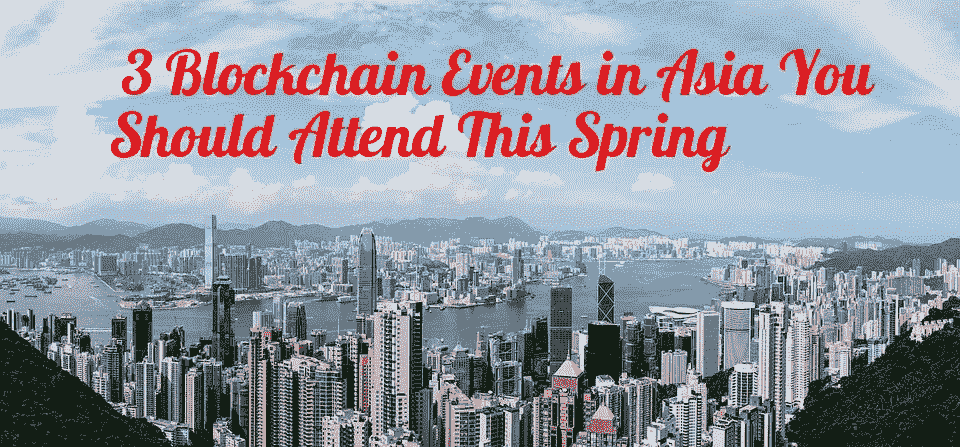
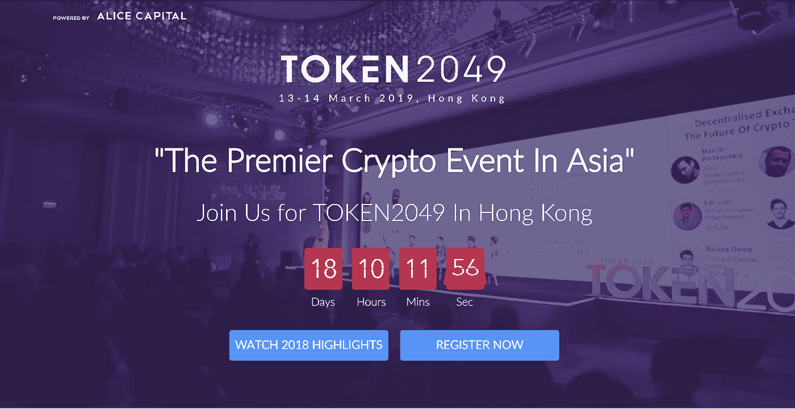
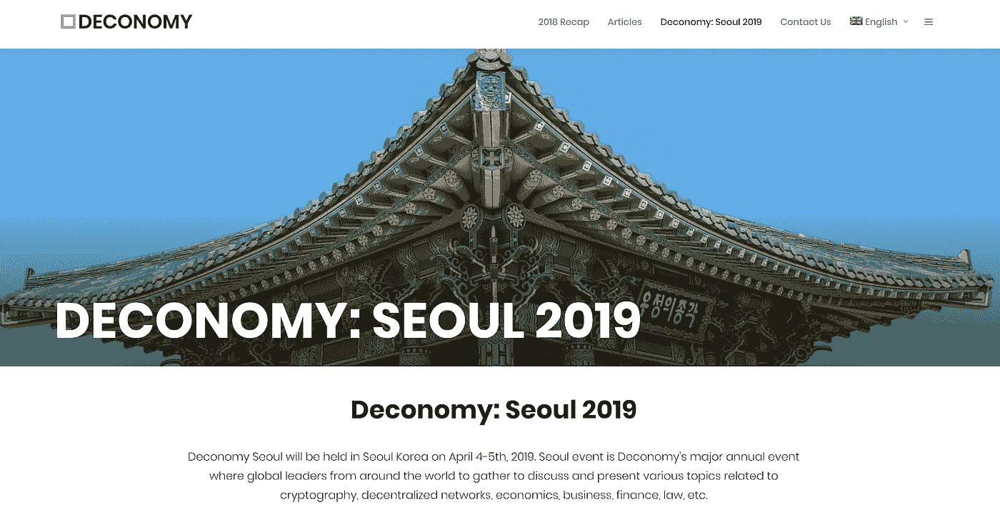
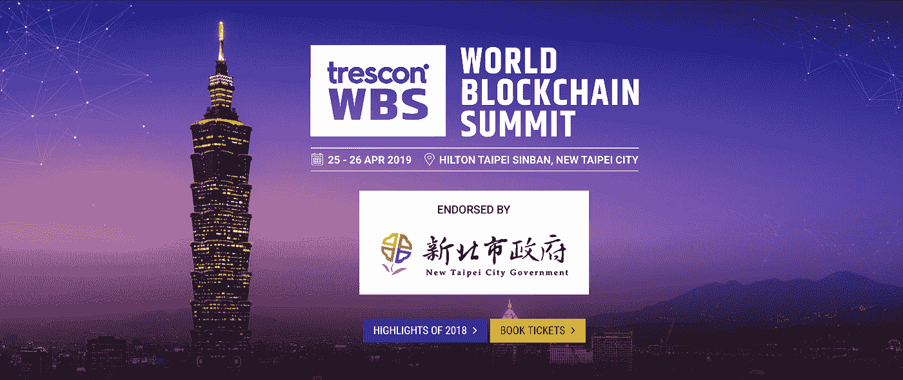

# 今年春天将在亚洲参加 3 场区块链会议和活动

> 原文：<https://medium.com/hackernoon/3-blockchain-events-in-asia-you-should-attend-this-spring-970614cc8a2c>

对 2019 年春天在亚洲参加的最佳区块链活动和会议感到好奇吗？别再看了。我们会掩护你的。在本帖中，我们将带你了解你不应该错过的 3 个区块链活动，在哪里买票，以及每个活动的几位主要发言人。

如果你的国家或城市有任何我们应该关注的事件，请在评论中告诉我们，希望我们能在那里见到你。

我们开始吧！

# TOKEN2049 港(3 月 13 日，14 日)

即将到来的是 3 月 13 日和 14 日在香港嘉里酒店举行的 TOKEN2049。托克 EN49 自称为“亚洲首屈一指的加密盛会”，不想让人失望，拥有加密和区块链的一些最大的名字，估计有 2000 名与会者。

一些[著名的演讲者包括](https://www.token2049.com/)；Litecoin 创始人兼创始人、IOHK 和 Cardano 首席执行官 Charles Hoskinson、Tron 创始人兼首席执行官 Justin Sun 以及 Lisk Max Kordek 总裁。托克 EN2049 还将主办以太坊亚洲超级会议，届时以太坊基金会的成员(包括以太坊联合创始人 Vitalik Buterin)和亚洲各地的几位社区领袖将齐聚一堂，讨论以太坊社区的未来。

演讲日程中列出的几个有趣的演讲[包括:](https://www.token2049.com/schedule)

*   **去中心化的未来:互操作性和可伸缩性**—Aion 首席执行官 Matthew Spoke 和万链创始人兼首席执行官 Jack Lu。
*   **为什么隐私很重要**——Beam 首席执行官亚历山大·扎德尔森和 Horizen 联合创始人罗伯特·维格里奥尼。
*   **Stablecoins:钱与国家的分离**——与 Circle 董事总经理刘杰克和 Digix Shaun Djie 联合创始人兼的对话。

演讲日程还将在最后一天与 Litecoin 创造者查理·李进行 35 分钟的炉边聊天，并提供一部即将在失败的新西兰加密交易所 Cryptopia 上映的电影的独家预览。

与会者可以[用 crypto 或 USD](https://www.token2049.com/tickets) 支付门票，早鸟票的价格为 999 美元，约合 7，800 港元。

你可以在这里找到活动的完整时间表——https://www.token2049.com/schedule。最后，我们建议前往托克 EN49 网站，观看过去的精彩片段，并进一步了解这次活动。

# 2019 年首尔经济展(4 月 4 日、5 日)

每个人都知道南韩对加密很狂热(嗯，也有一个区块链会议即将在平壤举行！)，那么还有什么地方比首尔更适合举办活动呢？ [Deconomy Seoul 2019](https://deconomy.com/seoul2019/) 如果你想物有所值，那就太棒了，因为展览通行证只需 10 美元，全票(包括展位、主题演讲和展板)99 美元，限量版 VIP 通行证 999 美元。

Deconomy Seoul 2019 位于首尔 Jung 区的 Jangchung Arena，并拥有一些业内最大的[区块链名字](https://deconomy.com/seoul2019/)，包括以太坊联合创始人 Vitalik Buterin、[首席执行官赵昌鹏、](http://blockchainseo.net/binance-dex-testnet-launch/)比特币倡导者、比特币基地 Japan Nao Kitazawa 首席执行官 Andreas Antonopoulos 和 Consensys 首席执行官 Joseph Lubin。它将解决从密码学到 P2P 网络和区块链技术，一直到哲学和商业的各种问题。

论坛将包括两整天的讨论和演讲，以及会后的聚会。你可以在他们的网站上找到 2018 年首尔 de conomy 的摘要。一些值得注意的统计数据包括超过 150 家公司、80 多名演讲人和 2400 多名与会者的出席情况。

你可以在他们的网站上找到更多关于[去首尔的信息，并在这里购买你的门票——https://deconomy.com/tickets/](https://deconomy.com/)。你可以用 BTC、XRP、BCH 和 BSV 支付。

# 世界区块链峰会台北(4 月 25、26 日)

世界区块链峰会将于 2019 年 4 月 25 日和 26 日在台北举行，地点在杜鹃花之城(台北)和即将到来的区块链岛(台湾)。台湾迅速将自己定位为加密热点和中心，是几个著名项目的所在地，包括 [Cobinhood](https://cobinhood.com/) 和 [CoolWallet](https://coolwallet.io/) 。它也被币安首席执行官赵昌鹏称为“比特币之家”

世界区块链峰会台北将在新北市的希尔顿台北新店举行，是连接全球区块链专家和该领域技术参与者的全球系列活动的一部分。它还将展示企业用例、政府用例、鼓舞人心的主题演讲、小组讨论等等。此外，还有一个为寻求为其平台或公司筹集资金的初创公司举办的推介比赛，奖金从 1 万美元到 100 万美元不等——如果你的公司进入下一轮初创公司世界杯并最终获胜。

几位著名的演讲者包括 McAfee Associates 的 John McAfee、Draper Associates 的 Tim Draper 和 Bitcoin.com 的 Roger Ver。还将有许多专题讨论，包括如何为智能城市解锁区块链技术、加密交换的终极愿景以及企业区块链实施的趋势。

超级早鸟代表通行证(针对企业组织的代表)将花费 295 美元，而参展商套餐(针对初创企业和中小企业的代表)将花费 3，000 美元。你可以在[世界区块链峰会门票页面](https://taipei.worldblockchainsummit.com/book-tickets)找到更多关于门票定价的信息。

想了解更多关于世界区块链峰会的信息，请点击[进入他们的网站](https://taipei.worldblockchainsummit.com/#speakers)。你也可以在这里找到所有演讲者的名单——https://taipei.worldblockchainsummit.com/speakers。

# 最后的话

你有它！2019 年春天，你应该参加的亚洲 3 个最好的区块链会议和活动。请务必在评论中让我们知道你将参加的任何活动或会议，希望我们能在那里见到你！我们将很快推出另一篇关于北美 3 个区块链事件的文章，你也应该看看，所以请务必尽快再次关注。

请务必[关注我们的区块链博客](http://blockchainseo.net/blog/)了解所有最新的加密货币和区块链更新、新闻和信息性文章。请在评论中告诉我们你想让我们写的任何话题。

-地下墓室

*原载于 2019 年 2 月 22 日*[*blockchainseo.net*](http://blockchainseo.net/3-blockchain-events-asia-spring/)*。*