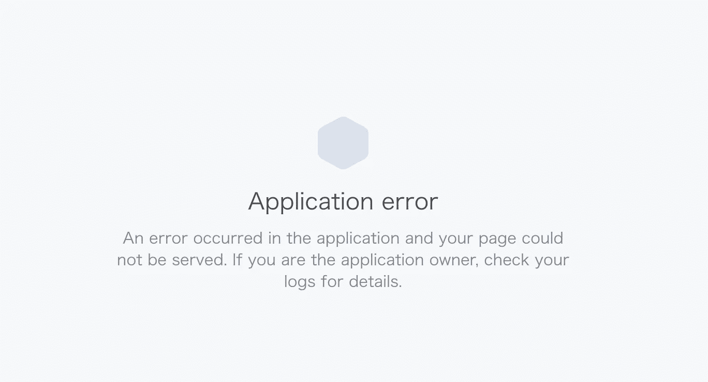

# 构建第一个 Shopify 应用程序时要避免的 3 个常见错误

> 原文：<https://medium.com/hackernoon/3-common-mistakes-to-avoid-when-building-your-first-shopify-app-cc9006f06009>


Shopify 从根本上改变了我们对电子商务和建立在线业务的看法，现在你可以创建一个漂亮的电子商务网站，列出产品，并在不到一天的时间内开始赚钱，因为 Shopify，在这个世界上，Shopify 的市值超过 180 亿美元，[超过 60 万商家](https://expandedramblings.com/index.php/shopify-statistics/)，Shopify 的合作伙伴和开发人员[在服务和应用程序方面赚了超过 4.3 亿美元](https://www.shopify.com/partners)，难怪越来越多的人对建立和赚钱 Shopify 应用程序感兴趣。

我应该知道这一点，因为我开发的第一个 Shopify 应用就是为了做这个。

但是，在开发和获得我的第一个 Shopify 应用程序后，我也学到了一些东西——Shoppy:一个更好的 Slack Bot——在 App store 上发布，我想分享我在制作第一个应用程序时犯的 3 个常见错误，这样你就可以避免它们，更快地上市。

开始了…

# **1。忘记设置 authenticated _ controller . Rb**


制作 Shopify 应用程序最重要的第一步是认证新商店，并使用该会话数据来做一些事情，如使用商店/订单/产品数据、响应网络挂钩或处理收费。

当我第一次设置我的应用程序时，我在每个控制器上使用以下代码来确保我已经正确地验证了会话:

```
session = ShopifyApp::SessionRepository.retrieve(1)ShopifyAPI::Base.activate_session(session)
class ShopifyController < ApplicationController
```

这是令人难以置信的低效，并导致了非常令人沮丧的错误，如果我继承了一个处理所有与 Shopify 相关的认证的认证控制器，这些错误本来是可以很容易避免的。

**那么，确保我们始终认证我们的会话以访问 API 和商店数据的最佳方式是什么？**

**解决方案:**确保您已经正确设置了`AuthenticatedController`，并确保任何需要 Shopify 认证的控制器都继承了以下内容:

```
class AuthenticatedController < ActionController::Base
  include ShopifyApp::Localization
  include ShopifyApp::LoginProtection
  include ShopifyApp::EmbeddedAppprotect_from_forgery with: :exception
  before_action :login_again_if_different_shop
  around_action :shopify_session
end...class ShopifyController < AuthenticatedController
```

# 2.在控制器中检索商店信息时，使用 Shopify 的“域”字段



Literally the screen my first alpha user saw because of this mistake.

在开发过程中，您可能会创建一个调试存储，以便安装应用程序和测试数据。使用 Shopify，商店是自动生成的，所以如果你的调试商店叫做`Debug Store`，Shopify 会给你的商店一个类似于`debug-store.myshopify.com`的域名。

这个 Shopify 域将存储在两个字段中:`myshopify_domain`和`domain`。

在开发过程中，您可以直观地设置各种商店查找，如下所示:

```
@shop = Shop.where(shopify_domain: ShopifyAPI::Shop.current.domain).first
```

事实上，我能找到的大多数回复和教程都是从`domain`中查找的，因为在开发中这是有意义的。`myshopify_domain`和`domain`一模一样！

但是，在生产中，大多数用户都设置了自己的自定义域，这将产生如下数据:

```
myshopify_domain: "example.myshopify.com", domain: "example.com"
```

我第一次让 alpha 用户安装 Shopy 时就发现了这一点，应用程序完全崩溃了。

我发现，Shopify 为你提供了`myshopify_domain`商店链接，让你存储在应用程序的数据库中，因此如果你进行商店查询并依赖`domain`，那么如果商店设置了自定义域，查询将不会正确匹配，从而导致崩溃。

**那么，您如何确保在生产中正确匹配从 Shopify 获得的域名呢？**

**解决方案:**当你在控制器中检索关于你的店铺的信息时，总是使用`myshopify_domain`而不是`domain`。这可确保您在用户完成安装后，将用户的域名与您收到的 Shopify 域名正确匹配。

因此，调整后的生产代码应该如下所示:

```
@shop = Shop.where(shopify_domain: ShopifyAPI::Shop.current.  myshopify_domain).first
```

# 3.在提交你的应用程序进行审核时犯容易导致你被拒绝的错误。


我想分享的最后一件事是我在完成开发并提交我的应用程序供批准后所犯的错误。

以下是我第一次提交 Shoppy 后收到的官方错误:

> 1.“Shopify”一词不能出现在应用名称或标语中。关于商标限制，请参考我们的[合作伙伴计划协议](http://e.customeriomail.com/e/c/eyJlbWFpbF9pZCI6IlJQSVNBUUFCYUhzenBhYVBoSjhKWG1kZHphN0QiLCJocmVmIjoiaHR0cHM6Ly93d3cuc2hvcGlmeS5jYS9wYXJ0bmVycy90ZXJtcyIsInBvc2l0aW9uIjoyfQ/b8c7b67f71aac811cd000a949bd403e3f709fa493170aba0a6c90574d5b75970)。
> 
> 2.你的应用列表中不应包含任何定价信息。更多详情，请参考我们的[定价部分要求](http://e.customeriomail.com/e/c/eyJlbWFpbF9pZCI6IlJQSVNBUUFCYUhzenBhYVBoSjhKWG1kZHphN0QiLCJocmVmIjoiaHR0cHM6Ly9oZWxwLnNob3BpZnkuY29tL2VuL2FwaS9hcHAtc3RvcmUvbGlzdGluZy1pbi10aGUtYXBwLXN0b3JlL2FwcC1saXN0aW5nI3ByaWNpbmctc2VjdGlvbiIsInBvc2l0aW9uIjozfQ/e5f97f7343b03376470f6c0dd8bf61ce84a30c0d9d8fad1807e6540163716e84)。
> 
> 3.您的合作伙伴帐户中的应用程序名称与 Shopify 应用程序商店列表中的名称不同。这些字段必须相同。您可以在合作伙伴仪表盘的应用设置部分更改应用名称。

这些都是超级容易修复的错误，但是因为我犯了这些错误，它们被标记了，所以我必须在编辑后重新提交我的应用程序。从那时起，这个应用程序又花了 10 天的时间才从待审批变成被批准。如果我避免了这些错误，我可以将我的总审批时间从 30 天减少到 20 天。

**那么，我们在提交 app 审核时，如何不犯这些文案错误呢？**

**解决:**很多事情:

1.  请勿在您的应用名称或标语中提及“Shopify”。不过你也可以提到其他应用程序(例如，我的应用程序使用 Slack，所以我引用 Slack)。
2.  如果你正在开发一个免费增值应用，不要在一般描述文本框中提及你的其他定价等级。看起来你可以把这些包括在你的截图中，或者你可以把它们包括在你的应用程序描述的定价部分。
3.  App store 中应用程序的名称必须与安装时的名称相匹配。我以为我可以在安装应用程序后做一个更重的营销，但显然，我错了。只要确保应用程序名称相同，就不会有任何问题。

我希望这篇文章能帮助你开发和发布自己的 Shopify 应用程序，如果你有任何问题，请随时给我发电子邮件，地址是 chris@emerald.io！

—

Chris 是一名自学成才的程序员，也是 Threadbase 的联合创始人:这是一个允许非开发人员只需点击几下就可以[建立自己的 Reddit 风格社区的平台，该平台于 2019 年 3 月被收购。他还刚刚完成了 Shoppy 的开发，这是一款免费的应用程序，可以从你的 Shopify 商店向 Slack 发送订单通知和总结报告。](https://threadbase.io/?utm_source=social&utm_medium=medium&utm_campaign=181102_make_hacker_news)

在 Threadbase 和 Shoppy 之前，Chris 在包括 Quidsi 和 ComiXology(均被亚马逊收购)和 Bonobos(被沃尔玛收购)在内的初创公司从事营销工作。