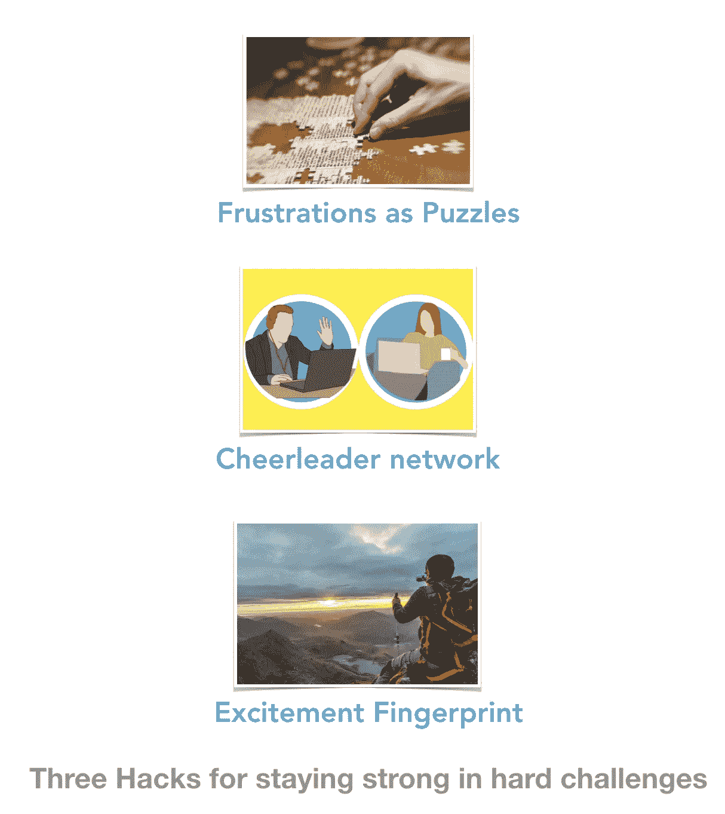

# 3 个针对看似不堪重负的工作负载的激励技巧

> 原文：<https://medium.com/hackernoon/3-motivation-hacks-for-seemingly-overwhelming-workloads-2c191161a3cc>

离开全职工作后，我最近成为了一名独立创始人/创造者，在这一过程中，我看到了相当多的剧变和许多反对者。事实上，每个人似乎都认为单独创业者不太可能成功，这让事情变得更加困难。(谢谢保罗·格拉厄姆！)

当接受任何新的、大的和大胆的事情时，期待事情会变得容易得多并在过程中失去动力是很有诱惑力的。在这里，我分享三个对我帮助很大的技巧或心态，它们可能还会帮助你应对更大的挑战，而不会失去最初让你开始的动力。

# 将挫折视为学习

想想长远的打算。这仅仅是你正在做的一个一次性的项目或风险投资，还是你想长期做下去，也许是未来的多个风险投资？你所做的任何有价值的事情都会有令人沮丧或意想不到的因素。预料会有意想不到的困难。你如何处理它们决定了它是否会让你长期变得强大，或者你最终会把自己逼向只做简单的事情。

> 预料会有意想不到的困难。

我采用的一种思维方式是把每一个困难都当作一个有待解决的难题。每天你可能会解决 3 个新的难题。这种心态对我帮助很大。每当你解决了一个难题，你在将来解决类似的难题时就会变得更好。

大多数聪明人发现，想要预先知道所有事情的答案是很有诱惑力的。这是一个常见的陷阱。放弃这种诱惑，每天拥抱“解谜”,去解决你从未遇到过的问题。我的意思是将整个过程游戏化一点。如果你以前玩过令人沮丧的益智视频或棋盘游戏，你可能会有同感。

# 定期和朋友/啦啦队交流

开始时很容易对事情非常确定，但是当意想不到的困难袭来时，你可能会看到前进的动力开始减弱。在你的人际网络中或之外找几个关心你或这个项目的人，并确保你定期与他们交谈。他们是你的啦啦队员。

请注意，这不同于通常关于寻找顾问或导师的建议。这些啦啦队员更像是你的朋友，你甚至可以打到很晚，他们也不会介意。如果你能找到 1-3 个这样的人，那将会有很大的帮助。如果你一个人都不认识，试着参加一些聚会或会议，找一些和你有相似经历的人做朋友。

你可以亲自和他们见面，或者定期进行视频通话。我觉得看到他们的脸很有帮助，所以电话和电子邮件的影响较小。向他们展示你在做什么，获得他们的反馈，寻找他们对你的旅程有何看法的信号。当然也要向他们表示支持。这可以帮助你意识到你并不孤单。

有时，如果你专注于建设，与他人过多互动会感觉是浪费时间。但是以我的经验来看，这真的帮助我摆脱了自己的想法。这可以成为救命稻草。

# 除了所有逻辑上的原因，找一些让你兴奋的事情

做某事或开始某事有理性的原因，但也有令人激动和兴奋的原因。这可能是看到你的想法被很多人使用，或者仅仅是在那里建造一些真实的东西的愿景(这本身就非常困难)。创造是一种勇敢的行为。

它甚至可能是这个项目或挑战之后会发生的事情——可能会为你开辟新的途径去做其他令人兴奋的事情，帮助你找到更好的工作，过上不同的生活方式，增强你的信心等等。我称之为“情绪激动指纹”,我们往往会对此感到兴奋。找出最让你兴奋的 1-3 件事，即使它们真的很“尴尬”，对其他人来说可能没有意义。你不必与他人分享它们。每天都把它们放在你的脑海中。

兴奋创造了一种新的动力。光有逻辑上的原因是不够的——有时人们会觉得如果事情在逻辑上是合理的，就不应该遇到这么多困难，这样就更容易失去动力。但是如果你对过程、结果或未来感到兴奋，它会给你一种超越逻辑的强大动力。

# 总结想法

我已经开始了一段激动人心但充满挑战的旅程，试图在[stock quanta](http://stockquanta.com)/[coin quanta](http://CoinQuanta.com)创建一个项目，改变世界上大多数 DIY 投资者看待投资的方式。一个大胆的愿景伴随着它自己的障碍、意想不到的问题和反对者。但是有了上面的框架，问题就不是真正的问题，只是我迟早需要学会解决的谜题。无论我开始什么样的冒险，大部分问题都会存在，所以我最好现在就学会解决它们，而不是希望有一条更容易的道路！

请随时关注我自己充满挑战的旅程中的更多见解。