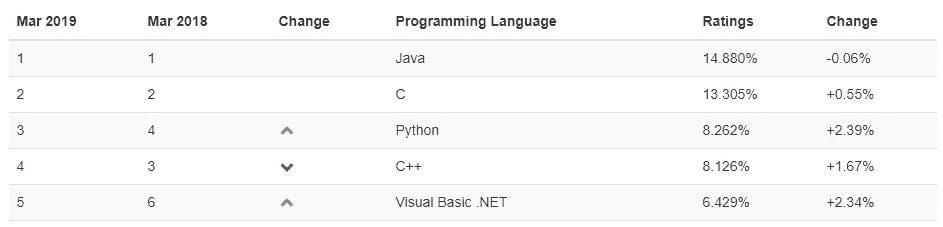
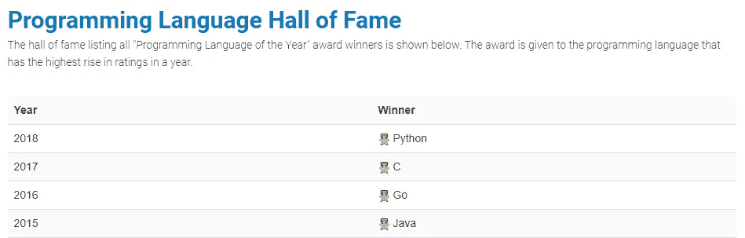
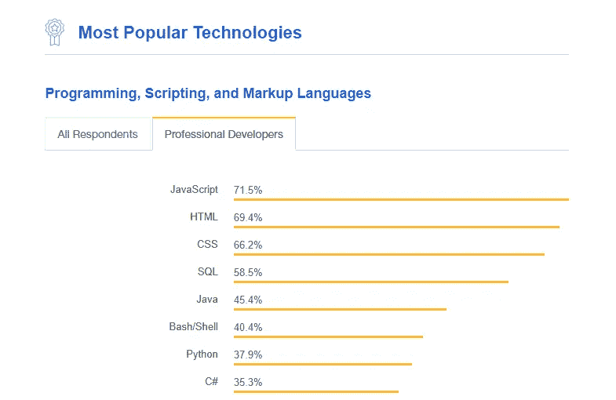
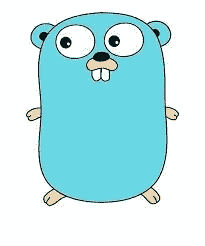

# 2019 年要学的 3 门编程语言

> 原文：<https://medium.com/hackernoon/3-programming-languages-to-learn-in-2019-2eb035936f65>

**声明:** *这完全是我的个人观点，来源于我的个人经历。请随意分享你的想法。*

还记得 2013 年，我开始学习我的第一门 C++编程语言，写了我的第一篇《Hello World》，兴奋得像个小屁孩。现在，我已经专业地进行了编程，并有幸与许多不同的技术合作，我收集了一些关于我个人的 2019 年人们应该学习的前 5 种语言的想法。所以，如果你是编码界的新手，我推荐这些语言。

说完这些，让我们直接进入我列表中的第一种编程语言:

# 计算机编程语言

许多开发人员喜欢 Python，我相信大多数专业程序员在他/她的职业生涯中至少做过一次 Python 编码。根据 [Tiobe Index](https://www.tiobe.com/tiobe-index/) 提供的统计数据，这表明 Python 确实仍在流行:

***为什么是 Python？***

1.  各种类型软件应用的用例，包括 web 应用、网络服务器、桌面实用程序、数据处理、机器学习等等
2.  最大的/活跃的/支持性的社区之一，所以无论你是初学者还是专家，从 Python 开发伙伴那里寻求支持都不会太难
3.  令人惊叹的图书馆(Django，Numpy 等。)
4.  非常容易理解(初学者友好)
5.  到目前为止，数据科学家用于机器学习的最流行的语言

对我来说，Python 是开发人员必须学习的语言。

# Java Script 语言

年龄到了这个时候怎么能不谈 JavaScript 呢？JavaScript 几乎无处不在！根据 Stack Overflow 2018 年[开发者调查](https://insights.stackoverflow.com/survey/2018/)显示，JavaScript 是其平台上最受欢迎的语言。

***为什么是 JavaScript？***

1.  非常容易理解(初学者友好)
2.  不同软件(浏览器、移动应用、网络应用、物联网设备等)中的广泛使用案例
3.  发展最快的社区之一
4.  对 JavaScript 开发人员的高要求
5.  流行的网站/应用程序使用运行在 [Node.js](https://nodejs.org/en/) 上的 JavaScript(网飞、PayPal、LinkedIn、优步等等)

如果你喜欢快速发展的语言，JavaScript 可能是适合你的语言。

# 去

对你们许多人来说，这可能是一个小小的惊喜。Go 并不完全是我们最初想到的语言之一，但 Go 实际上是一种非常酷的编码语言。

Gopher

***为什么走？***

1.  性能:Go 使用 goroutines (Go 的最大优势)以较少的资源并发执行指令
2.  与 Python(解释型)相比，严格类型允许容易的调试
3.  没有继承使得 Go 应用程序易于维护
4.  Go 是由 Google 设计/支持的，这意味着这种语言是为巨大的可伸缩性而设计的
5.  就像 C/C++一样，Go 是编译的，不使用虚拟机，性能非常接近低级语言。然而，与 C/C++不同，Go 内置了垃圾收集功能。多酷啊！

如果您的应用程序在性能和可读性方面存在问题，Go is 可能是一个不错的选择(没有双关语)。对于初学者来说，这可能有点难学，因为 Go 非常依赖指针，对于一个新程序员来说可能不容易掌握。

# 最后的想法

请记住，这是我的个人观点。然而，我相信这三种语言有一些共同之处:编码的乐趣。编码应该是有趣的。我可以向你保证 Python、JavaScript 和 Go 将会实现。

除了有趣之外，这三种语言将会提高开发应用程序的热情，这些应用程序不仅符合潮流，而且为可伸缩性做好了准备，这是当今许多开发人员面临的一个大问题。

分享你对 2019 年要学的 3 门编程语言的想法！