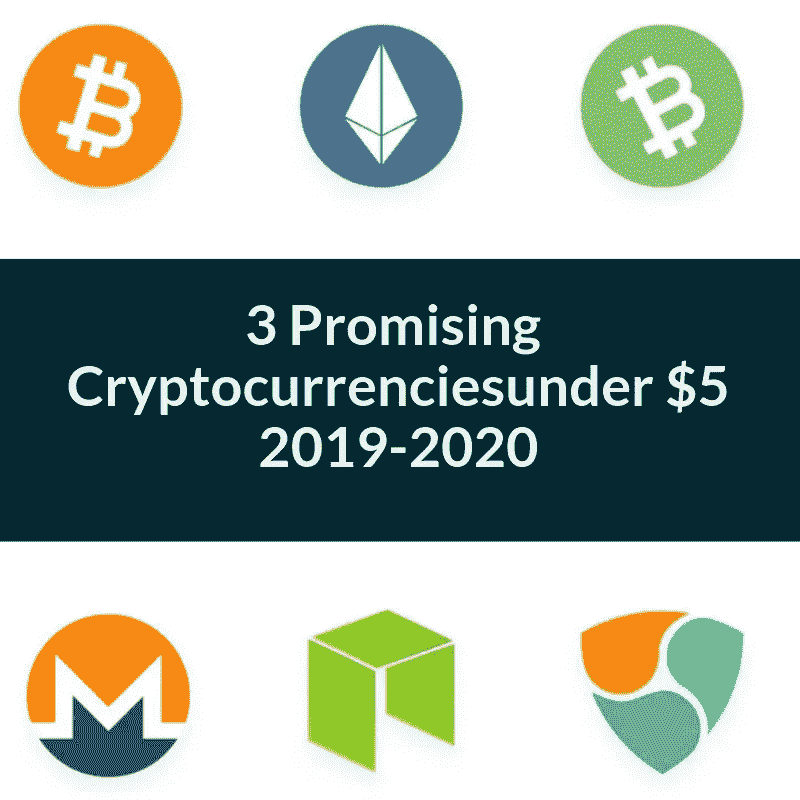
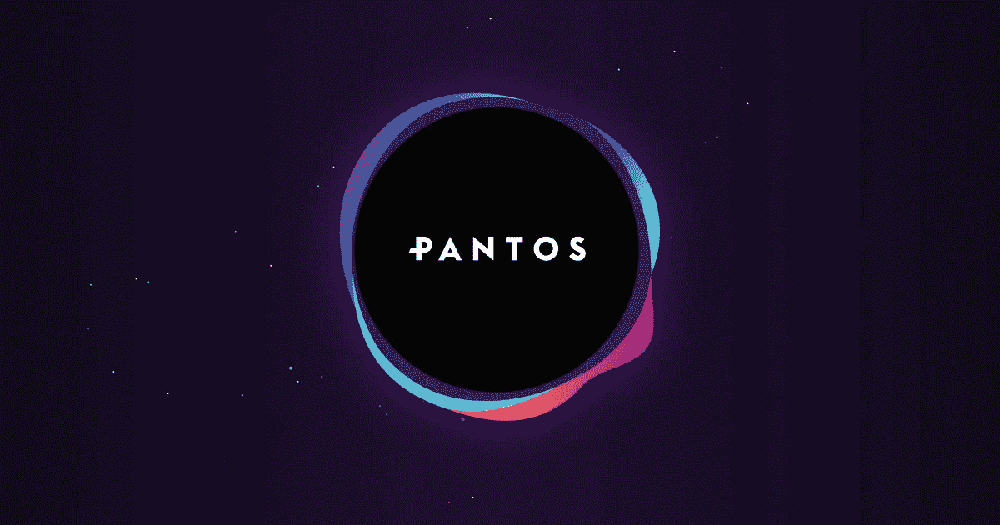
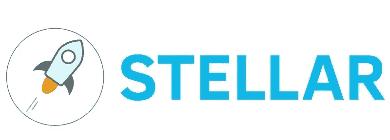

# 2019 年至 2020 年投资 3 种 5 美元以下的有前途的加密货币

> 原文：<https://medium.com/hackernoon/3-promising-cryptocurrencies-under-5-to-invest-in-for-2019-2020-36b72fa32808>

## 从跨区块链转账到面向 20 多亿用户的银行业竞争对手加密货币

在投资加密货币时，一个被忽视但却很重要的因素是效用。

忘掉那些华而不实的 ICO 广告，转而看看加密货币将如何被使用。高效用为加密货币提供了以下好处:

## 提高流动性

不断被使用、转移和交易的加密货币允许投资者容易地买卖所述加密货币。高市值的加密货币可能会让你变得富有(理论上)，但如果交易量不够，谁会买你的钱呢？

## 推动需求

合法使用的加密货币是能够从其效用中受益的用户所需要和寻找的加密货币。寻求从加密货币需求中获利的投资者也在寻找这种货币。

## 制造稀缺

对加密货币的需求越大，用户就会购买越多，导致流通中的硬币越少。

**今天，我们将看看三种不同的加密货币，它们都有非常宏大的使用案例。**

## **(潘)**

PAN 目前的价格约为 0.01 美元，是这个项目的早期阶段。

潘托斯(PAN)是由加密货币交易所 [BitPanda](https://www.bitpanda.com/?ref=3127933809251797450) 开发的跨链加密货币，这也是投资者目前唯一可以购买这种加密货币的地方。

PAN 正在开发，可以在整个区块链工作，例如可以从以太坊区块链传送到利斯克区块链，反之亦然。

这将允许跨区块链转移数字资产，这是任何加密货币都无法实现的壮举。

为了实现这一点，PAN 依赖于令牌原子交换技术(TAST)，该技术本质上是用于加密货币令牌之间的区块链间转移的原子交换技术。

为了帮助实现该项目，PAN 正在与多个机构的研究人员合作开发，这些机构包括:

*   维也纳大学
*   未来密码经济学研究所(RIAT)
*   奥地利科学院

如果成功，PAN 将允许近乎即时的跨链转移，允许用户将资产从一个区块链转移到另一个，而不必使用交易所等第三方媒介。

潘几乎不在地图上，这种加密货币仍处于早期采用阶段，还没有其他交易所获得这种令牌。

对于他们试图完成的事情，他们的合作伙伴(包括 Waves，Komodo，Lisk & amp；amp；amp；amp；amp；amp；amp；amp；amp；amp；amp；amp；amp；amp；amp；amp；amp；amp；amp；amp；amp；amp；amp；amp；amp；amp；amp；amp；amp；amp；amp；amp；amp；amp；amp；amp；lt；amp；amp；amp；amp；amp；amp；amp；amp；amp；amp；amp；amp；amp；amp；amp；

## **OmiseGo (OMG)**

OmiseGo 目前的市值为 2.48 亿美元，价格为 1.75 美元，考虑到这种加密货币去年的巨大需求，这令人难以置信。

OMG 是一种由现实世界的公司 Omise 创建的加密货币，该公司为成千上万的商家提供在线支付解决方案。Omise 曾登上 2016 年《福布斯》泰国版，还被泰国总理授予“年度数字创业公司”。

OMG 试图解决两个问题:

1.  亚洲有数亿人，全球有 20 亿人没有银行账户，这意味着他们没有银行账户。
2.  他们想让在许多不同的网络和许多不同的货币或资产之间转移价值变得容易。

OMG 希望为没有银行账户的人群提供一个易于使用的系统，以非常低的成本存储、发送和接收任何货币或资产的资金。

更简单地说，OmiseGo 希望用户、供应商和商家能够使用任何资产类型的货币，通过任何网络在全球范围内轻松转移资金。

这可能是法定货币(英镑，美元，泰铢等。)，加密货币或任何数字化资产。

OMG 的目标是个人和电子支付提供商，这为加密货币的采用提供了巨大的空间。

OMG 试图解决的问题规模非常大，仅在亚洲(OmiseGo 的总部所在地)就有数亿潜在用户，在全球范围内超过 20 亿。

我相信他们有一个很好的机会来实现这一点，成为极少数接受这一挑战的公司之一。

## **恒星流明(XLM)**

XLM 目前的市值为 20 亿美元，价格为 0.10 美元，考虑到它的潜力，我认为这是一笔大买卖。

XLM 自夸道:

*   几乎即时交易(2-3 秒)
*   几乎免费交易(每笔交易 0.00001 XLM)
*   与 Stripe、IBM 和德勤的合作关系

XLM 计划接管全球汇款市场，可能取代目前每天处理超过 5 万亿美元交易的 SWIFT。

比较 SWIFT 和 XLM:

*   SWIFT 交易成本至少 25 美元，XLM 成本不到一美分
*   SWIFT 交易时间 3-5 个工作日，XLM 需要 2 -3 秒

恒星流明区块链还可以用来开发去中心化的应用程序(dapps)和部署智能合同，与当前的领导者以太坊相比，交易成本更低，交易速度更快。

这也让 XLM 成为创造新加密货币的中坚力量，就像以太坊是 ERC 20 代币背后的平台一样。

每次使用 ERC-20 代币，交易费用都以以太网支付，现在 XLM 的区块链可以成为新数字资产的家园，从加密货币到视频游戏中的武器和皮肤。

当谈到数字资产时，我们甚至还没有触及表面，我们谈论的是具有真实、有形和真实世界价值的数字商品。

最后，恒星有自己的分散交换，恒星分散交换(Stellar DEX)。这允许对等交换加密货币，无需第三方组织或验证您的身份。

在我看来，考虑到范围和他们计划解决的问题，恒星/XLM 确实被低估了。

这项技术已经存在，我们所需要的是在大规模采用之前让普通人理解。

## **结论**

这些加密货币在它们旨在解决的问题上似乎走在了时代的前面，特别是对于可能没有意识到这些问题的普通人来说。

然而，这可能正是他们拥有巨大潜力的原因。如果你对这些加密货币感兴趣，你可以在这里找到并投资它们:

*   恒星(XLM)可以直接从**用现金购买。**
*   **可以直接从 [**BitPanda**](https://www.bitpanda.com/?ref=3127933809251797450) **用现金购买(PAN)、Stellar()和 OmiseGo (OMG)。****

**在我看来，像这样的时候，当市场平静时，是积累的好时机，我迫不及待地想看到这些项目如何在这些年中成熟。**