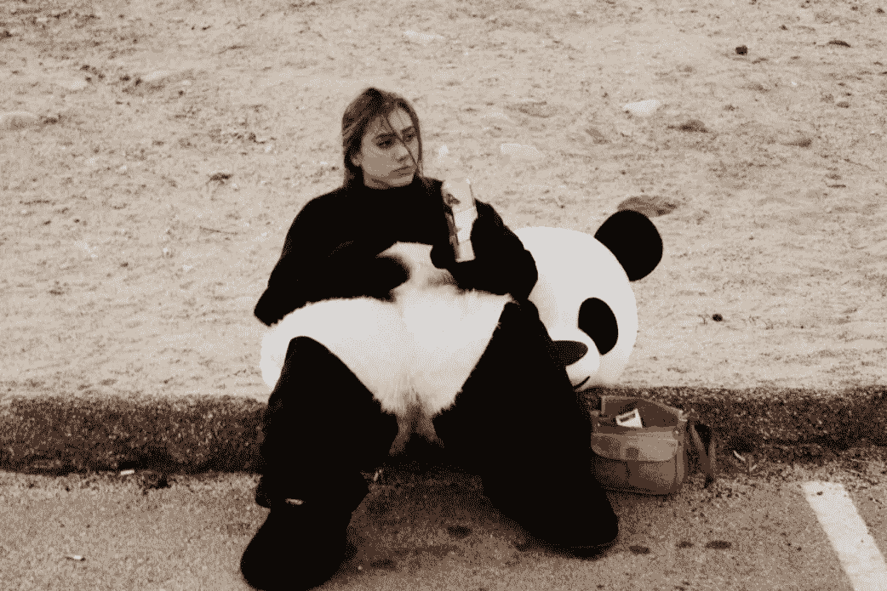

# B2B 购买之旅比 B2C 更感性的 3 个原因

> 原文：<https://medium.com/hackernoon/3-reasons-why-the-b2b-buying-journey-is-more-emotional-than-b2c-93e4c1a0aae8>

> 如果你喜欢这篇文章，你可以找到其他一些关于[增长](https://brightfund.co/essays/how-to-prioritise-your-growth-strategy)、[战略](https://brightfund.co/essays/how-to-run-a-growth-experiment)和[收购](https://brightfund.co/essays/are-there-really-only-19-channels-for-growth)的文章。我目前最受欢迎的文章是[揭露每笔收购成本和客户收购成本之间的差异。](https://brightfund.co/essays/demystifying-the-difference-between-cac-and-cpa)快乐阅读！

# 我们都有情绪，即使是在 B2B

做生意是一种耻辱。人们说，与 B2C 相比，B2B 购买是理性的，没有感情的。你同意吗？

B2B, B2C. We’re all people. We all have emotions. Photo: [thebeauxjournals.com](http://thebeauxjournals.com)

最重要的是，无论你是营销、销售、运营还是产品部门的人，都要理解购买过程中的情感因素。我们很容易留在污名中，盲目地相信 B2B 购买过程是理性的，没有感情的。

具体来说，在 B2B 营销中，我们需要为我们的买家制作、创造和交流情感挂钩和故事，以进入我们的营销和销售渠道。因此，我们的内容、文案和创意必须不断挖掘买家的情感，以尽可能保持高购买意愿。

这一切都很好，但它仍然缺少一个关键因素。我们没有考虑**购买行为—** 与您的产品、服务或价值主张无关。

如果我们作为 B2B 营销人员和销售人员了解购买行为中引发的情绪，那么我们将为自己赢得更多的成功。谁把 B2B 购买的摩擦拿出来谁就赢了。

正如 [Dave Gerhardt](https://twitter.com/davegerhardt) 在 [Drift](http://www.drift.com) 的营销副总裁所说:

> *“谁做得更容易***谁就买得赢”**

# *购买的行为*

*一位智者曾经说过:*

> **“买错一罐汽水也没问题”**

*一罐可乐 70 便士。如果你不小心喝了全脂可乐而不是零度可乐，没什么大不了的。*

*然而，如果购买那罐可乐有多个利益相关者，需要几天时间来饮用(实施)，必须签署一份有约束力的合同，每月至少支付数百美元，并得到首席执行官的批准，这将是一个问题。*

*B2B 购买有更多的利害关系，这使得它比 B2C 更情绪化。*

***3 个主要原因:***

## *1.人*

*购物之旅往往遵循蜂群思维。不仅仅是企业中的一个人有购买软件的任务。有一个团队正在研究这个项目。你知道团队是由什么组成的吗？人们。*

*团队中的人越多，就会产生更多的意见、感受和犹豫不决。幸运的是，团队合作是我的强项之一，但对一些人来说，这可能很难掌握。*

*在某件事情上一起工作可能会带来**紧张**、**冲突**和**激烈的争论**，尤其是在为你的企业决定最好的产品、服务或解决方案的时候。所以是的，人是一个很大的因素。*

## *2.费用*

*如果你负责购买一年 1 美元的软件，那么很容易——让我们买下所有的软件。但可悲的是，事实并非如此。*

*对于一个每月花费约 1，000 美元的工具，您的花费超过了 12，000 美元，这与您为企业创造的收益相比有多大比例？或者更难，你的薪水？*

*也许你是河马(房间里收入最高的人),相比之下，它是微不足道的——对你有好处。如果没有，风险会更高，你的情绪也会更高。*

*成本越高，风险就越大。赌注越高，你的情绪就越高。*

**

*Emotional steaks for dinner*

## *3.名声*

*你可能还不知道——但是负责购买一个软件对你在公司的声誉有着巨大的影响。你实际上是在购买上印上你的名字，说“我的名字是 Rupert，我批准这个工具”。*

*如果你是领导项目并最终做出决定的人，那么你就是被追究责任的人。压力是存在的。这种情况会让你情绪高涨。*

*在 B2C 中，信誉不是问题。如果你买了一罐可乐，在 Evernote 上买了高级包，或者在 GoDaddy 上为你的博客买了一个便宜的域名(这些都是很随意的例子)，这都不在话下，但是你明白我的意思。如果被追究责任，声誉是一个因素。*

# *结论*

*B2B 购买之旅比 B2B 更感性。*

*它需要更多的人来做决定，往往会花费更多的钱，而且你的声誉也岌岌可危。这就是情绪过山车的秘诀。*

*如果我们能在考虑人员、成本和声誉的情况下，尽可能减少购买行为的摩擦，那么你就为自己的成功做好了准备。*

*不要忘记 [Drift](http://www.drift.com) 的营销副总裁[戴夫·格哈特](https://twitter.com/davegerhardt)所说的话:*

> *“谁让购买变得更容易，谁就赢”*

*你怎么想呢?*

*一如既往地让我知道你的想法。如果你觉得这很有趣，并且认为你的同事、朋友和家人会从阅读中受益，那么请分享一下👏！ *真是狂赞赏！**

*如果你喜欢这篇文章，那么你可以找到其他一些关于**[*战略*](https://brightfund.co/essays/how-to-run-a-growth-experiment)*[*收购*](https://brightfund.co/essays/are-there-really-only-19-channels-for-growth) *。我目前最受欢迎的文章是* [*揭露每次获取成本和客户获取成本之间的差异。*](https://brightfund.co/essays/demystifying-the-difference-between-cac-and-cpa)****