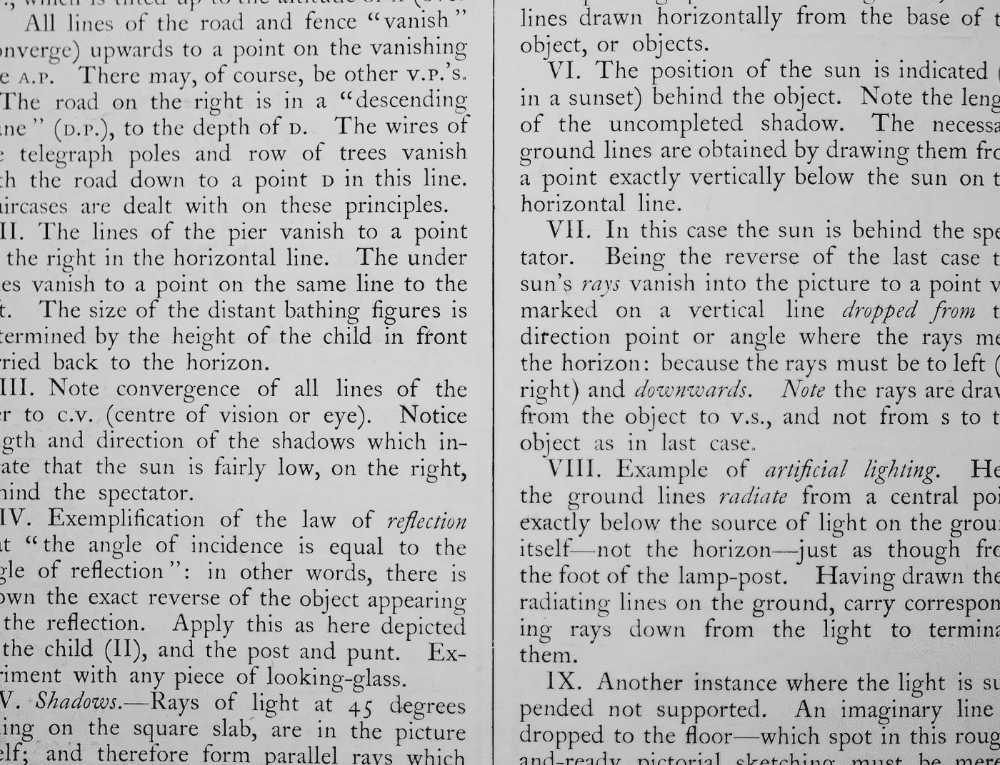
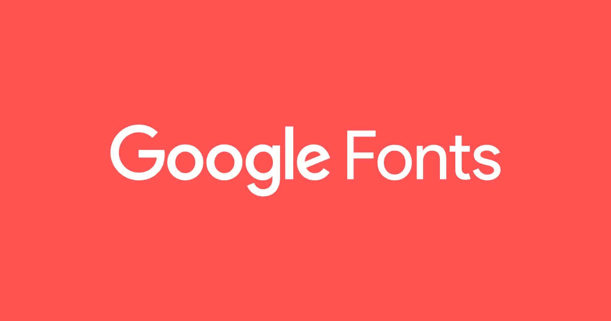

# 你应该关注网站“字体”的 3 个原因。

> 原文：<https://medium.com/hackernoon/3-reasons-why-you-should-focus-on-the-font-rather-than-the-color-a37e1af7faaa>

## 如何用你的字体吸引用户？

Photo by [Mr Cup / Fabien Barral](https://unsplash.com/photos/zFz3jThypsA?utm_source=unsplash&utm_medium=referral&utm_content=creditCopyText) on [Unsplash](https://unsplash.com/search/photos/font?utm_source=unsplash&utm_medium=referral&utm_content=creditCopyText)

让我把这篇文章写得简单明了。我用过几十个网站，创建了三个。我每次得到的[反馈](https://hackernoon.com/tagged/feedback)都不一样。我在 CSS 文件上做了很多改变，使它看起来丰富多彩和优雅，但每次都有一些东西漏掉了。

有一天，我开始改变网站的字体，并注意到它带来的巨大变化。当你选择一个适合它的风格时，一些网站看起来更好。我会给你 **3 个理由**为什么。

Photo by [Annie Spratt](https://unsplash.com/photos/DwPLi_mvKpw?utm_source=unsplash&utm_medium=referral&utm_content=creditCopyText) on [Unsplash](https://unsplash.com/search/photos/font?utm_source=unsplash&utm_medium=referral&utm_content=creditCopyText)

# 1.人们关注不平凡的事物。

以中号为例。它有很多字体——两种用于引用，一种用于标题，一种用于副标题。这种差异表明不同的信息，它使人们想读更多。

你可能看过研究论文。长长的两列，同样的 Times New Roman/Arial 和固定的 12 号大小。听起来像是睡眠的处方。

> ***人们阅读不同字体的文本。它在大小、样式和重量(粗体/斜体)上有所不同。你可能会注意到这一部分比上面写的更好。***

这就是神奇之处。眼睛会吸引非凡的东西，你的文字应该有一种“与众不同”的外观。

Photo by [Brianna Santellan](https://unsplash.com/photos/TXlvDNMu2LI?utm_source=unsplash&utm_medium=referral&utm_content=creditCopyText) on [Unsplash](https://unsplash.com/search/photos/font?utm_source=unsplash&utm_medium=referral&utm_content=creditCopyText)

# 2.选择正确的字体集可以增加可读性。

可读性就是一切。这是人们使用网站的原因。相比其他阅读平台，Medium 拥有更多用户。因为它是可读的。字体大小和风格不同，具有良好的美观性。

> 选择一种优雅、与众不同、可读性强的字体。草书字体通常是不鼓励的，因为一些字母看起来很相似，会产生混淆。

这里需要注意的另一件重要事情是**一致性。既然我告诉你要使用不同的字体，就不要去下载 10 种，然后分散在整个网站上。应该是有限的数量。**

我通常会选择三个——一个用于标题和数字，一个用于重要文本，一个用于普通段落。

你可以再加一个来突出一些标题。但是，不要过度。

# 3.知道去哪里找。

互联网最大的好处和最大的坏处是它拥有大量不同的数据，你可以随心所欲地钓鱼。但是，你需要看适当的地方才能得到正确的答案。

Google Fonts is the best place to look for fonts : [Source](https://fonts.google.com/)

> 我的主要建议是选择字体是使用 [**谷歌字体。**](https://fonts.google.com/)

谷歌字体最大的特点是它给你不同语言的多样性。您可以通过编写自己的输入来测试它，并轻松地将其包含在您的网站中。我的建议是 Roboto，Calibri 和 Open Sans。这些是默认的好的。

有时，使用谷歌字体可能会降低你网站的速度。在这种情况下，你可以**在其他地方下载**该字体。有很多网站可以下载和使用字体，但并不是所有的字体都可用。

## 我写关于生活课程、编码和技术的故事。要阅读更多内容，请在 [Twitter](https://twitter.com/snandhini98) 和 [Medium 上关注我。](/@nandhus05)