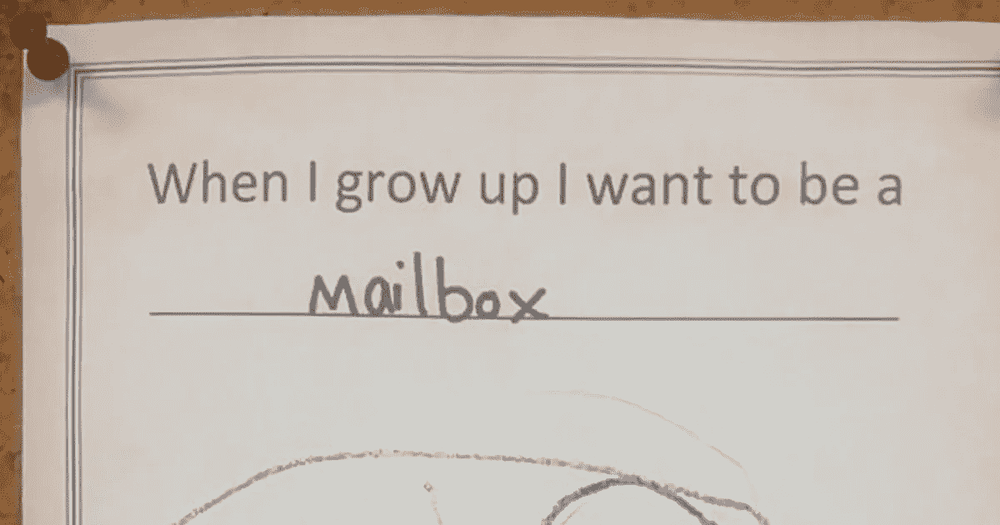
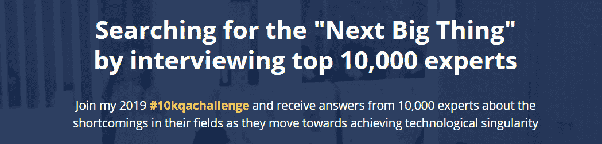
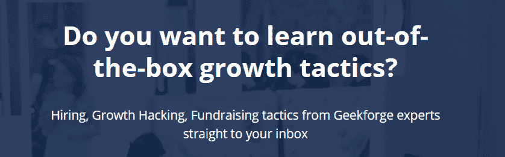
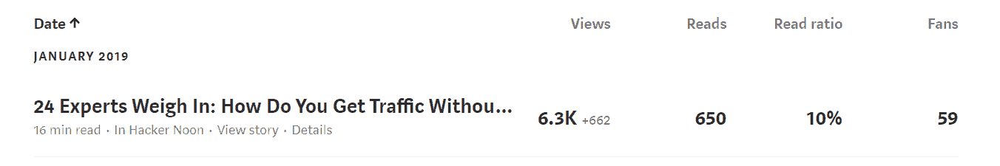
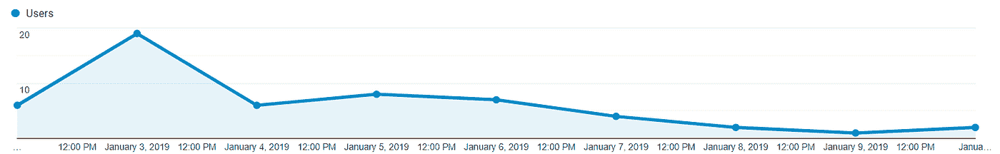

# 关于如何设定 2019 年业务目标的 3 个步骤

> 原文：<https://medium.com/hackernoon/3-steps-on-how-to-set-your-business-goals-for-2019-f25cfae8d661>

[source](https://www.boredpanda.com/funny-kids-notes-dreams-life-goals/)

因为我们刚刚度过了全新的一年，所以我将与你分享我用来建立商业目标的系统。这是一个我已经用了五年多的方法，它一直帮助我实现我的每一个目标。这个系统的好处是它非常简单。

我 2019 年的个人目标之一是让我正在做的事情变得更加透明——而这篇文章正是这样做的开始！请记住，这仅仅是我对这个话题的个人经验，如果你有什么想补充的，或者如果你想讨论你自己的经历，请随时分享。

# **第一步:找到主要约束**

有一种理论叫做约束理论(TOC)，由[艾利·M·高德拉特](https://twitter.com/GoldrattSaid)发明，并在他的书《[目标:持续改进的过程](https://www.amazon.com/Goal-Process-Ongoing-Improvement-Goldratt/dp/B00BW8LKXU/)中描述当我第一次读这本书时，它改变了我对目标的看法。主要的想法是，通过一遍又一遍地寻找和扩展约束(实现任何目标的最重要的限制因素)，有一条持续改进的道路。如果你想更上一层楼，这就是你需要学习的理论。

与我的三位联合创始人一起，我们在 2018 年底推出了一款新产品，目前的目标是找到合适的市场，以及实现指数增长的方式。为了实现这些目标，我们需要资源来快速改变产品(我们有一个团队来做这件事)和我们做营销的方式(病毒式营销对我们有很大的帮助)。所以营销是我们的主要限制因素，我们的约束。

我们团队的角色划分如下:

*   我是首席执行官；我的技能是产品开发和营销
*   Vladimir 负责管理我们所有产品的 UX/用户界面
*   亚历克斯是负责筹集资金的金融专家
*   丹尼斯是为我们下一步行动提供建议的战略家

# 第二步:想出一个独特的、激励性的想法

这里的主要目标是找到能长期激励我的东西。换句话说，要找到“核心使命”目标有多大并不重要。可能是“把人送上火星”而不是“创建一家宇宙飞船公司”，或者可能是简单的“变得更有吸引力”而不是“减掉 20 磅”

在前面的步骤中，我说过我们当前的约束是找到有效营销的方法，所以让我们试着找到这个目标的核心任务。

***我是这样想的:***

我们如何找到最好的、最具成本效益的方式来营销我们的产品？一种方法是创造一些有价值的东西让用户分享。

就我而言，我们产品的目标受众是在不同领域(人工智能、区块链、机器人、量子计算、网络安全)打造创新产品的企业家。互联网上充满了非常适合观众的高质量内容，所以我们需要更加努力地工作，以提供有价值的内容。

我们想出的一个点子是一种挑战形式的营销策略。我称之为[**# 10k QA challenge**](http://formula.geekforge.io)——我将向 10000 名专家提问，并在可信的出版物上与我的目标受众分享他们的答案(比如《黑客正午》)。

这是一个双赢的策略:它将帮助专家传播他们的专业知识，并让企业家获得有价值的答案。所以让我们来测试一下这个想法。

在这里，我们为我们的挑战创建了一个简单的登陆页面:【https://formula.geekforge.io/ 

[https://formula.geekforge.io/](https://formula.geekforge.io/)

# **第三步:建立测试时间表**

我的经验表明，做大事的最好方法是一遍又一遍地修改和修正最初的想法。在 10 个案例中有 8 个案例中，最初的想法永远不会成功，它需要在第一次测试后进行修改。因此，要做到这一点，我们需要有一个时间表来帮助团队修改和分析最终结果。

回到我们的[**# 10k QA challenge**](https://formula.geekforge.io/)例子，我们首先提出了“增长策略”的一般概念它看起来像这样:

我们根据专家的回答创建了第一个帖子；以下是链接:[https://hacker noon . com/if-you-are-started-from-scratch-in-2019-with-no-budget-you-do-to-gain-traffic-for-9196472 e9d5e](https://hackernoon.com/if-you-were-starting-from-scratch-in-2019-with-no-budget-what-would-you-do-to-gain-traffic-for-9196472e9d5e)

《邮报》的统计数据非常好；它在媒体上发布后仅 9 天就获得了 63000 次点击量:

它还在 Twitter 上获得了大量的分享:

[https://twitter.com/kirills4ilov/status/1080468237014441986](https://twitter.com/kirills4ilov/status/1080468237014441986)

所以第一个测试显示，关于专家建议的内容效果很好。

但是转换率的统计数据看起来很糟糕。我们收到了:

*   50 个用户访问登录页面
*   6 名时事通讯订户

因此，考虑到这些反馈，我们对最初的概念做了一些修改。这是它现在的样子:[https://formula.geekforge.io/](https://formula.geekforge.io/)

我们将在今年继续这方面的工作，下面我列出了将用于改进的时间表。

## 下面是我每天的日程安排:

## 7:45–8:00

*   *醒来:吃早餐，看看我一天的日程安排，看看新闻，看看科技世界是否发生了什么大事。*

## 9:00–14:00

*   *手机、信使、邮件通知完全关闭；从事主要任务需要高度集中(写作、计划、任务设定等。).*

## 15:00–19:00

*   *电子邮件、电话、会议、管理任务。第二天是与团队、客户和合作伙伴交流的时间。*

## 20:00–21:00

*   *去跑步或举重。*

## 21:30–00:00

*   *创造性任务:阅读、思考。我最好的想法是在这个时期产生的。我试着把它们写下来并系统化，这样我就可以在早上执行。*

## **以下是我每周的日程安排:**

## 星期一:

*   *安排与团队的通话和会议。需要确保每个人都明白我们在做什么，并设定每周目标。*

## 周二至周四:

*   *与团队一起努力实现当前目标。在那几天尽量不要开外部会议，以便集中精力完成主要任务。*

## 星期五:

*   *会议。*

## 星期六:

*   *团队会议分析整个一周和当前目标。计划下周。*

当我们提出想法并测试新的假设时，我们有两周的冲刺时间。它应该与更长的任务并行(如产品开发，可以持续 1-2 个月)。

# **结论:**

这个三步系统的优点是非常简单。你只需要:

> **1。找到你当前的约束。**
> 
> **2。想出一个如何超越限制的主意(你需要为此找到任务目标)。**
> 
> **3。制定执行计划和分析结果的时间表(记住，第一个想法不需要[通常永远不会]很棒)**

应用这些步骤肯定会帮助你建立系统，帮助你在任何领域实现持续改进。欢迎在下面的评论中分享你自己的目标设定方法。

# 延伸阅读:

我还想分享一些有用的资源，它们帮助我找到了改进的新思路。

[**【Ben-evans.com】**](https://www.ben-evans.com/)**——**[本·埃文斯](https://twitter.com/benedictevans)’，来自安德森·霍洛维茨，关于所有科技事物的每周时事通讯。Ben 也是 a 16z 年度呈现的创作者(2018 年的是[这里是](https://www.ben-evans.com/benedictevans/2018/11/16/the-end-of-the-beginning))。

[**Justin Jackson . ca**](https://justinjackson.ca/)——[Justin 的](https://twitter.com/mijustin)简讯是我看过的最励志最有个性的简讯。如果你是一个创造者，那么这是一本必读的书。

[**Singularityhub.com**](http://singularityhub.com)——如果你想为奇点动量做好准备(预言说它将在 2045 年发生)，那么在这里订阅。

[**5 子弹星期五**](https://tim.blog/welcome-to-5-bullet-friday/)——来自[蒂姆·费里斯](https://twitter.com/tferriss)的疯狂玩意儿。这份时事通讯里什么都有，从早晨的仪式到如何在短时间内建立一个 X 百万美元的企业的故事。

[**Videofruit.com**](https://videofruit.com/)——关于建立邮件列表的最佳内容可以在来自[布莱恩·哈里斯](https://twitter.com/Harris_Bryan)的视频《水果简讯》中找到。

[**Exponentialview.co**](http://www.exponentialview.co/)——[阿齐姆·阿兹哈尔的](https://twitter.com/azeem)技术、商业和社会视角。你会发现科技世界的一个不寻常的视角。这真的有助于拓展你看待世界的方式。

**——这是一个伟大的摘要，包含创业世界的事件、精选文章、新闻和信息。这份时事通讯最大的好处是它展示了你所在地区的事件。**

****——这是一门关于设计陷阱的免费在线课程，由[的大卫·卡达维](https://twitter.com/kadavy)通过电子邮件提供，教你如何避免初学设计师最常犯的错误。(大卫也是《[内心开始:赢得内心战争&让你的艺术发光](https://www.amazon.com/Heart-Start-Inner-Your-Shine-ebook/dp/B077XRMBR9/)》的作者)****

****[**Remotive.io**](https://remotive.io) —远程工作者的最佳技巧和窍门。****

****[**Builtbykrit.com**](https://builtbykrit.com/newsletter)——每周一期的时事通讯，介绍设计和开发工作室的创业经验。****

## ****关于作者:****

****[基里尔·希洛夫](http://twitter.com/kirills4ilov)——geek forge . io 和 Howtotoken.com 的创始人。采访全球 10，000 名顶尖专家，他们揭示了通往技术奇点的道路上最大的问题。加入我的**# 10k QA challenge:**[geek forge 公式](https://formula.geekforge.io/)。****