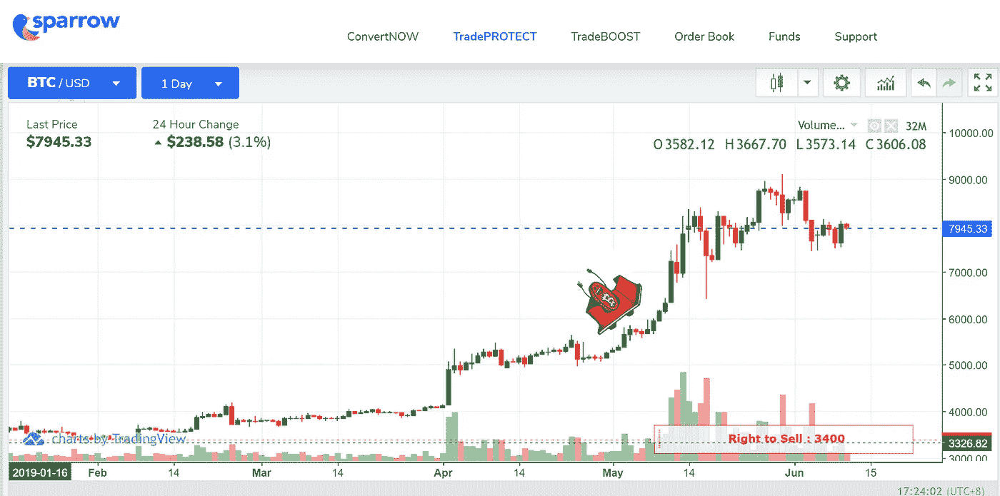
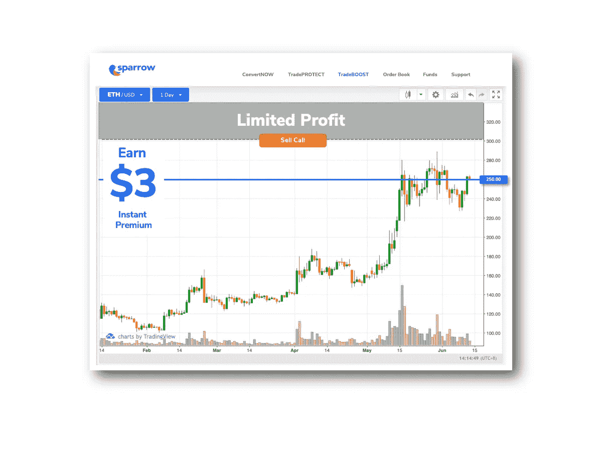
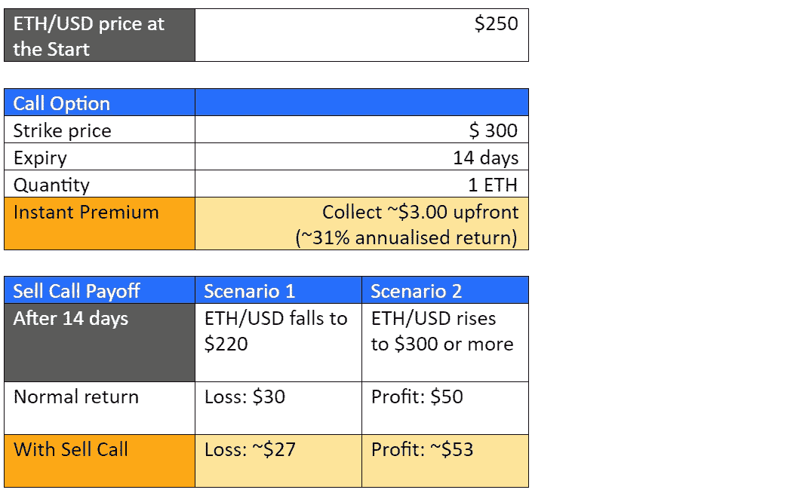
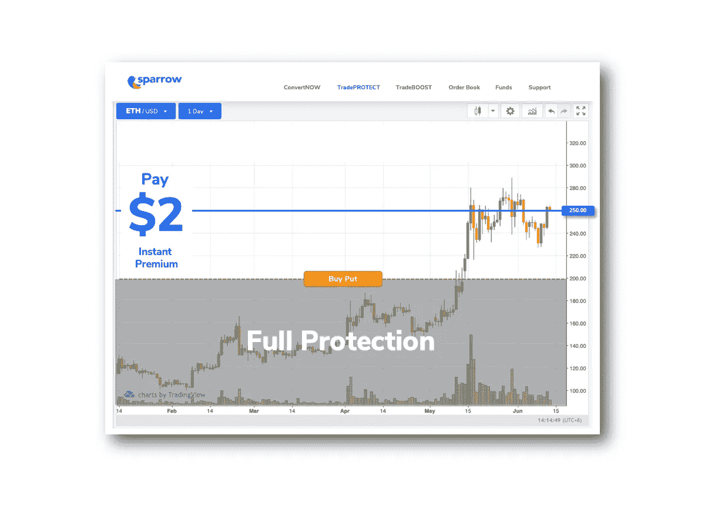
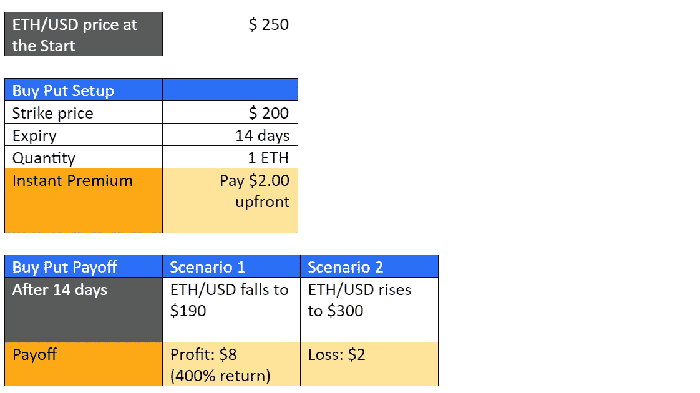
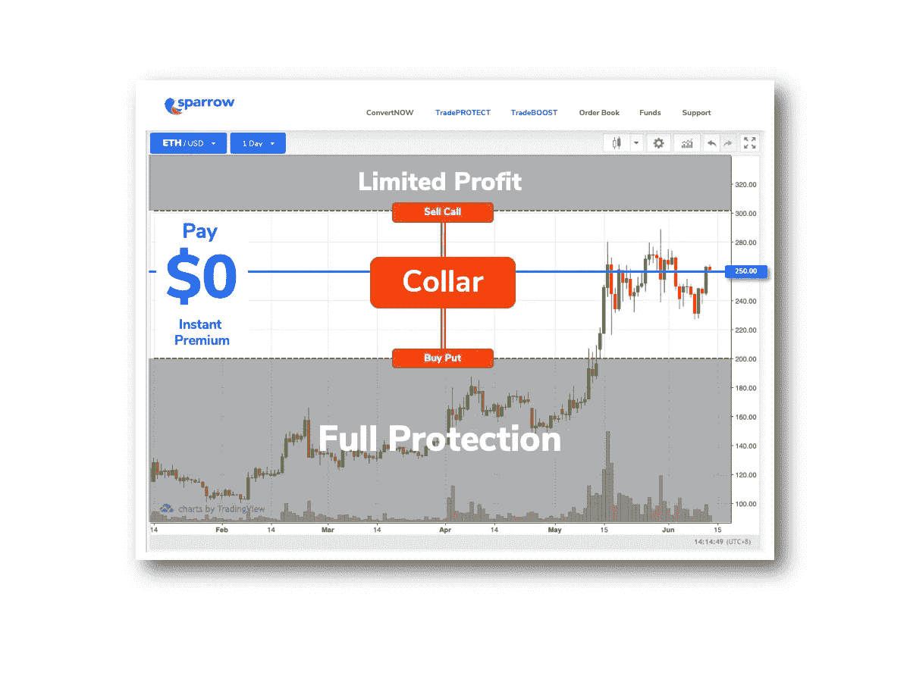
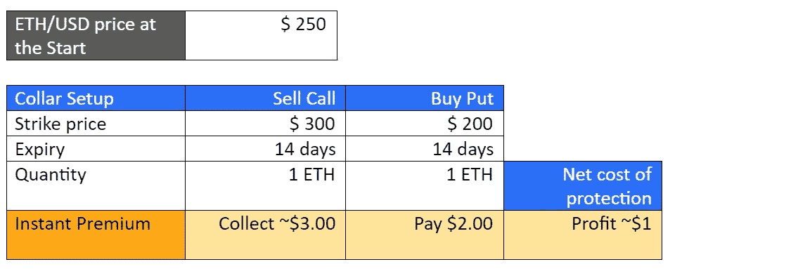

# 利用期权交易应对加密市场波动的 3 种策略

> 原文：<https://medium.com/hackernoon/3-strategies-to-combat-crypto-market-volatility-with-options-trading-9322d710f087>

我们都听说过密码交易员在几周甚至几天内损失超过 50%的故事。当业余选手不知道如何控制风险时，就会发生这种情况。正确使用期权可以帮助你对抗加密市场的波动，甚至从中获利。我将分享专业人士日常使用的 3 个策略。

1.  **卖出看涨期权以增加收益**

卖出看涨期权可以增加你的收益，减少损失。当你卖出看涨期权时，你就给了买方在到期日以执行价购买你的加密资产的权利。您将立即获得奖金，由您保管。

例如:卖出一个 1 ETH/USD 看涨期权，执行价格为 300 美元，为期 14 天

您将从 Instant Premium 中提前获得约 3 美元，由您保管。如果 ETH 的价格跌至 220 美元，即时溢价将抵消部分损失。然而，如果 ETH 的价格涨到 300 美元，即时溢价将使你的利润超过 50 美元。

关键的一点是，即时溢价无论如何都是你自己留着的。你可以把它当作收入，或者用它来为投资组合购买保障。下一个例子将涉及保护。

**2。购买看跌期权保护你的资产**

看跌期权用于保护头寸或进行投机性押注。当你买入看跌期权时，你会在加密资产价值下跌时获利。您将有权在到期日以执行价出售加密资产。这是一个非常强大的工具。

例如:买入一份 14 天的执行价为 200 美元的 1 ETH/USD 看跌期权

您将预先支付 2.00 美元的即时保费，这是您的最大损失。只要 ETH 的价格跌破 198 美元，你就获利了。

例如，如果 ETH 的价格跌至 190 美元，您将享受 8 美元的利润。这是一个惊人的 4 倍回报，2 美元的支出，没有抵押品要求！

购买看跌期权而不是做空的最大好处是，你的损失仅限于即时溢价的成本。在上面的例子中，你的最大损失是 2 美元。

需要注意的是，不存在适合所有人的“完美”履约价格或到期日。这也是为什么 Sparrow 允许用户根据自己的需求定制选项。

你应该设定一个与你的风险承受能力和市场偏好相匹配的执行价格。行使价将锁定你投资组合中资产的最低价值。这将帮助您以固定成本实现真正的投资组合保护。

**3。低成本对冲的领(卖出看涨+买入看跌)**

当市场波动时，期权可能会很昂贵。购买看跌期权的成本可能高于大多数人愿意支付的价格。项圈是显著降低这些成本的简单方法。

衣领是前两种策略的结合。要建立颈圈，你应该高于市价卖出看涨期权，低于市价买入看跌期权。

这就是项圈的工作原理。购买看跌期权可以保护资产免受下跌风险，但你必须立即支付溢价。卖出看涨期权会让你立即获得溢价。当一起完成时，我们用卖出看涨期权的即时溢价来抵消买入看跌期权的成本。

可以用最小的成本或根本不用成本来建立项圈。在上面的例子中，你可以免受 200 美元以下价格波动的影响，你的净成本实际上是利润！

这完全取决于你把你的执行价格和到期日放在哪里。但是天下没有免费的午餐。卖出看涨期权可能会限制你的盈利潜力。然而，即使在市场不景气的时候，它也会降低保护成本。你需要决定哪种权衡适合你。

**结论**

这些策略中的任何一个都可以帮助你战胜艰难的市场。这很大程度上取决于市场条件、风险偏好和你的预算。为每一种情况做好计划，很快你就会更加自信地交易。

现在你知道职业交易者的秘密了。只告诉你最好的朋友；)

***

本文作者 Adrian Tan 是领先的期权交易平台 [Sparrow](http://www.sparrowexchange.com/) 的首席信息官，该平台授权机构和个人交易通过智能合约结算的比特币和以太坊期权。

# 👉关注麻雀[博客](https://blog.sparrowexchange.com/)和[电报](https://t.me/SparrowExchange)获取更多期权交易提示。

**免责声明**

此处提供的信息仅供参考。不应将其视为法律或财务建议。您应该咨询律师或其他专业人士，以确定什么最适合您的个人需求。

对于使用我们的内容可能获得的任何结果，Sparrow 不做任何保证或其他承诺。在没有咨询自己的财务顾问、进行自己的研究和尽职调查之前，任何人都不应做出任何投资决定。

在法律允许的最大范围内，如果任何信息、评论、分析、意见、建议和/或推荐被证明不准确、不完整或不可靠，或导致任何投资或其他损失，Sparrow 概不负责。

通过我们的任何沟通渠道包含或提供的内容无意也不构成法律建议或投资建议，也不形成任何律师-客户关系。您使用我们任何沟通渠道上的信息，风险由您自行承担。