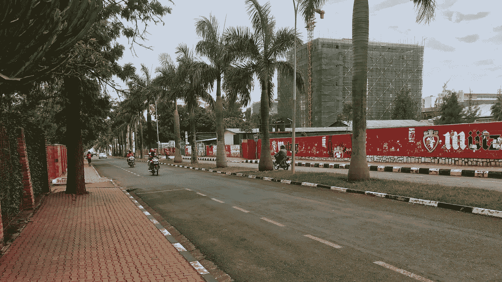
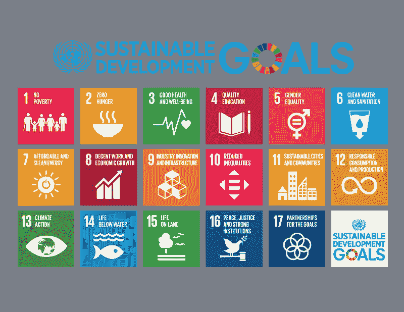

# 每个人都应该学习的 3 条来自非洲的技术经验

> 原文：<https://medium.com/hackernoon/3-technology-lessons-from-africa-everyone-should-learn-3c7c7a322620>

## *卢旺达和肯尼亚之行如何改变了我对新技术的看法*

Kigali, Rwanda

> *技术让人分心，限制选择，劫持你的想法和观点。*
> 
> *社交媒体会让人上瘾，扼杀创造力和人际互动。你应该删除你的社交媒体账户。*
> 
> 自主机器和传感器迎来了“无隐私”时代
> 
> 数字世界再次被“老式的工作方式”所取代
> 
> *crypto 和区块链没有未来。*

我越来越多地在社交媒体上看到这样的消息。关于数字发展和新兴技术的最负面的报道在媒体上最受欢迎。而且，我必须承认，这些故事看起来确实有些吸引力。

然而，在对卢旺达和肯尼亚进行了近两周的访问后，我改变了对这些故事的看法。我开始意识到，这些技术已经或将成为我们社会的一部分，任何阻止、阻挠或破坏其重要性的企图都注定要失败。

# **数字和新兴技术的重要性**

我们应该鼓励而不是阻止社交媒体的使用和新兴技术的进一步发展，如人工智能、传感器和分布式账本技术。虽然它们在“发达世界”可能被视为不必要和不受欢迎的——造成“奢侈问题”，但它们有助于解决基本的生活问题，如新兴经济体的贫困、不公正和不平等。

在过去的两周里，我清楚地认识到了数字和新兴技术的一些好处。

## **#内含物**

第四次工业革命导致越来越多的包容。社交媒体和数字空间让更多人参与政治和公共辩论。

在线培训平台和社交媒体让更多的人参与到教育系统中来。

金融技术解决方案和加密货币为那些通常被排除在传统银行和货币系统之外的人们提供了更多的金融包容性和经济利益。

正如一名肯尼亚出租车司机上周对我说的那样:

“金融科技让我有可能成为金融系统的一部分。最大的好处是，它能让我的孩子得到适当的教育。”

## **#可持续发展目标**

2015 年，联合国会员国通过了 17 项可持续发展目标。

显然，总的来说，技术对大多数可持续发展目标都有积极影响。我已经提到了数字技术给教育系统带来的好处。当前的技术发展也带来了经济增长，有可能减少贫困。

其他新兴技术限制了人类对环境的影响，并促进了所有层次和年龄的所有人的健康和福祉。

## **#老牌精英的瓦解**

技术的指数级增长已经为更多的公司提供了更多的机会。它创造了新的市场，并给现有企业带来了巨大压力。

例如，我在非洲了解到，传统银行在数字化转型和不断变化的消费者偏好方面存在严重问题。成熟市场的“重组”带来了新的竞争，也可以说减少了腐败。

## **#新商业生态系统**

社交媒体、数字应用和应用编程接口(API)允许第三方开发者和其他企业在现有产品和服务的基础上进行构建。结果是不同类型公司的可扩展平台生态系统的创建。

[*SafeMotos*](http://www.safemotos.com) 就是创造这样一个生态系统的明显例子。它使用技术来鼓励安全驾驶(通过远程跟踪司机的行为和态度)。它有潜力成为 SuperApp(类似于印度尼西亚的 [*GoJek*](https://www.gojek.io) )，为食品交付、食品技术、金融技术等领域的众多服务提供门户。SafeMotos 的故事之所以如此有趣，是因为它在网站上突出提到了联合国可持续发展目标:

*“safe motos 致力于实现多项联合国可持续发展目标，包括打造更安全的出租车体验(SDG 11)、发展本地技术产业(SDG 9)、通过技术提高出租车司机的经济生产力(SDG 8)以及让女性成为出租车司机(SDG 5)。”*

但是安全运动不仅仅提供经济利益。它还为司机提供持续的英语培训和课程，使他们能够吸引越来越多的外国游客到卢旺达旅游(可持续发展目标 4)。

 [## 这个创新应用如何成为非洲的优步

### 在卢旺达的基加利着陆，你会很快注意到这个城市的一些事情。山丘从地面升起，丛生…

www.nationalgeographic.com](https://www.nationalgeographic.com/photography/proof/2018/february/safemotos-kigali-rwanda-africa-tech/) 

## **#赋予年轻一代力量**

社交媒体(*脸书*、*推特*、 *Instagram* 、 *WhatsApp* 等。)为年轻一代在全球范围内建立联系引入了新的平台。这丰富了他们的生活，增长了他们的知识和技能。

正如我在上周的帖子中提到的，卢旺达的年轻人正在推动一场“自下而上”的社会变革，这将带来一个更清洁、更有序的环境和进一步的技术发展。

# **我从非洲学到的三课**

## **第一课:我们必须更加关注“科技为善”**

很明显，新技术和数字发展有利也有弊。

在我访问过的新兴市场，好处是普遍存在的。一般来说，人们关注的是技术对人们生活和环境的目的和影响。社会和经济利益及影响引起了年轻一代的共鸣，并增强了那些在生活中没有机会或机会很少的人的权能。

## 第二课:我们必须了解科技公司的文化

许多强调社交媒体和新兴技术“奢侈问题”的文章往往会阻碍技术发展。

这不是解决办法。最好是理解和影响技术背后的公司文化。这些公司必须少关注利润，多关注目的和影响。思考与可持续发展目标相关的安全措施。

我们都有责任确保科技公司采取正确的技术保护措施，为用户提供健康安全的环境。通过这样做，我们可以打开大量的新机会，开发创新，事实上，可以进一步保护我们免受潜在的技术危险。

## 第三课:教育

我说得再多也不为过，但应对当前技术革命负面影响的最佳答案是教育。例如，我们必须花更多的时间来解释社交媒体和数字故事的巧妙使用。

我们必须让下一代对新兴技术有更深刻的理解。然后，他们可以确保新兴技术给人类带来的积极影响能够全面实现(不仅是在新兴经济体，也包括“发达世界”)。

我在非洲逗留期间学到了很多东西。我对当前的技术发展及其对新兴市场的意义更加乐观。在我开始抱怨可能由技术引起的“问题”之前，我将首先关注它们为世界其他地方的人们的生活问题提供的真正解决方案。尤其是在那些不太受平台关注的地区，这些平台通常仍然非常关注美国或欧洲。

如果这些好处是真实的(“技术为善”)，我们就不应该忽视或拒绝技术发展，而是应该集中精力训练自己成为更好、更负责任的用户。

*感谢您的阅读！每周都有新的故事。因此，如果你关注我，你不会错过我关于数字时代如何改变我们生活、工作和学习方式的最新见解。*