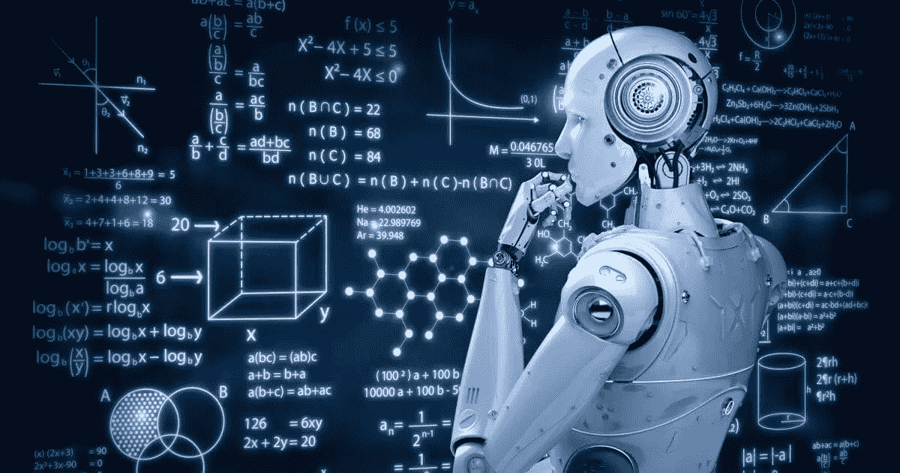
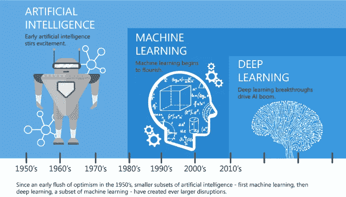
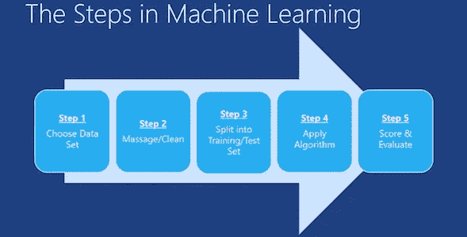
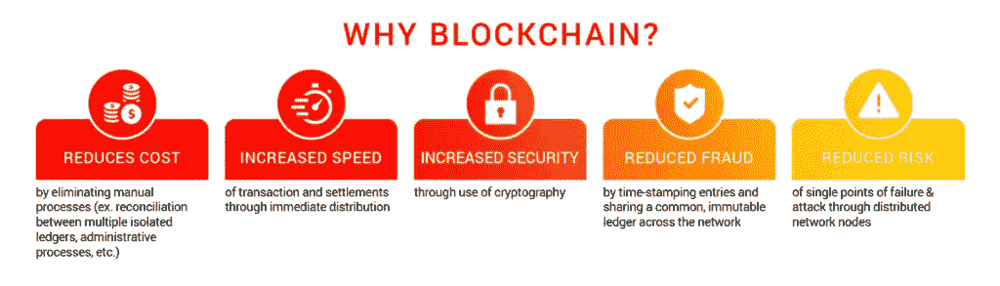

# 区块链可以释放机器学习全部潜力的 3 种方式

> 原文：<https://medium.com/hackernoon/3-ways-blockchain-will-unleash-the-full-potential-of-machine-learning-3d3a4d350b1>

我们目前正生活在一场人工智能革命中，新的研究和应用正在取得成果。人工智能技术的进步，比如深度学习，已经改变了一切，从你的网飞账户上的建议，到医生在病人生病前如何治疗他们。似乎每天都有新的发展和新的任务由以前由人类完成的机器来完成。不久前，人工智能似乎只是科幻小说的一部分。今天，人工智能就在我们身边。

即使有所有这些目前令人兴奋的人工智能应用，在不久的将来还会有更多的应用实现。然而，这项新技术的出现也带来了不切实际的高期望。最新的例子，机器学习。对于人们来说，知道机器学习的宣传在哪里结束，实际应用在哪里开始是很重要的。对我来说，我认为区块链技术是使机器学习发挥最大潜力的基础设施。

# **增加计算能力**

在未来几年，我们的社会无疑将被人工智能的新发展所驱动。这确实将是一个令人兴奋的世界，但它也需要大量的硬件和计算能力。为了让人工智能实现这些宏伟的愿景并兑现其承诺，需要加速机器学习任务的可扩展高级计算。

目前，正在对越来越多的数据中心进行巨额投资，这些数据中心利用传统的基于 CPU 的计算来执行机器学习任务。典型的 CPU 单元有 6 到 14 个内核，可以运行 12 到 28 个不同的命令线程。通常，这些线程将只在单个数据块上运行。因此，建立更多的 CPU 数据中心不足以满足人工智能日益增长的需求。

然而，还有另一种类型的计算可以更好地满足 AI 对计算能力不断增长的需求，即基于 GPU 的计算。一个工作站 GPU 单元可以容纳 2000 到 3000 个内核，每个线程可以运行 100 个或更多的命令线程。通常，这些线程会同时运行大约 30 个信息块。这种计算能力在分布式处理的同时提高了速度，降低了能耗，非常适合机器学习任务。

区块链或分布式账本技术(DLT)可以通过利用拥有未利用的 GPU 计算能力的机器的计算能力来提供人工智能所需的计算资源。在某些方面，这就是比特币协议的设计目的。比特币协议的一部分要求矿工解决任何一台计算机都无法独自解决的复杂数学问题，以此来确认和验证区块链上的交易。随着过程的进行，它不断进化，虚拟货币诞生了。如果我们可以将价值符号化，难道不能将计算能力也符号化吗？

基于区块链的项目目前正在致力于将计算机连接到一个对等网络中，允许个人相互出租资源。这些资源可用于完成需要任何计算时间和容量的任务。如今，此类资源由集中式云提供商提供，它们受到封闭网络、专有支付系统和硬编码供应操作的限制。

# **降低计算成本**

每 3.5 个月，人工智能计算的需求就会翻一番，成本也会相应增加。计算能力的传统供应商，如亚马逊和微软，正在利用价格作为杠杆来控制限制创新的使用。

基于区块链的解决方案现在正致力于为机器学习任务所需的 GPU 计算能力建立分散的市场。这些项目旨在将计算密集型项目与连接的平台成员相匹配，这些成员将共享他们的系统资源来完成给定的任务。借助分布式账本技术(DLT)，人工智能创新可以通过访问加密矿工使用的全球分布式 GPU，大幅降低其计算成本，然后将其提供给人工智能公司。

目前，在多个云平台上，GPU 计算时间可以以约 0.5 美元/小时的价格购买，相比之下，CPU 的价格为约 0.01- 0.05 美元/小时，但尽管 GPU 成本较高，但由于运行时间大大缩短，这些类型的计算要便宜约 5-10 倍。随着基于区块链的项目创建计算能力市场，这些费率可能会很快变得比过去的成本曲线更具压缩性。

# **提高数据完整性**

对于任何人工智能模型来说，准确可靠的数据是模型产生智能行为的核心。这也意味着考虑数据和应用程序的完整性，在模型中包含的数据和工程师维护的原始记录之间存在无法解释的差异。

公共区块链的本质非常适合数据完整性这样的任务。区块链创造了一种环境，在这种环境中，数据是私有的、不可变的、透明的、分布式的，并且可以在没有主权实体的指导下自由操作。最终，公共可开采的区块链将成为人工智能高速公路，但不仅仅是计算能力。它们还将作为人工智能模型的数据来源，这对保持模型的有效性至关重要。区块链技术有望为人工智能算法增加结构和问责制，以及它们产生的智能的质量和有用性。

# **结论:**

分布式账本技术(Distributed ledger technology，DLT)通过将原始计算处理能力商品化和符号化，有可能成为人工智能基础设施的支柱，从而扩大人工智能的发展。任何感兴趣的方面都可以自由地访问 GPU 计算能力进行人工智能开发，这将减少我们对亚马逊和微软 CPU 农场的依赖，这些农场以价格调节创新率。如果在区块链生态系统中构建解决方案的团队能够兑现他们的承诺，开发者和工程师将能够将人工智能的真正潜力扩展和应用到我们的生活中。

**想了解更多信息，请访问我的网站:**

【www.MasiDigitalVentures.com 