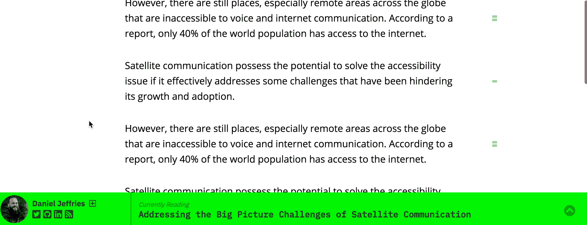

# 改善投稿作者体验的 3 种方法

> 原文：<https://medium.com/hackernoon/3-ways-to-improve-experience-for-contributing-writers-e3e13a48b2e4>

`1\. Don't run pop up ads on their content.`

当有人希望一个故事对公众免费时，它就应该对公众免费。购买鞋子或创建账户的弹出广告是阅读故事的主要障碍。我们正在消除这一障碍。

`2\. Make it easier to read more stories by the contributing writer.`

在[黑客正午 2.0](https://community.hackernoon.com/c/product) 中，我们将测试增加同一撰稿人的第二个故事被阅读的可能性的方法。目前，当你在 Hacker Noon 上发表文章时，你必须离开故事页面才能获得作者的更多故事。我们正在试验一个粘性作者简历，这样贡献者可以策划他们的前 3 个故事，并使他们可以在他们所有的故事页面上访问。示例:

`3\. Give the contributing writer the power to make a prominent call to action on their profile page.`

当你向另一个网站投稿时，它有助于扩大你的社区和整个互联网的存在。大多数投稿作者都有办法让他们的读者帮助他们。通过在投稿作者简介页面设计一个突出的行动号召，我们可以帮助投稿者从他们的读者群中获得更多。简单的用例可以是“购买我的书”、“演示我们的软件”、“订阅我的时事通讯”、“订阅我的 patreon”、“现在招聘”，或者我们的贡献者提出的任何有创意的 CTA。我认为这可以使他们的黑客正午简介成为一个有助于推动真正商业活动的页面。

*原载于 2019 年 4 月 10 日*[*community.hackernoon.com*](https://community.hackernoon.com/t/3-ways-to-improve-experience-for-contributing-writers/1911)*。*