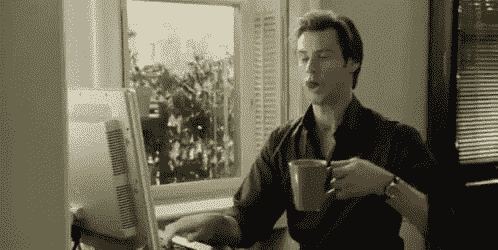
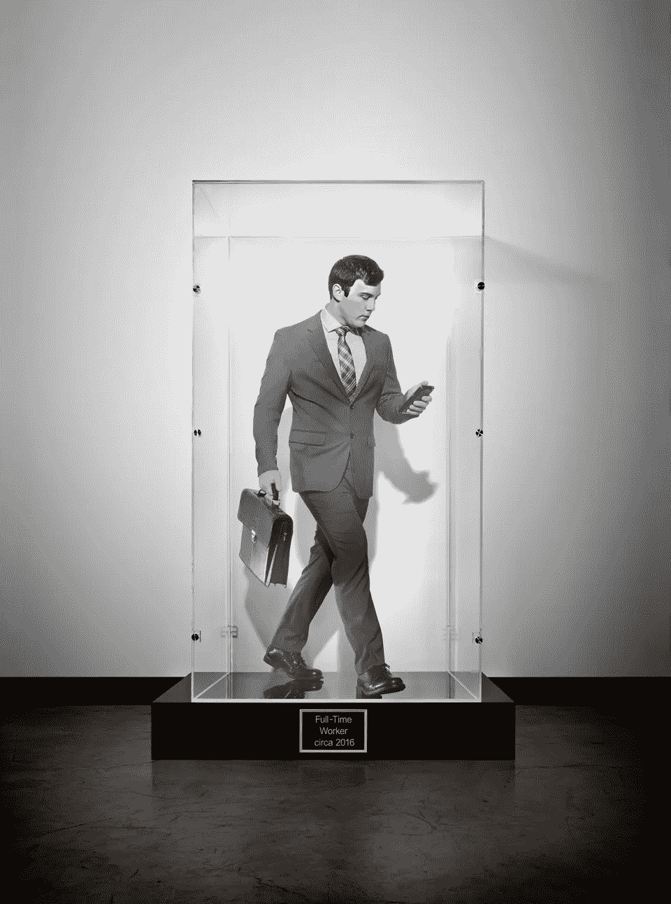
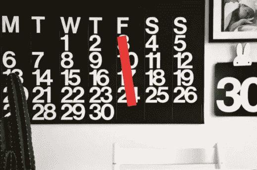

# 战胜办公室无用装腔作势的 3 种方法

> 原文：<https://medium.com/hackernoon/3-ways-to-win-the-battle-against-useless-posturing-in-the-office-a51103657006>

## 出勤主义是一种流行病，以下是我们如何战胜它。

> 这家伙带着流感去上班。纸巾散落在他的桌子上，你不能停止想那些细菌跳进你的咖啡杯。这是一种出勤主义——一种有义务在工作，但精神上完全放松的感觉。

出勤主义现象困扰着许多公司和员工。员工觉得有必要坚持工作，以给同事留下深刻印象，或者不被老板瞧不起，即使他们无法有效地工作。但是，谁说早到、辛苦地吃午饭或者在办公室呆到很晚会让你成为一个更好的员工？事实上，有[强有力的证据表明，当你坐在办公桌前时，你的创造力和效率都不是最强的。](https://www.theladders.com/career-advice/einstein-on-the-only-productivity-tip-youll-ever-need-to-know)

仅在美国，由于出勤造成的生产力损失就高达每年 1500 亿美元。进一步的拖累包括工作中更多的错误，需要更长的时间来完成任务，工作质量更差，士气更低，精疲力竭，愤怒，怨恨和社会功能受损。

对许多人来说，出勤主义是糟糕的病假政策的一个功能，这使得员工别无选择，只能强迫自己工作以保持稳定的工资。但对于有适当病假的工薪员工来说，出勤主义源于糟糕的管理，这种管理将面对面时间看得比产量或员工福利更重要。

今天所需要的是一种重视工作结果的文化。无用的姿态必须让位于有目的的生产力。

这里有三种方法可以让你在办公室里对抗出勤主义。

# 让他们走

想创造一种更具创新性的文化？给员工更多自由。

办公室设计公司 Morgan Lovell 的工作场所主管 Monica Parker 解释说:“我们应该努力创造一种文化，在这种文化中，人们觉得他们可以真实地展现自己，但也觉得他们不必在场，消除办公室中的那种在场感。”。员工应该在工作环境中自由流动，而不是被束缚在办公桌前。我们的目标应该是通过技术或小隔间感到被授权，而不是被限制。

然而，在工作场所，台式电脑等固定技术仍然以 2:1 的比例超过笔记本电脑等移动技术。如果不给工人足够的自由裁量权来控制他们的工作，公司实际上抑制了生产力。这正是为什么保持运转的[是苹果总部的基石。是时候我们欣赏弗里德里希·尼采的说法了，“所有真正伟大的思想都是在行走中产生的。”](https://www.inc.com/jonas-altman/apples-new-headquarters-proves-that-the-coolest-of.html)

每家公司愿意授予的自由度都是有限的。当玛丽莎·梅耶尔把雅虎的员工叫回办公室时，这突然终结了在家工作的灵活性。几年后，马特·莫楞威格走了另一条路，摆脱了他的公司 Automattic 的旧金山总部。

“人们行使一定的酌处权和控制权的工作会导致认知的灵活性和对自我和社会的参与性取向；相比之下，过度监控、压迫性监督的工作环境会导致痛苦，”心理学家巴里·施瓦茨引用了[梅尔文·科恩和卡米·斯库勒](https://www.jstor.org/stable/2779361?seq=1#page_scan_tab_contents)的一篇经典文章。给员工控制权与我们是否被要求去办公室关系不大，而与我们对工作的感受关系更大——无论工作以何种形式进行，我们都会做出贡献。

# 让正念成为一种武器

太多的时候，人们甚至在完成了大部分工作后还在工作。他们一整天都筋疲力尽，但是在时钟敲响那个神奇的数字或者老板先离开之前，没有人敢离开。

仅仅因为你在键盘上敲敲打打并不意味着你在高效地工作。

在工作中进入正念。如果你对这个概念不熟悉，正念就是完全活在当下的练习——而不是白日做梦或在你的头脑中娱乐其他想法。

也许在工作中更多的正念的最大好处是在如何最好地引导你的能量方面做出更好的决定。研究表明，正念冥想[会削弱任务动机](https://www.researchgate.net/publication/324900898_Mindfulness_Meditation_Impairs_Task_Motivation_but_Not_Performance)，但不会影响表现。换句话说，当你知道你的注意力和精力可以更好地用于为新客户准备推介时，你会不情愿地遵从并填写无意义的管理表格。随着时间的推移，再加上这种意识，你可能会开始质疑一项工作是否可以被简化、更有效地完成、被技术淘汰，或者可能被完全取消。

正念带给个人的清晰思维也转化为持久的商业成功。通用电气前副主席贝丝·康斯托克知道这一点。她发展了*文化俱乐部*。她所在的业务部门有一个多层次的团队，帮助实现转型变革和领导力。她给领导一笔“赏金”，让他们告诉她一些她真的不想听的事情。有了这种程度的坦诚，领导者就可以确定哪些低效可以消除或减少。通过这种方式，员工福利和业务创新都得到了提升。

# 提升工作精神

大多数美国人在心理上对他们的工作和公司没有归属感(T4)我们不应该简单地看我们是如何度过时间的，我们应该意识到我们是如何集中我们的工作精神的。保持高昂士气的一个方法是缩短工作周。

“每周工作 40 小时是工业时代的遗迹。AngelList 创始人 Naval Ravikant 说:“知识工作者的工作就像运动员一样——训练、冲刺，然后休息、再评估。”。

缩短工作周的好处是多方面的:更少的病假、节省成本、更好的工作/生活融合。这种修正的工作观注重质量，而不是数量。随着自尊感的增强，员工也更有创造力、生产力、责任感和协作精神。你希望重症监护护士在 12 小时轮班结束时还是在 4 小时轮班开始时照顾你吗？

我当然知道我会选哪一个。

*享受这个？考虑快速打字并与你的伙伴分享🤓*

*加入我下一个关于* [*工作中的创造力*](https://www.eventbrite.ca/e/creativity-at-work-tickets-53933634954) 的谈话