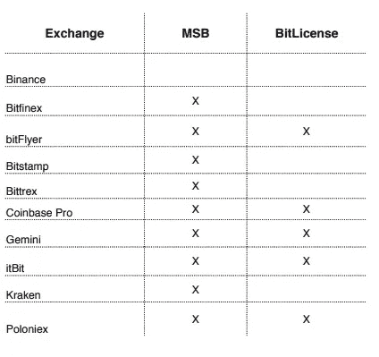
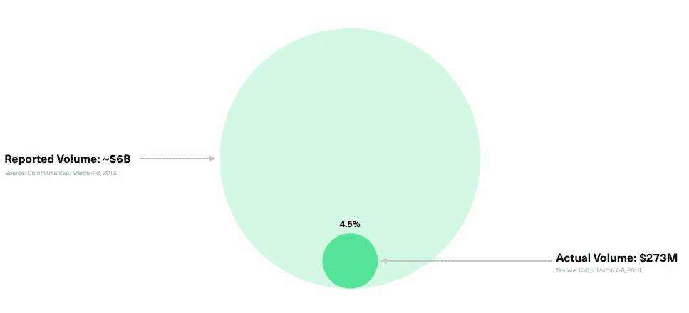
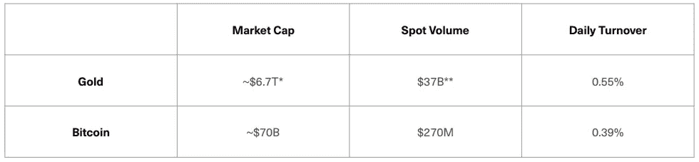

# 我们的加密应用完成了 2%的比特币交易。以下是方法。

> 原文：<https://medium.com/hackernoon/300-million-in-trades-the-crypto-app-doing-2-of-bitcoins-trade-volume-3aba5bbb6aae>

我们已经看到了最近的见解和报告趋势，讨论了整个加密市场中存在的伪造量。加密社区明白这是一个主要问题，减缓了其被普通社会的合法接受，许多企业和实体正在努力揭露可疑的加密市场经济的真相。

# 假货与真货

Bitwise Asset Management 最近发布了他们的报告“真实的比特币市场”，该报告详细讨论了交易所之间猖獗的虚假交易量，并试图揭示比特币的真实市场规模。链接可以在这里找到[。](https://www.sec.gov/comments/sr-nysearca-2019-01/srnysearca201901-5164833-183434.pdf)

在这项研究中，Bitwise 承认了从加密交易所获取真实交易数据的挑战。为了过滤“灰色市场”，从主要受监管的市场中逐位选择数据，用于详细分析真实的比特币市场规模。

以下交易所的数据用于获取现货市场交易量:币安、Bitfinex、Bittrex、BitFlyer、BitStamp、比特币基地 Pro、Gemini、itBit、北海巨妖、Poloniex。

Exchanges studied in Bitwise’ true Bitcoin volume analysis

Bitwise 指出，区块链透明研究所(block chain Transparency Institute)也对非经济和/或虚假交易量进行了详细调查，并确定了 56 家涉嫌存在虚假交易量的交易所。可疑的交换都不在 Bitwise 研究中使用的十个交换中。

此外，除币安之外，上述所有交易所都在 FinCEN(金融犯罪执法网络)注册为货币服务企业(msb ),有义务制定正式的反洗钱政策，以发现可疑和非法的金融活动并提交报告。

根据从 CoinMarketCap.com 和 Kaiko.com 收集的现货市场数据，Bitwise 指出，比特币的实际交易量远低于交易所报告的交易量。

在交易所报告的 60 亿美元比特币现货交易量中，Bitwise 发现只有 2.7 亿美元是实际真实交易量，这表明报告的比特币交易量中约有 4.5%是真实的。或者换句话说，超过 95%的报告比特币交易量是假的！当涉及到恐吓局外人冒险进入 crypto 时，这是一个相当有效的标题。

他们通过将每日市场成交量与黄金(一种类似但不同的资产，价值储存手段)进行比较，进一步支持了这些结果。我们可以观察到比特币的市场行为相对紧密地跟随黄金的市场行为。如果我们要增加每日成交量以匹配黄金，我们将获得约 3.8 亿美元的全球比特币每日现货交易量，如果我们计入虚假交易量，这可能是一个粗略的估计。

## shrimpy:3 亿美元的交易量&比特币日交易量的 2%？

几周前，我们发布了一篇文章，详细介绍了我们如何在加密交易中实现 2.5 亿美元的收入。从那以后我们就没有停止过。上个月，我们的月销量增长了 70%以上！

根据 Bitwise 报告中 2.7 亿美元的实际每日比特币现货交易量，我们可以推断 Shrimpy 在整个比特币现货市场的交易量中占 1-2%的份额！

然而，我们不会走得太远，因为这些数字只是粗略的估计。甚至 Bitwise 报告也多次提到，他们的报告完全排除了大部分加密交换，因为存在虚假量。虽然伪卷是加密中一个持续存在的问题，但是我们不能完全忽略来自这些交换的所有卷。

Shrimpy 交易怎么这么多？答案很简单。我们的应用程序简单易用。不像其他自动交易机器人，Shrimpy 是初学者友好的，不需要交易知识或经验来设置。用户通过选择他们的资产和适当的分配来构建一个简单的加密指数投资组合，它们就设置好了！

为什么让新的密码所有者难以管理他们的投资组合，尤其是在这样一个动荡和不可预测的市场？通过消除积极管理加密交易的压力和需要，Shrimpy 让加密资产所有者和交易者在管理他们的加密未来时放心。

Shrimpy 的目标是成为初级和高级交易者的标准现货市场交易解决方案。在我们的[2.5 亿美元的里程碑文章](https://blog.goodaudience.com/executing-250-million-in-crypto-trades-dd45d2d3a48c)中，我们提到了在明年整合另外 24 家交易所的宏伟目标。然而，我们不能直接去 CoinMarketCap.com，开始根据交易量整合交易所。必须有一个审查过程来识别哪些交易所没有虚报交易量。这确保了我们支持的任何交易所整合将能够继续推动 Shrimpy 的发展势头。

# 关于虾皮

[Shrimpy](http://shrimpy.io/) 是一个自动化加密交易&投资组合管理工具，让用户像传统的指数基金一样自动化他们的加密资产投资组合策略。

## Shrimpy 应用

 [## Shrimpy -加密货币投资组合管理

### 管理您的数字资产的最简单、最值得信赖的方式。

www.shrimpy.io](https://www.shrimpy.io/) 

用户能够配置定制的加密货币组合，并实施被动管理策略，消除了必须主动交易加密的麻烦。

Shrimpy 的免费版本为所有用户提供了完整的自动交易、指数和再平衡功能。Shrimpy 还提供每月 8.99 美元的月费订阅。高级订阅包括:

Shrimpy Social :关注、交流和分享其他 Shrimpy 交易者的策略。

[**Shrimpy Insights**](https://blog.shrimpy.io/blog/shrimpy-introduces-social-insights) :了解其他 Shrimpy 用户如何构建和管理他们的加密组合。

[**高级回溯测试**](https://blog.shrimpy.io/blog/the-crypto-portfolio-rebalancing-backtest-tool) :用于评估定制加密货币组合&策略的健壮回溯测试工具。

## Shrimpy 为开发者提供的加密交易 API

 [## 面向开发者的加密交易 API

### 业界领先的加密交易、实时数据收集和交易账户管理 API。

developers.shrimpy.io](https://developers.shrimpy.io/) 

除了消费者应用程序，Shrimpy 还为希望将可扩展的交易所交易功能集成到其应用程序中的开发人员提供了一个交易 API。

Shrimpy 的 Universal Exchange API 是作为一个基于云的解决方案创建的，以解决几个加密开发人员的障碍，包括**交换交易**、**产品可扩展性**和**用户管理。**有了 Shrimpy 的 API 在手，开发人员在创造将塑造加密未来的下一个时代的突破性产品时就不会受到范围的限制。

Shrimpy 的 API 是一种加密货币交易 API，可与以下所有交易所及其 API 端点兼容:币安 API、CoinbasePro API、Bittrex API、北海巨妖 API、Gemini API、Poloniex API、Huobi API、KuCoin API、Bibox API、BitMart API 和 HitBTC API。用户不必管理每个交易所的所有连接，只需利用 Shrimpy 现有的加密交易所交易基础设施，并专注于实际的产品开发。

**虾米链接**:

[电报](http://t.me/ShrimpyGroup)

[推特](https://twitter.com/ShrimpyApp)

[脸书](https://www.facebook.com/ShrimpyApp/)

Reddit

*原载于*[*blog . shrimpy . io*](https://blog.shrimpy.io/blog/shrimpy-trading-two-percent-entire-bitcoin-market)*。*