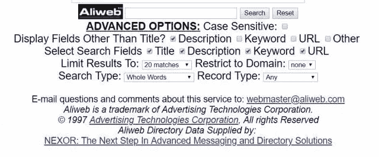
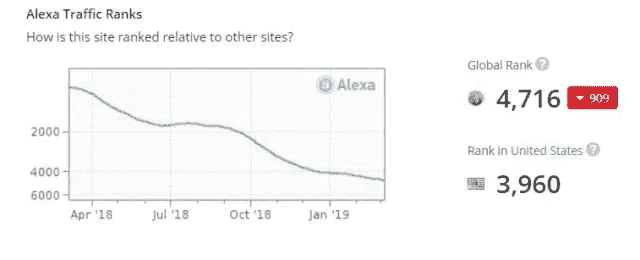
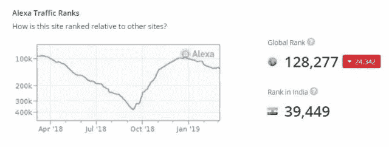
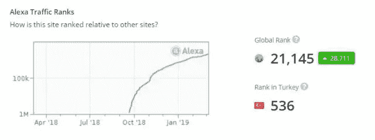
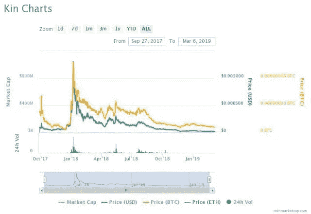
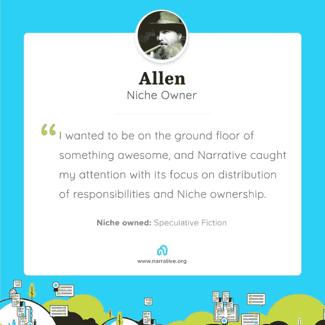

# 围绕区块链技术构建的 31 个社交网络

> 原文：<https://medium.com/hackernoon/31-social-networks-utilizing-a-blockchain-e639214ee8e6>

Screenshot of Whaleshares’ Welcome page

在之前的一篇名为“[社交媒体的发展](http://tayloredcontent.com/the-evolution-of-social-media/)”的文章中，我回顾了一些始于 20 世纪 90 年代的社交媒体的历史亮点，并触及了一些当前涉及区块链的社交媒体项目。在那篇文章中，我没有给出一份目前或即将运营的区块链社交媒体网站的完整列表。这就是今天的帖子。

值得指出的是，区块链上的许多社交媒体项目都是对[脸书-剑桥分析公司丑闻](https://en.wikipedia.org/wiki/Facebook%E2%80%93Cambridge_Analytica_data_scandal)的回应。如果不是直接的，那就是间接的。即使是在那次事件之前启动的项目，如 Steemit，也是对社交媒体集中化方法的回应，自[阿奇·李克索引](https://web.archive.org/web/19980209094726/http://www.aliweb.com/)为信息搜索者提供了第一个集中式网络搜索引擎以来，这种方法一直主导着在线媒体。你可以在维基百科找到真相。

Screenshot from the Internet Archive

我不认为下面的列表是全面的，当然也不是详尽的。我所尝试做的是尽可能多地找到目前正在运营或即将运营的区块链社交媒体项目。其中一些可能还没有发布。他们可能处于 ICO，前 ICO，或后 ICO 阶段，但有一些项目声称是社交的，我没有提到。

我在这里的目的是列出核心功能是社交的网站。也就是说，他们属于通常所说的“社交媒体”或“社交网络”在去中心化的时代，你会发现很多项目试图包含社交成分，但是这个成分并不是平台的核心特征。例如， [Qbao Network](https://qbao.fund/#/) 是一款具有社交功能的跨链数字钱包。 [Mixin Messenger](https://mixin.one/messenger) 是一款信使应用，存在于[点对点数字资产交易平台](https://mixin.one/)的更大框架内。我可以很容易地列出其他分散的区块链项目，这些项目包括社会成分，但本质上不是社会的，或者社会成分不是商业模式的核心，但这个列表可能比世界上最长的火车轨道还要长。我会放弃这一切。

在区块链技术发展的这个节骨眼上，有许多项目根本没有持久力在下一次重组中生存下来。我不关心这个。如果我听说了一个网站，但找不到它的网址，它就不在这个列表中。如果这个项目目前有一个网站主页，并且它的核心功能是社交，那么它就包括在内。这个帖子发表后会发生什么，我就不知道了。

现在，事不宜迟，我给你 31 个使用区块链(或加密货币)的社交网络。

# 纯社交网络

先说纯社交。这是一个普通的社交媒体网站，没有专业化，只是一个包罗万象的类别，任何类型的社交网络都可以归入其中。

**1。**[**Steemit**](https://steemit.com/)——我们先从他们的大老爹开始。Steemit 并不是第一个加入区块链的社交网络，但它是最大的。区块链被称为 STEEM，Steemit 是位于它上面的社交网站 dapp。这是非常基本的。自我定义为像 Reddit 一样，你可以看到一个白色的屏幕和一个可怕的用户界面来发布你的博客帖子，但由于 Steemit 是第一个上市的，他们比其他人都有优势。你可以因你发布的内容、upvote 和 resteem 以及你在其他 Steemians 人的帖子上发表的评论获得作者奖励和策展奖励。在过去的一年中，他们的流量一直在稳步下降，目前在 Alexa 的全球排名为 4689。

Screenshot of Steemit’s Alexa rank

**2。**[**Trybe**](https://trybe.one/)——还是在第一年，try be 就坐上了 EOS 区块链。有趣的是，它的前端是建立在 WordPress 之上的。没关系，但是 WordPress 是开源的，并不完全安全。十多年来，我一直在上面运行我的网站。尽管它是内容管理系统中的佼佼者，但仍会遭到黑客攻击。几周前，我试图登录我的 Trybe 账户，发现这个平台被黑客入侵了。然而，网站的货币部分位于区块链，是完全安全的。据我所知，没有人失去任何价值，虽然我不能登录到我的帐户几个小时，直到他们修复它。

**3。** [**叙事**](https://alpha.narrative.org/wait-list?r=2KDQsJFSdz)——叙事是一个很有前途的新兴网站，坐落在新区块链上。围绕利基组织，叙述者可以购买或被提名主持(利基所有者和主持人因其角色获得奖励)，内容创作者在创建个人日志条目时选择其中三个利基发布。目前处于 alpha 阶段，我期待看到叙事如何推出测试版，计划于 2019 年 4 月 2 日推出。与此同时，平台上也出现了一些争议，这些都是相对于大局而言的小问题。

**4。**[**Minds**](https://www.minds.com/)——Minds 自称“秘密社交网络”据我所知，该网站于 2015 年推出，这使其成为第一个上线的区块链社交媒体网站。Minds 位于以太坊区块链，其令牌是一个 ERC-20 令牌。用户可以写博客，查看他们的新闻源，参加小组，在 messenger 应用程序上聊天，发布照片和视频，以及在频道中播放。其全球 Alexa 排名为 11030。老实说，我不知道为什么它没有比现在更受欢迎。

Screenshot of the Minds home page

**5。**[**some**](https://somee.social/)——some 以前叫王。现在，货币是 onG，网站是 SoMee。它还没有上线，网站上也没有任何信息。如果你点击脸书图标，这应该会带你到一个脸书页面，你会得到一条消息说，该应用程序仍处于开发模式。

**6。** [**超空间**](https://site.hyperspace.app/)——这个看起来和叙事差不多。用户创建空间并邀请其他人加入这些社区，并因在这些社区周围创建内容而获得本地货币报酬。全球 Alexa 排名= 396014。

**7。** [**乳齿象**](https://joinmastodon.org/) —乳齿象承诺在“非算法”的订阅源中提供无广告内容这对反脸书的人群来说应该很好。我没用过，但是看起来很像 Hootsuite。用户可以发布最多 500 个字符的内容。用户也可以为这个平台开发应用程序，但我看不出有什么方法可以从你的内容中获得回报。全球 Alexa 排名= 78661。

Screenshot of Mastodon

**8。**[**social**](https://sociall.io/)—social 的口号是“我们重塑了社交媒体。”他们于 2018 年在 Q1 推出，因此与 Steemit 和 Minds 相比，他们还很年轻。他们在以太坊区块链有自己的令牌，他们的目标是分散社交媒体，让社区管理平台。这很像叙事，但相似之处也到此为止了。它们包括即时通讯、用户博客、众筹和“脸书移民工具”我喜欢这种声音，但我没有使用过这个平台，所以我不知道它是如何工作的。他们的 Alexa 流量模式看起来像过山车。

9。[**WhaleShares**](https://whaleshares.io/)——WhaleShares 有自己的区块链，是由 Steemit whale[@ official fuzzy](https://steemit.com/@officialfuzzy)创建的，他也是 BitShares 的联合创始人。Steemit 的普通用户几乎从一开始就明白这个平台是如何被 bidbots 所困扰的。许多人因为这个原因离开了这个平台。WhaleShares 在许多想从创作和管理内容中获得更公平回报的斯蒂芬妮人中变得很受欢迎。它最独特和有趣的功能之一是能够在 Steemit 或 Golos 上购买鲸票。其全球 Alexa 排名为 128741。它在西班牙、印度、美国和尼日利亚非常受欢迎。这是一个需要关注的问题。

Screenshot of the Whaleshares Welcome page

10。 [**全球社交链**](https://gsc.social/)——自称全球第一社交链，他们也自称是中东和东南亚最大的社交媒体网络平台。他们的全球 Alexa 排名在过去三个月中下降了近 200 万用户，所以这看起来不太好。

# 移动消息应用

我对手机短信不感兴趣，可能是因为我的年龄，但我个人对分享内容的偏好是在那里我可以让我的大脑像鹰一样飞翔。移动和即时通讯与这个目标不太相符，所以如果我是千禧一代，我可能还是更喜欢博客和内容管理。然而，WhatsApp 和 Snapchat 已经证明了这里是有市场的。我在区块链上发现了三款可靠的即时和移动通讯应用。

11。 [**小野**](https://www.ono.chat/en/)——自称“去中心化区块链网络”，小野也自称是最大的去中心化自治社区。坐在 EOS 区块链上，mainnet 还没有发射。创作者和策展人根据他们的内容、投票和对其他用户内容的评论获得报酬。虽然 Ono 还有其他组件，但即时消息组件被认为是其“基础生态系统”的一部分。其全球 Alexa 排名为 958，076，尽管在过去八个月中大幅下降。

**12。** [**黑曜石**](https://obsidianplatform.com/)——目前在 alpha 中，黑曜石是一款有消息应用的区块链。该应用程序声称是一个“匿名的加密通信应用程序。”

**13。** [**宁折不弯**](https://adamant.im/)——和黑曜石一样，宁折不弯是 2017 年研发的。它的区块链使用分布式状态证明共识机制，迄今为止还没有获得太多的关注。

# 专业网络平台

这些总部位于区块链的社交网络平台类似于非区块链的社交媒体，针对特定的专业领域，如 LinkedIn、YouTube 和 Pinterest。

14。[**social x**](https://socialx.network/)—一个发布照片和视频内容的社区。我没什么印象。

15。**——邀请你“收回你的社交体验”的社交媒体平台有什么不让人喜欢的这个社交新闻平台允许用户控制自己的数据，奖励策展人，并“打击假新闻”。他们的 SPN 令牌位于以太坊。他们有一个好看的网站，他们的全球 Alexa 排名是 496，131。其中大部分似乎是印度。**

**16。 [**Sola**](https://sola.ai/) —在测试版中，Sola 自称是“没有压力的社交媒体”，一个你可以“乐此不疲”的地方。对我来说那听起来像一个笑话，但是我不确定笑点在哪里。该网站相当有吸引力，但它看起来像一个思想的仿冒品。他们的加密货币 SOL 是一种 ERC-20 代币，他们为即将到来的空投感到自豪。我将 Sola 放在专门的类别中，因为用户可以通过人工智能算法看到交付给他们的卡片中的内容。我没用过网络，但听起来很有趣。他们的全球 Alexa 排名是 128277。**

****

**Screenshot of Sola’s Alexa rank**

****17。**[**Indorse**](https://indorse.io/)—Indorse 是一个类似 LinkedIn 的社交平台，允许用户验证彼此的技能。这的确是一个有趣的概念，我很想尝试一下。全球 Alexa 排名 455730。**

****18。** [**道具项目**](https://www.propsproject.com/) —一个视频分享平台，简单明了。我认为它需要一个更好的名字，但它得到了 YouTube 红人菲尔·德弗兰克的认可，所以我知道什么？我确实喜欢其中的一些特色。Props 包括一个可下载的手机应用和一个游戏节目应用。内容创作者和策展人赚取报酬，而侵扰性的广告客户却没有分成。我希望这一次成功，但是，目前的交通数字看起来不太好。**

**19。[**LBRY**](https://lbry.io/)—LBRY 自称“媒体网络”。我很有兴趣下载这个桌面应用，但是我还没有做任何事情。尽管如此，这个想法是存在的，而且它们似乎很受欢迎。他们的全球 Alexa 排名是 55560。其中大部分似乎在美国。创作者可以参加 YouTube 合作伙伴计划和 3D 打印计划。**

****

**Screenshot of LBRY’s “Learn” page**

**20。[**delegate call**](https://delegatecall.com/)—一个为提问和回答问题支付代币的问答网站。这很简单。先别离开 Quora，但这个有前途。它在以太坊和织布机网络上运行。他们的全球 Alexa 排名是 449950。**

****21。** [**烟网**](https://smoke.io/)——大麻爱好者现在在区块链上有了自己的社交网络。他们在斯蒂尔姆区块链使用授权的利益相关证明机制。吸引人的网站，得到点燃。好吧，烂笑话。他们的全球 Alexa 排名是 405267。**

# **Steemit 仿制品**

**当你在任何竞赛中领先时，你无疑会有模仿者。那是赞美。在这种情况下，由于 Steemit 是开源的，任何人都可以获得 Steemit 代码并创建自己的仿冒品，许多人已经这样做了。这些并不是唯一基于 Steemit 的网站，但这些是我发现最有趣和/或显示出一点希望的网站——除了 Smoke Network。**

****22。** [**熊股**](https://bearshares.com/) —我不确定这个名字是从哪里来的(为什么不是牛股？).你登陆这个网站，它看起来非常像 Steemit。几乎一样，但更有吸引力。与 Steemit 概念相同。我为什么要用它？他们的大部分用户群在尼日利亚。**

****23。**[**Golos**](https://golos.io/)——这是另一个明显的 Steemit 仿冒品。他们的总部设在俄罗斯，大部分用户群在俄罗斯，但在德国、波兰、西班牙和英国也很受欢迎。他们的全球 Alexa 排名是 53866。**

****24。**[**Serey**](https://serey.io/)——总部在柬埔寨，在孟加拉国似乎更受欢迎。**

# **基于 Steem 的 Dapps 和平台**

****二十五。**[**Dtube**](https://d.tube/)—Dtube 是一个基于 Steem 区块链的视频分享平台。用户可以通过发布和分享他们的视频、投票和评论他人的视频获得奖励。**

****二十六。**[**d live**](https://dlive.tv/)——d live 是一个视频直播平台，它始于斯蒂姆区块链，但后来跳出链条，来到了利诺区块链。他们的全球 Alexa 排名是 21145。在土耳其，他们排在第 536 位，远高于美国的第 10，297 位。**

****

**Screenshot of DLive’s Alexa rank**

****27。** [**WeKu**](https://weku.io/) — WeKu 是另一个有自己的区块链的 Steemit 替代品。基于 Steemit 和 Graphene 框架，它利用区块链、人工智能和星际文件系统来创建一个真正分散的内容网络。他们称自己为“区块链的 SaaS 社区平台”WeKu 有一些独特的功能，包括内容创作者出售作品和许可他人使用作品的方式，用户可以创建和管理群组。在斯提米特，许多这类社会特征不和谐地发生。在 WeKu 上，它们被烤进平台。我一直抗拒尝试 WeKu，即使它在 Steemians 中很受欢迎，但我可能不得不尝试一下。随着我对它越来越熟悉，我喜欢我所看到的。他们的全球 Alexa 排名是 187404。它们在美国最受欢迎，但在尼日利亚、哥伦比亚、印度和加拿大也有可观的用户基础。他们于去年夏天推出。**

# **社交“社区”**

**这两个平台都是基于中文的平台，语言有点混乱。我可以清楚地看到社交网络是这些平台的主要组成部分，但我不确定如何利用它们。这可能是翻译问题，也可能只是中国人看待他们的媒体的方式不同。**

**28。 [**TTC 协议**](https://www.ttc.eco/#/)——TTC 协议与其说是一个社交网络，不如说是一个连接其他各种社交网络的协议。它包括一个区块链和一个令牌，用户可以构建 dapps。这大概是我能理解的全部，但是看起来很有趣。**

****29。** [**【群群】**](http://qunqun.io/)——群群自称是区块链的一个社交社区平台。这仅仅意味着用户可以创建类似 Twitter 的社区，这些社区相互独立，并被鼓励相互交流。这是一个有趣的概念，但我不确定它是否行得通。好像在哪里都不受欢迎。**

# **传统社交媒体**

**当传统玩家开始采用新技术时，你知道创业公司正在做一些事情。然而，他们通常不如那些原生使用该技术的初创公司做得好。然而，值得注意的是，两家总部不在区块链的社交媒体网站现在正在他们的框架内使用加密货币。**

**三十岁。 [**Kin**](https://kinecosystem.org/) —社交媒体应用 Kik 在 2017 年推出了自己的加密货币。该令牌名为 Kin，可用于各种应用程序之间的支付和转账，位于以太坊区块链上。在 CoinMarketCap 上排名 165，市值略高于 1750 万。**

****

**Source: CoinMarketCap**

**31。脸书——脸书上个月宣布他们正在[收购区块链的一家初创公司](https://cointelegraph.com/news/report-facebook-acquires-blockchain-startup-in-apparent-first)，引发了一些兴趣。现在他们正在谈论他们自己的加密货币。看起来他们打算将它与 WhatsApp 一起使用，WhatsApp 是他们在 2014 年花大价钱购买的消息应用程序，用于印度的资金转账。这可能看起来无伤大雅，但如果这个实验对脸书有效，我不会惊讶地看到他们将加密货币纳入他们在脸书平台上的广告模式。谁知道他们还能去哪里？**

**脸书正在研究自己的加密货币，这不仅是一个大新闻，也是互联网迈出的一大步。由于脸书在几个层面上与谷歌、苹果、亚马逊和微软竞争，这应该会加剧互联网大公司之间的竞争，并使加密货币更接近被广泛接受为一种安全可信的支付方法。但这与这篇博文的目的相去甚远。有 31 个社交网络目前或即将在区块链运营，其中许多处于增长模式，我认为我们对这项新技术有很多期待。**

****

**在我名为“**的 14 种权威内容”的专题报告中，我分享了 14 种不同类型的内容，如果执行得好，可以向你的观众展示你是一个在你的专业领域具有深厚知识和熟练程度的专家，并且他们会因为你的知识和熟练程度而尊重和信任你。我不想让这听起来很容易。不是的。这需要努力工作。但是如果你想让别人承认你是一个权威，那么你必须*证明*你是一个权威。在网上做到这一点的最好方法是提供优秀的内容，让你在观众眼中超越竞争对手。[立即获取免费报告](http://tayloredcontent.com/types-of-authority-content/)。****

********

****I am the proud owner of the Speculative Fiction Niche on [Narrative](https://alpha.narrative.org/wait-list?r=2KDQsJFSdz).****

*****发自我的博客*[*SteemPress*](https://wordpress.org/plugins/steempress/)*:*[*http://tayloredcontent . com/31-social-networks-utilizing-a-区块链/*](http://tayloredcontent.com/31-social-networks-utilizing-a-blockchain/)****

*****原载于 2019 年 3 月 6 日 steemit.com**的* [*。*](https://steemit.com/blockchain/@blockurator/31socialnetworksutilizingablockchain-npve52jy8d)****