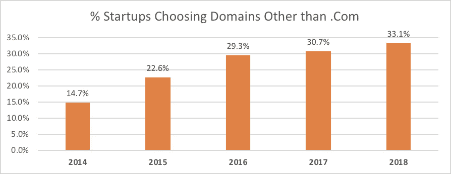
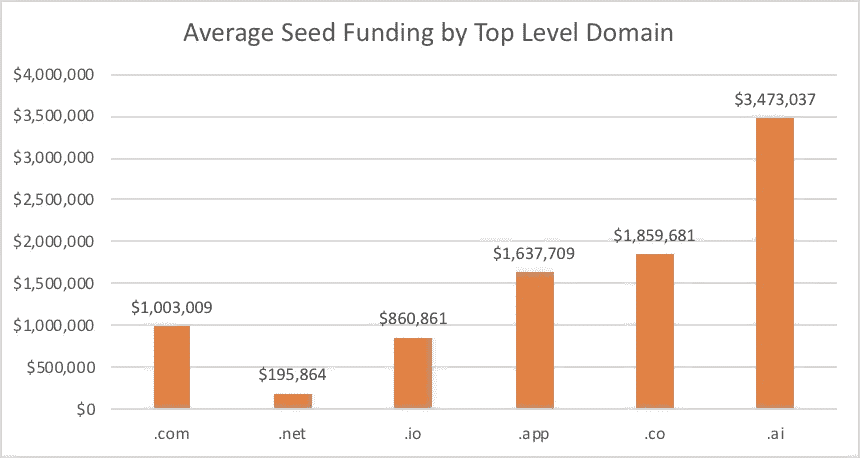
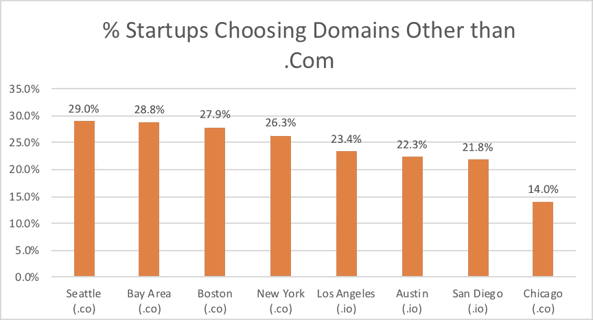

# 33.1%的创业公司不使用网络公司

> 原文：<https://medium.com/hackernoon/33-1-of-venture-startups-dont-use-dotcoms-87e2e25ed134>

## 新的研究表明。艾，。app，。技术和更多替代主页域扩展

初创企业总是在创新，甚至在选择互联网顶级域名时也是如此。越来越多的创业公司避开传统的。com 域名扩展有利于更独特的，有时是描述性的顶级域名，特别是随着互联网的成熟和可用的数量。com 域名减少。

Brex 分析了超过 3000 家申请其企业信用卡服务的初创公司，发现自 2014 年以来，选择 TLD 而不是 TLD 的初创公司数量。com 增长了一倍多，从 2014 年的 14.7%增长到 2018 年的 33.1%。2014 年，除了。com 是。木卫一，。然而，在 2018 年，反映了人工智能在创业生态系统内的崛起。ai 取代了。net 作为第三种最受欢迎的域名扩展。近年来越来越流行的其他扩展包括。app，。健康，。技术和服务。

> **2018 年 T3。ai 取代了。net 作为初创公司中第三受欢迎的“替代”域名扩展，是初创公司中所有顶级域名中增长最快的**

有趣的是，顶级域名似乎与融资高度相关，因为拥有. ai 域名的种子期公司的平均融资额是拥有. com 域名的公司的 3.5 倍，而拥有. ai 域名的公司的平均融资额是拥有. com 域名的公司的 3.5 倍。网域名称公司只有 20%的平均份额。com 域名公司资助。

总部位于西雅图的初创公司最有可能选择替代域名，有 29%的公司这样做。这略高于硅谷和波士顿的初创公司，但与奥斯汀(22.3%)、圣地亚哥(21.8%)和芝加哥(14.0%)相比，这三个城市都领先。每个被调查的城市都有。co 或。木卫一成为他们最受欢迎的替代 TLD。然而，。ai 在加州最为流行，在湾区和洛杉矶都有极大的集中。

另类领域并不仅仅局限于初创公司。有趣的是，风险基金已经开始跟随其组合投资的脚步，使用 Brex 的风险基金中有 28%选择了其中任何一种。vc 或者。资本扩展。

> ***使用 Brex 卡的风险基金有 28%的域名以结尾。vc 或者。资本延伸***

> [最初发表在 Brex](https://brex.com/blog/domain-ai) 上。