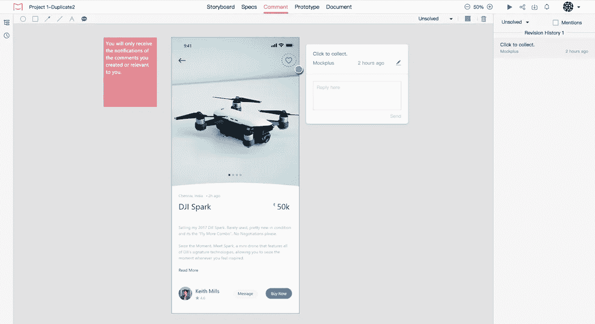
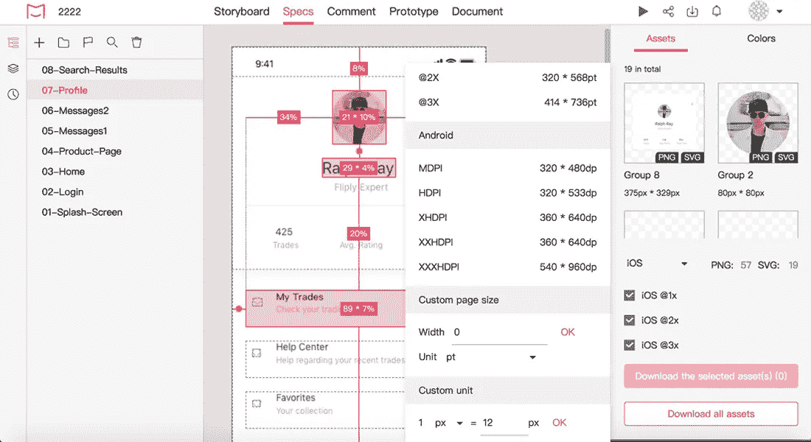

# 草图中有效设计协作的 4 个最佳技巧

> 原文：<https://medium.com/hackernoon/4-best-tips-for-effective-design-collaboration-in-sketch-8fbba67a873e>

设计是一项团队运动。为了创造伟大的产品，设计师、开发人员和其他团队成员应该一起工作。在这篇文章中，我们将看到当我们在 Sketch 中工作时，如何使协作更有效。

设计是一项团队运动。为了创造伟大的产品，设计师、开发人员和其他团队成员应该一起工作。所有设计团队都设定了简化设计流程的目标。协作是经常需要改进的领域之一。

在这篇文章中，我们将看到当我们在 Sketch 中工作时，如何使协作更加有效。

# 1.引入版本控制

如何让设计师不再问类似“**在哪里可以找到最新的设计？**“答案很简单——你需要引入一个版本控制工具。

版本控制在开发领域已经存在很长时间了。很难想象一个开发过程有两个或更多的开发人员，却没有版本控制系统。但是对于设计界来说，版本控制仍然不是很常见。

有两种**实现版本控制的方式**:

# 用户库和云驱动器

库允许设计者在多个文档中共享符号。每次当设计者需要更新符号时，他们编辑库文件，并且其他设计者将被通知改变。Sketch 中提供了库(从 47 版本开始)，可以与 Google Drive 或 Dropbox 一起使用。

这种方法只适用于相对较小的团队，但不适用于大型组织，因为它不是为并行工作而设计的。因此，当两个设计者试图同时编辑库文件时，他们将面临一个问题。

# 使用特定工具进行版本控制，如[摘要](https://www.goabstract.com/)或[工厂](https://plantapp.io/)

在较大的团队中，一些不同的人可能同时处理同一个特性。抽象和植物都允许。Abstract 采用 Git 等版本控制系统的现有概念，并将其应用于设计领域。使用工具的过程对于任何有编码经验的人来说都是直观的(你需要熟悉抽象中使用的分支或提交等概念)，但是对于不熟悉开发概念的人来说可能需要一些时间。

与 Abstract 不同，Plant 是一个工具，它试图建立一个更直接的处理设计工件的过程。它不包括分支，并且需要设计师更少的时间来学习如何使用这个工具。Plant 是一个草图插件，因此设计师不需要打开任何其他应用程序和草图来开始设计工作。

# 2.建立设计评审程序

设计评审是一个降低设计返工可能性的程序。当设计师进行评审时，他们通常会讨论设计的以下方面:

*   可用性方面(具体的设计决策是否符合可用性标准)
*   美学和风格选项(设计是否符合品牌指南)

虽然设计评审听起来像一个正式的活动，但它不一定是一个正式的面对面的会议。事实上，这种格式对于团队成员位于世界不同地方的分布式设计团队来说是不可能的。相反，它应该作为一个持续的设计活动融入到设计过程中。有了像 [Mockplus iDoc](https://idoc.mockplus.com/?hmsr=cherrymedium) 这样的工具，就有可能在线进行设计评审。

所有参与设计流程的团队成员都可以在同一个共享空间中发表评论，并查看其他团队成员的反馈。该工具支持颜色编码:可以用颜色对评论进行分类(例如，用红色表示可用性问题，用蓝色表示品牌风格问题)。

**讨论是有效设计项目的核心部分。用**[**mock plus iDoc**](https://idoc.mockplus.com/?hmsr=cherrymedium)**完善设计评审。通过评论和回复促进富有成效的讨论。**

# 3.创建沟通和反馈的单一渠道

的确，设计团队沟通的渠道越多，每个团队成员花在寻找有价值信息上的时间就越多。更糟糕的是，信息量可能是压倒性的，在永无止境的更新流中，丢失重要的细节变得相对容易。

为了防止这种情况发生，限制设计团队用于沟通的渠道数量至关重要。理想情况下，你每天应该只有一个数字沟通渠道来提供和接收反馈。这个通道应该与你的主要设计工具——草图相结合。

项目经理应该为设计更新创建一个有效的通知策略。每次团队中有人更新草图主文件时，应通知所有团队成员。这将保证所有团队成员不会错过一个关键的更新。

# 4.让开发者更有效率

设计过程不仅是设计，也是开发。这就是为什么设计移交程序——设计师为开发者提供所有资产的设计过程中的一个步骤——对产品的成功至关重要。顺利的设计移交保证了开发人员会像设计人员创建设计一样实现设计。

我们都知道创建规范的过程可能是乏味的(尤其是当您手工准备一个规范的时候)。但是使用正确的工具让设计师和开发者生活得更好是可能的。其中之一是 Mockplus iDoc，它允许您自动创建所有重要的移交信息。

使用 Mockplus iDoc 创建一个规范所需要做的就是选择您正在开发的平台(草图)，iDoc 将自动为这个平台生成定制的资源。更好的是，该工具将允许您看到重复的设计元素，并将提供现成的代码片段。

**Mockplus iDoc 是一种访问和查看规格的简单方法**

# 结论

无论你的设计过程有多好，总会有一些改进的空间。本文中提到的技巧和工具将帮助您充分利用您的设计活动。