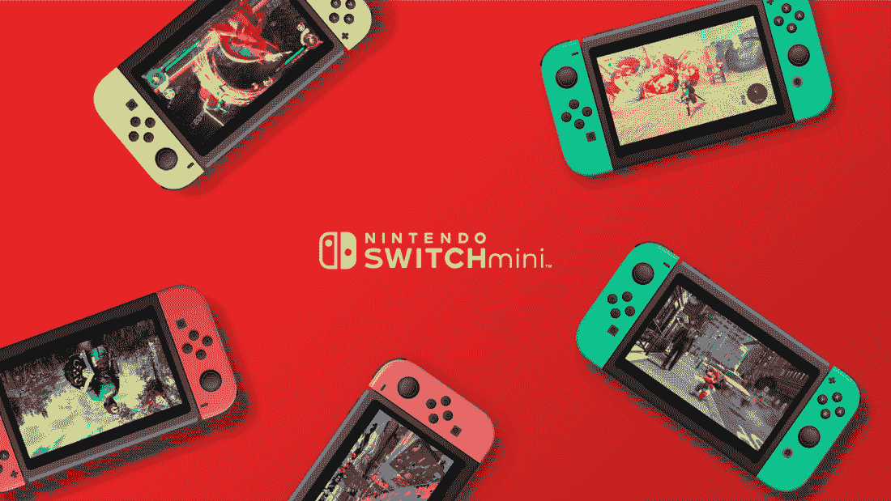
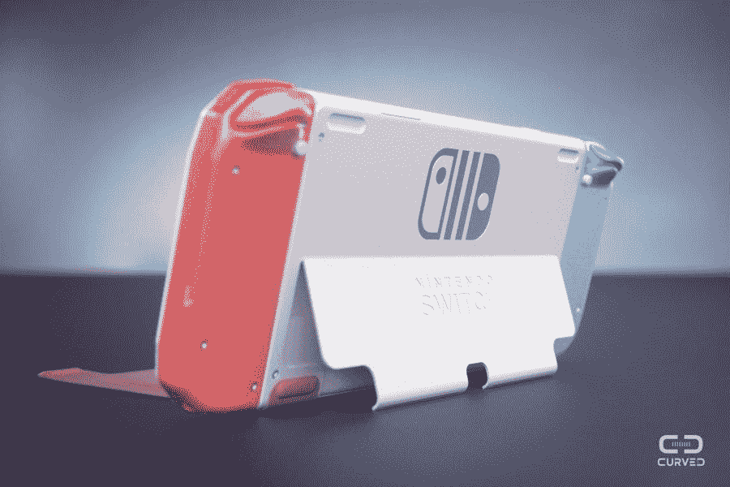
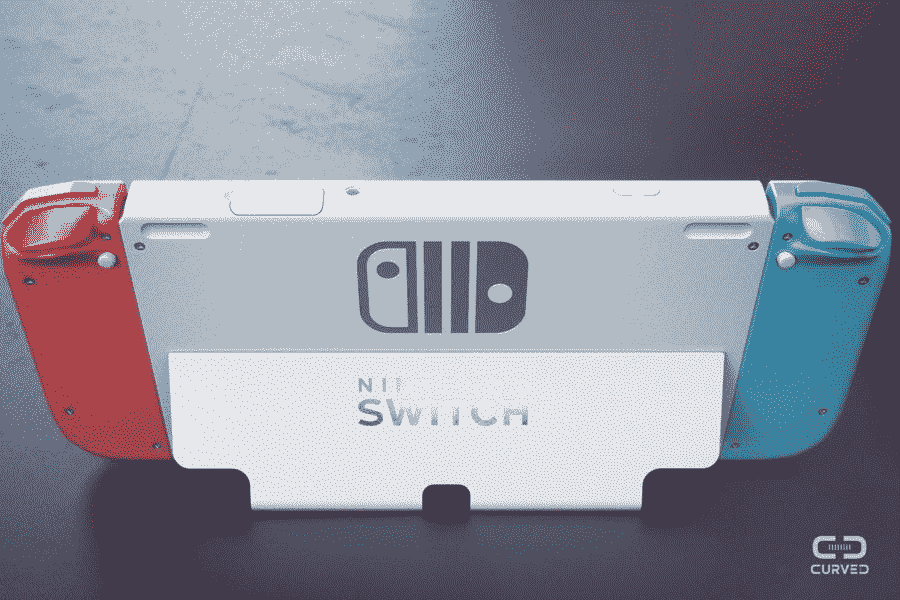

# 任天堂 Switch 迫切需要的 4 项变革

> 原文：<https://medium.com/hackernoon/4-changes-the-nintendo-switch-desperately-needs-a3c23df6ad08>

当任天堂在 2017 年 3 月发布 Switch 时，它立即引起了轰动。供应的限制使得很难买到游戏机，这个问题持续了几个月。当我最终拿到我的手机时，它的多功能性给我留下了深刻的印象。易于使用，功能强大，紧凑，有趣！

现在，距离 Switch 发布日已经过去两年多了，游戏机的增长[开始放缓](https://www.seattletimes.com/business/nintendo-chief-seeking-growth-sources-as-switch-sales-slow/)。任天堂一直专注于通过像 [Labo](https://geekonrecord.com/2018/01/20/nintendo-labo-thinking-outside-the-box-or-with-the-box/) 这样的实验来扩展其用例，但没有更新游戏机的任何部分。

Switch 的迷你版已经传闻了一段时间，这是任天堂最有可能振兴销售的下一步。 [Justin Latham](/@justinlatham/the-future-of-the-nintendo-switch-d3e55b51d4c7) 创造了一个有趣的概念，包括包装和营销材料:

*Nintendo Switch Mini concept by* [*Justin Latham*](/@justinlatham/the-future-of-the-nintendo-switch-d3e55b51d4c7)

尽管如此，更新更大的任天堂 Switch 将是与微软的 Xbox 或索尼的 PlayStation 等其他玩家竞争所必需的。以下是任天堂 Switch 为了成为新的畅销书应该得到的 4 个升级。

## **1。更大的显示屏**

目前的 720p 屏幕对于这样一个便携的外形来说效果相对较好。然而，在大电视上玩了像*荒野之息*这样视觉丰富的游戏后，移动时缺乏清晰度令人心碎。

任天堂应该为显示器提供升级，配备 1080p OLED 面板，能够提供 60fps。这将是甜蜜的，尤其是无边框演示。

在不改变机箱尺寸的情况下移除当前的挡板就足以与现有的 Joy-Con 保持兼容，同时提供更加身临其境的体验。获得如此漂亮(和大)的显示屏也将使 Switch 成为通过网飞、Hulu 和其他 1000 家流媒体服务观看电影和电视节目的绝佳设备。

*Bezel-less display concept by* [*lukewchen*](https://m.imgur.com/r/NintendoSwitch/FmfOH)

## **2。更长的电池寿命**

更大的显示器，即使是有机发光二极管显示器，也意味着更多的功耗。玩*荒野之息*时，一次充电三个小时的电池续航时间感觉很短。其他游戏可能会使游戏机的电池持续更长时间，但任天堂说它最多可以持续大约六个小时。

看到任天堂用更大的电池更新交换机，能够提供长达 10 个小时的乐趣，这将是令人敬畏的。正如目前大多数消费电子产品一样，人们只是想要更长的电池寿命。

## **3。更稳定的支架**

尽管有些人[通过夸大支架使控制台变得多么不稳定来取笑支架，但事实是角落的放置对稳定性没有任何帮助。它很薄，而且它的单一角度使它在短距离内(像在飞机托盘桌上)不舒服。](https://youtu.be/PPtPIpXwpvs)

拥有一个多角度的宽支架将使控制台成为更好的旅行伴侣。 [Curved](https://curved.de/news/curvedlabs-so-stellen-wir-uns-die-nintendo-switch-2-vor-601983) 的 Switch 2 概念以一种美丽的方式解决了这个问题:

## **4。更持久的欢乐大会**

毫无疑问，Switch 最大的弱点是 Joy-Con。我不得不在使用一年后购买一个左控制器的替代品，新控制器已经开始让我担心:当我将它连接到屏幕上时，它不再发出标志性的“咔哒”声。操纵杆是控制器中的另一个弱点，可能是因为它在许多游戏中经常被用来移动角色，最终受到的影响最大。

Joy-Con 通过一个部分由塑料制成的机械装置与开关相连。我敢打赌，经过一千次左右的点击后，塑料会轻微变形，失去开箱后的坚固性。我的一个朋友在一个周末的激烈游戏后归还了游戏机，因为 Joy-Con 在连接时开始晃动。

事实上，塑料是任天堂便携式游戏机上的一种常见材料，也是 Switch 客户在线投诉最多的材料之一。真希望 Switch 2 用更好的材料，至少在那些长期来看更容易出故障的运动部件上。

这里是我最喜欢的任天堂 Switch 2 概念，由[弯](https://curved.de/news/curvedlabs-so-stellen-wir-uns-die-nintendo-switch-2-vor-601983):

你呢？你会如何改善任天堂 Switch？

你喜欢这篇文章吗？ [**订阅**](https://geekonrecord.com/subscribe/) **通过邮件获取新帖。**

*原载于 2019 年 5 月 3 日 geekonrecord.com**T21*[。](https://geekonrecord.com/2019/05/03/4-changes-the-nintendo-switch-desperately-needs/)