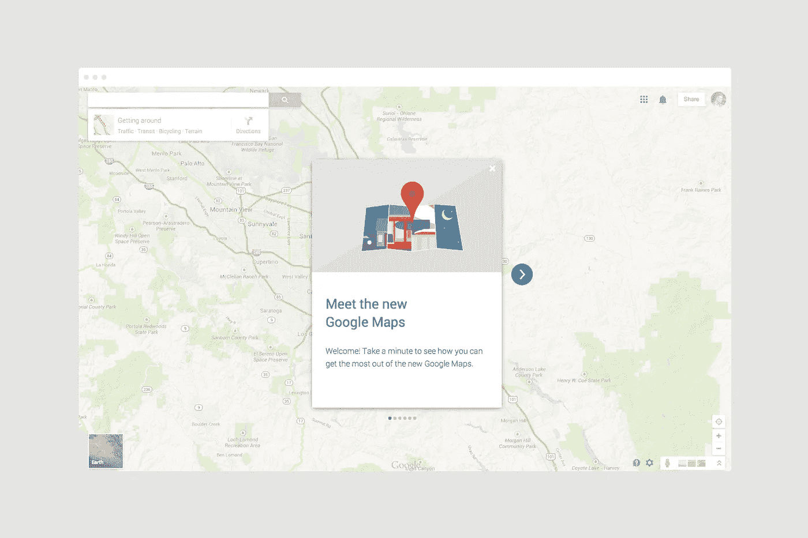
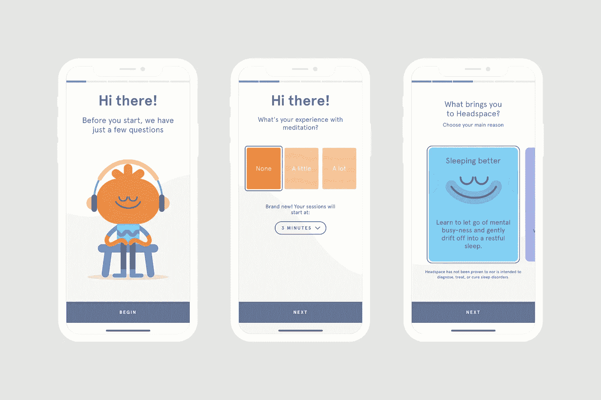
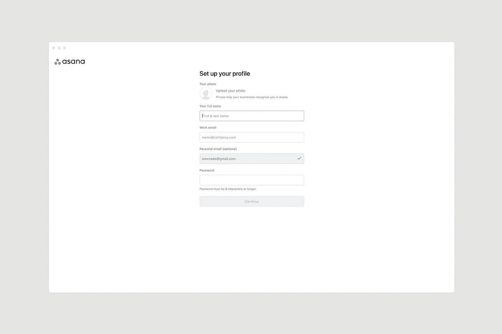
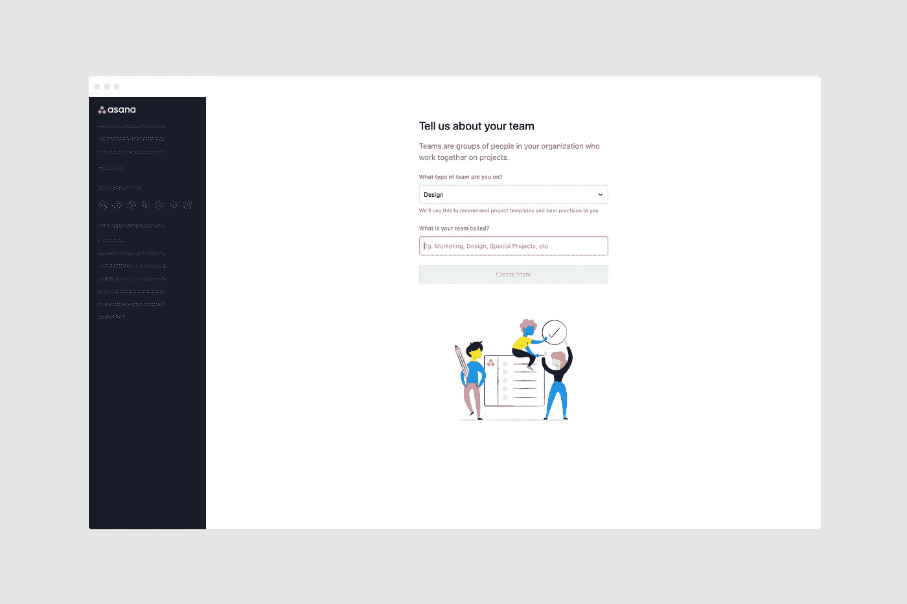
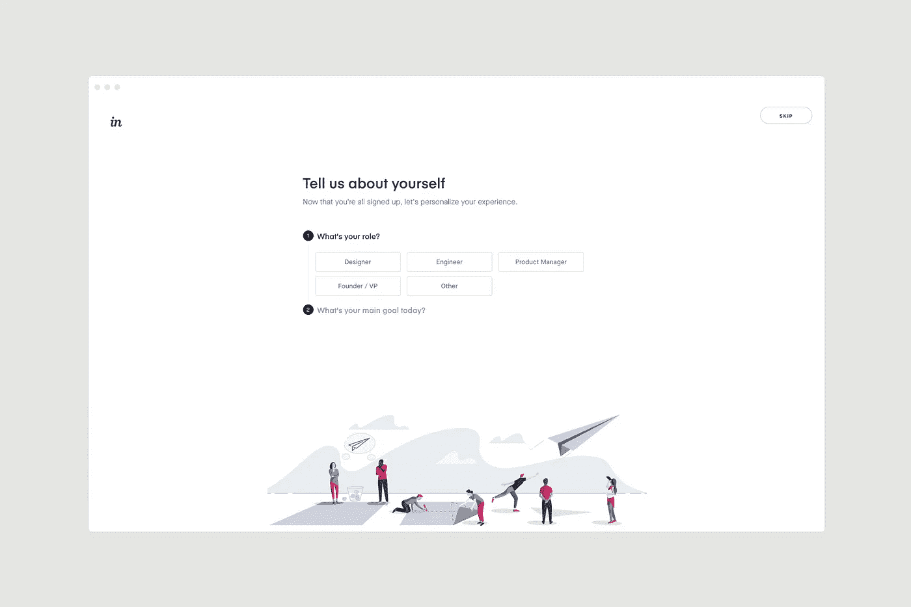
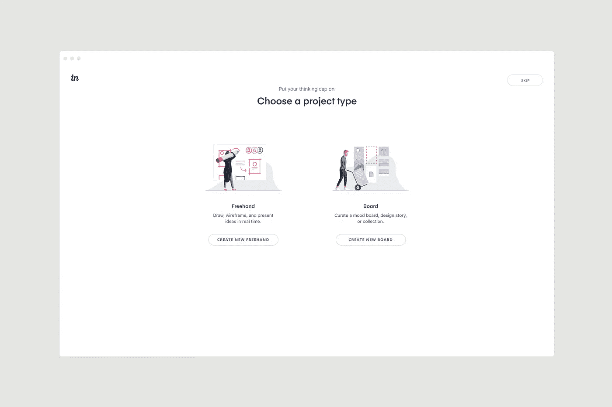
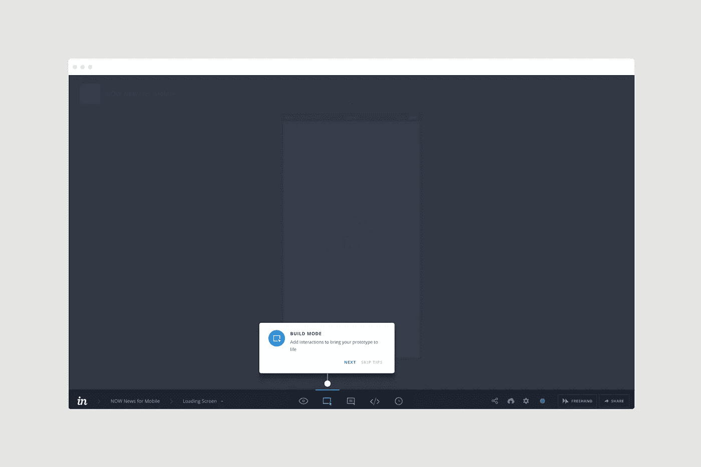

# 4 种用户入职策略，帮助您转化更多用户并减少流失

> 原文：<https://medium.com/hackernoon/4-functional-designs-to-consider-when-onboarding-new-users-f63cd1906930>

## 当新用户的时间宝贵时，他们会对应用程序设计体验失去兴趣，所以如果你想成功，从一开始就让他们参与进来是至关重要的。

第一印象决定一切这种陈词滥调只是因为它是真的。尤其是在数字时代。

当新用户的时间非常宝贵时，他们会很快对某个体验失去兴趣，因此如果你的应用程序有机会将他们转化为客户甚至高级用户，那么从一开始就吸引他们是至关重要的。

入职流程是告诉他们如何为他们解决特定问题的绝佳机会，所以不要浪费这个机会。

# 什么是入职流程？

没有多少人会不同意，一个应用程序的上线过程的最终目的是适应你的潜在客户，让他们尽快感到舒适。

这正是无缝应用程序设计对于获取和保留如此重要的原因。他们经历的第一个过程无疑是最重要的过程，因为如果他们从另一边出来时感觉没有比以前更好，你可能会永远失去他们。

一次成功的入职培训最终是让你的用户接受你的想法。把这一点做好，其余的事情就会迎刃而解。

Get your onboarding right and the rest will follow

# 为什么入职流程很重要？

如果你提供的是新的东西，新鲜的东西(如果不是，为什么不是？)，这可能需要一点时间来适应你的用户。理解这一点是你的应用程序设计过程的关键部分，所以花时间把它做好是不可低估的。

根据 Intercom 的调查，[40%到 60%的 SaaS 应用程序用户会在下载后打开一个应用程序，并且永远不会返回](https://www.intercom.com/blog/designing-first-run-experiences-to-delight-users/)，这显然是一个令人担忧的潜在流失用户的高数字。

一个简单的事实是，顾客比以往任何时候都有更多的选择和更少的耐心，所以赢得顾客越来越难。然而，这并不是说你的入职过程不能成功；诀窍在于遵循那些带来更多讨好而不是疏远的方法。

> *与以往相比，消费者拥有更多的选择，但耐心却越来越少。*

# 选项 1:走查方法

与其让用户漫无目的地浏览你的应用程序，让他们自己解决问题，不如从他们登陆的第一秒开始就引导他们完成这个过程。

这是入职流程中最显而易见的选择——你为什么不想经历一次新的体验来熟悉它呢？

这是一种常见而简单的方法，有很多好处，但如果你在入职时走得太远，也会剥夺用户的权力。

这里有许多不同的创意方向可以吸引你的用户，但每种产品或服务的“最佳点”都是不同的。例如，谷歌地图可以提供一个简单的入门流程，用户根本不需要花时间去适应，这是许多其他应用程序所不具备的。

Google Maps’ walk-through design

# 选项 2:参与式方法

如果你的应用程序需要从用户那里收集信息，那么开始入职流程的一个很好的方法是承诺基于对一些问题的回答来提供个性化的体验。

像 [Headspace](https://www.simonmccade.com/blog/headspaceapp) 这样的应用在这一点上做得非常好——新用户提供的相关信息越多，他们从应用体验中获得的整体收益就越多。

这里还有另一个平衡的方法，就是问适当数量的问题，以免让用户失去兴趣:

> *对他们要求太多，他们会厌烦并去别处；对他们要求太少，你会让他们失望。*

The onboarding process of the Headspace app

# 选项 3:设置方法

一个通常与引导人们完成这个过程的第一个选项相结合的策略是要求他们立即建立一个账户。

通过这种方式，他们可以更专注于了解应用程序，因此他们更有可能在注册后完成走查。

Setting up a new user profile with Asana

在这里获得用户界面是非常重要的——当吸引新用户来完成你的应用程序中的任务时，清晰是至关重要的。

Asking for information in the set-up process with Asana

# 选项#4:一体化方法

一个勇敢但更有成效的应用程序设计方法是将上述所有方法结合起来，让人们在提交信息的同时注册，以个性化体验，并在他们完成入职流程后，获得做什么和去哪里的显示。

从设计的角度来看，这需要更多的关注和考虑，但结果对你的参与度指标来说是非常好的。

[InVision](https://www.invisionapp.com/) 在你成为忠实用户后，它通过越来越多的工具提示让你在应用程序中移动。你可以边走边学，从而获得更丰富的经验。

Personalising the user experience in InVision

作为 InVision 的新用户，您可以选择的路线从一开始就已经规划好了，因此您知道您可以从该应用程序中获得什么:

Choosing a project type in InVision

一旦您登录，Vision 仍将指导您完成使用过程，因此您不会陷入孤立无援的境地:

Selecting a mode in InVision

# 把时间投资在你的用户身上

一个科技初创公司的应用程序的 UX 和用户界面设计需要考虑的事情太多了，有时会让人不知所措，但如果你需要的话，这里会有帮助。

像 [Useronboard](https://www.useronboard.com/user-onboarding-teardowns/) 这样的资源给了非设计师，比如工程师，他们需要投资于他们自己的用户的灵感——在那里有许多其他网络应用程序如何为他们的用户这样做的例子。

> *未能向新用户解释清楚意味着未能完成你希望他们完成的任务。*

如果你没有合适的专业知识，这可能是一个困难和耗时的过程，但正是因为这个原因，太多的初创公司忽视了它，并在未来为此付出了代价。

如果你对自己设计应用程序没有信心，从专家那里寻求建议会有很多收获。

毕竟，了解在入职流程中包含什么、如何以及何时包含某些功能和好处是吸引和留住客户的关键部分。

# 透露细节

这里最重要的一点是，没有放之四海而皆准的方法。根据你提供的产品或服务，有很多方法可以吸引用户，所以在决定如何满足他们之前，仔细考虑你的用户到底需要什么。

如果你的应用程序需要变得复杂，为人们详细地拼写出来并没有错，但是请记住，入职过程越长，就越有必要向新用户展示整个过程中某种形式的进展。

入职流程是利用第一印象法则的绝佳机会；从他们登陆的那一刻起，就让他们很容易参与进来，并且在未来与你的其他内容的参与将会更容易成功。

Making a good first impression is crucial for every new app

# 入职用户对任何早期科技创业公司都至关重要

对于一个新的创业应用程序来说，缺乏一个良好的入职流程可能会导致缺乏任何重要的参与度和转化率，这最终将意味着在短期、中期和长期内失去客户甚至潜在的品牌倡导者。

这就是为什么，作为我的[设计咨询服务](https://www.simonmccade.com/services)的一部分，我为科技初创公司提供各种用户界面和 UX 方法，给他们的客户留下持久的第一印象。

如果您想了解更多信息，为什么不今天[安排一个约会](https://www.simonmccade.com/contact)来讨论我们如何为您设计一种方法来解决您用户的问题？

需要其他建议吗？请求我的免费备忘单，其中包括“47 [可操作的 UX 黑客来修复你的应用](https://www.simonmccade.com/ux-hacks-to-fix-your-app)”。

感谢您花时间阅读这篇文章。如果你觉得它有帮助，请让我知道。👏👏👏

如果你想了解更多，请查看我的[博客](http://www.simonmccade.com/blog)定期更新。

本文原载于【www.simonmccade.com】**。**