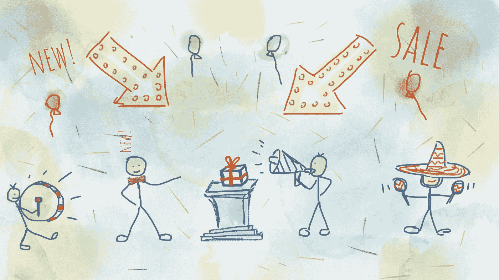

# 增强通用产品和建立更好客户体验的 4 个技巧

> 原文：<https://medium.com/hackernoon/4-tips-for-augmenting-your-generic-product-and-building-better-customer-experience-9312a49c0963>

## *体质、性格、文化、自我意识*

我相信你的[产品](https://hackernoon.com/tagged/product)拥有你的客户需要的所有零件和功能。但你要卖的不仅仅是通用产品，你要卖的是“整个产品”。整个产品是一个普通的产品，增加了第二，辅助服务，如漂亮的包装，礼貌的销售人员，愉快的店内体验，易用性，有趣的上车过程和其他一切需要用户感觉良好，把他们的钱放进你的口袋。提供完整的产品提供完整的品牌体验，与潜在的[买家](https://hackernoon.com/tagged/buyer)的情绪紧密相连。既然购买是一个感性的决定，你应该花一些时间来创造整个产品。这是我喜欢关注的整个产品的几个层次:

# 体形

Physique 是产品的一般外观。无论它是一个包还是一个登录页面，它必须看起来吸引你的客户。外观是引发顾客情绪的因素。情感驱动购买决策。体格是与顾客接触的第一点，因此你应该站在顾客的角度:
1。注意包裹
2。问“这是什么？”
3。想知道“我为什么要在乎？”
4。想被说服
5。需求证明
在你的设计中解决这一流程会让你与潜在买家有一个良好的开端。

# 个性

你应该把重点放在你传达给顾客的信息上。你正在开发的产品应该有和你的客户可以联系到的人一样的语调。这样，他们会觉得自己是部落的一部分。这种感觉，这种归属感，建立了信任，使购买更容易。所以，确保你创造了一个角色，一个能反映你的产品并能让你的顾客与想象中的英雄产生共鸣的角色。

# 文化

个性提供了一个单一人物的形象。通常，一个单独的数字无法定义更大群体的文化。为了定义你的客户想要成为其中一员的群体，你必须分享这个群体的核心价值观。通过分享这些价值观，你让消费者安心，或者确信你们有相同的信念。客户接受团队的规范、价值观和观点，这使他成为团队的一员。如果这个群体的标准之一是拥有你的产品，每个人都会想要拥有它。所以，分享你的信念。吸引有相同信仰的人。相同的信仰建立了一个部落，一个部落建立了信任。此外，信任驱动决策，决策控制购买者的行为。

# 自我形象

归属感感觉很好，但是群体的每个成员都意识到自己的个人主义。这种道德立场强调个人的价值，重视独立和自力更生。所以确保你的客户在使用产品时知道他们是谁。他们手里拿着产品能获得什么超能力？清楚地传达他们可能取得的成就。你的客户比他们想象的更强大，你只需要允许他们做到最好。他们会感到有力量，有灵感，渴望尝试产品。

无论你是启动一个新公司，领导一个已建立的公司，还是简单地让一个新产品起步，你只需要在创造整个产品的过程中简化你的工作。整个产品的这四层将帮助您为客户提供出色的体验。这确实很重要，让你鹤立鸡群。

## 想了解更多？

> 去拿我的新书:[宝藏路线图](https://treasureroadmap.com/)。

这本书提供了一套从精益创业、设计思维和敏捷软件开发中涌现出来的工具，这些工具正在彻底改变新想法的产生、提炼和推向市场的方式。

 [## 产品管理书籍-创意到商业-宝藏路线图

### 如果你选择遵循我在这本书里揭示的公式，很有可能你可以通过转行谋生…

treasureroadmap.com](https://treasureroadmap.com/)