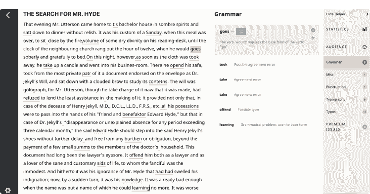
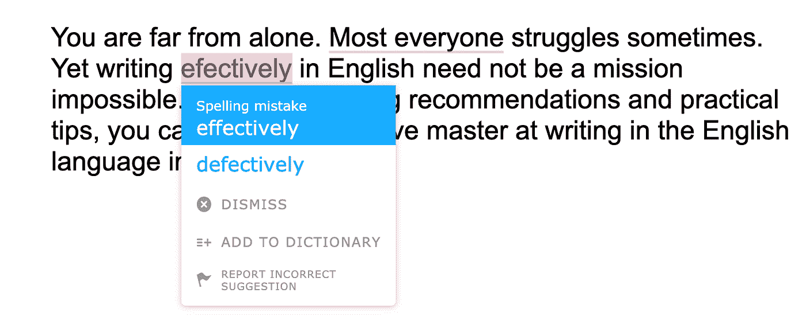
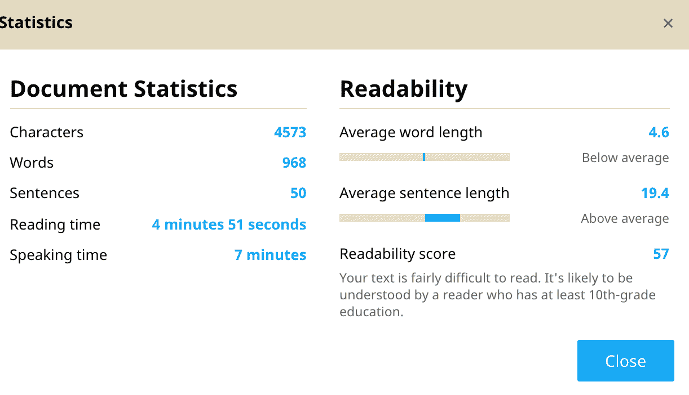
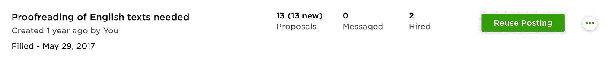
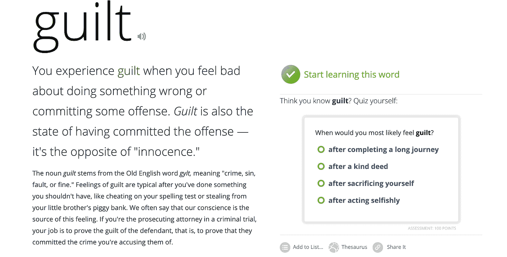
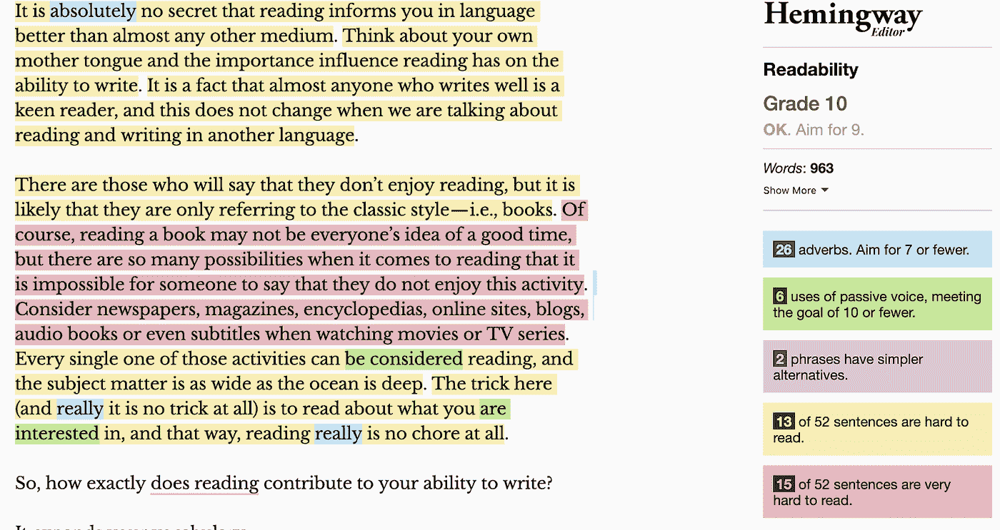

# 寻求提高写作水平的自由职业者的四个工具

> 原文：<https://medium.com/hackernoon/4-tools-for-freelancers-looking-to-improve-their-writing-57ac8f202f46>

无论您是否从事网页内容创作或文案工作，您都有可能每天都需要输入一些清晰的文本。因此，获得一些自动化工具总是一个好主意，这会让你的生活变得轻松一些。今天，我将分享我列出的顶级在线服务，你可以用它们来提高你的写作水平。

## [Linguix.com](https://linguix.com/)

即使是受教育程度最高的人也会犯语法和拼写错误，错别字会成为一场噩梦。令人高兴的是，有工具可以检查你的文本并消除错误。对于这个任务，我的首选是 Linguix。

它有效地防止了打字错误——这是我打字速度快时最大的问题。此外，它修复语法错误，并作为一个超级方便的 [Chrome 扩展](https://chrome.google.com/webstore/detail/textlyai/ndgklmlnheedegipcohgcbjhhgddendc/)。有时我在 WordPress 或 Medium 上编辑帖子，扩展可以即时检查所有内容，这非常方便。不需要 Ctrl+C/Ctrl+V 和粘贴任何东西。

*Real-time fixes generated by the algorithm*

还有一个以文件存储和个人字典为特色的网络应用程序——在这里你可以添加你不想让系统高亮显示为错误的单词。此外，有一个在线编辑器，你可以粘贴你的文本或从头开始写。没有格式选项。相反，你可以运行一个内容评估。算法将评估文本的可读性和复杂性。如果太难读，系统会告诉你。

该系统有一个基本的免费计划，但[高级版](https://textly.ai/premium)允许发现数百个错误，并访问内容模板库等功能。我的选择是 Linguix 的季度计划 36 美元。

## [**向上工作**](https://upwork.com/)

为了让你的内容真正一流，你还需要一个人工校对。你可以在像 Fluent Express 这样的网站上购买快速校对。然而，你甚至不知道谁在为你的作品工作。当一个编辑和作家一起工作了很长一段时间，最高的质量就达到了。你们两个都应该知道对方的风格和语言偏好。这时，不仅仅是基本的校对发生了，文本也变成了更好的产品。

我用 Upwork 找这样的同事。这是一个连接自由职业者和需要他们服务的人的平台。还有专业的编辑和校对，可以用多种英语方言工作。

*Several job postings on Upwork allowed me to find great freelancers who are now my editorial team. We work together for around two years.*

那里的竞争很激烈，所以你可以以合理的价格快速检查你的文本，更重要的是，与你未来的编辑建立关系。你可以讨论编辑，协商未来的折扣，解释文本任何部分背后的想法——简言之；你肯定需要为专业的内容创作而努力。

## [**Vocabulary.com**](https://www.vocabulary.com/dictionary/)

**当你每天都要写很多内容的时候，你的大脑有时会卡在一些单词里。偶尔我会忘记某个单词的正确含义，Vocabulary.com 帮助我解决了这个问题。服务背后的主要思想就像老师向学生解释一个新的概念。参见示例:**

****

**在同一个页面上，您可以看到一个具体的词的使用情况，并举例说明，点连接的词。你甚至可以做一个关于单词意思的小测验。因此，你会很快记住意思，所以这个工具不仅对内容创作者有用，对学生也有用。**

## **[**海明威 App**](http://hemingwayapp.com/)**

**有点夸张的工具，但仍然很方便。有时，人们认为这是一个可以与 Startup 竞争的写作增强工具。唉，但这是完全错误的。这个工具只适合提升你的写作风格。它显示了诸如过于冗长的句子、被动语态或糟糕的语言结构等问题。**

****

**然而，该系统不提供任何校正；只是指出你的错误。所以，你必须是一个有经验的作家才能应用这样的建议。**

## ****最终想法****

**当然，自动化工具不能代替人工校对，但令人高兴的是，有一些服务你也可以找到这样的人！向真人提供已经通过最新算法增强的文本将会更容易、更便宜、更快。**