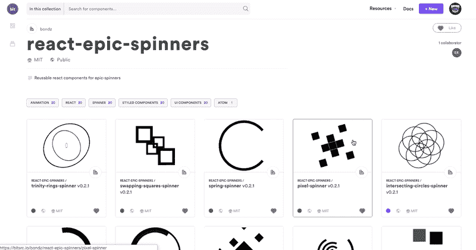
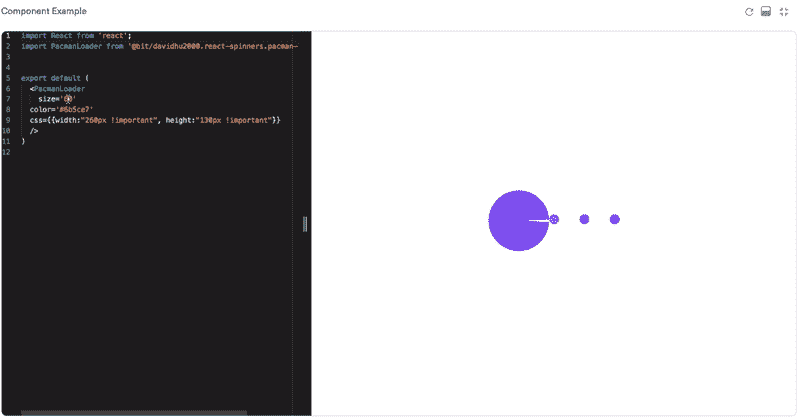
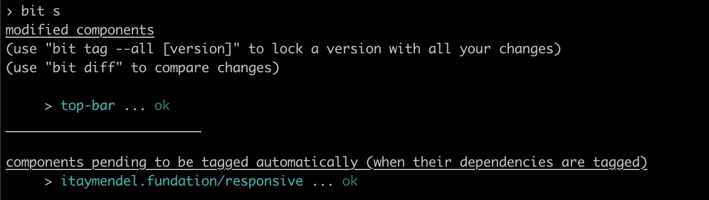
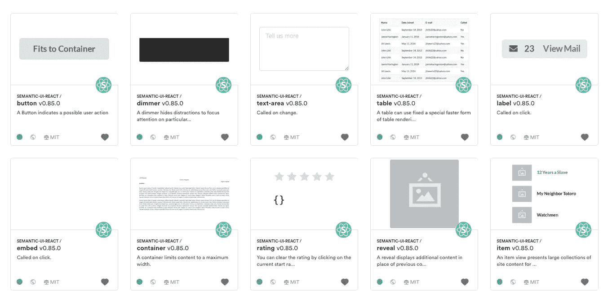
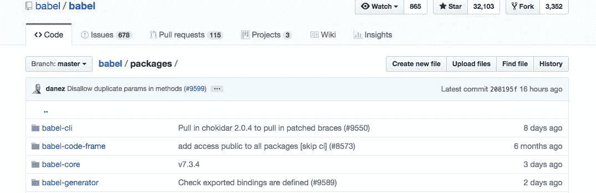
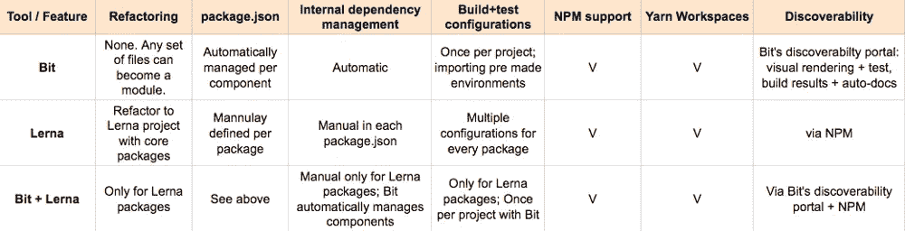

# Monorepo 在 2019 年的 4 种发展方式

> 原文：<https://medium.com/hackernoon/4-ways-to-go-monorepo-in-2019-ea5d19fc1f08>

## 观察野外 Monorepos 的有用工具和想法…


So yeah… just put everything in there. It should be ok I think.

最近，我听到和谈论了很多关于扩展代码共享的方法。一个流行的话题是“[](https://hackernoon.com/tagged/monorepo)**”或多包共享存储库。**

**将单独的包保存在单个存储库中对于代码共享是有用的，因为它使团队能够共享他们项目的一部分，以供其他团队和项目使用，而没有设置和维护许多存储库的开销。**

**例如，想象一个组织，其中不同的前端团队希望使用共享的 React 组件进行协作和工作。为了支持这一点，他们构建了一个共享的 React 库(就像 Pinterest 的格式塔或惠普的索环)。**

**为了实现这一点，他们考虑采用“monorepo ”;将所有组件保存在一个库中，而每个组件都是自己的包。这种“有用的邪恶”也使得贡献、运行 CI/CD 和管理变更变得更加容易。**

**在这篇文章中，我将回顾并分享生态系统中实现这一目标的最佳工具和解决方案。请根据您的经验随意评论和建议您自己的见解和工具！**

# **1.比特分量单报告**

**[](https://bitsrc.io/components)**

**关于 [**位**](https://github.com/teambit/bit) 的事情是，每个存储库已经是一个 monorepo。**

**你不需要重构任何东西。你不需要重组项目，设置不同的包，定义`package.json`文件或其他任何东西。**

**取而代之的是，你只需要把 Bit 添加到存储库中，共享组件。这之所以成为可能，是因为 Bit 能够自动将组件从项目中分离出来，包括它们所有的依赖关系等等。**

**几十个组件可以在几分钟内共享，从将 Bit 添加到存储库中，到在 [Bit 的 hub](https://bitsrc.io) 中变得可用，在那里它们可以被组织、共享和在线播放，然后与 NPM 和 Yarn 一起安装。**

**[](https://bitsrc.io/components)**

**当您对存储库中的一个组件进行更改时，Bit 会自动跟踪这些更改，并识别将它作为依赖项的其他组件。然后，如果您运行`bit status`，您可以看到所有的组件，当它们的依赖关系被修改时，它们被自动修改。**

****

**Made changes to 1 component in the repo; Dependents were automatically updated**

**也就是说，不需要手动通过`package.json`文件来管理对依赖项的更改，因为 Bit 为您做了这项工作，使您的 monorepo 维护更加简单。**

**您还可以将 Bit 添加到您的库的 release management (CI/CD)中，以便用所有的更改更新每个版本中的组件。由于 Bit 运行、构建和测试您的组件，您可以快速了解一切的新状态。**

**PRs 可以直接提交给 monorepo，或者通过`bit import`让其他人直接从他们的最终项目中导入和开发组件。**

**总而言之，如果你有一个组件库，你想做一个多包 monorepo，Bit 可能是最快和最省力的方法。它还提供了附加价值，如可发现性、在线社区等。**

**[试试看](https://bitsrc.io)。**

# **例子**

**Bit 之前的语义 UI 组件库。**

**[](https://github.com/Semantic-Org/Semantic-UI-React) [## 语义-组织/语义-用户界面-反应

### 官方的语义-用户界面-反应集成。为语义组织/语义用户界面反应开发做出贡献

github.com](https://github.com/Semantic-Org/Semantic-UI-React) 

带 Bit (0 重构)的语义-UI 组件库。

[](https://github.com/teambit/Semantic-UI-React/tree/addBit) [## teambit/Semantic-UI-React

### 官方的语义-用户界面-反应集成。通过创建帐户，为 teambit/Semantic-UI-React 开发做出贡献…

github.com](https://github.com/teambit/Semantic-UI-React/tree/addBit) 

[与 Bit](https://bitsrc.io/semantic-org/semantic-ui-react) 共用的部件。

[](https://bitsrc.io/semantic-org/semantic-ui-react)

## 赞成的意见

*   0 重构到存储库。从 0 到从现有库中发布 100 个包只需几分钟。试试看。
*   无开销的可扩展代码共享。
*   组件的出色视觉[可发现性](https://bitsrc.io/components)。
*   Bit 自动管理 repo 中的所有依赖项，包括对组件依赖项的更改，并根据需要更新所有组件。没有不同的`package.json`文件需要维护或更新。
*   变更管理可以通过 PRs 到 repo 来完成，也可以通过从任何其他存储库中发布组件更新来完成，方法是导入一个组件，对原始存储库进行更改并发布更新。
*   版本的自动更新(CI/CD 中的 Bit)。

## 骗局

*   扩展系统即将启动。在此之前，您可能需要为您使用的不同工具稍微修改一下构建/测试环境。
*   通过 Bit 的注册表与 NPN/Yarn 客户端(您的选择)一起作为包安装。不支持 NPM 的注册表。
*   hub 的所有功能(搜索、游戏、npm 安装)都要求你在 hub 中托管代码(比如 GitHub 和 NPM)。没有供应商锁定(Bit 像 Git 一样分布，可以在任何服务器上设置)。

# 2.莱娜·莫诺 repo


Lerna 是一个工具，用于管理单个存储库中的多个包。

使用 Lerna，您可以重构您的库，在其中保存多个包，而 Lerna 允许您链接依赖项(`lerna bootstrap)` ,并根据您的选择单独或一起对它们进行版本化(独立模式意味着每个子包都有自己的 semver，并在其依赖项更新时相应地更新)。

```
my-lerna-repo/
  package.json
  packages/
    package-1/
      package.json
    package-2/
      package.json
```

Lerna 自动执行 monorepo 中的软件包任务。`lerna run build`将在每个子包中运行`npm run build`，而`lerna publish`将所有包发布到 npm，并将更新 git 标签，等等。然后，可以从 NPM 的注册表安装软件包。

Lerna 一开始就需要做一些工作，而且在整个过程中还需要做更多的工作，但是它是一种可靠的方法，可以将少量的核心包保存在一个存储库中，并将每个包独立地发布给 NPM。

一些开源项目使用 Lerna 来处理核心包，包括 Babel、Jest 和 Gatsby。它在网上有许多教程和帖子。它对于在一个存储库中管理一个项目的几个部分特别有用，而每个部分都是独立的“迷你项目”。

## 例子

[带 Lerna 的巴别塔包](https://github.com/babel/babel/tree/master/packages)。

[](https://github.com/babel/babel/tree/master/packages)[](https://github.com/babel/babel/tree/master/packages) [## 巴别/巴别

### 🐠Babel 是一个用于编写下一代 JavaScript 的编译器。巴别塔/巴别塔

github.com](https://github.com/babel/babel/tree/master/packages) 

## 赞成的意见

*   成熟和丰富的网络教程。
*   单独或在一行中对所有包进行版本控制。
*   用`lerna bootstrap`链接项目中的依赖项。
*   repo 中所有包的任务执行自动化。
*   `Lerna publish`发布 NPM 的所有更新。

## 骗局

*   对存储库进行大量重构。大量的初始开销。
*   维护开销随着每个包的不同`package.json`和环境而增长。
*   包的可发现性依赖于 NPM/图书馆的文档。
*   PRs 只能在回购中制定，并且很难让新的开发人员加入回购，这反过来又会损害包的采用。

# 3.Bit + Lerna + Yarn 工作空间组合



Lerna 和 Bit 可以在一个库中一起玩。

例如，Lerna 可用于管理核心包，而 Bit 可用于共享所有较小的组件。Bit 还为组件提供了可发现性，并减少了所需的重构和维护量。

这两个也可以玩纱线工作空间。Bit 将自动管理存储库中组件之间的依赖关系，而 Lerna 将帮助您处理更大的核心包，Workspaces 将帮助整合和优化存储库中外部包的安装。

## 赞成的意见

*   使用 Lerna 处理库中 3-4 个较大的包，而 Bit 将处理几十个组件。
*   共享任意数量的回购组件不会产生开销。
*   组件的可发现性和更简单的协作。
*   与 Yarn 工作空间相结合，优化工作流程和性能。

## 骗局

*   使用两个工具而不是一个。
*   您必须手动维护较大的软件包。
*   使用 2 个包注册中心(两者都与 NPM 客户端一起工作，所以在运行 1 个命令后，它应该不会影响内部使用)。

# 4.Git 子模块


Git 是大多数开发团队的选择。它允许你将一个库[作为另一个库的子目录](https://git-scm.com/book/en/v2/Git-Tools-Submodules)，为整个项目创建一个[单一工作树](/@porteneuve/mastering-git-submodules-34c65e940407)，并且一个项目可以使用另一个项目的代码。

但是……Git 子模块对于大多数开发者来说是一个痛苦的话题。

首先，他们只在`master`分支工作。第二，子模块在项目之间创建了高度耦合的代码，使得在跨 repo 任务上的合并和协作变得困难。子模块 repo 也不知道它是嵌套的，可能有一个从属 repo。

有各种工具围绕子模块特性提供额外的自动化，例如 [git-subtree](https://github.com/apenwarr/git-subtree/) 、 [gitslave](http://gitslave.sourceforge.net) 、 [braid](https://github.com/cristibalan/braid) 和 [giternal](https://github.com/patmaddox/giternal) 。这些工具试图改善子模块的一些可用性问题，但是不被特定的供应商支持，并且具有不同的缺点。

# 结论

围绕 Monorepos 的讨论在社区中蓬勃发展。虽然大多数人都同意多回购架构的优点，但一些用例使得维护和发布来自多个存储库的多个包变得非常困难。尤其是在共享库上工作时。

为了使这更容易，生态系统中出现了新的工具。从在单个存储库中自动保存和发布较大软件包的 Lerna，到将组件库体验提升到一个新水平的 Bit，一切都不费吹灰之力，而且好处多多。

别忘了，代码共享不仅关乎技术，也关乎人。你和你的团队必须面向编写可重用的代码，模块化地思考，鼓励交流和效率。感谢您的阅读，有任何问题，请不要犹豫在下面评论。**欢呼****