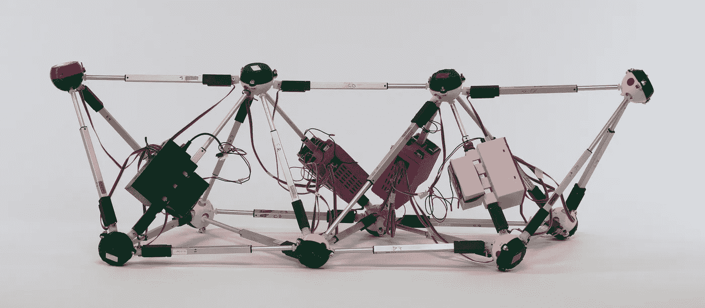

# 43 个需要你的公共发明项目

> 原文：<https://medium.com/hackernoon/43-public-invention-projects-that-need-you-a8e4e39130b4>

The Glussbot, a Tetrobot invented by Public Invention.

> 公共发明是一个非营利组织，它的使命是“在公众中发明，为公众服务”，我们的前 43 个项目可以在这里找到。

我们的目标是创造符合我们[使命](https://pubinv.github.io/PubInv/)的人道主义项目，并指导这些项目创造发明，使我们所有人更加富裕、健康和开明。

我们需要像你这样的志愿者来协助这些项目。门槛不低；我们认真对待发明。我们只从事大多数人和美国专利局认为是真正发明的项目。然而，我们所做的一切都是自由开源的:我们不寻求专利。相反，我们的精神是分享我们所做的一切，包括我们的错误:我们在光明中工作。我们正试图为硬件发明做自由软件基金会为软件所做的事情。

但门槛也不太高——一些项目需要高级技能，如数学、理论计算机科学、电气和机械工程，但几乎所有项目都需要写作、摄影、平面艺术、以人为本的设计，以及最重要的项目管理、领导力和辅导。如果你觉得自己还没有准备好成为一名公益发明家，那么恭喜你！你的谦逊让你有资格。

在写这篇文章的时候，公开发明的是作者和少数志愿者。在接下来的几周内，我将尝试为 43 个免费开放项目中的每一个写更多的东西，试图招募公共发明教练和志愿者。请花一分钟滚动这些项目，看看其中是否有你感兴趣的。如果是这样的话，请联系我，我会优先更详细地解释和记录这个想法——许多想法现在还处于初步阶段，如果你跟踪每个项目的 [GitHub 文件](https://github.com/PubInv/PubInv/tree/master/ideas)的链接，你就会看到这一点。

这些项目分为以下几个领域:

*   机器，
*   卫生设施，
*   能量，
*   计算，
*   健康，
*   农业，以及
*   艺术。

我希望在后面的文章中依次总结这些类别。谷歌数据工作室版本可以在这里找到，尽管我们有你可能更喜欢的谷歌[电子表格](https://docs.google.com/spreadsheets/d/1c_qcNfTRaGTTsexRF7Lp0HDJyPFmueahzMh6_wR3N1Y/edit?usp=sharing)。

43 Public Inventions Projects

本文顶部的照片是与项目#16 相关的机器人，“Gluss”，一个机器人桁架。这是公共发明发挥作用的规模的一个例子:任何东西都可以用最少的资本投资来完成。你可以自愿在你的车库里为一个公共发明项目工作；其实作者连车库都没有。

下面是包含数据的 Google Sheet 的链接:[https://docs . Google . com/spreadsheets/d/1c _ qcnftragttsexrf 7 LP 0 hdjypfmueahzmh 6 _ wr3n 1y/edit？usp=sharing](https://docs.google.com/spreadsheets/d/1c_qcNfTRaGTTsexRF7Lp0HDJyPFmueahzMh6_wR3N1Y/edit?usp=sharing) ，可能比上面的 Google Data Studio embed 更容易学习。

作为一个你已经可以玩得很久的发明创意的例子，考虑一下我们开发基于色块的正字法的尝试:【https://pubinv.github.io/color-block-font/[，它看起来像这样:](https://pubinv.github.io/color-block-font/)

另外，公共发明想要你的发明创意，只要你愿意在[知识共享署名 4.0](https://creativecommons.org/licenses/by/4.0/) 许可下发布它们。如果你不是在为你的想法寻求“知识产权”,而是愿意与世界分享，我们很乐意将它添加到这 43 个项目的列表中；世界需要 4300 个。作为公共发明的总教练，我的工作是帮助你把你的想法组织成一个其他人可以参与的项目。

请通过<read.robert>联系我们，我将回答您的问题，或者帮助您确定您自己的发明想法是否适合公共发明。</read.robert>