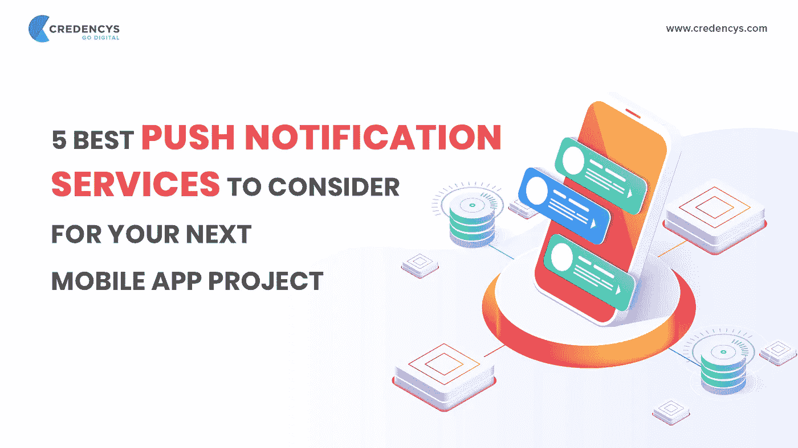
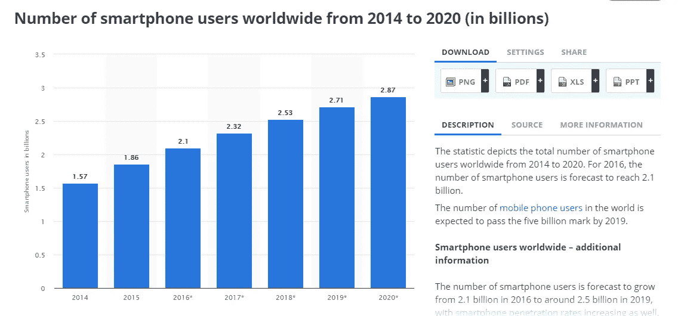
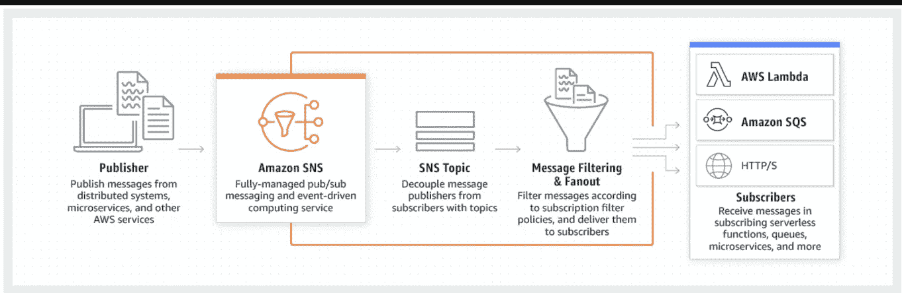
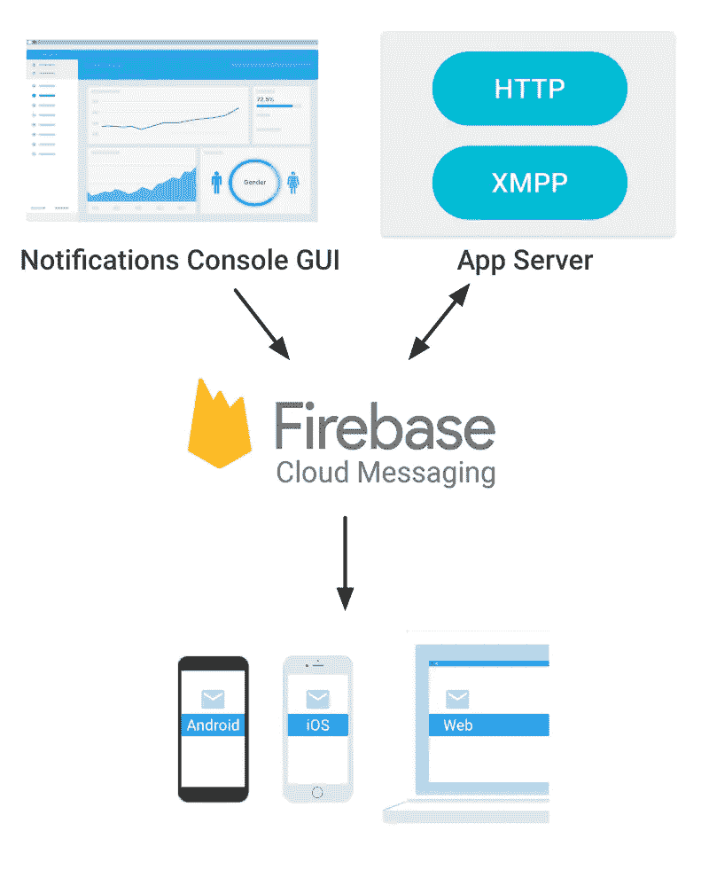

# 为你的下一个移动应用项目考虑的 5 个最佳推送通知服务

> 原文：<https://medium.com/hackernoon/5-best-push-notification-services-to-consider-for-your-next-mobile-app-project-9b4c2e8dd1db>

推送通知是苹果公司在 2008 年首创的，从那以后，它已经成为一个不可避免的功能。无论你正在开发什么类型的移动应用，无论是电子商务应用、社交媒体应用，还是移动游戏，都有 99%的可能性将这一特性包含在移动应用开发中。

现在，有很多推送通知服务可用，在这个博客中，我们将列出 5 个最好的推送通知服务。但是，在我们进入主题之前，让我们先了解一下基础知识。

# **什么是推送通知？**

推送通知基本上是将信息从应用程序传送到智能手机设备，而无需发送请求。

简单来说，安装在智能手机中的移动应用程序不需要启动就可以接收推送通知。与用户必须发送请求才能从服务器接收信息的拉式通知不同，推式通知直接来自服务器。

# **推送通知的重要性**

不言而喻，智能手机已经成为我们生活中不可或缺的一部分。我们出于不同的目的使用不同种类的应用程序。

事实上，智能手机用户的数量在过去几年中急剧增长。看看下面的统计数据就知道了。

Source: [Statista](https://www.statista.com/statistics/330695/number-of-smartphone-users-worldwide/)

上图清楚地证明了推送通知在移动应用中已经变得不可或缺。

如果你真的想一想，推送通知在日常生活中对我们帮助很大。例如，每当我们的收件箱收到新邮件或有人评论我们最新的 Instagram 照片时，他们总是让我们了解最新情况。

但这只是硬币的一面。另一方面，也是重要的一点，是知道何时在用户的智能手机上发送推送通知。

**听听这个**——如果你以正确的方式使用推送通知，它可以提高你的用户保持率&参与度。但如果做错了，它们会显得很烦人，令人不快，还会增加应用程序的弃用率。

你看，大多数用户不喜欢大量的通知。如果他们从一个应用程序收到太多通知，他们很可能会关闭它们，或者在最坏的情况下…删除应用程序本身。

因此，您需要仔细规划推送通知的时间跨度。

# **如何有效使用推送通知的 3 个技巧？**

这里有一些方法，你可以利用推送通知。

*   在您的移动应用中集成推送通知服务时，首先要考虑的是允许用户管理您的移动应用中推送通知的频率。这将有助于防止用户卸载你的应用。
*   第二点也是最重要的一点要记住的是，只发送真正重要的通知。例如，在特定时间范围内发送关于限时优惠的推送通知。
*   最后，正如我们之前所说的，避免发送大量的推送通知。这要么会让他们完全关闭你的应用程序的推送通知，要么会删除你的应用程序。所以，最好提供一个选项来启用用户感兴趣的通知。

现在，您已经了解了什么是推送通知以及如何有效地使用它们，让我们转到本文的主题。

# **5 种最佳推送通知服务**

推送通知服务在过去 10 年已经出现，因此市场上有很多种服务可供选择。此外，推送通知服务的数量不断增加，使得选择正确的服务变得困难。

例如，你可以在[找到超过 50 个推送通知服务。](http://pushproviders.com/)

但在这篇文章中，我们列出了 5 个最佳推送通知服务，我们已经在客户的几个移动应用开发项目中亲自使用过。

让我们检查一下！

# **1 —亚马逊社交网络**

亚马逊 SNS(简单通知服务)是亚马逊在 2010 年推出的。该公司的主要目标是提供一个单一的 API，允许向多个平台发送推送通知——它做到了。

**亚马逊 SNS 是这样运作的:**

正如你所看到的，亚马逊社交网络是 GCM、MPNS、APNS 等流行通知服务和用户设备之间的中介。

简而言之，Amazon SNS 使用设备令牌来创建移动端点，以便您可以向用户发送推送通知。

## **亚马逊 SNS 的优势:**

*   清晰的定价策略—0.50 美元/百万份通知
*   灵活的试用期—前 1，000，000 个通知是免费的。
*   深入的文档—它回答了所有问题，并且以非常方便的方式组织(使用图像、表格和图表)。
*   跨平台支持——它允许使用单个 API 向多个平台发送推送通知，如 Andoird、iOS。

# **2 —城市飞艇**

都市飞艇是一家成立于 2009 年的移动交战平台公司。该平台结合了多种功能，如推送通知服务、目标功能、应用内消息和分析。

它是最古老的，也是最好的推送通知服务之一。

## **城市飞艇的优势:**

*   跨平台支持——它支持 Android 和 iOS 平台。
*   伟大的定价政策-启动计划是完全免费的。基本版每月 99 美元，你也可以选择定制计划(45 天免费试用期)。
*   个性化和分段选项—它允许创建丰富的、交互式的、带有位置触发器的自动推送通知。
*   吞吐量很大！—大约 30 万条消息/秒。

除此之外，Urban Airship 还为开发者提供了最全面的文档。

# **3 — Firebase 云消息传递**

Firebase Cloud Messaging 或 FCM 是一个移动开发平台，提供多种有用的产品，如云存储、实时数据库、机器学习开发工具包、崩溃报告系统和推送通知服务。

就像上面提到的推送通知服务一样，Firebase 允许发送丰富的、有针对性的、自动化的推送通知，具有完整的内容定制和 A/B 测试功能。

最棒的是，Firebase 云消息是开源的，因此您可以无限制地使用它。

# **4 —接合**

Accengage 成立于 2014 年，提供一套工具来帮助营销人员提高移动应用的参与度。除了推送通知服务，Accengage 还提供移动应用跟踪技术、移动重定向解决方案，并连接到各种第三方分析工具。

现在，Accenage 可能没有像 Urban Airship 那样的悠久历史，但该公司拥有像迪士尼、雀巢、Orange 这样的全球品牌作为他们的客户。

## **加入的优势:**

*   个性化和定制工具——它允许针对特定的受众。
*   支持 iBeacon 和地理围栏—允许您发送基于位置的通知。
*   一套附加工具—多平台和多语言消息、A/B 测试、深度链接

# **5 —推呜声**

Push Woosh 是一家成立于 2011 年的推送通知服务公司。它提供了多种工具，用于发送移动和网络推送通知，以及应用内消息、活动绩效分析等。

## **推呜声的优点:**

*   合理的定价政策—免费计划(最多 1000 台设备)、入门计划(5000 台设备，每月 42 美元)、商业计划(最多 30K 台设备，每月 126 美元)和企业计划(30K 台设备以上的定制价格)。
*   免费试用期——Push Woosh 提供 14 天免费试用，无需信用卡。
*   附加工具—多平台和多语言支持、细分、应用内消息传递、私有云。

你有它！

在你下一个[移动应用开发](https://www.credencys.com/mobile-application-development-services/)项目中要考虑的 5 个最佳推送通知服务。