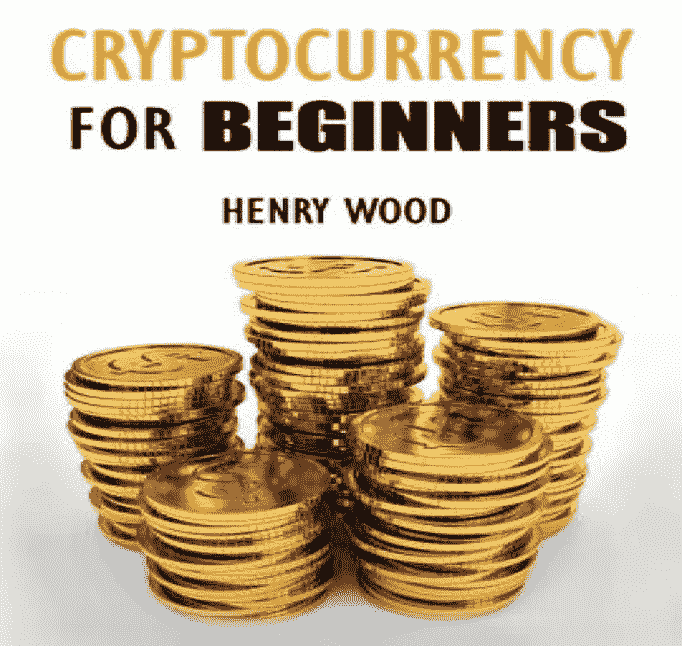
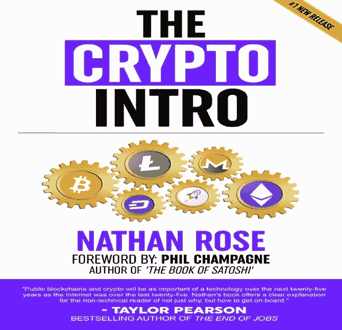
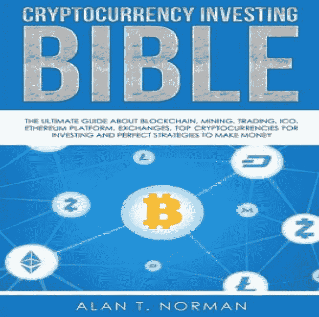
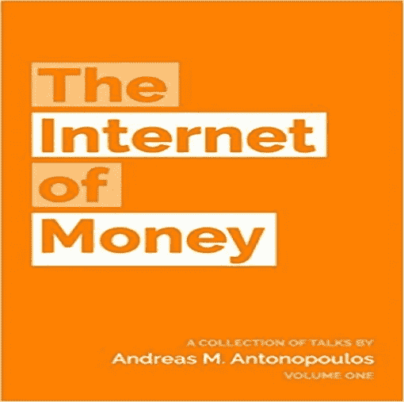
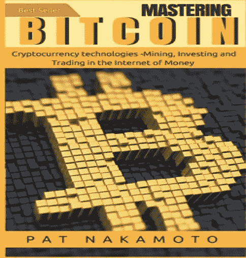
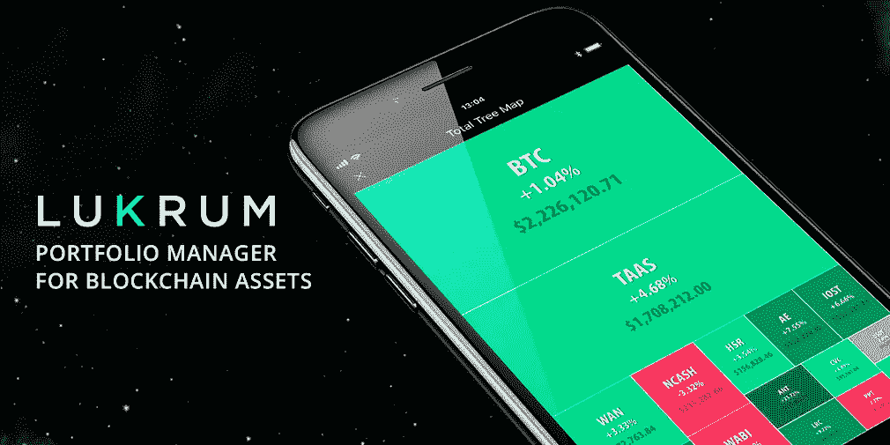

# 给加密投资者的 5 本书，你需要马上阅读

> 原文：<https://medium.com/hackernoon/5-books-for-crypto-investors-which-you-need-to-read-right-now-5d9a4b7d56f3>

Designed by LUKRUM

无论你是经验丰富的**秘密投资者**还是新手，深入了解游戏规则总是有好处的。成功的行业专家的建议和见解在这里不能被破坏。

当然，有几个在线媒体渠道可以让你了解其他**的加密投资者**在做什么以及他们为什么成功，但是没有什么比书籍更好的了。一些最有价值的成功秘诀只能在书中找到。出于这个原因，让我们深入探讨一下你现在需要阅读的五本书:

**1。** **亨利·伍德《初学加密货币》**

[面向初学者的加密货币](https://www.barnesandnoble.com/w/cryptocurrency-trading-tips-and-strategies-for-beginners-henry-wood/1127766859?ean=9781983531514&st=AFF&SID=Barnes+%26+Noble+-+Top+100%3A+Book+Bestsellers&2sid=Skimlinks_8732207_NA&sourceId=AFFSkimlinks&cjevent=efd036dad94511e8838202240a18050f&dpid=tekz25v83)顾名思义就是面向初学者的。它向你介绍了[加密货币](https://hackernoon.com/tagged/cryptocurrency) **交易**世界。这本书以最易懂的方式呈现了有价值的信息，使你能够参与到“价值互联网”中在阅读结束时，你可能会加入加密投资者俱乐部。

**2。** **密码简介——内森·罗斯**

加密简介帮助你了解加密是如何工作的，以及如何开始。您将了解如何选择合适的**加密货币交易所**并创建您的加密**钱包**。您还将了解各种**数字代币**以及如何购买您的第一种加密货币。简单地说，这本书有很多信息可以帮助初学者理解他/她的密码诗。这是一个“提出你的问题，你会得到一个”的问题。 **艾伦·t·诺曼的加密货币投资圣经**

[加密货币投资圣经](https://www.barnesandnoble.com/w/cryptocurrency-investing-bible-alan-t-norman/1127461489?ean=9781979688369&st=AFF&SID=Barnes+%26+Noble+-+Top+100%3A+Book+Bestsellers&2sid=Skimlinks_8732207_NA&sourceId=AFFSkimlinks&cjevent=e4dcc372d94511e8826e00b70a180510&dpid=tekz25v83)提供你需要知道的关于加密领域的一切。它向你提供加密货币**投资**的基础知识以及它是如何工作的。它为你提供了投资策略，并推荐了一些你可以考虑的伟大策略。它为你提供了所有你可以投资的顶级替代币的列表，以及智能合约如何操作的完整指南。这本书回答了你想知道的关于区块链的几乎所有问题。

**4。** **安德烈亚斯·m·安东诺普洛斯的《货币互联网》**

本书的前提[货币的互联网](https://www.amazon.com/gp/product/1537000454/ref=as_li_qf_asin_il_tl?ie=UTF8&tag=nathanrose-20&creative=9325&linkCode=as2&creativeASIN=1537000454&linkId=f6060db66b7244221c7cf3739c4250df)，简单来说就是回答“为什么[比特币](https://hackernoon.com/tagged/bitcoin)”这个问题。你很可能想知道比特币是如何工作的，以及为什么**比特币(BTC)** 很重要。安德烈亚斯提出了许多与比特币相关的问题，以及加密货币在未来可能如何扩大规模。由一系列关于加密货币交易的文章组成，这是一个很好的加密领域初学者指南。

**5。** **比特币:掌握比特币和加密货币技术 Pat Nakamoto**

中本聪(Pat Nakamoto)的书 [**比特币**](https://www.barnesandnoble.com/w/bitcoin-pat-nakamoto/1127216766?ean=9781978159945&st=AFF&SID=Barnes+%26+Noble+-+Top+100%3A+Book+Bestsellers&2sid=Skimlinks_8732207_NA&sourceId=AFFSkimlinks&cjevent=da933ab2d94511e883bb023a0a180513&dpid=tekz25v83) 是对比特币世界的介绍。比特币背后的概念以简单的方式呈现，非技术用户可以阅读和理解。在这里你将学习如何投资比特币，如何开采比特币，甚至如何进行比特币交易。

**最后一句话**

如你所见，加密货币不仅仅是比特币和以太坊**。要成为精英中的精英，你需要通过研究和实践来磨练你的技能。**

我们上面重点介绍的几本书可以帮助你从业余爱好者成长为专业人士。所以现在就给自己拿一本，好好读一读，并在下面的评论区和我们分享你的想法。

你已经用过 LUKRUM 了吗？

[卢克拉姆](https://lukrum.tech/?utm_source=medium)——最人性化的加密货币投资组合管理器。该应用程序允许与所有 exchange 帐户或区块链钱包自动同步，以跟踪数字资产。开始使用免费的&安全应用程序进行交叉投资组合分析&了解最有利可图的策略。

我们很高兴听到您的任何反馈或意见，以改善应用程序，让您的生活更轻松。因此，请随时通过以下任何渠道联系，包括[电报](https://t.me/LUKRUMapp)、[推特](https://twitter.com/LUKRUM_app) & [脸书](https://www.facebook.com/LUKRUMapp)。

