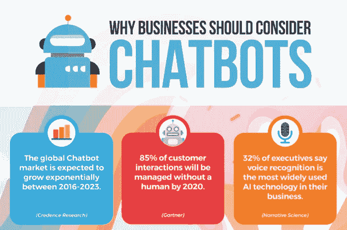
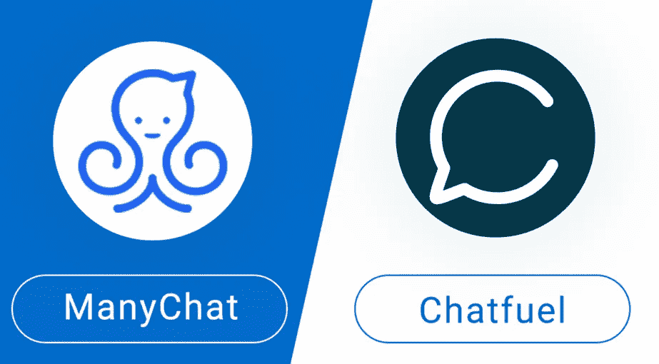
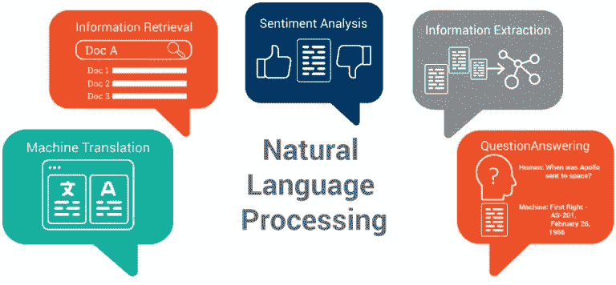
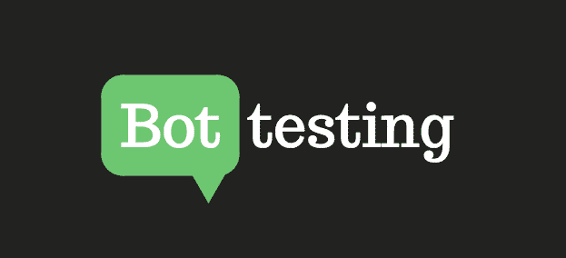
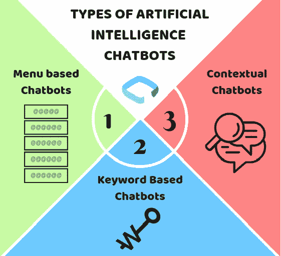

# 2019 年企业应该考虑的 5 个最先进的聊天机器人创意

> 原文：<https://medium.com/hackernoon/5-chatbots-ideas-business-cant-afford-to-miss-in-2019-e59cd41e01f8>

如果你想在你的网站上添加最先进的聊天机器人，你可能会注意到开发一个聊天机器人需要很多东西。

作为领先的离岸软件开发公司 ValueCoders 的 IT 采购分析师，我在编程阶段开发最先进的“聊天机器人”时面临几个挑战。尽管如此，我发现现在管理聊天机器人开发工作变得更加容易，尤其是在了解了为商业社区创建一个强大的聊天机器人解决方案的想法之后。在这里分享我最先进的聊天机器人想法的经验。

尽管聊天机器人在商业领域已经存在了几十年，但电子商务直到现在才知道如何有效地将它们用于商业目的。

***那么，你有没有考虑过将最先进的聊天机器人理念应用到你的商业网站上？***

如果是，那么你已经意识到了这项技术的商业潜力。如果你是第一次使用聊天机器人，这里有五种方法可以将最先进的聊天机器人应用到你的商业网站上。

## **聊天机器人创意**

1.  **让我们从你的聊天机器人想法的技术需求开始**

聊天机器人由机器人引擎构建，如 [ManyChat](https://manychat.com/) 或 [Chatfuel](https://chatfuel.com/) ，然而，对于主要的商业网站来说，需要更熟练的方法来创建一个拥有所有升级功能的定制应用程序。所以，每当你想到在你的商业网站上添加聊天机器人的想法时，你可能也需要升级你的互联网服务，并且需要购买更多的服务器空间。

*假设你的聊天机器人会通过不同的销售点交易与用户对话，那么开发者推荐的网速是 75 Mbps。*

创建一个后台应用程序也是一个不错的聊天机器人想法，因为它可以存储和处理从用户那里收集的信息。[*node . js*](https://www.udemy.com/the-complete-nodejs-developer-course-2/)*和*[*Udemy*](https://business.udemy.com/get-started/)*是创建有用的&交互式后端应用的首选框架。*

另外，决定你的聊天机器人是使用语音还是只显示文本。

为了检查您的所有技术需求是否得到满足，您需要在向公众发布之前对机器人的性能进行良好的分析。寻找下一个聊天机器人创意的更多技术要点:

**功能标准** —实现对话机器人的功能可能是设置过程中最重要的部分，包括创建对话流、定义用例以及连接到 API。这一过程将涉及您的 UX 设计团队、营销团队和软件开发专家团队。

**跨所有频道测试**——如果你正在从头开始构建聊天机器人或者使用一些可用的技术，你将需要将对话翻译成跨所有频道和设备的代码。

**分析** —在 bot 可供发布后，对 bot 性能的分析很重要。跟踪机器人性能的关键指标是收到的用户交互数量、失败率、客户满意率和 ROI。

**2。让自然语言处理(NLP)成为你最先进的聊天机器人理念**

将 NLP 添加到您的聊天机器人可以增强您的客户体验。 ***如何？***

通俗地说，NLP 的基本功能就是有意义地解读人类的技术输入。基于 NLP 的响应系统的最好例子是亚马逊的 Alexa，它对你说的话做出反应，并根据你的语音命令给你结果。

聊天机器人主要使用带有“if-then”命令的脚本来回答客户的常见问题。然而，今天 [if/else 语句](https://chatbotslife.com/how-to-build-a-conversational-chatbot-and-avoid-if-else-statements-37b48ad11eae)已经是过去的事情了，并且会因为机器人没有给出及时的响应而使您的客户感到沮丧。为了避免 if/else 语句，我们寻找新的&更新工具来满足您的需求。

Rasa 是一个开源框架，用于构建最先进的聊天机器人，这些聊天机器人使用语言处理工具(NLP)进行交互式对话。

**普通聊天机器人是这样工作的:**

你让聊天机器人预订去法国的机票。

机器人要求你指定预订日期。

然后，你简单地提一下日期。

你的航班已经订好了。

这是你所期望的场景，但是事情是不同的，很少能顺利进行。这是我们都面临的实际情况:

你让聊天机器人预订去法国的机票。

机器人要求你指定预订日期。

然后，你只需选择当天的日期。

但是，你也问了法国的天气。

聊天机器人不知道如何回应…..

没有回应，是因为你加的条件，你还可以进一步加更多的条件。 ***有什么解决办法？***

Rasa 的工作方式完全不同。Rasa 程序不是管理条件，而是聊天机器人，处理大量带有变量的故事。

**3。反复测试你的聊天机器人想法**

开始聊天机器人测试需要开源工具，比如 Selenium & TestMyBot，这两个工具都是聊天机器人自动化测试的流行工具。根据您的业务需求，您可以将聊天机器人的开发和测试外包给软件开发公司。或者你可以[雇佣聊天机器人开发者](https://www.valuecoders.com/hire-developers/hire-chatbot-developers)，他们可以根据你的业务需求为你提供最好的聊天机器人开发服务。

有很多方法可以使用其他工具来衡量你的机器人性能。请查看下面给出的参考资料:

[**Botium**](https://www.botium.at/) 通过其 API 级别的用户界面使聊天机器人测试速度提高了 100 倍。

[**Selenium**](https://www.seleniumhq.org/) 是测试&网站&聊天机器人自动化流程的工具。

## 4.确定客户的需求

询问客户的对话需求，如企业对企业(B2B)客户与企业对消费者(B2C)客户有不同的方式，反之亦然。

在这种情况下，问你的客户这些问题。

他们需要聊天机器人来获取信息吗？

他们在登录或购买过程中是否需要任何帮助？

所以，如果你的目标受众是 B2B 或 B2C，确保你的聊天机器人能够进行 C2H 式的聊天机器人对话。

## 5.永远记住你的商业目标

无论你的聊天机器人想法有多聪明，你都不会仅仅为了好玩而在你的商业网站上实现它。你应该总是有一个好的理由。因此，在你的网站上部署聊天机器人之前，检查你的业务目标，了解聊天机器人的想法如何帮助你实现业务目标。

如今，聊天机器人适用于各种能力水平的企业。虽然有些企业需要基本的聊天机器人，但有些企业需要更高级的聊天机器人。

***如何确定适合你业务需求的聊天机器人创意？***

当决定哪种聊天机器人适合你的业务时，你只要设身处地为你的客户着想，想想他们想从你这里得到的服务。你需要决定谈话的内容是否会影响你的服务。此外，考虑你的目标受众和他们对 UX 的偏好。弄清楚这一点很重要，因为一些用户可能更喜欢有可视菜单按钮的聊天机器人，而不是开放式的体验。

***这里有一些选择:***

**带菜单/按钮的聊天机器人**——这些聊天机器人很适合回答常见问题。但它们不适合用于更高级的回答场景或有太多变量或太多信息要预测的对话。

具有关键字识别功能的聊天机器人 —基于关键字识别的聊天机器人会注意用户键入的内容，然后尝试做出相应的响应。这些聊天机器人使用可定制的关键字和人工智能来为用户提供适当的响应。

**上下文聊天机器人** —与上面讨论的其他两种机器人相比，这是聊天机器人的最高级形式。这些聊天机器人运行在机器学习(ML)和人工智能(AI)上，记录并记住与特定用户的对话。

最适合你的业务的最先进的聊天机器人也可能需要先进的人工智能能力；然而，在某些情况下，简单的菜单按钮机器人可能是正确的解决方案。

## **最后的话**

今天的聊天机器人能够提供必要的帮助、信息以及与顾客保持亲密关系的积极体验。最终，聊天机器人的想法将所有这些品质的愉快体验带入对话中，使对话体验更丰富，对企业更有用。

我们希望这些要点能够帮助您满足构建最先进聊天机器人的业务需求。正如你所看到的，聊天机器人为商业网站提供了很多好处。无论您是想在您的网站、短信聊天还是 messenger 上开发聊天机器人，您都可以快速联系并[雇佣最好的聊天机器人开发人员](https://www.valuecoders.com/hire-developers/hire-chatbot-developers)，他们提供优秀的聊天机器人创意和开发服务。