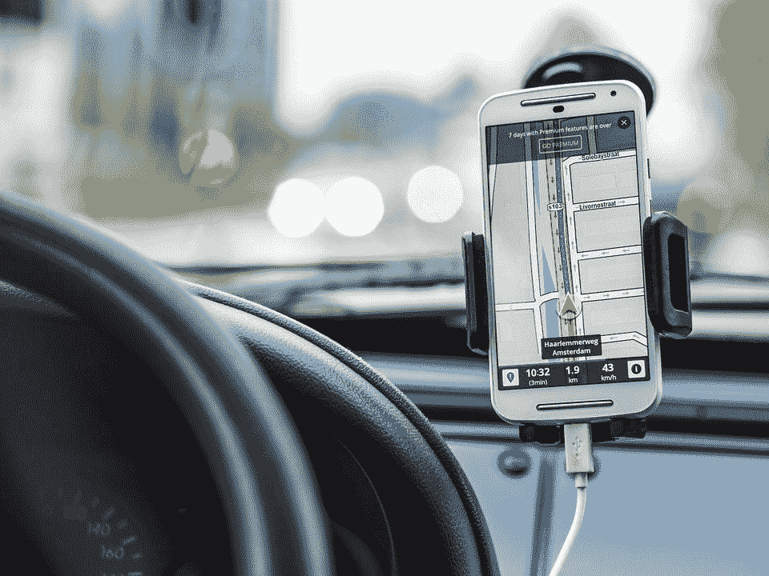

# 2019 年将繁荣或萧条的 5 种未来交通技术

> 原文：<https://medium.com/hackernoon/5-future-transportation-technologies-that-will-boom-or-bust-in-2019-b5ee59f7f8f>

Photo Credit: [Pixabay](https://pixabay.com/photos/navigation-car-drive-road-gps-1048294/).

这些年来[新技术的再次出现](https://hackernoon.com/future-technology-trends-that-gonna-rule-the-planet-fa2f578f22eb)帮助了我们如何生活和开展日常活动，这种发展大部分是因为发明和创造了减少日常压力和改善生活的新方法。

运输业是新技术进步的重要领域之一。我们现在看到汽车自动沿着预定的路线行驶。将使用新型磁性轨道系统的火车。以及一辆惊人的时速 800 英里的新型“超级高铁”。

所有这些创新不仅仅是一种幻想，它们将在未来几年内发生，或者已经开始搭载我们。这提高了一些行业的水平，如汽车运输公司 **/** 汽车运输公司、卡车生产公司和车队管理更有效率。

事实上，[根据 OICA 出版物](https://blog.marketresearch.com/5-top-trends-in-the-transportation-industry-in-2018)和 MarketsandMarkets 分析，2017 年全球卡车产量达到 402 万辆，高于 2015 年的 360 万辆。另一方面，全球公共汽车产量从 2015 年的 390，466 辆增加到 2018 年的 429，838 辆。卡车和公共汽车产量的增加表明了货运和客运需求的增长。

根据 MarketsandMarkets 的分析，2018 年交通行业的主要趋势包括对卡车排队、电动卡车、自动驾驶、电动/混合动力公交车和智能交通解决方案的需求不断增长。

然而，交通运输技术的改进通过减少温室气体的排放、改善空气质量和支持经济发展来达到一些重要的目的。因此，以下是将在 2019 年繁荣或萧条的未来交通技术:

## **1。未来的交通创新将通过地铁实现**

像 Hyperloop 这样的运输技术已经广为人知，因为人们知道它可以在很短的时间内将许多人运送到很远的地方。但是还有一些你可能意识不到的事情。

在历史上，高速铁路的发展一直受到管理摩擦和空气阻力的困难的阻碍，当车辆接近高速时，这两个问题都变得很严重。

vactrain 概念理论上通过在真空(无空气)或部分真空管道中采用磁悬浮列车来消除这些障碍，允许时速数千英里。

然而，Elon Musk 最初构想的 Hyperloop 是一条地下铁路，在早期测试中显示速度高达 240mph。开发人员希望最终版本能达到三倍的速度。Hyperloop 类似于 vactrain 系统，但工作压力约为 1 毫巴(100 [帕](https://en.wikipedia.org/wiki/Pascal_(unit)))。

## **2。更强大的全球定位系统(GPS)将改变我们的通勤方式**

GPS 并不是一个新现象，我们使用 GPS 已经超过十年了。但是现在，当将现代 GPS 设备与硬件中发现或使用的早期模型进行比较时，存在巨大的差异。

GPS 设备在过去非常有限，它们只能计算里程以提供到达车辆最终目的地的估计时间。但是现在 GPS 设备更加足智多谋。

除了他们现在实现计划行程的基本功能之外，一些汽车运输公司现在使用 GPS 单元进行调整，以了解何时天气适合旅行，了解每条路线的交通状况，以便决定采取最佳路线尽快送货。

## **3。水燃料汽车**

如果汽油动力汽车产生的空气污染率可以降低，你认为会发生什么？

水燃料汽车是一种假设直接从水中获取能量的汽车。水燃料汽车已经成为许多国际专利、报纸和科普杂志文章、当地电视新闻报道和网站的主题。

就像已经做成现实的无人驾驶汽车的案例；水燃料汽车已经被一些科学家试验了很长一段时间，我认为很快就会成为现实，我们将开始过简单的生活。

## **4。高铁网络**

高速铁路网络在全球引起了极大的兴趣。就在最近，韩国已经开始建造将在仁川机场运行的磁悬浮列车，据报道，中国正在开发第二辆磁悬浮列车。

一辆计划中的磁悬浮列车将在 40 分钟内运送乘客往返名古屋和东京之间 200 多英里，有助于缓解拥堵的道路，减少空气污染，减少事故

磁悬浮列车的主要问题是开发成本高。恩德勒说，由于速度快，火车必须在目的地之间直接行驶。

## **5。弦理论运输发展**

弦理论试图将四种已知的基本相互作用——引力、电磁力、强核力、弱核力——统一在一个理论中。

你可能听说过量子物理中的弦理论，但你在运输领域听说过吗？

这个概念是基于使用两根绳子，上面骑着一辆轮式车辆。这是一种新的低成本运输系统，它可以穿过任何东西水，沙漠或森林，塔。

## **结论**

由于变革性的交通技术，现代交通目前正在经历重大变革。上面讨论的几乎所有要点都标志着交通领域的下一个创新事件，它将改善我们的生活方式，提高我们日常活动的效率。