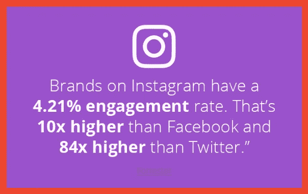
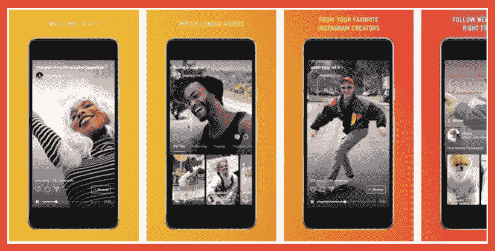
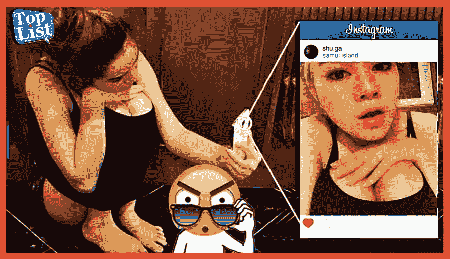

# 微观影响者必须了解的 5 个 Instagram 营销趋势

> 原文：<https://medium.com/hackernoon/5-instagram-marketing-trends-micro-influencers-must-be-aware-of-a57fbf687540>

## 如果你在 Instagram 领域被认为是权威，你就会知道建立这种声誉有多难。这需要持续不断的努力。做小事需要一种意愿。它需要一双眼睛来寻找人们喜爱的内容。

[Image Source](https://www.pexels.com/photo/app-apple-application-blog-219003/)

## 成为[相关的、高参与度的微型影响者](https://hackernoon.com/how-to-measure-what-an-instagram-influencer-is-worth-cb488f605ffe)是一份全职工作。

你现在可能做得很好，如果你利用这些改变 Instagram 面貌的趋势，你可以做得更好。

你准备好迈出下一步了吗？这些是你需要了解的趋势。

# **1。持续参与推动有机增长**

如果你想增加你的关注，最简单快捷的方法就是开始喜欢帖子，这样你就会出现在人们的订阅中。随着[每天有 42 亿个赞](https://blog.hootsuite.com/instagram-statistics/)，Instagram 绝对有参与度，这些赞帮助人们得到关注。这是一个普遍的趋势，随着[影响者](https://hackernoon.com/tagged/influencer) [市场](https://hackernoon.com/tagged/market)变得更加艰难，这种趋势只会变得更加普遍。

[Image Source](https://www.falcon.io/insights-hub/topics/social-media-strategy/21-tips-increase-instagram-engagement/)

幸运的是，如果你想获得一点优势，像 Kicksta 这样的公司可以为你工作，帮助你在你的后喜欢游戏中领先一步。

正如 Kicksta 最新指南中的[所指出的，“Instagram 上有 2500 万个商业档案，我们生活在一个仅仅拥有社交媒体并不足以在 Instagram 上获得真正粉丝的时代。你必须吸引合适的 Instagram 用户，以获得关键的社交证明，帮助你的品牌脱颖而出。”](https://kicksta.co/how-to-get-real-followers-for-instagram)

“与此同时，你的竞争对手可能有一个平庸的产品，但由于他们从 Instagram 上的粉丝那里获得的社交认可，他们的销量可能会超过你。”

随着喜欢的趋势继续上升，有人帮助你会比独自一人走得更远。

# **2。Instagram 故事越来越受欢迎**

每天有超过 4 亿人观看 Instagram 故事，如果你没有跟上，是时候加入了。Stories 问世时，功能与 Snapchat 非常相似，但 Instagram 的用户群规模使 Stories 一炮而红，立即获得了参与。

故事是推动参与度的一个很好的方式，特别是引入一些贴纸，为其他常规帖子增加兴趣和刺激。

倒计时、温度、问题框等将为用户提供常规帖子所没有的参与方式。好好利用。

# **3。Instagram TV (IGTV)爆发**

[Instagram TV](https://www.adweek.com/digital/5-instagram-marketing-trends-we-will-see-in-2019/) 是一款独立的垂直视频应用，允许长格式内容创作，将与 YouTube 和 Twitch 等常规和流媒体视频服务直接竞争。对于垂直格式，它专门针对移动观察者。

视频仍在继续增长，思科指出，到 2021 年，82%的互联网流量将来自视频。Instagram 想分一杯羹，这就是 IGTV 的用武之地。

[Image Source](https://www.youthapps.in/2018/06/igtv-instagram-tv-mobile-app.html)

今年，Instagram 正在努力推动 IGTV 的起飞，因为它希望在长格式视频领域找到自己的位置，就像在短格式视频领域一样。如果你能早点进入，尤其是在竞争不激烈的时候，你就能比等待更舒适地开拓出一个利基市场。

利用现在的趋势，这样你就可以抢在那些试图等待的人前面。

# **4。Instagram 购物推动卓越的转化率**

如果你卖产品，你绝对*有*跳上 Instagram 购物潮流。Instagram 购物允许人们直接从你的 Instagram 帖子中购买。这些帖子会自然地显示出来，并在角落里有一个标签和一个白色购物袋，表明该商品可供购买——这与那些旧的“生物链接”变通办法的转换能力相去甚远。

根据他们自己的统计，75%的人在 Instagram 上看到商业帖子后会采取行动。这对任何人来说都是惊人的参与率。如果你想提高销售额，利用这个机会让人们直接去看你的产品。

除此之外，Instagram Checkout 将很快允许你完全通过 Instagram 提供产品，而买家无需离开该应用程序。

这是一个已经开始起飞的趋势，你将能够以一种你以前根本无法做到的方式增加你的销售额和你的品牌知名度。

# **5。真实性变得越来越重要**

最终的趋势不一定与 Instagram 本身正在做的事情有关，而是品牌通过影响者产生的巨大影响的结果。这就是真实性。

[Image Source](https://funalive.com/articles/social-media-vs-real-life-30-pics-videos_De1.html)

人们开始对产品代言持更加怀疑的态度，尤其是那些随处可见的广告。尤其是对那些有微小影响力的人来说，让人们看到你真的在使用你所推广的产品——你真的关心他们，而不仅仅是那些给你钱的公司——比以往任何时候都更重要。

真实性一直很重要，但随着平台变得饱和，它比以前更加重要。做真实的自己，你会脱颖而出，尤其是那些真正关心薪水多于关心他人的人。

# **你在驾驶座上**

微影响者在 2019 年处于非常有利的位置，Instagram 做出了一些改变，让你能够增加受众，推出新内容，推动产品，创造更令人满意的沉浸式用户体验。你在驾驶座上。确保你利用了它——但是要以同样的真实性去做，就像你现在所做的那样。

如果你充分利用所有这些进步和趋势，并做好自我定位，你将处于成功的有利位置。不要落在后面——勇往直前，利用你所拥有的一切工具，让 2019 年成为辉煌的一年。