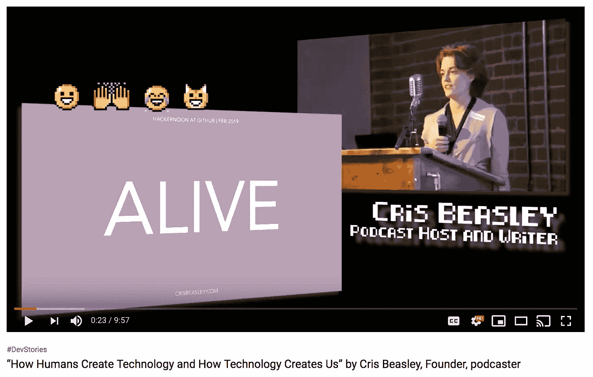
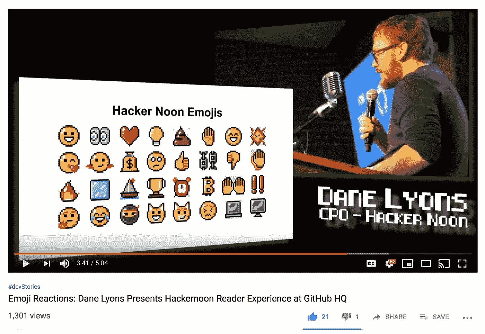
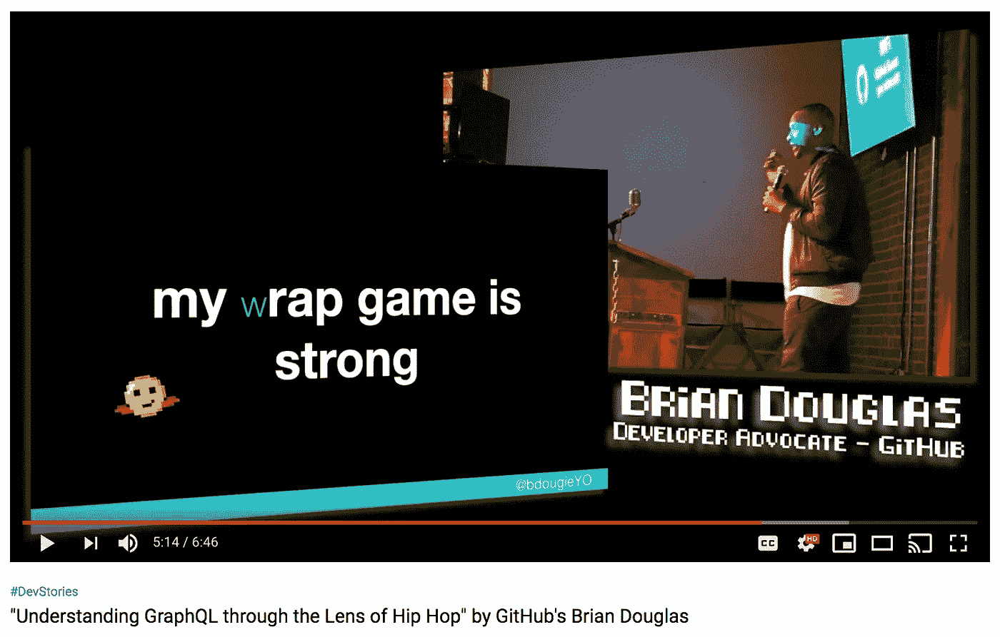
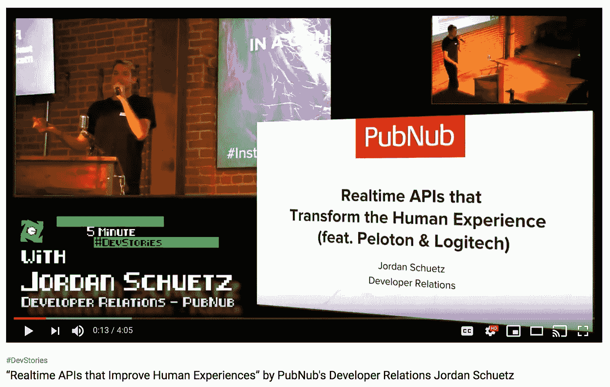
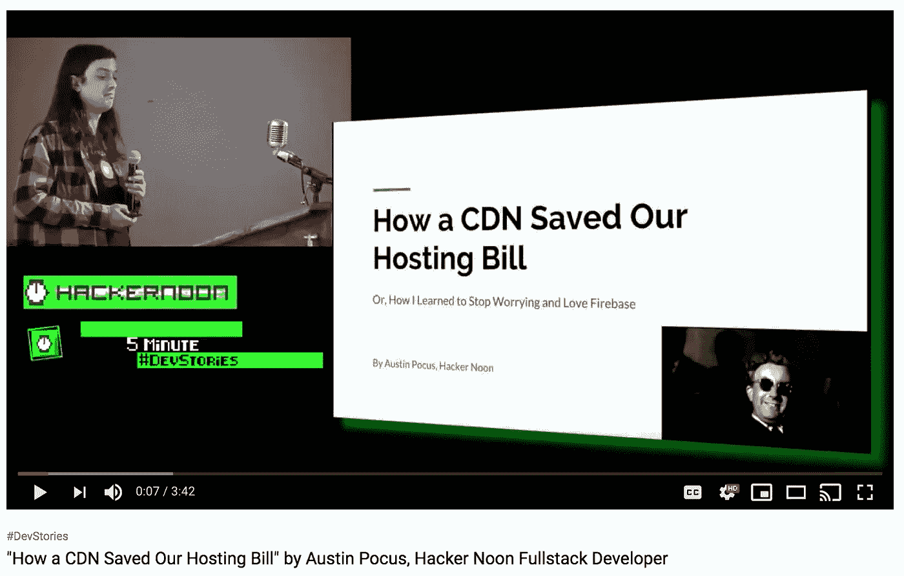
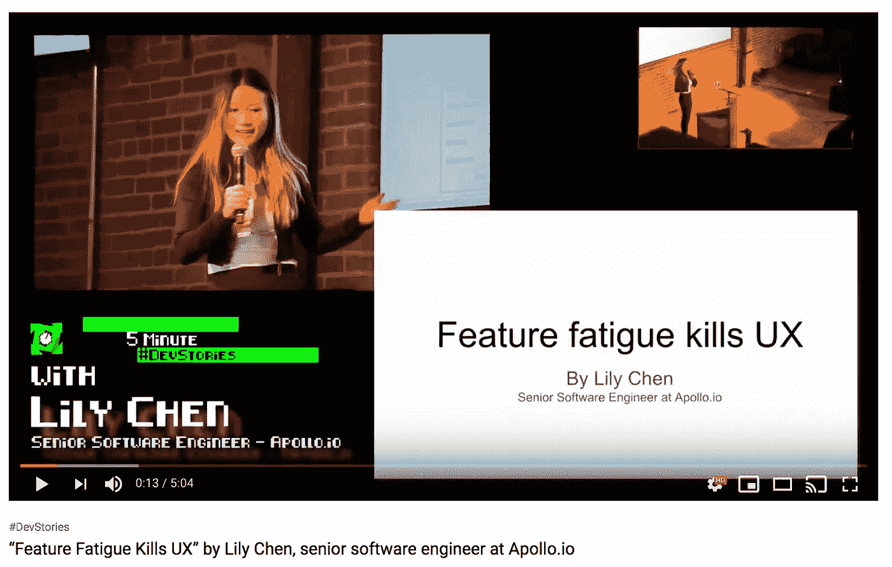
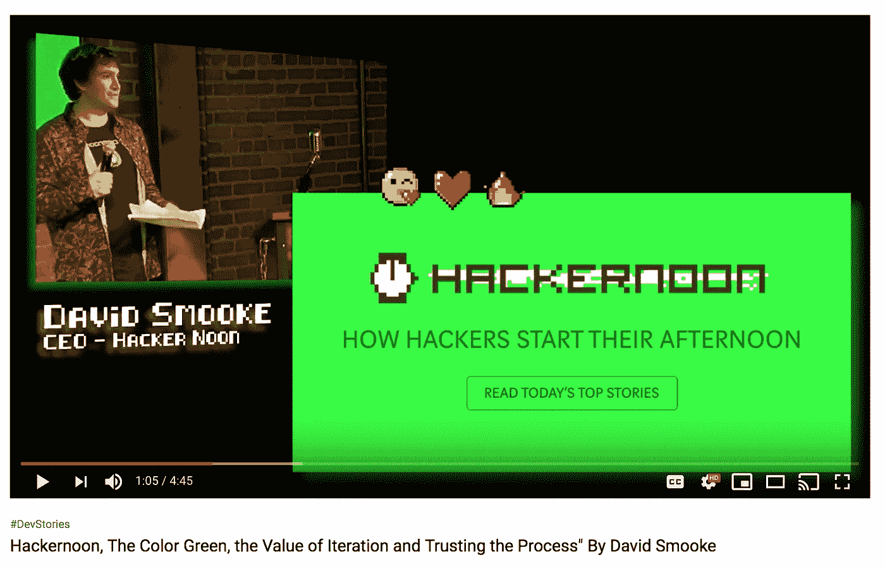
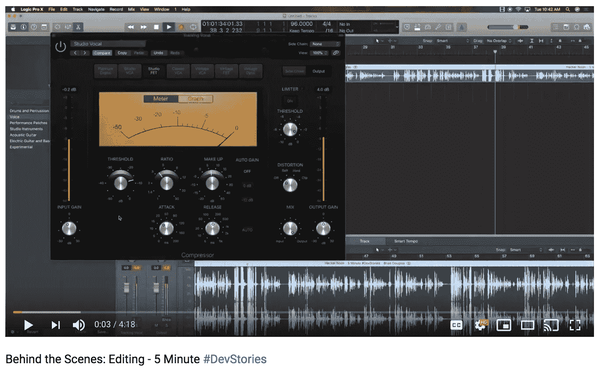

# 5 分钟# dev stories @ GitHub HQ[视频]

> 原文：<https://medium.com/hackernoon/5-minute-devstories-github-hq-videos-f3f518a49cf8>

## 但首先，向我们本周的投资者们欢呼吧:[伊曼纽·切塞纳](https://hackernoon.com/@0x0ece)，[威廉·陈](https://www.linkedin.com/in/williamkchen/)，&，【丹·萨丕尔。

嘿，很抱歉这八个[黑客正午贡献者](http://contribute.hackernoon.com)的精彩演示视频延迟发布。我们正在提升我们的视频制作[(由](http://hackernoon.video) [Derek Bernard](https://community.hackernoon.com/u/derek/summary) 编辑)，每周两次来自 [Hacker Noon 播客](http://podcast.hackernoon.com)的视频采访和基于事件的视频制作，就像我们在 [GitHub](http://github.com) SF 总部与 [PubNub](http://pubnub.com) 一起做的这个。

## 这是完整的[黑客正午#开发故事播放列表](https://www.youtube.com/watch?v=ffGvNLM45F8&list=PLzeK5ofgBRBHuVA3Y8V3U_dvL6uVfE0aG)。

**[**生产力黑客利用现代文字编辑**](https://www.youtube.com/watch?v=TSRwI1x3cW0)**由[普拉那瓦·阿杜里](https://hackernoon.com/what-should-vcs-look-for-in-faas-startups-d20b2dbecc07)担任[的编程总监 AWIP](https://www.advancingwomeninproduct.org/) 和[的创始工程师鲁布里克](https://www.rubrik.com/)****

********

******[**人类如何创造技术，技术如何创造我们**](https://www.youtube.com/watch?v=htGeB7u72OQ) 作者:[克里斯·比斯利](https://hackernoon.com/@crisbeasley)，[播客](https://www.crisbeasley.com/podcast)，[莫兹利安](https://mozillians.org/en-US/)，[美国心理协会 Div 44](https://www.apa.org/about/division/div44) 技术顾问******

********

******[**读者表情符号反应迭代**](https://www.youtube.com/watch?v=Ow2lje7UBd4)**by[戴恩·莱昂斯](https://hackernoon.com/@danelyons)，黑客正午 CPO &福布斯技术委员会成员。********

************

******[**“安全、默默无闻、开放**”](https://www.youtube.com/watch?v=ffGvNLM45F8)作者:[伊曼纽·切塞纳](https://hackernoon.com/@0x0ece),[Pinterest](https://www.pinterest.com/)的安全工程师、 [SoloKeys](https://shop.solokeys.com/) 的联合创始人******

********

******[**透过嘻哈**](https://www.youtube.com/watch?v=c11Mxf4fxdE)**由 [GitHub](https://github.com/) 的开发者代言 [Brian Douglas](https://github.com/bdougie)********

************

********[**改善人类体验的实时 API**](https://www.youtube.com/watch?v=TcdVif7ay84)由 [PubNub](http://pubnub.com/) 的开发者关系 [Jordan Schuetz](https://hackernoon.com/the-future-of-indie-gaming-is-multi-platform-and-bright-43267bac038f)********

********

******[**一个 CDN 如何拯救我们的托管法案**](https://www.youtube.com/watch?v=UQgJXCBpRFw)**作者[奥斯汀·波库斯](https://hackernoon.com/@austin.pocus)，黑客 Noon Fullstack 开发者。阅读更多关于奥斯汀从他的第一次 Dev 演讲中学到的东西。********

************

********[**功能疲劳致死 UX**](https://www.youtube.com/watch?v=0zesFi4Zxm4)**作者[陈莉莉](https://hackernoon.com/@lilychendances)[Apollo . io](https://www.apollo.io/)高级软件工程师、获奖竞技舞者**********

************

******[Hacker Noon，The Color Green，The Value of Iteration and trust The Process](https://www.youtube.com/watch?v=0QLMXCQShng)作者 [David Smooke](http://davidsmooke.net) 。你也可以[看看这个故事](https://hackernoon.com/green-iteration-and-trusting-the-process-7289863897)。******

******对我们本周的投资者大声喊出来！为那些使我们有可能[建立一个更好的技术网站](http://startengine.com/hackernoon)的人干杯:******

*   ******[**伊曼纽·切塞纳**](https://hackernoon.com/@0x0ece) 是 [**Pinterest**](https://www.pinterest.com/) 的安全工程师，也是 [**SoloKeys**](https://shop.solokeys.com/) 的联合创始人******
*   ****[**William Chen**](https://www.linkedin.com/in/williamkchen) 是 [**Cabinet**](https://www.cabinet.app/) 的创始人，一款 iOS 专用的、可视化的、照片优先的记事本。****
*   ****[**【丹萨丕尔】**](https://www.linkedin.com/in/dsapir/) 负责 [**Pepipost**](http://pepipost.com/) (邮件发送 API 和送达能力咨询)的销售&运营。****

******P.P.S.** 如果你想在未来的活动中合作，[partners@hackernoon.com](mailto:partners@hackernoon.com)。****

******P.P.P.S.** 下面是制作这些视频的花絮视频。g'head 制作公司的一些很棒的音乐选择。****

****************