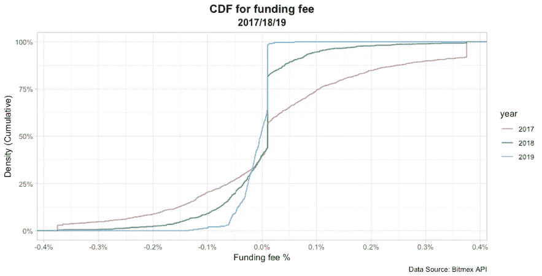
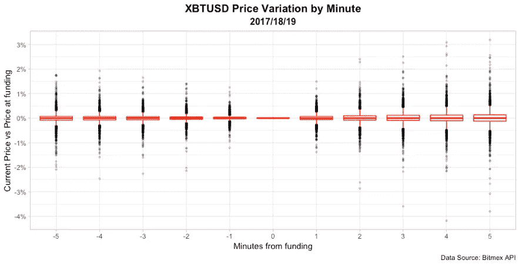
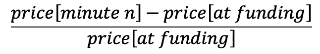
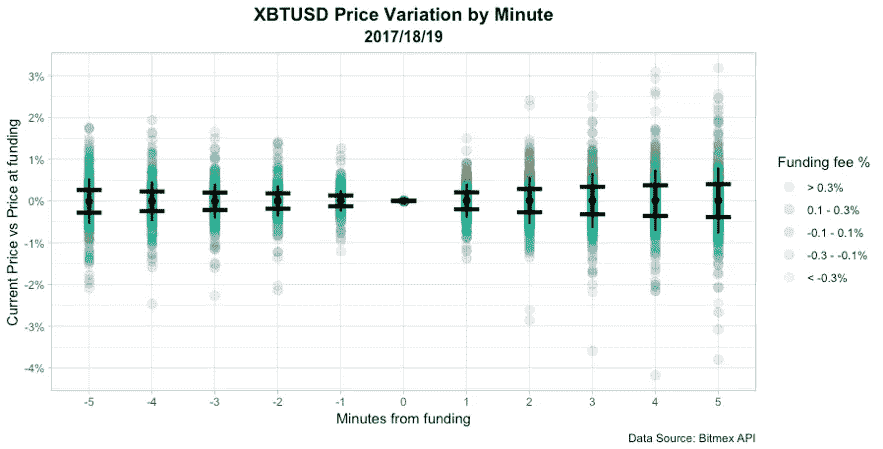
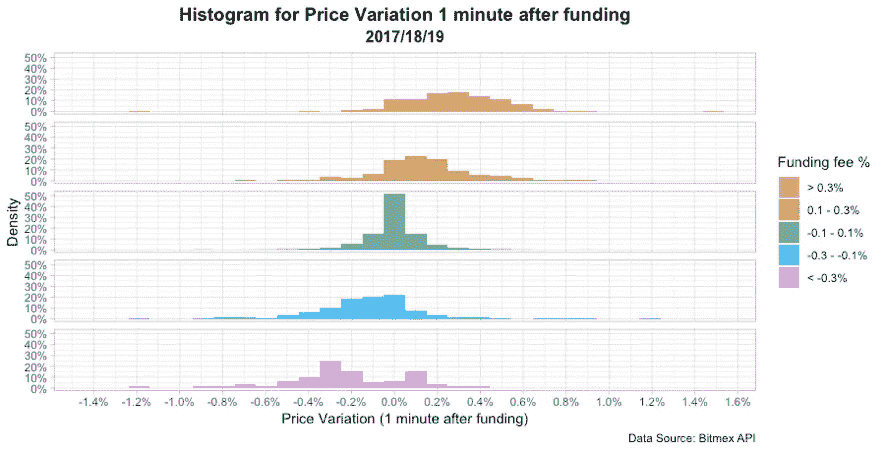
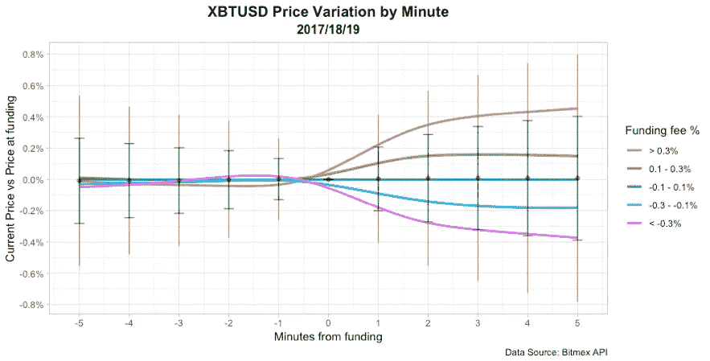
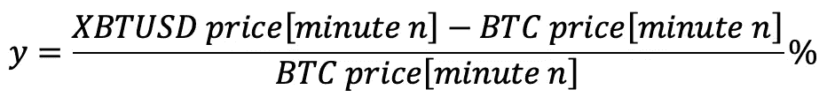
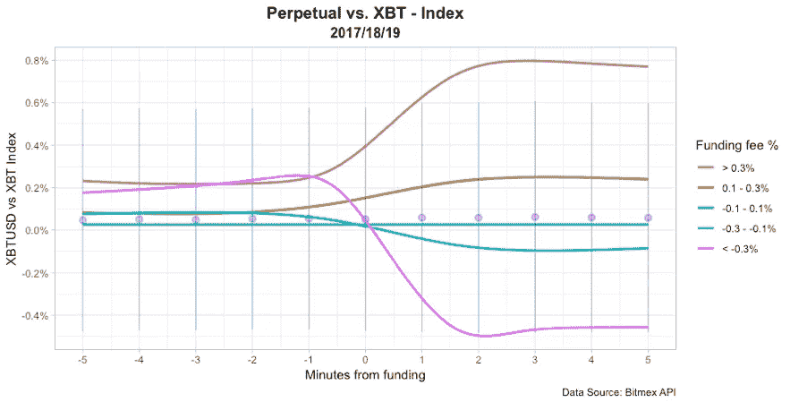

# Bitmex 上资金时间前后 5 分钟会发生什么？

> 原文：<https://medium.com/hackernoon/5-minutes-before-funding-fee-33a853f8f9f2>

# 关于 Bitmex 融资的一些基本概念

如果你曾经在 [BitMEX](https://medium.com/u/94b52ae5502e?source=post_page-----33a853f8f9f2--------------------------------) 交易过 XBTUSD 掉期(永久合约),你应该已经意识到，每 8 个小时，多头和空头之间就会交换一次资金费用。谁出钱谁出，基本取决于市场的预期。简而言之:

*   如果融资费用> 0:多头支付空头，因为有看涨情绪
*   如果融资费用< 0:空头支付多头，因为有看跌情绪

这种合约的特点是，如果你没有在资金交换的精确时刻(每 8 小时一次)持有头寸，你就不会得到任何报酬/费用。

值得一提的是，在实际结算前 8 小时，每个人都知道资金费用(金额和符号)。

# 那又怎样？

所有这一切意味着，从技术上讲，如果你处于一个融资费用对你不利的位置(意味着你将支付费用，而不是收到它)，你可以在融资时间前一秒钟退出该位置，并在一秒钟后重新进入该位置，而你根本不会被收费。

另一方面是:如果你不在任何位置，你可以在融资前一秒进入有利位置，在结算时持有，收取费用，一秒后退出。结果是，从技术上来说，你只需要两秒钟的曝光时间就可以收取一笔固定费用。

记住，Bitmex 提供了 100 倍的杠杆，做市商费用为+0.075%(接受者为-0.025%)，乍一看，有几种策略值得研究。

最简单的策略可以是:

*   如果融资费用大于零:在融资前进入一个空头 XBTUSD 头寸，收取费用并在融资后立即平仓。
*   如果融资费用小于零:在融资前进入一个 XBTUSD 多头头寸，收取费用并在融资后立即平仓。

# 消息是…？

好吧，那么…在这之前，我不会带来任何新的东西。上面表达的一切，比我聪明的人之前已经说过很多次了。

现在，问题在于所有这些断言之前的那个词:“技术上”。如果你对 Bitmex 的工作原理有所了解，你可能已经对这个提议的策略有多“真实”产生了一些疑虑。

首先，考虑探索一个一致的融资费用策略，你需要使用算法交易。这种策略没有手工交易的空间。这意味着在一个 24/7 的市场里，你要花太多的时间在你的笔记本电脑前。所以，你最好知道如何编码。

也就是说，仍然不容易预测花时间在基于开发基金费用的策略上是否有意义。之所以很难对此有一个直觉，是因为很难权衡所有相关的因素。所以…以下是影响这一战略的主要因素:

*   **订单和滑点**。在大多数情况下，这在 Bitmex 中不是问题。
*   **佣金**。我们之前说过，造者费是+0.075%，取者是-0.025%。
*   **融资费有多频繁才有足够好的价值，才能使战略盈利**。乍一看不容易看到，你需要计算统计数据。我将在下面带来一些帮助。
*   **撤销时间窗口发布**。出于安全考虑，Bitmex 每天只允许你提取一次你的比特币(13:00 UTC)。由于 Bitmex 不提供美元持仓，保持美元中性的唯一方法是对冲你的头寸。这两件事结合在一起，意味着你可能会被迫保持防御状态，等待撤退的时间。因此，即使你不愿意，你也会面临资金费用。在高波动时期，这是一个重大问题。当有一个明确的趋势时，如果你谨慎行事，风险是有限的。
*   **XBTUSD 掉期合约价格在临近融资时间**时的波动。有理由预计，许多交易者正试图从融资费中获利。所以，众所周知，如果是这样的话，潜在的利润将会被我们期望的相反方向的价格所侵蚀。这是最难分析的一点，也是我试图阐明的一点。我不会解决你所有与这个问题相关的问题，但至少我会努力减轻一些痛苦。

# 我们开始吧

使用 Bitmex 的 API 提供的数据，我计算了一些图表，这些图表将有助于我们更好地理解正在发生的事情。让我们先来看看 Bitmex 是如何频繁地提供足够有吸引力的融资费用的。

下图显示了每年提供的费用超过一定值的次数的百分比。

例如，在一年内平均交换 1095 次资金费用的总数中，2017 年期间提供大于 0.3%(相当于每年 328.5%)的价值的次数约为 10%，2018 年期间几乎为 0%，2019 年期间为 0%。

此外，2017 年期间，约有 15%的时间提供 0.1%(相当于每年 109.5%)至 0.3%之间的值，2018 年期间为 5%，2019 年期间为 0%。你可以用这个图表来计算所有其他的价值和费用范围。

让我们继续分析在交换资金费用的瞬间，价格是如何波动的。为了做到这一点，我们将从下面的箱线图开始，其中我们汇总了对 2017 年、2018 年和 2019 年对应的价格值的分析。

Y 轴代表“n”分钟的 XBTUSD 价格和融资时刻的价格之间的百分比差异。这是:

X 轴代表从资金到位开始计算的时间，单位为分钟。那么 1 表示资助后一分钟，-3 表示资助前三分钟，0 表示资助时刻。

图表的每个值都是 2017、2018 或 2019 年期间给定分钟的 XBTUSD 价格差异百分比的度量。图表中标出了在此期间交换的每笔融资费用。

红色方框图显示了每一分钟的中间值以及 50%的值落在哪里。假设正态分布，须状显示 99.3%的总值落在哪里。最后，每个黑点代表一个异常值。

在图表中，我们可以看到离差非常低。我们还可以理解，随着离筹资时刻的距离增加，离差也增加。

我们可以尝试对这个图表做一点改变，根据每个时刻的融资费用值，对每个数据点使用不同的颜色。

除了使用箱线图，我们还可以使用误差线来表示一个标准差(68%的数据在此范围内)和两个标准差(95%)的触须。

黑点代表平均值，而不是上图中的中值。结论类似于我们之前得到的结论，但我们也可以补充说，随着融资费用的增加，融资后价格的变化变得更加积极。此外，随着融资费用变为负值，价格的变化也变得更负。

我们可以更好地看到这一点，如果我们创建一个直方图，显示融资后第一分钟的价格变化的分布。

我们现在清楚地看到了融资费是如何影响价格变化的。例如，对于大于 0.3%的融资费，价格变化的平均值为 0.2%。因此，如果你建立了一个空头头寸，收取 0.3%的融资费，并在融资后一分钟平仓，你将净赚 0.1%，而不是总的 0.3%。这还不包括费用。

如果我们想看完整部电影，我们可以用每个资助费用范围的价格变化的平均值绘制平滑的线条。

虽然图表并不完美(所有的线应该在 0 分钟穿过 0)，但它提供了一个非常实际的理解，说明了这个策略退出时机的重要性。结论是，在第一分钟之后，价格变化将基本上清算来自融资费收取的任何收入。

最后，另一个需要考虑的要点是 XBTUSD 价格和 XBT 指数(基本上是比特币的价格)之间的差距在融资时刻的表现。这将影响用基础资产(BTC)覆盖 XBTUSD 掉期的套利策略的盈利能力。

在下图中，Y 轴表示:

同样，我用每个基金费用范围的平均值绘制了平滑线。这有助于我们了解融资费如何影响融资瞬间周围的 XBTUSD 价格行为。

# 最后的话

那么现在你知道了…如果你打算花些钱，仔细看看这些图表，试着预测一下花这些时间是否有意义。

我并不是说没有获利的机会，但是让我们认识到它并不是每天都发生，也不是每个人都能利用它。

嗯…我的朋友，我希望我能有所帮助。让我知道你的想法和问题！！！

干杯！

迭戈·卡拉西克

**如果你正在* [*BitMEX*](https://medium.com/u/94b52ae5502e?source=post_page-----33a853f8f9f2--------------------------------) *上交易，并且不知道我在说什么，我强烈推荐你观看 Btmex 的 CEO、*[*Arthur Hayes*](https://medium.com/u/b8b32531d77?source=post_page-----33a853f8f9f2--------------------------------)*(尊敬！):*

