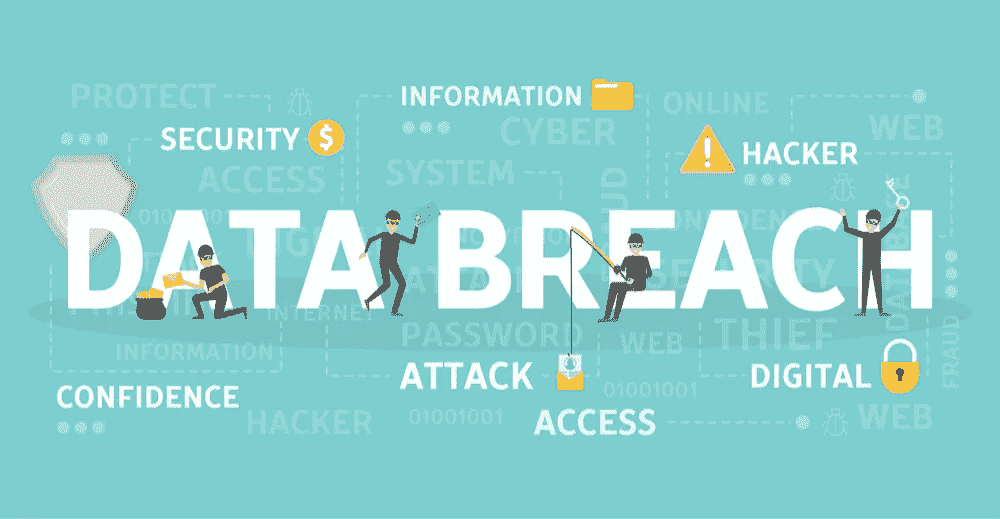

# 2018 年最容易发生数据泄露的 5 个行业

> 原文：<https://medium.com/hackernoon/5-most-vulnerable-industries-for-data-breaches-in-2018-87069dd6e35e>

【2018 年 2 月， [*安德玛黑客*](https://www.wired.com/story/under-armour-myfitnesspal-hack-password-hashing/) *成为历史上最大的数据泄露事件之一，影响超过 1.5 亿用户。在当时，受害者的数量之多使其成为创纪录的数据盗窃事件，但这个事件真正令人不安的是什么？*

那次泄露的结果是，隐私数据的类型遭到破坏:包括用户健康、表现和位置在内的隐私健身记录。看来“信息要免费”这句名言被黑客们拿得太过字面了。

很难想象黑了一家个人健身公司还能进名人堂。但是，即使用户的心率容易受到数据泄露的影响，客户向各种组织提供的更重要的个人信息又如何呢？

如今，没有一个行业能够幸免于数据泄露。让我们看看你的公司是否属于最脆弱的行业之一。

# 网

网站是骗子和黑客的目标，尤其是游戏和赌场网站。犯罪分子想黑掉这类网站，窃取个人信息、金钱和重要交易。这就是为什么许多网站投资于高级别的安全性，并雇用专业的 IT 安全专家来监控网站的安全性。

网络安全成为每个网站保护客户和用户的主要重要部分，尤其是赌场和游戏利基。有赌博网站[看多了使用真钱](https://casinobonusca.com/slots-sites/)是威胁较高的网站之一，也是黑客攻击最多的目标。

# 卫生保健

医疗保健行业比其他任何行业都更容易成为攻击目标，每天至少发生一起事故。电子健康记录包含有价值的信息，因为患者的档案通常包括信用卡号、医疗保险号、生物特征数据和其他个人信息。所有这些敏感数据都可能被滥用来获取医疗保险、医疗补助或处方药等健康福利。医疗保健是唯一一个内部比外部更脆弱的行业。超过一半的事件涉及内部人员，其动机要么是经济利益，要么是便利(将敏感文件存储在未经批准的媒体上)，要么是好奇(窥探家庭成员或名人)。

医院约占所有医疗保健数据泄露的 30 %,他们的计算机仍然是容易攻击的目标，因为它们包含大量信息，包括病历、护理报告和转诊信。

【2018 年 24%的数据泄露发生在医疗机构，几乎[八分之一的美国人的病历被泄露。错误配置、处置错误、遗漏、编程错误和数据输入错误是医疗保健行业数据泄露的主要原因。](https://www.modernhealthcare.com/article/20140908/BLOG/309089995)

# 住处

住宿也一直被认为是最容易遭受数据泄露的地方之一，占 2018 年发生的所有泄露事件的 15%。酒店行业的这一部门在客户在线预订、登记入住或收到通知时不断收集他们的客户信息。再加上公共 Wi-Fi 网络和智能手机钥匙卡，这些互联场所很容易遭受严重的数据泄露。

除了只能使用到过期的信用卡号之外，酒店还会收集其他可能被老练的入侵者窃取的个人客户信息。这些个人数据可能被滥用来冒充个人或闯入他们的银行账户。

大多数住宿违规都是由第三方供应商造成的。第三方为酒店提供各种服务，但酒店特别依赖于检查他们的网络安全政策。虽然分包商更有能力提供专业化服务，但在大多数情况下，他们可以无限制地获取酒店收集的信息:信用卡号、预订、工资单、人力资源等等。不幸的是，住宿行业的许多酒店还没有完全认识到监控第三方的必要性。

拥有数千家酒店的中国最大连锁酒店朱华酒店最近遭遇了一次数据泄露，这可能是酒店行业迄今为止最大的一次，影响了 1.3 亿顾客。该漏洞据信来自一名内部人士，他在 GitHub 上发布了一个内部数据库。

# 公共

虽然广为人知的知名企业违规事件经常成为新闻焦点，但公共部门也存在网络安全漏洞。事实上，与其他国家相比，美国政府经历的攻击次数最多。但是资金的缺乏和预算的削减阻止了政府有效地保护自己免受黑客攻击。不仅有如此多的机构面临攻击，而且很少有机构能够洞察其系统，从而有效地检测数据泄露企图。因此，超过三分之一的[事件](https://www.wired.com/story/federal-government-cybersecurity-bleak/)仍然没有回应，这意味着相关机构可能永远无法确定攻击是如何实施的。

网络间谍仍然是公共部门面临的最大问题，与国家相关的攻击者占所有事件的一半以上。三分之一的违规事件是由权限滥用和内部错误造成的。网络钓鱼攻击、后门或 C2 通道是间谍相关攻击中最常用的方式。

个人信息和国家机密是公共部门对网络罪犯如此有吸引力的两类数据。

# 零售

盗窃一直是零售商的一个问题，但现在数字窃贼的目标是窃取零售商最有价值的财产——他们客户的信用卡数据。它可以匿名泄露，因为现在所有的金融交易都快捷方便，现金可以很快地从银行账户中取出。

几个因素推动了数据泄露的激增。零售部门通常以纯文本形式将客户数据保存在云中。从软件到基础设施服务，越来越依赖外部第三方承包商，这也导致了违规事件的增加。

其业务活动需要其在线存在的公司继续成为 DoS 攻击的目标，而支付卡盗用者仍然是实体店的一个问题。Web 应用程序攻击仍然是一个问题，一些众所周知的输入验证漏洞是主要原因。

# 金融

去年 Equifax 的[事件](https://www.ftc.gov/equifax-data-breach)影响了超过 1 亿人，这表明金融行业仍然是黑客的主要目标。金融服务公司受到冲击主要是因为那里有钱。虽然他们在防御普通攻击方面做得越来越好，但结果是他们面临更复杂的威胁。

大多数事件涉及难以检测的 web 应用程序攻击，因为每天都有数百万合法用户访问它们。此外，在噪音中识别恶意活动很难，特别是如果攻击是随着时间的推移通过多个代理服务器进行的。

随着越来越多的金融机构转向第三方来处理内部流程、迁移到云以及使用更多渠道与客户进行交互，金融行业中的潜在攻击面显著增加。

ATM 劫持是物理访问篡改的主要形式，web 应用程序身份验证工具、恶意软件和权限滥用位列前五大攻击模式。

# 结论

每天，暴露公司数据的威胁都在飞速发展。无论哪个行业，2018 年发生的大部分数据泄露都可以通过某种方式追溯到内部人士。尽管对抗威胁的尝试主要是被动的，但很少有方法可以减轻与内部人员相关的安全风险。

持续的用户活动监控和访问管理是保护您的组织并最大限度地减少数据泄露的潜在影响的一些最有效的方法。