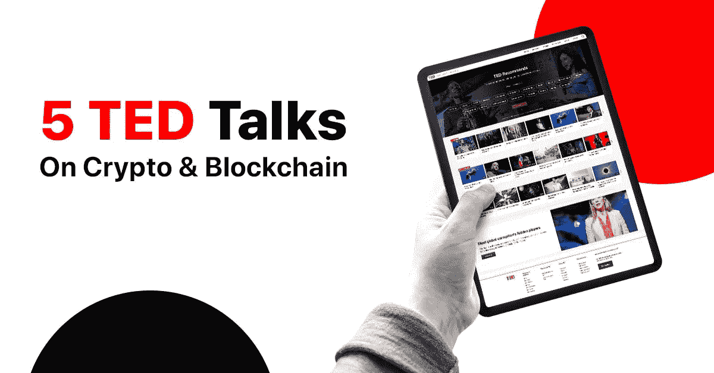

# 关于加密货币和区块链的 5 个必看 TED 演讲

> 原文：<https://medium.com/hackernoon/5-must-watch-ted-talks-on-bitcoin-blockchain-77f6d418c392>

没有什么比一场精彩的 TED 演讲更能提升你的自尊，获得关于某个特定话题的新想法，当然，还能学到新东西。我们都爱他们有很多原因。从他们迷人的主题到他们极具激励性的演讲者，他们无所不包。

实话实说吧。加密货币及其底层技术——区块链——并不完全是你所说的“轻松话题”。希望 TED 的酷人们已经主持了几十场关于这些主题的演讲。但是在你继续在 Youtube 上滚动几个小时之前，你可能想看看我们为你精心挑选的那些。

是的。没错。我们为你策划了五个必看的关于区块链、比特币和加密货币的 ted 演讲。戴上耳机，投入这场智慧之旅吧！

# #1 |区块链如何改变货币和商业

如果你是在加密货币和区块链的世界里从零开始，不要再观望了。本次演讲完美地介绍了分布式账本技术，概述了其革新金融和商业的机制和机会。

演讲者？区块链研究院执行主席唐·塔斯考特，著有 16 本关于创新以及新技术对商业和社会的影响的书籍。他是哈佛大学伯克曼·克莱恩互联网与社会中心的成员，也是世界经济论坛的高级顾问。

在不到 20 分钟的时间里，Tapscott 为你提供了简单易懂的基本问题的答案，比如“什么是区块链？”，“区块链是如何工作的？”以及“比特币是什么？”。随后，他解释了区块链如何帮助简化混乱的金融服务行业，并将低效、复杂的业务流程转变为透明的流程，从而可能为公司节省数百万美元的运营成本。

我们的选择:Tapscott 指出，区块链技术有能力通过不可变的记录保护权利，创造“真正的”共享经济，结束汇款敲诈，让公民控制他们的数据，并保证内容创作者的公平补偿，从而使世界更加繁荣。

# #2 |区块链的未来

好吧。标题并不真正令人印象深刻。我们同意这一点。但是请相信我们，这个 8 分钟的演讲将会从一个完全不同的角度启发你如何实施区块链协议。《可共享的生活》一书的作者 Chelsea Rustrum 探讨了共享经济的局限性，并展示了如何利用区块链技术在这一领域产生积极的变化。

Airbnb 是如何在短短 5 年内变得像希尔顿一样强大的？优步司机的工作报酬公平吗？他们车辆的所有权呢？在 Rustrum 看来，目前没有一家“共享经济”公司真正在共享任何东西。相反，这些公司在他人所有权的基础上创造价值，却不提供相应的回报。

按照这种思路，她介绍了区块链技术作为分配价值和共享所有权的独特而有效的解决方案。

# #3 |区块链将如何彻底改变经济

别急，自作聪明的家伙！上面的 TED 演讲只是让你热身。这是给那些愿意深入探究区块链如何帮助改善经济的人的。

贝蒂娜·沃伯格(Bettina Warburg)是区块链大学的研究员、企业家和教育家，她解释了为什么这种分布式账本技术将银行或政府等中央机构排除在商业运营之外。

Warburg 认为，区块链通过启用身份管理、资产跟踪和取消交易，在减少不确定性方面发挥着至关重要的作用。

# #4 |像比特币这样的数字货币即将到来

根据世界银行最近的数据，全球汇款价值约为 6890 亿美元。在每笔交易中，像西联汇款和速汇金这样的中介机构会向汇款人收取高达 20%的费用，并需要几天时间来处理交易。这是一项非常有利可图的业务，但却是一种极其低效的为人们汇款的方式。多年来，这些汇款服务是数十亿人支持其祖国家庭的唯一选择。不再是了。

Juan Llanos 是各种加密货币项目的导师和顾问，他探讨了数字货币在扰乱国际货币转移方面带来的好处。从增强的安全性到即时处理，再到零费用，Llanos 检查了每一个属性。有了移动应用，比如 [Crypterium](http://crypterium.com) ，你现在可以在几秒钟内发送和接收资金，而无需支付任何费用。可以用[借记卡](https://preorder.crypterium.com/)消费的数字货币，可以转账到银行账户，也可以用来支付账单、税款或任何你想要的东西。

这位土生土长的区块链技术倡导者亲身经历了金融体系的缺陷。恶性通货膨胀，比索崩溃，当地银行扣留人们的储蓄…案例和故事在世界上许多国家重演。Llanos 利用这些经验，将传统货币与数字货币进行比较，为加密货币提供了一个新的视角，它们可以帮助避免未来的危机。

# #5 |加密货币如何帮助初创企业获得投资资本

你听说过 ICO 这个词吗？如果这不是你第一次尝试了解加密货币和区块链，那么你很可能已经了解了。首次发行硬币已经成为科技项目获得资本的一种替代方式。但是为什么呢？

科技企业家 Ashwini Anburajan 将带您了解风险投资的世界，以及数字货币如何改变初创公司的融资方式，这一大胆举措背后的原因，以及对投资民主化的影响。

## 关于[地穴](https://medium.com/u/3c3059b00067?source=post_page-----77f6d418c392--------------------------------)

根据毕马威和 H2Ventures 的说法，Crypterium 是最有前途的金融科技公司之一。我们正在打造一款移动应用，以满足数字资产时代的银行需求。