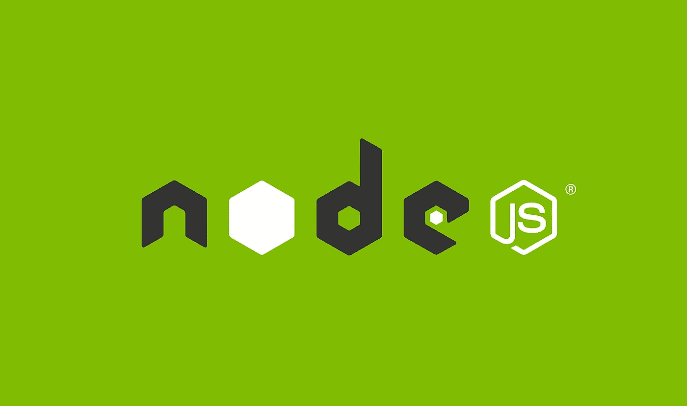

# Node.js 是构建电子商务市场的最佳平台的 5 个原因

> 原文：<https://medium.com/hackernoon/5-reason-why-node-js-is-the-best-platform-to-build-an-ecommerce-marketplace-f4bf0b165746>



曾经有一段时间，过程语言是与计算机交流的唯一方式。像 C 这样的过程语言非常有效地完成了它们的工作，并且仍然在一系列开发中使用。

后来，OOPS 出现了，一切都变成了模块化。使用 C++或 Java 创建一个对象，并在整个项目中随时随地使用它。然而，这不是它。其他几项进步的出现催生了现代编程语言和脚本，如 Servlets、PHP、C#、ASP，以及最后但同样重要的 JavaScript。

JavaScript 最初是作为 UI 开发的脚本语言开发的，现在是许多人最喜欢的编程语言。全球超过 69.8%的电子商务开发者使用 JavaScript 进行开发。

JavaScript 有能力成为前端脚本语言，也是服务器端编程的高效语言。这就是 Node.js 发挥作用的地方。该脚本的能力不仅使其成为服务器端编程的完美语言，而且 node . js for eCommerce development**已经成为开发大规模电子商务网站(如亚马逊和易贝)的标准。**

**本文将解释提倡 Node.js 的另外 5 个原因，并解释为什么 Node.js 购物车比任何规模的任何其他解决方案都更可靠。**

# **Node.js 在形式上到底是什么？**

**最初，Node.js 是作为编写前端代码的脚本开发的。然而今天，它已经有了更广泛的应用:**

*   **它被称为开源服务器环境，也称为开源 JavaScript 运行时环境。**
*   **谷歌构建了 Chrome V8 JavaScript 引擎，并使其能够在几乎所有平台上运行:Windows、Linux、UNIX 和 Mac OS X。**
*   **它同时用于服务器端和前端脚本的原因是，它基于事件驱动的非阻塞 I/O 模型，能够在服务器端和客户端应用程序上编写。**
*   **此外，它还可以从表单中收集数据，并在不改变语法的情况下执行数据库操作。**

**当用于电子商务的 Node.js 流行起来的时候，许多其他编程语言也开始出名；PHP、Python、Java 等等。谈到电子商务开发，PHP 仍然是最大的竞争对手之一。**

**通过像 WordPress、Magento、PrestaShop、Shopify 和 OpenCart 这样的成功项目，PHP 证明了它是一种通用的技术。然而，Node.js 让 Node.js 购物车变得更加简单、灵活、快速和可伸缩。**

# **1.Node.js 是现代化的，具有最新的代码库**

**如果我们考虑其他电子商务技术，Node.js 仍然是一个新生婴儿。这意味着代码库是现代的，并且符合开发人员面临的当代挑战，考虑到 Node.js 提供的优势，这确实是事实。**

**例如，PHP 的 LAMP 堆栈(Linux、Apache、MySQL 和 PHP)比 MEAN 或 MERN 堆栈更复杂。包含 MongoDB、Express、Angular 2 的 MEAN stack，以及包含 MongoDB、Express.js、React 和 Node.js 的 Node 和 MERN stack，使用更新的工具、最新的安全方法和庞大的基础库。我们也将在随后的要点中理解这一点。**

# **2.Node.js 使用更快的 NoSQL，而不是关系数据库**

**Node.js 支持 SQL 和 NoSQL 数据库，比如 MongoDB 和 Couch DB。它使用基于图形的数据库系统(如 Neo4j)来执行查询。除此之外，它还与 JSON (JavaScript Object Notation)兼容，这使得它甚至可以在没有 SQL 的情况下工作。**

**您不必在不同的数据库语法之间切换来执行前端和后端查询。您可以在服务器端和数据库上使用与客户端脚本相同的 Node.js 语法。这也使得 NoSQL 数据库成为非关系数据库，当然，它比其他关系数据库更快。**

# **3.Node.js 通过异步编译让系统快如闪电**

**今天大多数其他编程语言都使用关系数据库，而 Node.js 也可以使用 NoSQL，这也是 Node.js 如此快速的原因之一。**

**然而，还有一个原因使得 Node.js 甚至快了十倍。与任何其他编程语言不同，Node.js 允许异步代码编译。这意味着 JavaScript 引擎一次编译你的整个程序，而不是等待主要的代码行按照定义的顺序执行。**

**因此，它成为一种非阻塞的输入/输出异步编程语言，它将为单独的行生成输出，而不管它上面的行是否被执行。下面是一个如何在 Node.js 中实现非阻塞 I/O 架构的例子。**

**你需要使用 *promise* 代理值来调用异步流程: *resolve* 或者 *reject* 。完成后，通过 *promise* 值调用'*然后'*函数，将两个异步函数作为两个不同的参数。**

**现在，如果它满足条件，第一个函数将被调用。否则，第二个功能 *reject* 将在条件不满足时执行:**

```
var myPromise = new Promise(function(resolve, reject) {
  request.get(options, function(err, resp, body) {
    if (err) {
     reject(err);
    } else {
     resolve(JSON.parse(body));
    }
  })
})
```

# **4.Node.js 中的函数继承快速且适应性强**

**PHP 利用原型继承，这是快速和适应性强的。在任何情况下，Node.js 都为您提供了一个机会，为一个不太复杂的无陷阱框架使用函数继承。例如，PHP 的原型继承无疑更快，但在实际执行中不能有效地实现。**

**您需要考虑超级构造函数和继承函数来实现它。这样做会使程序越来越容易出错，因为如果不使用包装函数，就不能将方法作为回调参数传递。**

**在大多数情况下，函数继承比 PHP 的原型继承更容易在 Node.js 中实现。在 Node.js 中，将方法绑定到它们的实例更容易。node js 的函数继承提供了更好的性能基准，并帮助您避免方法的冗余调用。**

# **5.NPM 的在线知识库使其资源丰富而轻便**

**NPS 是 Node.js 项目的福音。它让您可以即时访问 node.js 开源项目的巨大在线存储库。此外，您可以使用命令行界面，并直接从存储库中获取所需的资源，以执行诸如包安装、更新管理、版本控制和依赖性控制等任务。**

**有了 NPM，任何 Node.js 项目都变得轻量级，因为您总是可以重用存储库中的代码，而不是添加新的代码。最棒的是，您还可以从存储库中下载您已经在使用的特定代码的源代码更新。**

## **最后的想法**

**我是 PHP 开发技术的粉丝。我仍然喜欢它，并且更喜欢它用于小规模的项目。然而，在用大量 JavaScript 构建沉重的购物车时，Node.js 是可伸缩的。MEAN stack 和 LAMP stack 都使用 JavaScript，但是 MEAN 是极其轻量级的，使用 JavaScript 不会降低 UI 的速度。然而，LAMP 对 JavaScript 的反应相当不可靠。**

**根据我对市场上 Node.js 购物车的熟悉程度，这个框架最适合构建任何规模的网站。它所提供的灵活性非常适合构建电子商务平台。**