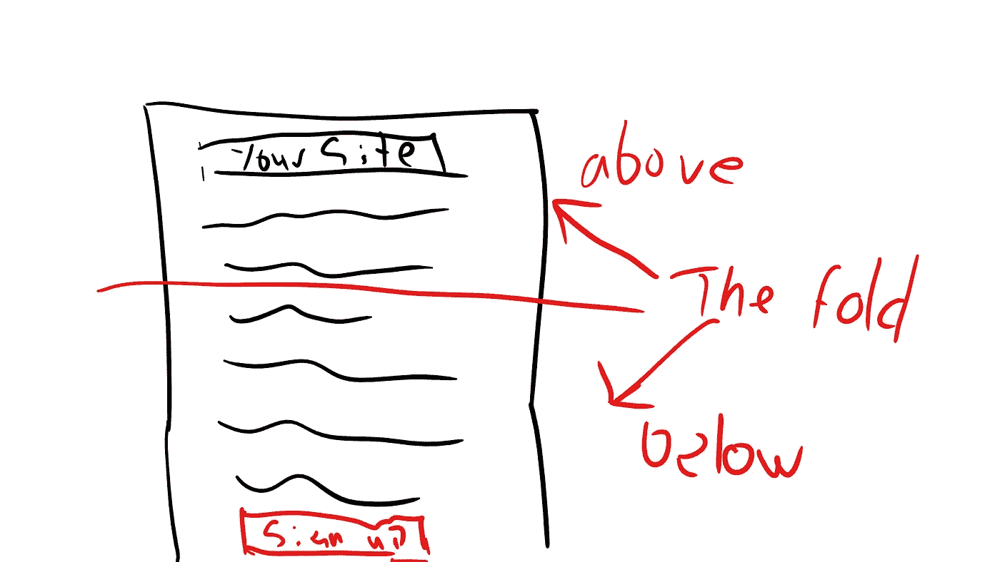
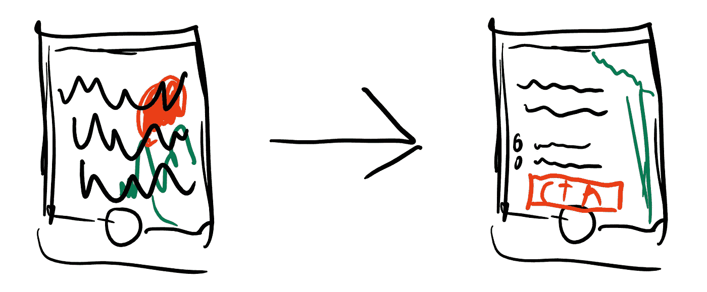
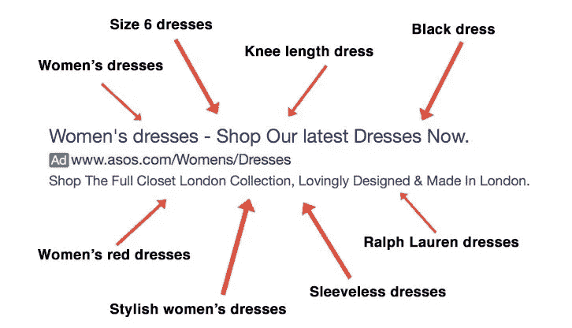
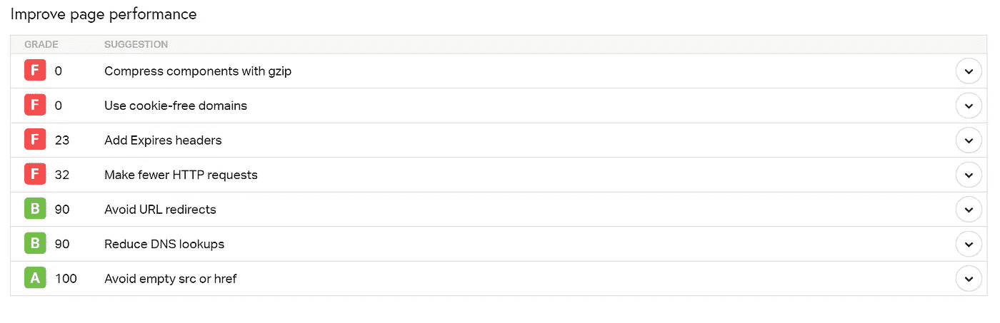
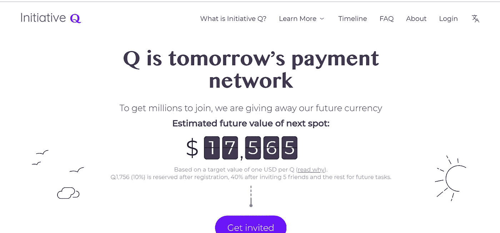
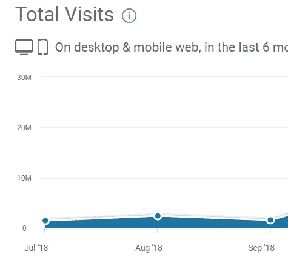
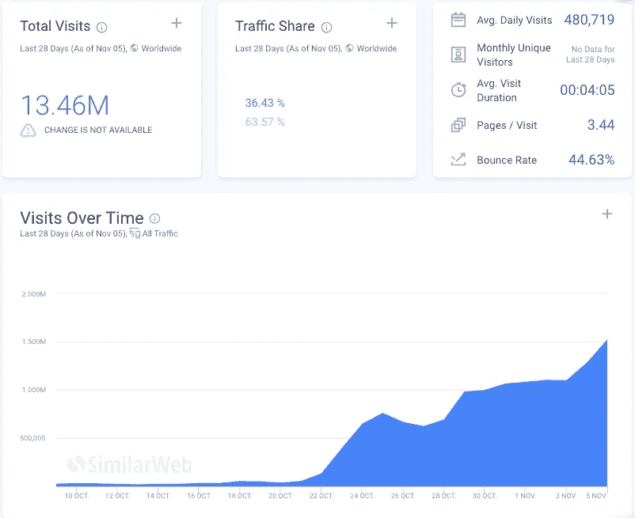

# 5 个简单的改变可以大大提高你的转换率

> 原文：<https://medium.com/hackernoon/5-simple-changes-that-can-drastically-improve-your-conversion-rate-ad495cbf0a9c>

Photo by [Hal Gatewood](https://unsplash.com/@halgatewood?utm_source=medium&utm_medium=referral) on [Unsplash](https://unsplash.com?utm_source=medium&utm_medium=referral)

> “测试一切！!"

是 21 世纪每个营销人员的口头禅。

但是对于一个小企业或 solopreneur 来说，数量/数据通常不足以持续运行广泛的测试……更不用说首先设置一个复杂的多变量测试系统所需的时间、技能和资源了。

与其浪费大量时间学习新技术，或者弄清楚如何构建和分析大数据集(你可能没有)，这里有 5 个简单的事情，在过去已经为其他人带来了积极的结果，你可以在你的网站上实施以获得结果。

# 1.将 CTA 移动到折叠上方

“折叠”基本上是指“第一视角”结束的地方，网站的其余部分开始。

你知道当你打开一个网站，你看到的第一件事是什么吗？滚动前你能看到的一切都在“折叠之上”。

其他的都在折叠之下。

将你的号召付诸行动是你能做的最简单的事情之一..但它也可能是最强大的。

“增长黑客”之父肖恩·埃利斯在他的网站“增长黑客”中实现了这一点，通过这一简单的改变,[的电子邮件注册人数增加了 700%。](https://www.youtube.com/watch?v=i0nxESR9sFs)

# 2.优化您的手机布局

Forego the clutter that automatic responsive design leaves for most mobile pages, and change your key pages to look great on mobile.

现在是 2019 年，距离手机取代桌面浏览网页已经有两年多了，但仍有数量惊人的网站没有针对手机进行优化。

[超过 70%的媒体时间花在移动设备上，](https://marketingland.com/mobile-now-accounts-nearly-70-digital-media-time-comscore-210094)这意味着你的移动设计应该比你的登陆页面在桌面上的外观更重要。

确保你的价值主张清晰可辨，你的背景图片看起来也不错&不影响内容的可读性。

Hubspot 通过对其移动布局进行一些关键的改变，将他们的移动转化率[提高了 10.7%。](https://blog.hubspot.com/marketing/increasing-mobile-conversion-rate)

# 3.实现单一关键字广告组和相关的登陆页面

单一关键词广告组(或简称 SKAG)在 SEM 中并不是一个新的原则，但它经常被内部营销团队和老牌机构所忽视。

如果你正在使用谷歌、必应或其他搜索引擎广告，你需要停止偷懒&努力向用户展示相关内容。

如果你在一个广告和一个登陆页面上定位多个不同的关键词，那么你为你的理想客户提供了一个糟糕的用户体验。

This example from [ConversionXL](https://conversionxl.com/blog/single-keyword-ad-groups/) shows exactly what’s wrong with running a single ad to multiple broad keywords.

想想人们转向搜索引擎时的心态..

他们想要特定问题的特定解决方案，而不是可能包含他们想要的内容的一般类别答案。

实施 SKAGs 使客户活动的 CPCs 减少了 20%,并大幅降低了每次销售和销售的成本。

我不是唯一一个报告这种结果的人。

[PPC 机构 clicteq 引用了仅实施 SKAG 就增加了 14%的 CTR 和减少了 22%的 CPA。](http://clicteq.com/single-keyword-ad-groups/)

Hanapin Marketing 的 Sam Owen 能够[通过实施 SKAGs 将 CPA 降低 50%,并将每月销售线索增加 106%。](https://www.slideshare.net/SamOwen3/using-single-keyword-ad-groups-to-drive-ppc-performance)

# 4.提高网站速度

"[如果你的网站在 3 秒内没有加载，53%的移动用户会离开你的网站。](https://www.thinkwithgoogle.com/data-gallery/detail/mobile-site-abandonment-three-second-load/)”

更糟糕的是，在一次糟糕的体验之后，85%的用户不太可能给你的网站第二次机会。

想一想。

> 你只有 3 秒钟的时间把你的网站完全展现在潜在客户面前，否则你会失去一半的潜在客户..永远。

所以尽一切努力提高网站速度。

你做得越快，你失去的潜在客户就越少，并且在这样做的同时给人留下持久的坏印象。

1.  使用类似 [Pingdom](https://tools.pingdom.com/) 、[网页测试](https://www.webpagetest.org/)或 [gtmetrix](https://gtmetrix.com/) 的工具测试你的网站速度。
2.  看看你的结果，谷歌如何解决出现的个别问题。

如果您以前从未尝试过这种方法，您通常会得到几个以上的 Fs，这是要进行的高 ROI 修复，并且通常相当简单。

更多提示:

*   为脚本和图像等较大的文件实施 CDN，以便用户从较近的服务器获取内容。(比如 AWS 的 CloudFront 或者 MaxCDN)。
*   通过[挤压](http://www.imgopt.com/)图像文件、调整大小或其他优化方式来减小图像文件的大小。
*   升级你的主机以获得更快的加载速度。(如果在测试页面速度的过程中，您的结果显示“等待”时间很长，这通常表明您的服务器很慢。)

# 5.确保你在你的登陆页面上实现了合理的文案原则

主动性 Q 的故事是关于文案力量的最伟大的现代课程。

Initiative Q 将自己标榜为“明天的支付网络”，并自推出他们的邀请测试版以来，成功地推动了数百万人的有机注册。

但对营销人员来说，这不是真正的故事。

事实是，它并没有在开放测试后立即起飞…曲线看起来不像是一个钟或海啸，更像是他们开门后的一条平坦的线。

这看起来不像最新的互联网幻想金钱热潮的曲线吧？

然后他们实施了一个关键的改变。

他们没有做任何技术上的事情，比如添加一个病毒循环(它已经在运行了)，他们只是优化了一个关键的拷贝；**邀请消息。**

旧的信息试图用有点干巴巴的技术术语来解释这个想法“建立未来的货币”..blablabla”。

他们的新信息利用了许多重要的文案原则，从**熟悉度&信任度**、**稀缺性、免费的力量，最后是 FOMO。**

> *“Initiative Q 是前 PayPal 员工尝试创建一种新的支付系统，以取代 20 世纪 50 年代设计的信用卡。这个系统使用自己的货币 Q，为了让人们开始使用这个系统，一旦它准备好了，他们就向现在注册的人免费分配 Q(随着更多的人加入，数量会下降，所以最好早点加入)。注册是免费的，他们只需要你的名字和电子邮件地址。没有什么可失去的，但如果这个支付系统成为世界领先的支付方式，你的 Qs 可以值很多钱。如果你错过了 7 年前获得比特币，你不会想错过这个。这是我的邀请链接:*[*https://initiativeq.com/invite/XXXXXXXXX*](https://initiativeq.com/invite/XXXXXXXXX) *一旦我退出邀请，这个链接就会停止工作。请在您注册后通知我，因为我需要在我这边验证您。”*

看看他们如何开始利用“前贝宝”作为杠杆，通过利用该领域的知名品牌来购买一些快速信任..并以 FOMO 的杠杆作用达到高潮(这是从郁金香到比特币的每一次热潮的背后)。

[OMR 报道了这个故事&他对旧版本和新版本进行了彻底的剖析，并解释了为什么它的效果如此之好。](/@omrockstars/the-future-the-blueprint-or-a-scam-what-is-initiative-q-11374235c7e2)

[Also courtesy of OMR’s Story.](/@omrockstars/the-future-the-blueprint-or-a-scam-what-is-initiative-q-11374235c7e2)

如你所见，新的拷贝成功了。

他们经历了数以千计的网络流量增长，*如果不是数百万的话*，并且延伸开来，转化率也是如此。

不要只关注技术。

确保你的文案，你的故事，能很好地说服你的访问者，你能提供一些东西，有一个令人信服的理由选择你。

要写出更好的文案，请记住几个要点:

*   **客户不关心你或你的公司**，而是关心**你如何帮助他们**和**他们是否相信你有能力这样做**。
*   客户有选择权，**与您而不是其他人做生意的具体好处是什么**？
*   给他们一个现在就采取行动的理由，而不是以后。(倡议 Q 很好地做到了这一点，它在理论上激励快速行动者比后来者多得多。)

要获得更多关于如何通过撰写伟大的文案让访问者行动起来来应对人类惰性的建议，请阅读以下书籍:

*   维克多·施瓦布[如何写好广告](https://www.amazon.com/How-Write-Good-Advertisement-Copywriting/dp/162654963X/)
*   唐纳德·米勒[建立一个故事品牌](https://www.amazon.com/Building-StoryBrand-Clarify-Message-Customers-ebook/dp/B06XFJ2JGR)

# 更多的学习，更多的变化和更多的机会

一个表现更好的网站的关键和你生活中每个领域表现更好的关键是一样的。

学习、深思熟虑的改变和冒险与奉献相结合..随着时间的推移逐渐消失。

你是否每天每周都致力于为你的网站和业务带来更好的结果？

你想要的不仅仅是方向和灵感，还有能立刻给你带来实际效果的可行策略吗？注册订阅我的时事通讯。