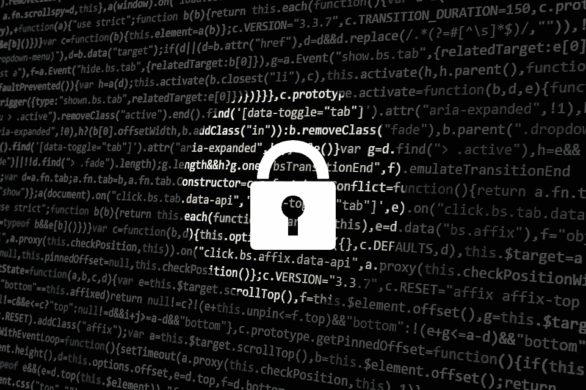

# 为您的组织选择最佳 IAM 解决方案的 5 个步骤

> 原文：<https://medium.com/hackernoon/5-steps-to-choose-the-best-iam-solution-for-your-organisation-be29244a888e>

身份和访问管理(IAM)是确保企业网络安全的关键工具之一。市场上有许多安全提供商，但是我如何找到适合您的身份和访问管理解决方案呢？

选择 IAM 解决方案时，您必须了解当前的网络安全趋势。

强烈建议查看 loginradius 的 [ciam 101，密切关注全球 iam 趋势，了解哪些风险和可能的威胁需要首先解决。](https://www.loginradius.com/resource/ciam-101/)

现代身份解决方案，它是任何高质量 IAM 解决方案的基本元素。

企业需要一个第三方供应商管理平台，该平台能够全面了解其网络中的分包商运营情况，并为不同的供应商群体提供细粒度的访问管理。

零信任安全——该方法将在 2019 年获得更大的普及。世界各地的组织使用业务关键型云服务将物联网设备集成到他们的网络中，并实施您自己的设备(BYOD)政策。

所有这些因素都增加了确保高质量身份管理和访问关键资产的需求。

物联网安全-互联“物品”预计到 2020 年将达到 200 亿以上。物联网设备的日益普及满足了开发新的[物联网安全策略](https://hackernoon.com/a-look-at-the-security-risks-of-iot-devices-f0d6ffe1441d)和新技术的需求。

那么，您如何选择适合您组织需求的身份和访问管理解决方案呢？

在下一节中，我将给出您正在寻找的主要 IAM 特性的简短列表。

# 我如何选择最佳的 IAM 解决方案？

了解新兴的 IAM 趋势对于理解不久的将来的网络安全风险以及哪个系统可以帮助您减轻这些风险至关重要。

了解主要功能，为您的企业选择最佳的身份和访问管理解决方案。以下是您在选择 IAM 软件时应该寻找的 5 个最有用的功能列表:

**1。多因素身份认证** —根据 2018 年数据泄露调查报告(DBIR)，在过去几年中，泄露的密码是超过 80%的数据泄露的最初原因。

MFA 可以帮助您填补用户身份的空白，从而降低数据泄露的风险。一次性密码-一次性密码增加了另一层身份验证，对于保护高价值数据和资产尤其有用。

**2。第三方供应商管理**—IAM 解决方案有助于确保您为第三方分包商获得正确的访问粒度级别。但是确保你的分包商不滥用授予的特权也很重要。

**3。主动事件响应** —能够快速响应网络安全事件至关重要。

因此，您需要一个 IAM 解决方案来通知您用户授权问题，并通过暂时阻止可疑帐户来主动响应此类事件。

**4。易于使用和用户友好的** —毫无疑问，最好的身份和访问管理软件是一个问题，你可以舒适地工作，而不必不断询问每个工具或功能。

毕竟，只有当你知道如何使用时，丰富的功能才是一大优势。

**5。兼容性-** 最后但同样重要的是，确保您选择的 IAM 解决方案与您组织使用的网络架构、操作系统和 SIEM 系统兼容。

有许多有趣的产品以可承受的价格提供强大的功能，但有一个严重的缺点:缺乏对不同平台的支持。

# 结论

身份和访问管理是任何现代组织的基本条件。了解谁可以访问您的敏感数据以及他们如何以及何时访问这些数据，对于防止内部威胁和提高您的[组织抵御网络攻击的安全性](https://en.wikipedia.org/wiki/List_of_cyberattacks)至关重要。