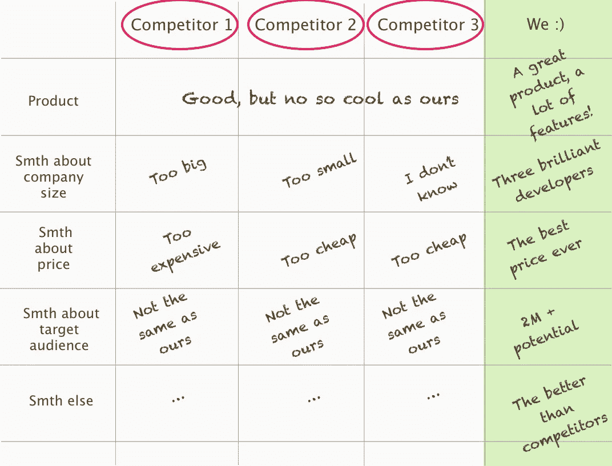
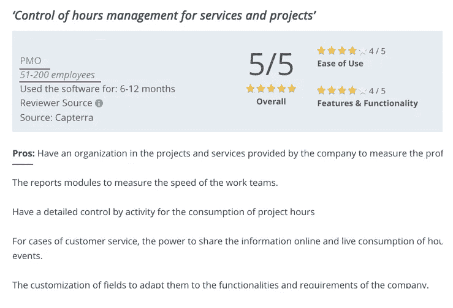
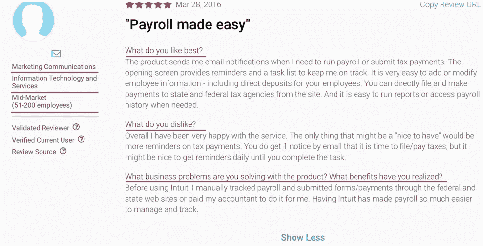

# 早期创业公司应该知道的关于竞争对手研究的 5 件事

> 原文：<https://medium.com/hackernoon/5-things-early-startups-should-know-about-competitor-research-df3b4a6e5f8>

A typical startup founder

最近，我尝试经营自己的创业公司——一个旨在改善开发过程的产品。除了广泛的学习，它让我理解了所有来自“硅谷”的笑话，并思考了很多关于零产品阶段的竞争对手研究。通常，我们寻求将我们的想法与现有的产品进行比较，但是如何将有东西与无东西进行比较呢？

**在这篇文章中，我将分享一些关于竞争对手研究的想法，以帮助早期创业公司获得准确、可操作的信息，并避免一些常见的错误。**

构建第一个产品是如此令人兴奋！这就是竞争对手分析(如果正在进行的话)通常看起来像这样的原因:

当然只是夸张而已。但是我曾经见过一个这样的电子表格！当研究人员的目标不是正确评估竞争格局，而是证明他们的产品更好时，就会出现这种情况。

竞争对手研究是发现你的对手和揭示机会的有力工具。让我们深思熟虑地做它。

> 成功的唯一方法是找到竞争对手忽略的机会。

# 1.评估你自己

要发现你的产品的竞争格局，你肯定需要很好地理解你在做什么。这听起来很奇怪，因为每个人都有，对不对？不完全是。

*最近，我与一位正在创建“新 Yelp”的企业家进行了交谈。我问他为什么人们不去原来的那个？为什么人们更喜欢新事物而不是熟悉的 Yelp 或 Tripadvisor？他的策略是什么，对客户有哪些好处是其他人没有的？他只是耸耸肩，说旧的 Yelp 已经过时了，新的 Yelp 出现只是时间问题。因此，他计划为未来的 Yelp 危机打造一款好产品。*

所以，是的，一开始我们需要问自己最重要的问题。

1.  我试图解决的问题是什么？(我的潜在客户在纠结什么？)
2.  **我要怎么解决？**(产品理念是什么？)
3.  **谁有这个问题？**(我的客户到底是谁？)
4.  **我如何确定问题有效？**我是否与有这种问题的人交谈过？(*剧透:如果有成功的竞争者，那很可能是一个有效的问题。*)

你最终应该得到的结果的例子:

*我很确定 _____ 和 _____ 与 ______ 有问题，导致 ______ 毁灭。可以通过 _____ 和 ______ 解决。我的产品理念是 _____，可以帮助解决这个问题。*

这种形式应该非常粗略地使用，因为在进行研究后，你可能需要调整，甚至完全改变整个向量。然而，你会得到一个研究的起点。

Competition is a long run

# 2.解决方案与解决问题

好像很像，对吧？不完全是。

在为我的初创公司做竞争对手研究时，我从那些与我们有着相似的改进工程过程原则的产品开始:观察存储库以发现“坏的”拉式请求。他们人数很少，但完全不在我们的联盟之内:GitPrime 和 T2 code climate。看起来非常乐观:我们仍然有一个利基市场。但是后来我把焦点转移到了问题上:缺乏开发可见性。发现至少有 5-7 种产品可以解决同样的问题。所以寻找一个确切的产品就是自欺欺人。

> 事实是，消费者不会选择相似产品中哪个更便宜或者他们更喜欢哪个。他们寻找一个更有利的解决方案。

# 3.请三思价格

许多新公司希望为同样的产品提供更低的价格，从而具有竞争力。在这种情况下，竞争对手的研究得出的结论是“嗯…我们可以提供同样的产品，但更便宜”。就此打住，想一想为什么他们的价格这么高:

1.  **他们是垄断者吗？**因为如果没有其他竞争对手，是的，他们可以决定价格，你就有机会。但是你知道多少垄断者呢？
2.  他们有固定的品牌吗？如果是的话，他们可能花了很多钱和时间来创建它。你准备好花同样多的钱了吗？还是知道没钱怎么出名？
3.  **一个产品有多大？因为你的竞争对手可能会支付开发人员、产品经理、设计师、支持人员等费用。此外，产品的价格包括基础设施、服务和维护。**

然后回答你自己:我准备好同样提供低价了吗？

# 4.未知的竞争对手

另一件要记住的事情:寻找竞争对手不要忘记，最大的一部分信息可能是隐藏的。图片，您正在为两个知名产品进行集成。然后突然他们发布了这个功能，让这个产品没用了。没人知道这件事。

这可能是研究中最复杂的部分之一。几乎所有获取潜在竞争对手计划的方法都是非法或不恰当的。但是，你可以试着认清公司方向。

1.  如果一家公司很大，那么检查收购。也许他们买了技术或者收购了有能力开发这项技术的团队。
2.  如果一家公司很小，那就调查创始人和关键经理的背景。离 100%还差得远，但可以提供线索。
3.  参加有竞争对手参与的会议和聚会。有时它们能揭示一些东西。
4.  查看社交网络。也许他们正在做调查或者做一些与你解决的问题相关的事情。

还是那句话，法律方法很模糊。最终，这就是为什么我们通常会发现我们想要的那种东西。

# 5.客户的观点

另一个帮助你获得更好结果的因素是顾客的意见。从你的角度来看，你是竞争对手的资产。但是从客户的角度来看可能会很有帮助。为了做到这一点，不要犹豫，问问你的朋友和同事为什么和如何使用它(如果相关)。获得这些重要信息的另一个方法是诚实的评论。当然，如果你正步入一个新的市场或试图创造一个新的市场，这可能是没有用的。此外，还有一些服务可供探索:

*   [Capterra.com](https://www.capterra.com)
*   [金融在线](https://reviews.financesonline.com/p/github/)
*   [G2Crowd](https://www.g2crowd.com)

这些服务不仅可以帮助您了解竞争对手产品的客户满意度，还可以免费提供客户见解。

*   使用竞争产品的公司规模。
*   用户的职务。
*   市场(金融、保险等等)。

Looks like Jira is doing great

同时也为你提供关于产品利弊的想法。

Example of review for Intuit

有些甚至让用户回答一个问题“你用这个产品解决了什么商业问题?”？''.这是一个巨大的优势！

当然，你不应该阅读所有的评论，并创建每个要求的功能。你的目标是深入了解你的潜在客户，他们的问题和对市场上产品的感受。

他们说:从市场开始，而不是从产品开始。即使你的产品还不存在，也要探索这个空间。

但是不管你得到了什么结果，不要试图复制每一个酷的特性。你自己的方式，你自己解决问题的方法，可以带领你从抢占市场份额到创造一个全新的市场。

你觉得这篇文章有帮助、有趣还是令人激动？然后点击几下“拍手”图标。这对我意义重大！