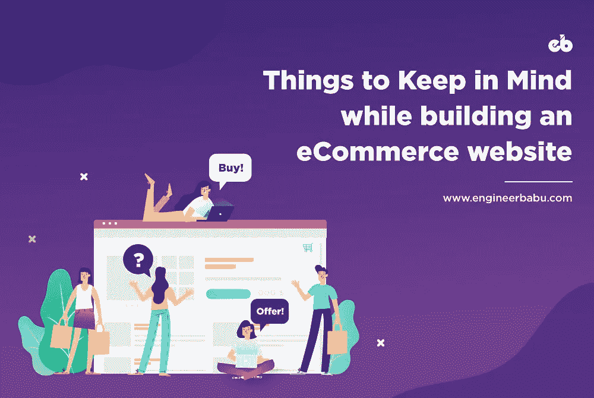
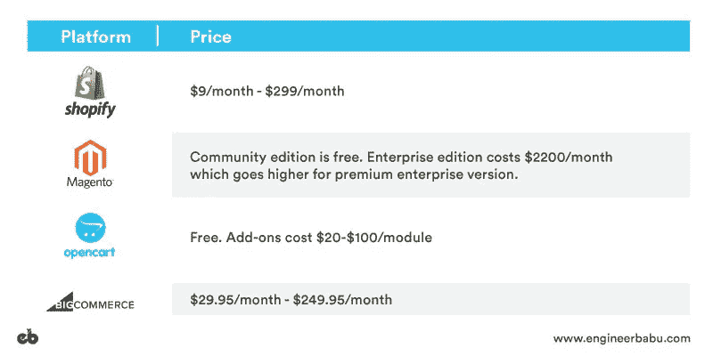
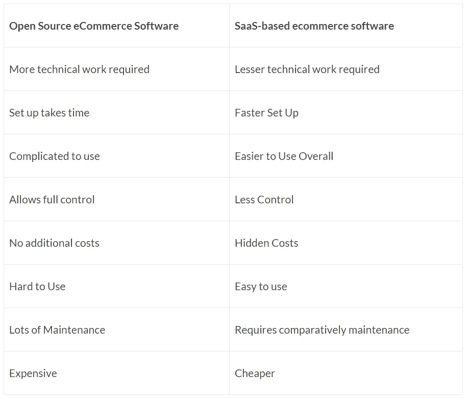
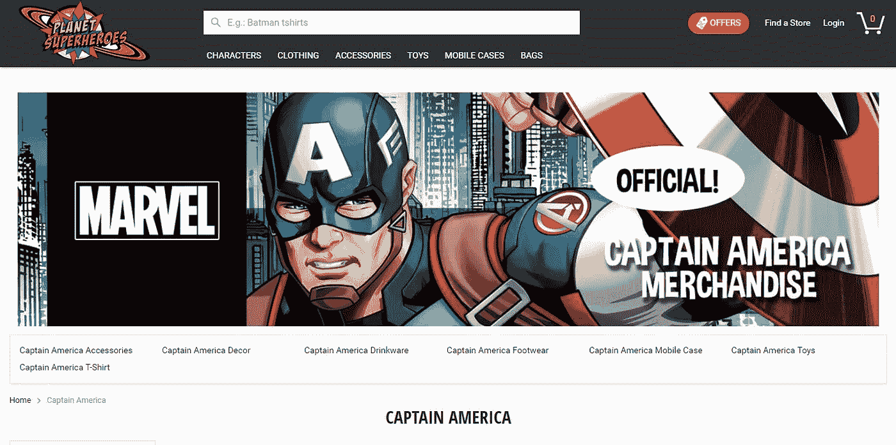
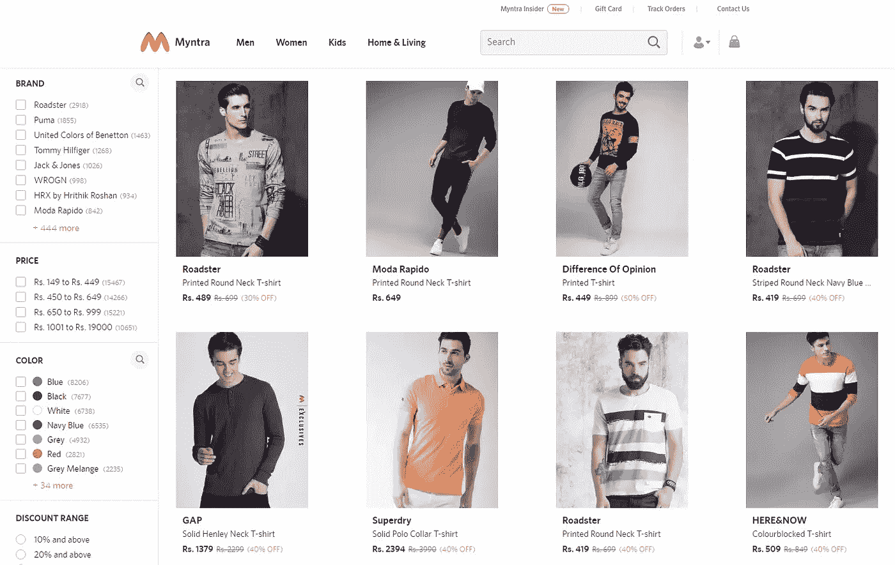
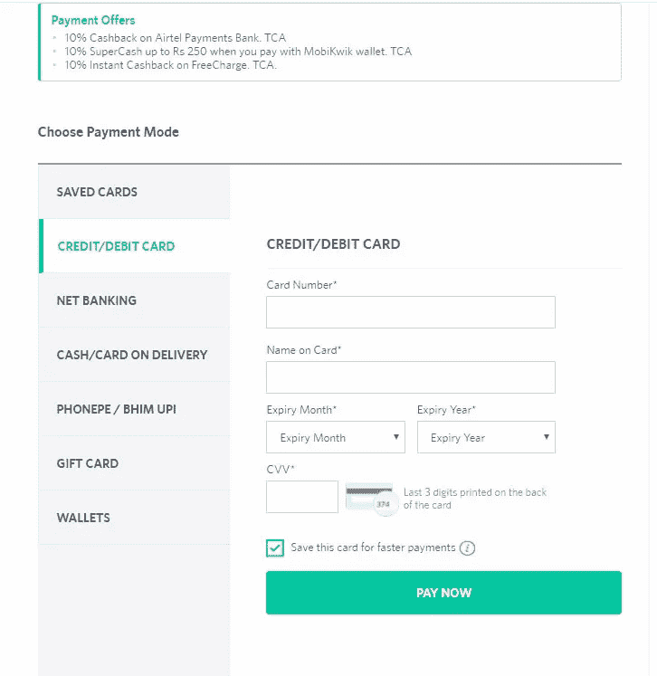

# 建立电子商务网站要记住的 5 件事

> 原文：<https://medium.com/hackernoon/5-things-to-keep-in-mind-for-building-an-ecommerce-website-91e3834a103a>

5 Things To Keep in Mind While Building an eCommerce Website

看起来你终于决定开始创建你的电子商务网站了。

不要再看了，因为你已经到达正确的目的地。

每当你要开始一个大项目时，最好在开始前做好准备。建立一个电子商务网站由许多移动的部分组成。因此，在一头扎进去之前，需要考虑各种因素。

从用户参与度到网站性能——设计一个简单的网站是一回事，但是开发一个电子商务网站会面临一系列的挑战。

**首先**，电子商务网站的建立不仅仅是为了在线宣传和展示你的品牌；它们主要是为顾客购物而建造的。因此，设计师需要确保网站易于使用和直观的销售。

**没有销售，整个网站将失去目的。**

所以，在你开始之前，考虑通读这篇文章，因为它可以作为一个圣杯，把你的电子商务产品梦想变成现实。

# 1.选择一个电子商务或虚拟主机平台

如果你是一家中小型企业，并且不寻求定制平台，那么为了节省时间和金钱，选择一个流行的电子商务平台。

我推荐 **Shopify，Magento，OpenCart 或者 BigCommerce。**

必读:[2019 年小型企业最佳电子商务平台](https://www.engineerbabu.com/blog/best-ecommerce-platform-for-small-business/)

大多数开发者都非常熟悉这些，这使得整合 WordPress 插件、支付处理等变得很容易。这些平台还提供了一系列定制功能。

此外，这些电子商务平台价格合理。

# 2.逆向工程成功的电子商务网站

创建一个电子商务网站或产品来产生线索、驱动流量和转化访问者的最巧妙的方法之一是对其他电子商务网站已经在使用的东西进行逆向工程。向那些已经在该领域出类拔萃的人学习，是确保你创建一个对你的业务有利可图的功能平台的一个稳赚不赔的方法。

**但是，你怎么能这样做呢？**

要了解你的竞争对手在利用什么，你可以去 Ahrefs(或其他竞争对手分析工具，如 SpyFu、Similar Web 或 SEMrush)并输入你自己的网站或你的竞争对手的网址。

一旦你这样做了，试着找出他们是如何获得流量的，他们对什么关键词排名，他们对什么关键词竞价，等等。

# 3.开源或 SaaS——明智的选择

根据各种因素，如您公司当前和未来的需求，以及预算和其他限制，您将在进入电子商务世界时做出重大决定:

你应该使用开源平台还是 SaaS 平台来托管你的在线商店？

***我们来对比一下:***

如果你不需要一个定制化的在线商店，而是想把你的精力和时间集中在经营和扩大你的企业上，而不是管理技术——你会更满意 SaaS 平台。这将为您节省大量时间和金钱，同时让您专注于实现您的业务目标。

如果你有足够的钱雇佣一个开发者，并且想要一个高度定制的购物体验，那么开源将是一个可行的选择。

# 4.寻找合适的技术合作伙伴

选择正确的技术合作伙伴是确保您的产品成功的关键一步，尤其是如果您来自非技术背景。

电子商务有时会变得棘手。出现了一些只能由有经验的开发人员处理的问题，因此你必须雇用一个在这个领域有工作经验的合作伙伴。

在这种情况下，追求万事通真的不是一个好主意。此外，仅仅雇佣一名开发人员是不够的。你需要一个电子商务领域的专家来满足你的要求。

因为电子商务本身就是一个庞大的实体；根据某人在其他领域的工作来雇佣他是愚蠢的。擅长设计打车或约会应用的开发者不一定擅长开发电子商务应用。

点击此处 **查看我们屡获殊荣的电子商务应用 right [**。**](https://www.engineerbabu.com/casestudies/frankgreen#top)**

# 5.清晰简单的导航

确保你在购买的每一步都有清晰易懂的导航。如果用户没有找到他们想要的产品或服务，他们不会花很长时间在你的网站上寻找。毕竟，他们有很多选择。

**通过为用户提供干净整洁的体验来留住用户。**

记住以下几点，你就可以开始了:

## **将您的设计与您的产品相匹配**

让你的设计和你所卖的东西保持一致将会完善你网站的整体感觉和外观。在设计的时候，确保所有的东西，从文本，图片，配色方案，都和你的网站完美的结合在一起。

例如，如果你的网站是卖玩具的，你的设计应该看起来有趣和丰富多彩。

如果你的网站是交易小工具，你的设计主题应该看起来现代和科技。

例如，这个买卖美国队长商品的电子商务网站使用了与他们的产品完美匹配的设计。

## **适当的产品展示和描述**

你的电子商务网站的目的应该是销售产品；因此，在你的网站上突出你的产品是很重要的。展示商品时，一定要确保你使用的是能吸引用户注意力的高质量图片。图像越大越好。通过展示高质量的图片，您的客户将会看到产品的真实效果。

为了更好的可用性，选择一个在每一页都强调你的产品的布局。如果他们已经看过或点击过类似的产品，不要让他们很难找到“配饰”或“鞋子”的页面。

## 轻松的结账流程

除了允许交易迅速和匿名之外，电子商务网站还应该尽可能吸引消费者查看他们的商品。这个过程越简单，你的顾客就越有动力重复购买。所以不要为结帐创建太多的页面。

尝试创建一个单页的流程，同时不要让消费者感到过于沉重。

## 支付选项

我观察过几个电子商务网站，它们拒绝用户用 Paypal 或除 Visa 或 Master card 之外的其他支付方式付款。现在，随着统一支付界面的引入，您需要确保提供充足的支付解决方案，以迎合广泛的购物者。通过考虑消费者的支付偏好，你可以增加他们的购物动机，从而从长远来看促进你的销售。

# 开发电子商务网站时要问代理商的问题

我们遇到的许多非技术客户主要关心两件事，

## “成本和时间”

但这绝对不是正确的做法。首先，你应该对你要构建的东西给出清晰的说明(清晰的需求文档),并问一些类似下面的问题。

*   **建立投资组合**
*   你如何决定项目的价格
*   你的公司有多大，你进入市场多久了？
*   你能提供你过去开发的网站的例子吗？
*   你有没有案例研究来展示你的网站的有效性
*   你有一个项目经理谁将采取我的网站的所有权时，它被创建
*   维护网站是否需要持续成本，如果需要，费用是多少？
*   你使用什么标准和实践来确保站点响应不同的设备并为搜索而优化？

*   **分析和报告**
*   你愿意为我建立分析吗？
*   你使用什么工具和解决方案进行网站分析？
*   你建议我们跟踪哪些电子商务指标？
*   我们如何追踪哪些产品表现最好
*   我们如何追踪哪些渠道表现最佳？
*   我们如何跟踪客户如何使用我们的网站？

*   **网站特色**
*   如何为我的客户创建折扣或优惠券代码？
*   我能根据用户群个性化价格吗？
*   客户可以查看产品吗？
*   你能开发一个“愿望清单”、“产品有货时通知”或“延期交货”功能吗？
*   消费者能够从购物车页面更改购物车中商品的数量吗？
*   网站会有一个“仪表板”让用户更新他们的信息吗？

*   **搜索引擎优化**
*   你把关键词研究作为网站建设的一部分吗？
*   站点范围内的 HTTPS 是否包含在构建中？
*   你如何优化页面速度，尤其是在目录和图像多的页面上？
*   你会为我的网站实现模式标记吗？
*   你会在网站上包括一个博客吗？如果是，它们会在主站点还是子域上？
*   你将如何处理动态生成的页面？

*   **科技问题:**
*   前端会采用哪些技术？
*   后端会采用哪些技术？
*   你打算做原生 Android &原生 iOS 应用还是混合应用？
*   哪台服务器将用于托管？
*   你将如何确保网站的安全？
*   如果需要，实施变更需要多长时间？
*   如果服务器停机会发生什么？
*   您如何确保免受黑客攻击和网络钓鱼攻击？

# 包扎

一个电子商务网站可以完全改变你的业务。它不仅可以提高你的销售额，还可以在全球范围内建立你的企业——这也不需要经历开实体店的痛苦。

的确，创建一个电子商务网站需要大量的汗水、时间、努力和费用。然而，如果你知道正确的技术，一个好的电子商务网站不仅可以促进销售，还可以留住比你想象的更多的长期客户。

***我们的团队在***[***engineer Babu***](https://www.engineerbabu.com/)***为全球企业设计了一些最佳的电子商务解决方案。我们珍爱的澳大利亚电子商务客户 Frankgreen 已经赢得了无数的奖项，比如不是一年，甚至不是两年，而是连续三年的最佳设计奖！！我们的另一个电子商务应用 Ondoor(一个在线超市应用)在创纪录的时间内获得了超过 10 万次下载。***

[***联系我们***](https://www.engineerbabu.com/) ***马上免费咨询！***

我们希望这篇文章对你有所帮助。请在下面的评论中告诉我们你接下来想了解什么。