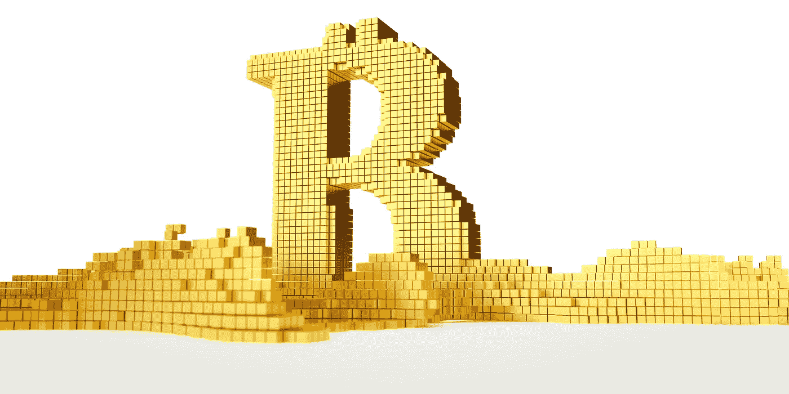
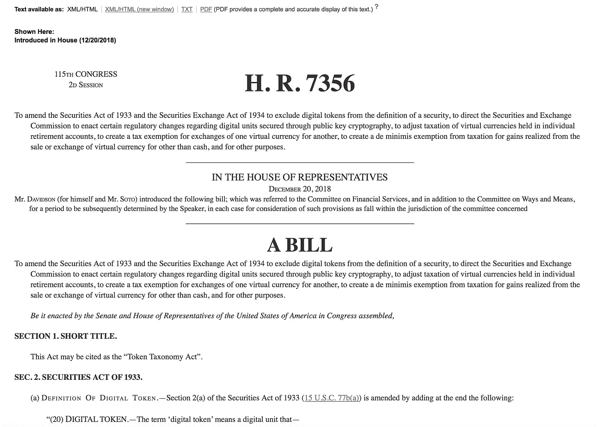

# 区块链投资策略:需要监控的 5 个市场转变

> 原文：<https://medium.com/hackernoon/5-trends-to-guide-your-blockchain-investment-strategy-f93e274e44e3>

## 这里有 5 个区块链板块运动，帮助你在 2019 年制定投资框架战略。

# #1 区块链开发和采用的成熟度不断提高

根据德勤的全球区块链调查，40%的德勤全球区块链调查受访者[报告](https://www2.deloitte.com/global/en/pages/energy-and-resources/articles/gx-innovation-blockchain-survey.html)他们的组织将在 2019 年向区块链计划投资 500 万美元或更多。传统公司意识到，区块链技术可以通过区块链的可靠性、速度和透明性来优化内部流程，从而有助于打破当前效率低下的系统。因此，更多的传统企业将开始与这项技术和提供区块链解决方案的公司合作。

> **这是什么意思？**这一趋势将增加传统公司和区块链公司之间的合作数量。反过来，这将使区块链进一步进入主流意识和采用，以及减少与投资区块链项目相关的不适。因此，在财政资源的支持和日益激烈的竞争下，将会出现越来越多的新的健壮用例及创新。

# #2 安全令牌的兴起

安全令牌的兴起将弥合加密和传统投资之间的鸿沟。安全令牌将数据市场和资产类别(如收入、债务、股权、房地产、贵金属)令牌化的能力(在证券发行平台如 [Abacus](https://abacusprotocol.com/) 、[证券化](https://www.securitize.io/)和 [Harbor](https://harbor.com) 的支持下)不仅会加速各行业的增长，而且通常会将一种完全新手类型的资本和所有权结构带入各行业。但加密证券也将扩大全球投资者的范围，让投资变得比以往任何时候都更容易。这将由数字资产交易平台的预期推出来促进，如[开放金融网络](https://www.openfinance.io/)、 [tZERO](https://www.tzero.com/) 或 [Templum](https://www.tradetemplum.com/) 。

此外，这一趋势将把加密和传统金融行业的专业人士聚集在一起，利用他们的专业知识，创造我们可能还没有想到的资产类别。很快，证券代币很可能会成为华尔街、平方英里、罗斯柴尔德大道或香港中环不可或缺的一部分。因此，地方和国家财富可以转化为全球流动性，从而形成一个共享和相互关联的全球金融体系。

> **这是什么意思？**全球非流动性资产超过万亿美元，支持安全代币的机会巨大，因为它们为股票、债务、房地产和其他数字资产(部分或全部拥有)的交易奠定了基础。

# #3 机构资金的到来

洲际交易所(ICE)的产品 Bakkt 是一个受监管的数字资产生态系统，消费者和机构投资者可以购买、存储和消费数字资产，计划在 2019 年初推出比特币期货产品。(注:[在 2019 年 2 月初的盈利电话](https://seekingalpha.com/article/4239136-intercontinental-exchange-inc-ice-ceo-jeff-sprecher-q4-2018-results-earnings-call-transcript?part=single)中，ICE 已确认该服务将于 2019 年末推出)。

世界第二大证券交易所纳斯达克[计划](https://www.cnbc.com/2018/11/28/nasdaq-to-launch-bitcoin-futures-despite-cryptocurrencies-bear-market.html)在 2019 年晚些时候推出加密货币产品。(注:在 2019 年 3 月 13 日的一份****新闻稿中，纳斯达克宣布首个全栈加密货币交易所 [**预计将于 2019 年上半年推出)。**](https://www.bcause.com/)****

********

****这些参与者的到来将提高透明度和安全性，包括防范各种形式的市场操纵。此外，比特币期货将促进主流采用，因为它们能够做空比特币，并以真实货币结算合同。随着这一趋势，我们可能会看到其他金融工具的出现，如加密贷款，使投资者能够在未来从他们的硬币中获利。****

> ******这是什么意思？**虽然机构资金可能需要数年时间才能完全进入加密市场，但这些项目的启动，再加上更清晰的监管，将为机构投资者提供他们熟悉的交易条款，创造一个没有高波动性、价格操纵和资产盗窃的更安全的环境，并鼓励机构资本的进入，从而加强行业地位。****

# ****第四大美国银行对金融科技和区块链进行战略投资****

****虽然有些人可能会同意，区块链和加密货币通过创造一种供应固定且不受经济操纵的透明货币分配来挑战传统银行的现状，但银行很快意识到，如果他们想继续运营，他们需要参与这场游戏。这是推动传统金融机构采用加密货币的潜在因素之一。****

********

****根据 [CBInsights](https://www.cbinsights.com/research/fintech-investments-top-us-banks/) 的数据，截至 2018 年 11 月，美国前 11 大银行共参与了 49 轮金融科技初创公司的股权融资——目的是未来回报或建立战略合作伙伴关系。这些投资涵盖支付、保险和贷款等类别。****

****虽然并非所有这些投资都是在区块链公司进行的，但值得注意的区块链投资包括高盛对 BitGo(一家为机构投资者提供托管服务和为企业投资提供多签名钱包等服务的公司)的投资，高盛、富国银行、摩根大通和花旗集团对 Axoni(一家专注于分布式账本基础设施的资本市场技术公司)的投资，以及花旗集团对 Setl(一家机构支付和结算基础设施)的投资。****

> ******这是什么意思？**投资区块链技术的趋势预计将继续，因为区块链将不可避免地成为一项重要的战略投资，也是金融科技应用不可或缺的一部分，因为它是一个廉价、可靠和安全的层，可以增强信任和效率。这将促进技术的采用和财政支持。****

# ****#5.法规的支持****

****毕竟，区块链可能确实是几十年来金融行业监管的变革力量。12 月 20 日出台了令牌分类法法案(Token Taxonomy Act),将某些数字资产排除在联邦证券法之外，修订了 1933 年的证券法和 1934 年的证券交易法。****

****根据该法案，如果数字令牌由分散性质定义，记录在分布式分类账中，不代表公司的财务利益，并且其创建和供应不能被更改，则数字令牌不是证券。该法案还提议对加密货币交易免税，并取消对加密商品和服务支付的增值税。****

********

****尽管国会必须通过该法案才能使其生效，但该法案代表了对数字化资产的监管处理进行调整的重要一步，从而促进了创新。****

****与其他监管活动一起，2018 年为 2019 年取得重大进展奠定了基础。例如，SEC 推出了一个公共平台，用于研究和评估新金融创新的新监管方法。****

> ******这是什么意思？**虽然监管机构正在不知疲倦地寻找监管新手行业的正确方法，但行业专业人士需要不断与政策制定者接触，以确保加密货币创新的成果不会丢失，我们一起为创造一个成功的行业奠定基础。****

# ****结论****

****虽然我认为区块链技术颠覆不会在短短一年内完全实现，但上述进步有助于更多个人、公司和金融机构接受区块链技术。****

****更清晰的监管、技术的实施以及散户和机构资金的涌入，将使该行业获得被主流接受和采纳的合法性。随着这些趋势的发展，区块链和加密货币可能会从爱好者的哲学中脱颖而出，成为我们不能忽视的重要工具。****

*******免责声明*** *:本文不构成作者或与作者相关的任何实体的投资指导或法律意见。*****

*****喜欢这篇帖子吗？请在页面左侧“鼓掌”,以便与更多人分享。* [*联系*](https://www.elvinakamalova.com/contact/) *或留言下方有任何补充或反馈。*****

*******我们感谢数字个人助理平台***[***Twinsy***](https://twinsy.io)***为研究工作做出的贡献。*******