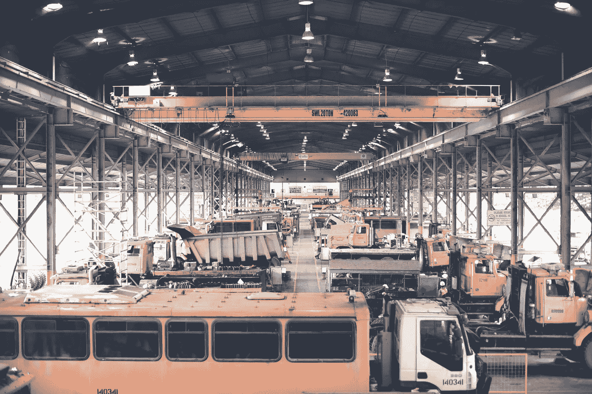

# 科技改变电子商务物流的 5 种方式

> 原文：<https://medium.com/hackernoon/5-ways-tech-is-transforming-ecommerce-logistics-b641bd20eee2>

尽管物流作为一个术语出现在 20 世纪 40 年代，但几十年来它一直在追求相同的目标:

●提高供应链绩效，包括服务质量

●提供透明的信息交流

●确定制造过程中的最佳路线和解决方案

有不同类型的物流取决于商业利基。这些是运输，制造，信息，分销，存储，商业和营销物流，仅举几例。考虑到全球经济基于统一的原则、资源和流程，所有类型的物流都有相似之处。

在电子商务中，物流在优化客户服务和降低成本方面发挥着关键作用。

事实是，与线下业务相反，在线销售点通常服务于来自世界各地的大量人群。因此，数字零售中优化的供应链是确保企业成功运营的关键因素。

研究表明，到 2020 年，全球物流支出将达到[10.6 万亿美元，并且费用逐年增加。让我们来讨论一下技术在这个等式中出现的位置，以及它如何改变整个物流行业。](https://www.supplychaindigital.com/logistics/global-logistics-spending-set-soar-106trn-2020)

Photo by Ray Kacaribu on Unsplash

# 技术改变电子商务的 5 种方式

技术正在改变物流供应商的运营方式。【Iflexion 的电子商务顾问提出了以下数字创新对电子商务物流影响最大的五个领域。

**人工智能和自动化。**在自动化的支持下，人工智能已经成功应用于各种现代物流解决方案，如仓库机器人、基于计算机视觉的条形码扫描、无人机送货等。

今天，人工智能对物流的关键价值在于它允许合理规划供应链(例如，在人工智能算法的帮助下，有可能选择最佳路线将产品从 A 点运输到 B 点)。与此同时，自动化解决方案有望取代大规模呼叫中心和其他客户支持部门的大量日常职责。

**物联网。**“物联网”的概念最早出现于上世纪 90 年代末，但它在物流领域的实际应用才刚刚开始。例如，由 RFID 标签生成的基于 GPS 的地理位置数据可以促进产品运输跟踪。使用历史数据分析还可以增强物流运作。

总的来说，物联网在物流领域有很多应用:有源/无源电子 RFID 标签；使用全球低压网络，而不是传统的互联网；卫星跟踪器有助于实时监控产品位置。所有这些使得实时数据分析成为可能，这对于每一家中大型网上商店都至关重要。

在物流相关工作流程中实施物联网的成功案例来自 [Rogue Ales](https://blogs.intel.com/iot/2018/02/06/how-rogue-ales-makes-a-great-beer-from-wet-hops-clean-water-and-innovation/) 。为正宗“鲜啤酒花”和“湿啤酒花”啤酒生产啤酒花的公司为其时间敏感型产品实施了特殊的位置跟踪技术。由于他们的啤酒花未经干燥，而是被送往酿酒厂立即使用，因此该公司在 12 小时内交付原材料至关重要，否则，啤酒将失去质量。除了跟踪当前位置，该公司的员工还使用特殊的指标来收集运输过程中的温度和湿度数据。

**利用大数据进行实时分析。**就物流而言，实时分析并不是“物联网专有的事情”。大数据让这一切成为可能。

如果手动操作，操作大量数据总是相当复杂和麻烦的任务。最微小的疏忽都会产生引发错误的风险，这将对您的业务流程产生进一步的负面影响。此外，随着数据量的增长，数据处理需要更专业的员工，这也带来了与人为因素相关的风险。

这就是为什么开发了自动处理大数据的特殊解决方案来降低这些风险。在物流中，这些工具可以通过识别模式和趋势提供重要帮助，同时也有助于预测物流公司绩效的整体效率。这种大数据解决方案被积极用于供应链优化、燃料跟踪、车辆的预测性维护等等。

**路线规划。**对于一家处理来自全球客户的数千份订单的电子商务企业来说，运输是一个大问题，如果交货延迟，可能会影响客户满意度。交货目的地通常是随机的，运输运营商很少有机会获得优化路线规划和缩短交货周期的资源。

然而，这个复杂的问题可以在动态路线规划系统的帮助下解决，这种系统越来越多。它们有助于将计划时间减少到几分钟，并允许在线控制货物装载和交付过程。最后但同样重要的是，它们还有助于显著优化运输费用。

供应链流程的数字双胞胎。可靠性是物流企业的基石，帮助他们保持高效运营。但是，如果主系统崩溃，数据丢失，业务停机是不可避免的，除非您适当地注意安全。

最简单的方法是定期在云中进行数据备份，将物理资产和流程与其数字模拟配对。特别是，创建物流流程中使用的数据的数字副本，可以降低网络中某个节点在某个点发生故障并使您的工作流程无限期停止的可能性。

Photo by Yu Kato on Unsplash

# 底线

总结以上概述，列出的技术可以帮助电子商务项目变得对所有者更有利可图，同时对消费者更实惠。

人工智能、物联网、大数据、实时分析和数字孪生技术的结合是电子商务企业应该寻求的，以优化其物流流程。实施这些创新有望提高效率，减少交付时间和成本，并提高消费者对数字零售商的满意度。