# 制作 React 应用程序动画的 5 种方法。

> 原文：<https://medium.com/hackernoon/5-ways-to-animate-a-reactjs-app-in-2019-56eb9af6e3bf>

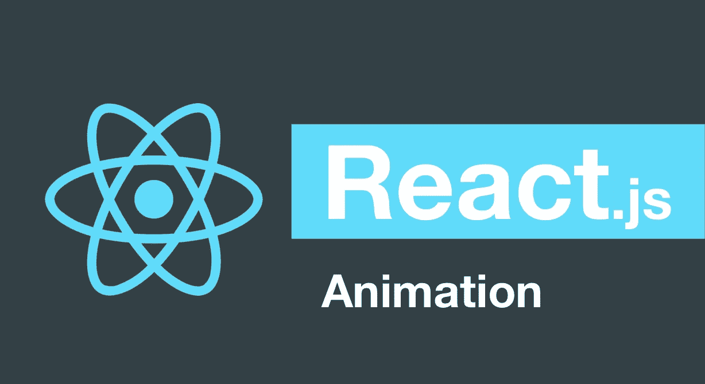

ReactJs 应用程序中的动画是一个热门话题，有许多方法来创建不同类型的动画。许多开发人员专门使用 css 和向 HTML 标签添加类来创建动画。这是一个很好的方法，你应该使用它。如果你想制作复杂的动画，你可以关注格林斯托克。GreenSock 是最强大的动画平台。React 中也有很多用于创建动画的库、组件。让我们来谈谈它们😎

1.  **CSS 方法**
2.  **React-transition-group —** 它是一个附加组件，用于简单实现基本 CSS 动画和过渡。
3.  **React-animations—**React-animations 实现了 animate.css 中的所有动画。简单易用！
4.  **React Reveal —** 这是 React 的动画框架。
5.  **TweenOne—**ant . design 用于动画的库

> …………………….…👇
> 查看回购，点击[此处](https://github.com/NozhenkoD/react-animation-2019)。👈
> …………………………👆

当然，开源有更多的动画库和组件。我想探索它。但是本文不包含库。*你还会在文末收到奖金，形式是值得你关注的库。*

👨‍💻让我们开始吧。

# 1。 **CSS 方法**

这种方法是制作简单动画的最佳方法之一。当您使用它而不是导入 javascript 库时，您的包仍然很小。并且浏览器花费更少的资源。这两点也在很大程度上影响了 app 的生产力。如果你有一个简单的动画，并且担心你的包的大小，注意这个方法。

我将向你展示如何使用 css 制作动画。
让我们看看汉堡包菜单的例子:👇

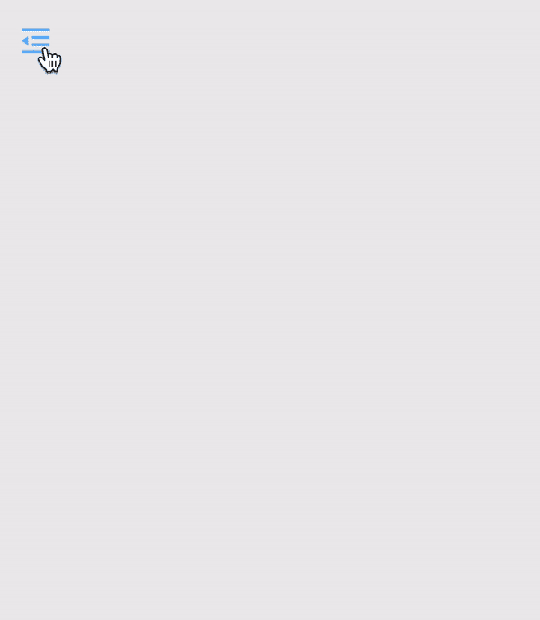

这个菜单易于使用 css 属性和 html 标签的触发器`className="is-nav-open"`。有很多方法可以实现这个例子。其中之一是在导航上方创建一个包装器，并触发边距的变化。导航具有等于`250px`的恒定宽度。和具有相同宽度的`margin-left`或`translateX`属性的包装。当我们需要显示导航时，我们必须为包装器添加`className="is-nav-open"`，并在`margin-left/translateX: 0;`上移动包装器

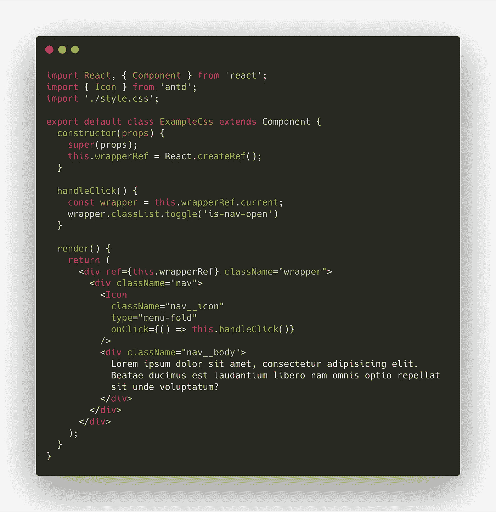

和 css 样式:

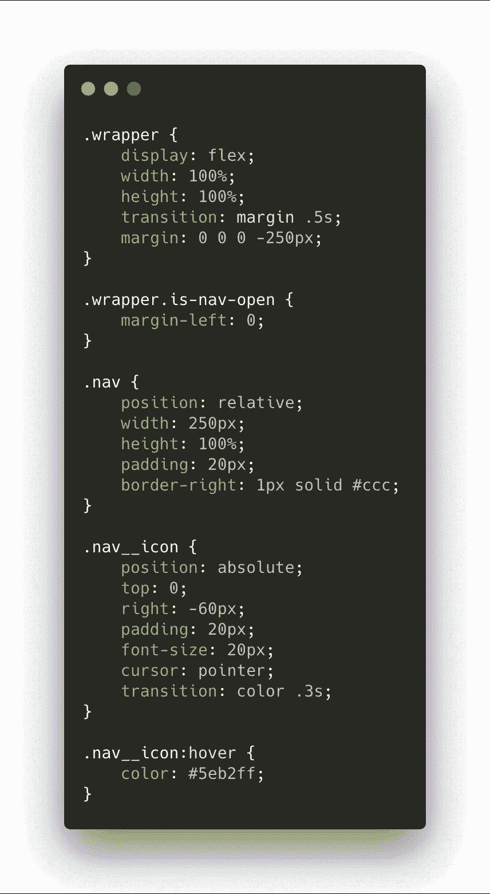

相信我，大多数情况下都有必要使用这种方法。我们最好编写几行 css 代码并触发类名，而不是导入大型库并在项目中实现它。用户会感谢你的浏览器快速复制应用程序。

但有时，你必须使用其他方法。还有什么其他方式存在？让我们看看下一个方法。

# **2。ReactTransitionGroup**

这个附加组件是由 ReactJs 社区的人开发的。 [ReactTransitionGroup](https://github.com/reactjs/react-transition-group) 很容易实现基本的 CSS 动画和过渡。

开发人员将这个库描述为:

> 一组用于管理组件状态(包括装载和卸载)的组件，专门针对动画而设计

无论如何，关于 it 附加组件，你需要知道三件事:

*   当组件生命周期改变时，反应转换组改变类。反过来，动画风格应该在 CSS 类中描述。
*   ReactTransitionGroup 的大小较小。它应该安装在 React 应用程序的包中，不会显著增加您的包。但是可以用 CDN。
*   ReactTransitionGroup 有 3 个组件(Transition、CSSTransition 和 TransitionGroup)。为了获得动画，你需要把组件包在里面。

我们来看看如何制作类似的动画*👀👇*

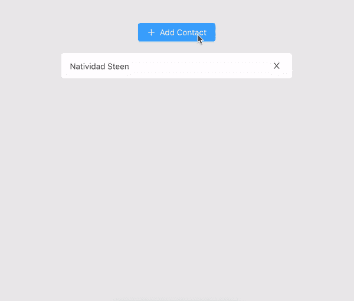

首先你需要从`react-transition-group`导入`CSSTransitionGroup`。在那之后，你必须把清单包在里面，并设置`transitionName`道具。每当`CSSTransitionGroup`中的孩子被添加或删除时，它将获得动画样式。

如果你设置了`transitionName="example"`道具，样式表中的类应该以一个示例名开始。

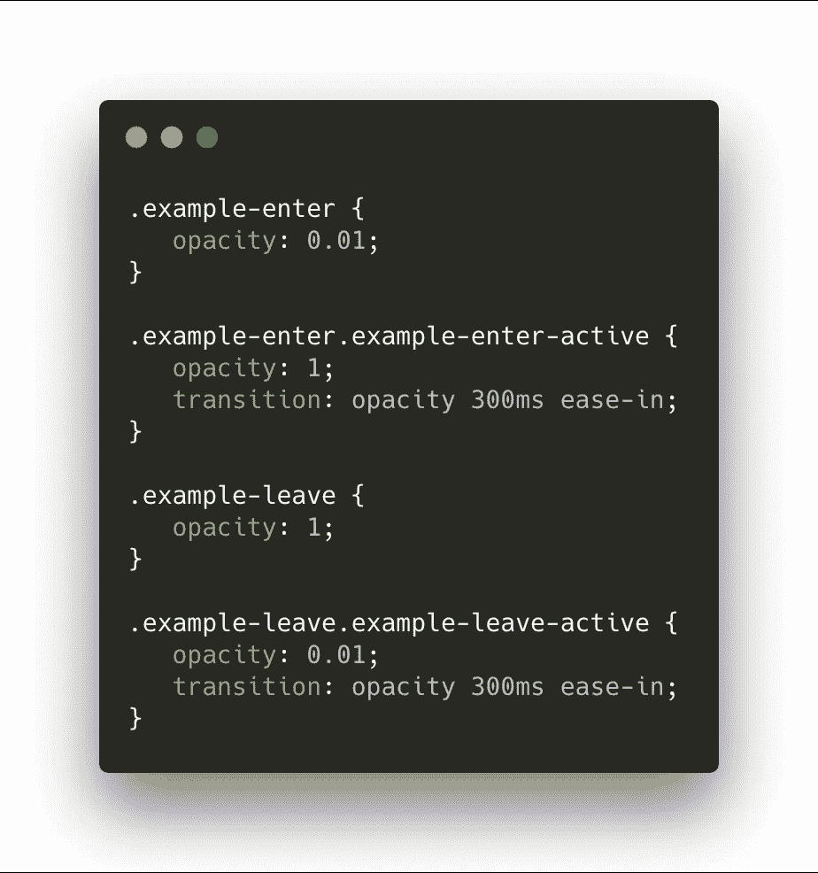

可以看基本用法`ReactTransitionGroup`版本。👀

这是你需要的一切。当然你需要添加一些逻辑。我们应该描述实现我们的示例联系人列表的两种方法:

`handleAdd` —添加新的联系人，它会获得一个随机名称，并将其推送到数组 state.items。(它使用随机名称包来获得随机名称)

`handleRemove` —通过`state.items`阵列中的索引移除触点。

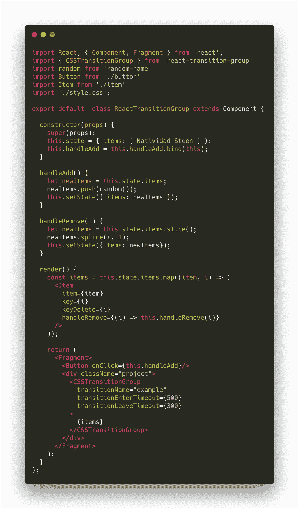

# 3️.反应-动画

[React-animations](https://github.com/FormidableLabs/react-animations) —该库建立在所有带有 [animate.css](https://daneden.github.io/animate.css/) 的动画之上。很好用，有很多动画收藏。React-animation 可与任何支持使用对象来定义关键帧动画的内嵌样式库配合使用，如 Radium、Aphrodite 或 styled-components。我更喜欢使用样式化的组件。

*你可以在 gif 上看到一些动画:👀👇*

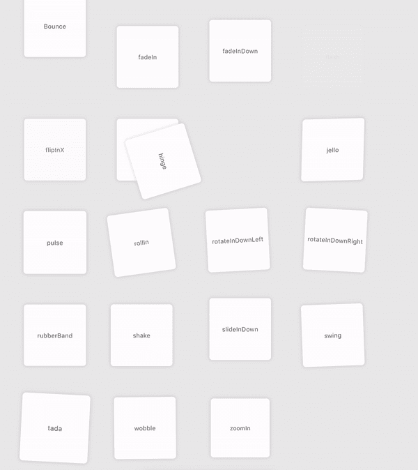

我知道你在想什么😄

一旦你看到这些动画，你就会意识到你可以在哪里使用它们。
让我们来看看这是如何工作的。比如— **弹跳动画**。

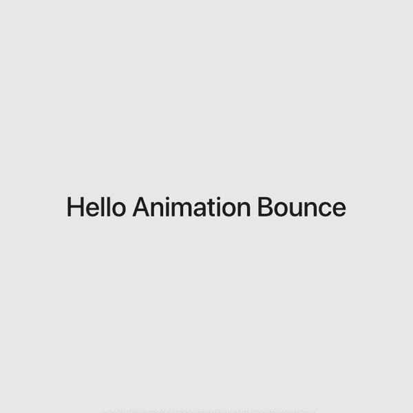

你首先需要从`react-animations`导入选择的动画。

正如我前面提到的，我在用动画样式和基本关键帧创建包装组件后使用样式组件。

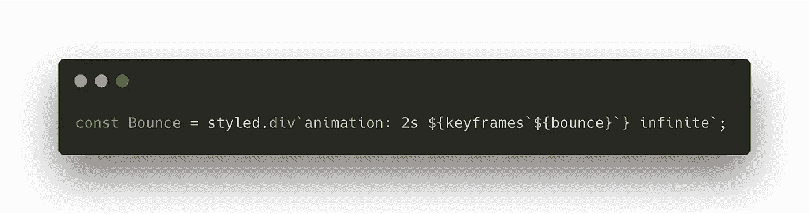

当组件被创建时，你需要包装任何 **HTML** 或者组件来制作动画。

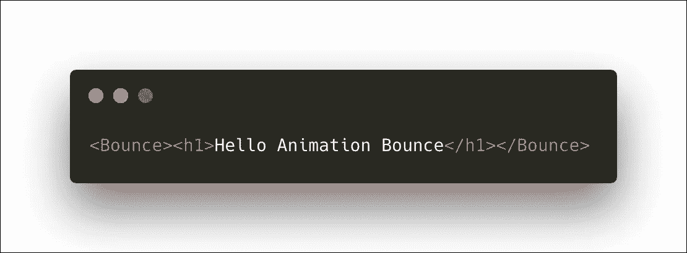

示例:

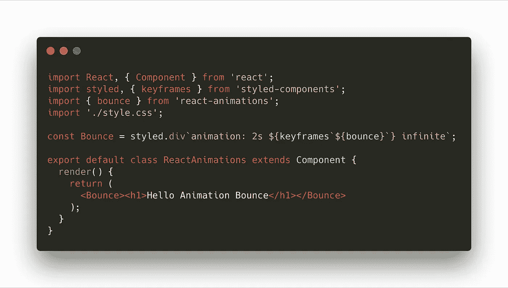

动画作品。这个动画很基础，也很简单。

有一些很好的解决方案可以在滚动中使用这个动画— [在滚动中反应动画](https://dbramwell.github.io/react-animate-on-scroll/#home)。

# **4️.反应-揭示**

React Reveal 是 React 的一个动画框架。它有基本的动画，如淡化，翻转，缩放，旋转和许多更先进的动画。它允许你用道具控制所有的动画，例如:位置，延迟，距离，层叠等等。你可以在这里看到它们。您也可以使用自定义 css 效果。它还具有服务器端渲染和高阶组件。如果你喜欢使用滚动动画这个框架适合你。看看它是如何工作的。

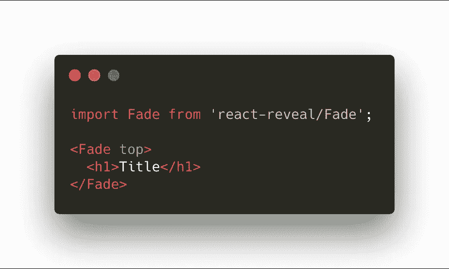

让我们看看这个动画的滚动效果。*👀👇*

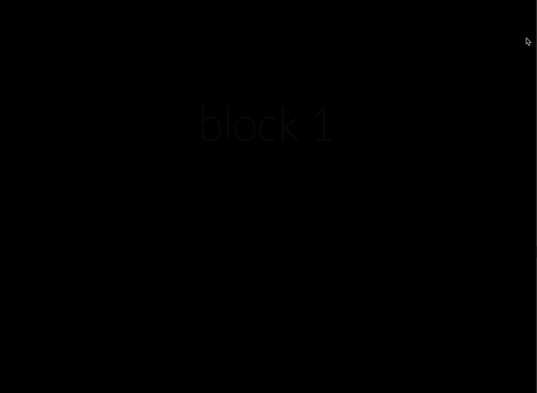

我们有 5 个区块，每个区块都有一个全屏页面，里面有一个标题。

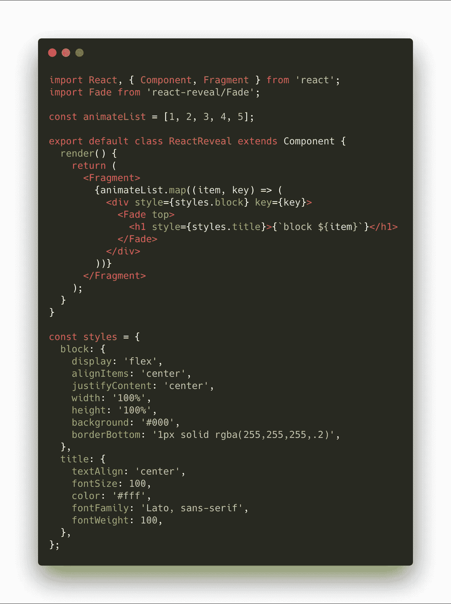

我们创建`animateList`常量。这个数组包含 5 个元素。使用数组方法`map`后，你可以渲染`Fade`组件中的每个元素，并将我们的项目插入到标题中。Const 样式为我们的块和标题提供了简短的 css 样式。我们从顶部得到了 5 个带有`Fade`动画的街区。

# **5️.蚂蚁设计**中的 TweenOne 和 a** 动画。**

Ant Design 是一个 React UI 库，其中包含大量易于使用的组件。它是构建优雅用户界面的有用组件。蚂蚁设计由中国企业集团阿里巴巴创建，它已经被许多知名品牌使用:阿里巴巴(当然)、腾讯、百度和许多其他公司。

你可能听说过 Ant design，所以让我们考虑一下它在登陆页面上的动画。👇

正如你所看到的，有很多动画元素。我想给你看一个简短的版本，因为所有的元素都有类似的动画。我选择了背景上有一个绿色球和一个元素的球体，例如一个红色正方形。我们的动画应该是这样的。

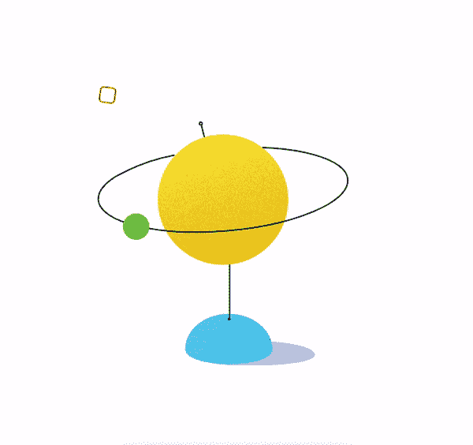

我在这个动画中使用了`TweenOne`组件，但是它需要`PathPlugin`来使用动画中的路径。当你把`PathPlugin`推到`TweenOne.plugins`时，它就会工作。

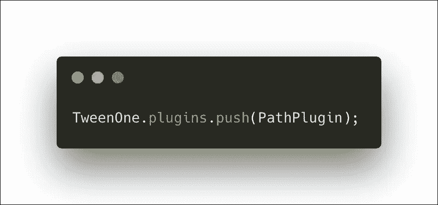

下一步让我们描述基本的动画参数:

*   **持续时间-** 时间动画以毫秒为单位，
*   **缓动** —动画缓动，
*   **yoyo**—每次重复时向前和向后交替。
*   **重复** —重复动画。你必须用-1 来表示一个不定过程。
*   **p** —动画的路径坐标
*   **easePath** —动画的缓和路径坐标

您不需要担心最后两个参数对于这个 svg 更具体。

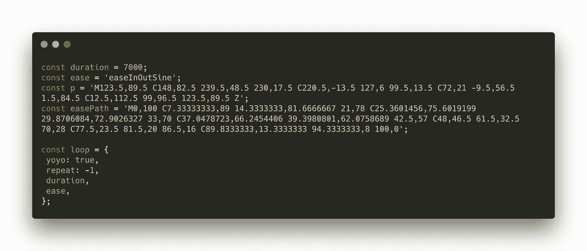

接下来，我们将创建一个动画对象。该对象有 3 种类型的动画:

*   **红方** —它有循环参数，我们将在下面描述，还有 Y 坐标、持续时间和延迟。
*   **绿球** —有带对象参数`x`的路径，`y`为值`p`。持续时间、重复和缓解— `TweenOne.easing.path` —具有两个参数的功能:
*   **路径—**ease path 坐标。
*   **lengthPixel —** 将曲线分成 400 段。
*   **轨迹**-一个椭圆，其轴具有循环样式和旋转参数。

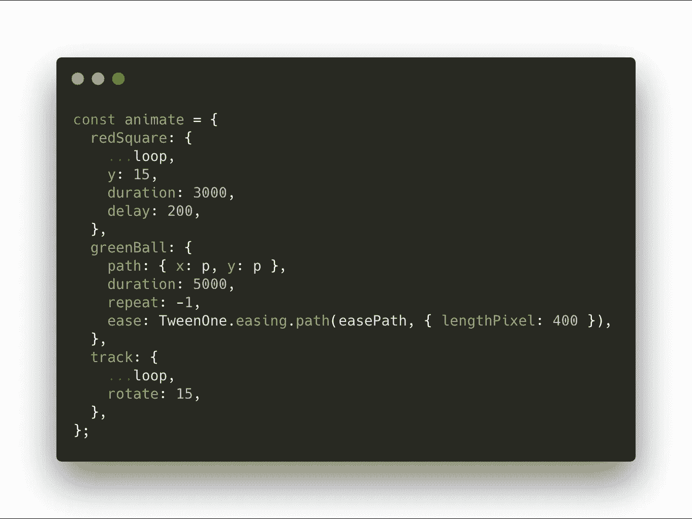

你不需要担心这些代码。你得注意`TweenOne`分量。让我们简单提醒一下，这些组件将从`rc-tween-one`进口。它被用作基础道具和动画道具的基本组件。是我们的动画！每个`TweenOne`都有自己的动画规则，如`redSquare`、`track`、`greenBall`。

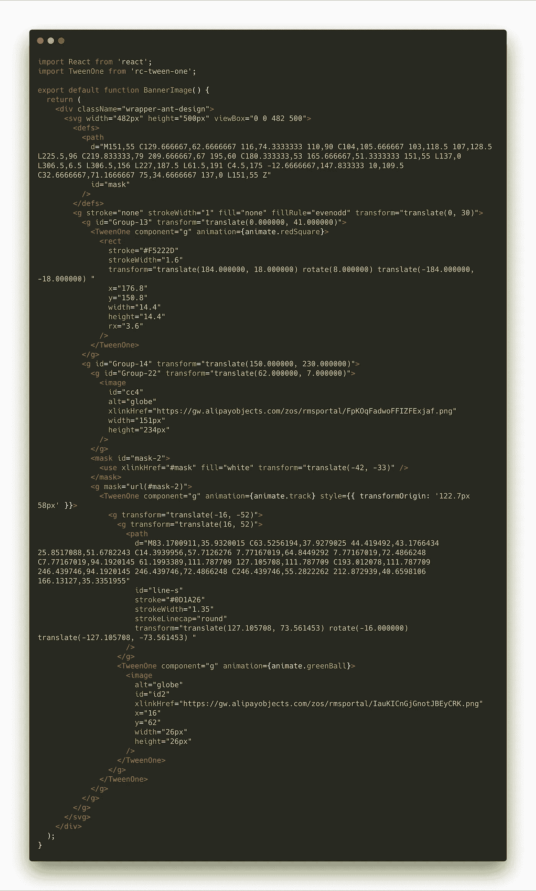

😄看起来很吓人。但实际上，你需要注意这几行。

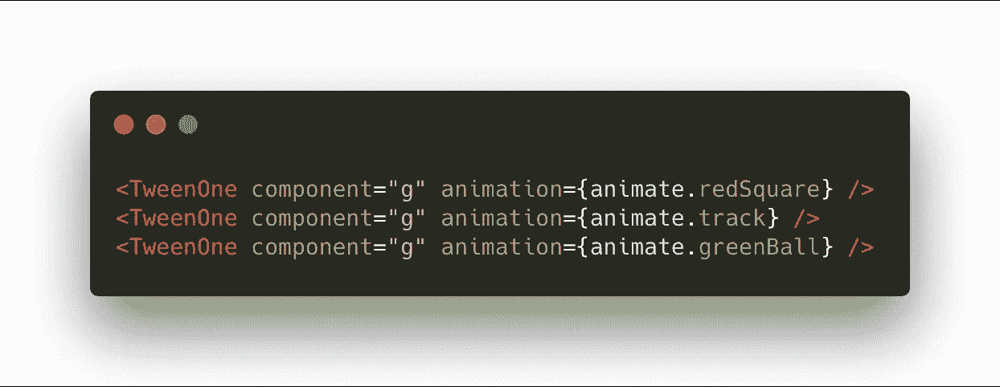

正如你注意到的，用这种方法创建动画是一种简单的方法。你所需要做的就是描述动画规则，并将它们传输到`TweenOne`组件。

## **🏁结论**

有很多使用动画的方法。所有这些都需要不同的方法。今天，我们回顾了一些您可以在项目中使用的决策。选择适合你的方法👨‍💻

🙂阅读本文之前，您的网站:

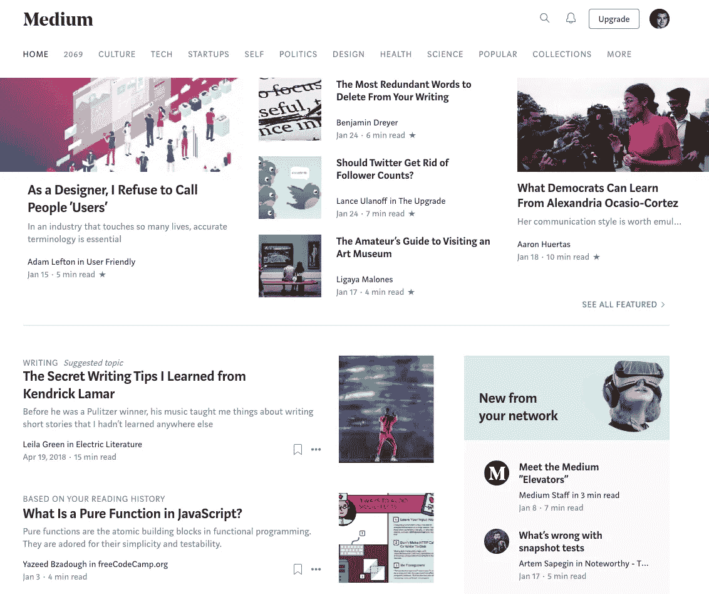

🤪看完这篇文章后，你的网站:

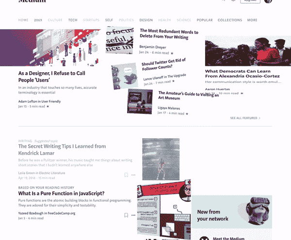

😄所以明智地使用动画吧！

> 👇你也应该读下一篇文章:👇

1.  [**用哨兵**](/hackernoon/tracking-errors-in-react-app-with-sentry-d6091a84b64e) 追踪 React App 中的错误
2.  [**React JS 中实现 CSS 的 9 种方式**](/@dmitrynozhenko/9-ways-to-implement-css-in-react-js-ccea4d543aa3?source=friends_link&sk=0497aa32141ac0a444bc088efadc4cad)

# ❤️感谢你的阅读

玩得开心，不断学习，一直坚持编码。
跟我上 [***中***](/@dmitrynozhenko)&[***Linkedin***](https://www.linkedin.com/in/dmitry-nozhenko-772a2195/)。

# 👏喜欢，分享，留下你的评论

如果你有任何问题或反馈，请在下面的评论中告诉我👇

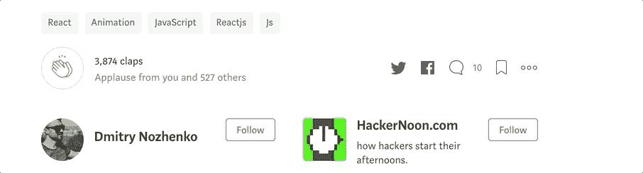

> Javascript 和 React 书籍:

1.  [**学道反应过来**](https://www.amazon.com/gp/product/172004399X/ref=as_li_qf_asin_il_tl?ie=UTF8&tag=icelimit09-20&creative=9325&linkCode=as2&creativeASIN=172004399X&linkId=38efebfe87cb357a2c4d6e283e5eaa76)
2.  [**学习 React:使用 React 和 Redux 进行功能性 Web 开发**](https://www.amazon.com/gp/product/1491954620/ref=as_li_qf_asin_il_tl?ie=UTF8&tag=icelimit09-20&creative=9325&linkCode=as2&creativeASIN=1491954620&linkId=d9168130ee66ea8e9550a8eccfc9f30a)
3.  [**雄辩的 JavaScript，第三版:现代编程入门**](https://www.amazon.com/gp/product/1593279507/ref=as_li_tl?ie=UTF8&tag=icelimit09-20&camp=1789&creative=9325&linkCode=as2&creativeASIN=1593279507&linkId=75b5928eaf8785a315c66ae38663b5e8)
4.  [**JavaScript:权威指南:激活你的网页(权威指南)**](https://www.amazon.com/gp/product/0596805527/ref=as_li_tl?ie=UTF8&camp=1789&creative=9325&creativeASIN=0596805527&linkCode=as2&tag=icelimit09-20&linkId=d9258bac89f15c5d4f81f05fa02d7efd)
5.  [**快速反应:使用 React、JSX、Redux 和 GraphQL**](https://www.amazon.com/gp/product/1617293342/ref=as_li_tl?ie=UTF8&tag=icelimit09-20&camp=1789&creative=9325&linkCode=as2&creativeASIN=1617293342&linkId=201e3d0be1b7cd8b35d7cb0c58ba4722) 的无痛网络应用
6.  [**JavaScript:精彩部分**](https://www.amazon.com/gp/product/0596517742/ref=as_li_tl?ie=UTF8&tag=icelimit09-20&camp=1789&creative=9325&linkCode=as2&creativeASIN=0596517742&linkId=e206c1a7cc52da3944325e2e8b52bd3f)
7.  [**JavaScript 模式:用编码和设计模式构建更好的应用**](https://www.amazon.com/gp/product/B0046RERXE/ref=as_li_tl?ie=UTF8&tag=icelimit09-20&camp=1789&creative=9325&linkCode=as2&creativeASIN=B0046RERXE&linkId=ca02ff1bcaef94a7da289369f4006498)

> 在下面你可以看到一个流行的动画库列表。

> ReactJs 库:

1.  [**react-motion**](https://github.com/chenglou/react-motion)**——**一个解决你动画问题的弹簧。****
2.  ****[**React-spring**](https://github.com/react-spring/react-spring)—一个基于 spring 物理学的 *React* *动画*库。****
3.  ****[**蚂蚁运动**](https://github.com/ant-design/ant-motion) — 蚂蚁设计的动画说明和组件。****
4.  ****[**React-move**](https://github.com/react-tools/react-move)——漂亮的、数据驱动的*动画*用于 *React。*****
5.  ****[**react-flight**](https://github.com/jondot/react-flight) —为 *React* 制作*动画*构图的最佳方式。****
6.  ****[**react-FLIP-move**](https://github.com/joshwcomeau/react-flip-move)—使用翻转技术在 DOM 变化(如列表重新排序)之间轻松制作*动画*。****
7.  ****[**react-burger-menu**](https://github.com/negomi/react-burger-menu)—一个非画布侧边栏组件，使用 CSS 过渡和 SVG 路径*动画来收集效果和样式。*****
8.  ****[**动画**](https://github.com/animatedjs/animated) —声明式*动画*库用于*反应*和*反应*原生****
9.  ****[**反应-补间-状态**](https://github.com/chenglou/react-tween-state) — *反应* *动画*。****
10.  ****[**反应动画**](https://github.com/FormidableLabs/react-animations) —内嵌样式库的动画集合****

> ****Javascript 库:****

1.  ****[**GSAP**](https://greensock.com/) —现代网络的超高性能、专业级动画****
2.  ****[**anime . js**](https://github.com/juliangarnier/anime/)—anime . js(`/ˈæn.ə.meɪ/`)是一个轻量级的 JavaScript 动画库，具有简单而强大的 API。它与 CSS 属性、SVG、DOM 属性和 JavaScript 对象一起工作。****
3.  ****[**Popmotion**](https://github.com/Popmotion/popmotion) —简单的动画库，提供令人愉悦的用户界面。****
4.  ****[**vivus**](https://github.com/maxwellito/vivus) —在 SVG 上制作绘图动画的 JavaScript 库。****
5.  ****[**svg.js**](https://github.com/svgdotjs/svg.js) —操纵 svg 并制作动画的轻量级库。****
6.  ****[**Velocity**](https://github.com/julianshapiro/velocity)—Velocity 是一个动画引擎，API 与 jQuery 的 *$相同。animate()* 。****
7.  ****[**wow**](https://github.com/matthieua/WOW) —滚动时显示动画。很有生气. css 朋友。****
8.  ****[**dynamic.js**](https://github.com/michaelvillar/dynamics.js/) —创建基于物理的动画的 Javascript 库。****
9.  ****[**granim.js**](https://github.com/sarcadass/granim.js) —使用这个小 javascript 库创建流畅的交互式渐变动画。****
10.  ****[**kute . js**](https://github.com/thednp/kute.js/)—kute . js 是一个原生的 JavaScript 动画引擎，具有很好的代码质量和性能****
11.  ****[**TweenJs**](https://github.com/CreateJS/TweenJS) —一个简单而强大的 Javascript 补间/动画库。CreateJS 库套件的一部分。****
12.  ****[**moveTo**](https://github.com/hsnaydd/moveTo) —一个轻量级的无任何依赖的滚动动画 javascript 库****