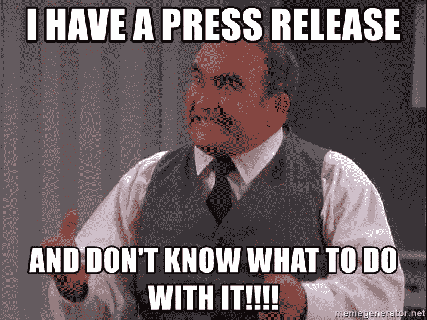

# 为你的创业公司寻找记者的 5 种方法。

> 原文：<https://medium.com/hackernoon/5-ways-to-find-journalists-for-your-startup-ddd6bb393340>

Photo by [Andrew Neel](https://unsplash.com/@andrewtneel?utm_source=unsplash&utm_medium=referral&utm_content=creditCopyText) on [Unsplash](https://unsplash.com/search/photos/journalist?utm_source=unsplash&utm_medium=referral&utm_content=creditCopyText)

投资者没有听说过你的创业公司吗？脸书项目页面上的帖子只有你喜欢？找不到向全世界展示你的产品的方法？

在过去的时间里，我经常被创业公司的创始人要求帮助:“我能给他们一个记者基地，让他们就此发布新闻稿吗？”和“嘿，看！这到底算不算好的新闻稿？”

然后，我决定为还没有公关专家的初创公司准备一份指南。

# 准备你的新闻稿。

Picture by memegenerator.net

首先，你应该决定你想告诉社区的主题。没有必要写很多多余的东西，最好是在新闻稿中，以符合你需要的最重要的东西。如果你有朋友，首先让他们阅读。获取反馈。然后，精简文字。

**记住，不是每一个信息场合都能成为记者们想要得到的新闻。**

你想告诉社区什么？你的产品有什么独特之处？也许你有一个重要的合作伙伴？你遇到了什么困难？只写有趣的东西。

*在任何情况下，不要使用:“我们的初创公司是最棒的/最漂亮的/最好的。”写得更可信。*

建议:如果你对你的信息场合的重要性有疑问，向熟悉媒体市场的人咨询。如果你的新闻被证明是无关紧要的，它将帮助你找到一个不同的角度来呈现材料或更令人兴奋的新闻。

*P.s 如果你写不出新闻稿，* [*给我写信*](/@gardenerbyrom4) *，我会尽量帮你。*

# 2.新闻的适当来源。

当许多创业公司第一次启动时，他们不能精确地确定如何为社区提交材料，并开始随机地做，这从根本上说是错误的。

最重要的是你的新闻是怎么归档的。对于那些通过链接来看你的产品或服务的读者来说，这应该是很有趣的。

对记者有吸引力的是:

*   你做过哪些在你之前没有人做过的事；
*   与行业巨头的主要合作伙伴关系；
*   你被屏蔽了，某个名人辱骂了你等等。

# 对记者要有信心。

很多时候，你会听到“不”，“我们不感兴趣”，等等。在这种情况下，最好假装成销售人员。每 100 个冷回答，你会得到 2-3 个有用的出版物。

你应该有内在的动力去得到一份出版物你不是在买它，而是在卖它。(我知道这可能很难，但你需要想象一下)试着恰当地进行对话。

此外，请注意，如果你没有发明治疗癌症或类似的东西，你将无法立即进入主要媒体。从小型网络杂志开始。

# 从哪里获得记者的联系方式？

1. [**Press Hunt**](https://presshunt.co/) 是一个约 40 万名记者、记者和媒体的分类数据库。你可以建立你最喜欢的记者的媒体名单，将他们的联系信息导出到 CSV，然后对他们进行公关活动。

记者根据他们对下一篇报道感兴趣的内容进行分类，因此你可以快速找到最有可能报道你的内容。

他们还有一个投资者研究的平台——【Investorscout.co】

**2.**(HARO)是记者获取公众反馈的在线服务。它使记者能够与报道相关问题的专家取得联系。许多大型媒体，如纽约时报，芝加哥论坛报，时代，华尔街日报，福克斯新闻频道和路透社都在使用 HARO。****

****帮助记者给用户提供免费和付费的套餐。免费套装是用户接收《HARO 日报》的电子邮件，并回复记者的提问，反之亦然。****

****3.[**Paydesk**](https://paydesk.co/)**提供 150 个国家约 1000 名记者的数据访问。搜索标准—语言、国家、地区、城市。要使用这项服务，你需要免费注册；然后你可以给潜在的记者发消息。假设选择/雇用/支付专家服务的整个过程将直接发生在平台上，客户确定工作成本，Paydesk 从每个订单中抽取 25%的佣金。******

******4. [**Hey.press**](https://www.hey.press/) 是一个研究媒体职业记者的平台。没有额外的功能、条件、机会。只需在搜索框中输入关键词，就能得到结果。每月 15 美元的 30 个认证记者的电子邮件地址列表，49 美元的 120 封电子邮件和与 Hey Press administration 协议的无限数据库。******

****5. [**Anewstip**](https://anewstip.com/) —又一个新的搜索工具。你可以指定主要的关键词，然后也可以指定在哪里可以找到专家——在 Twitter 上，通过个人资料，在新闻选择中。这项服务允许你按照语言、时间、活动领域对搜索结果进行排序。免费版每月可申请十次，注册是必须的。****

# ****结论——我的完美策略。****

********

****确定您想与之分享新闻的媒体列表。从中选出你认为最重要的 10 个(在发出新闻稿之前，你将与这些媒体的记者取得联系)。****

****一步一步地联系你名单上的每一位顶级记者(电子邮件、电话、社交网络),讨论你的新闻。如果您感兴趣，请立即发送问答第一部分的附加信息，加上说明性材料(更好的下载链接)，并准备好及时回答可能的问题。****

****然后你要发新闻稿(我用的是 UniSender 或者 MailChimp)，提前发布新闻，设定发布时间。****

****在解除禁运期满后大约 30 分钟(以及分别分发新闻稿后)，你开始打电话/向新闻发送的编辑部发送消息。您对以下问题感兴趣:****

*   ****你收到我的消息了吗？****
*   ****你感兴趣吗？****
*   ****为什么不呢？****
*   ****这条新闻可以不一样提交吗？****

****附:准备好建议编辑发表文章，而不是基于新闻稿。****

# ****如果一个媒体拒绝你，下一个。****

****没有媒体垄断舆论。被一个编辑拒绝了？试着联系他的同事。这条新闻对“商业”版块的编辑没有吸引力，但可能会让“创新”版块的编辑高兴。大型媒体尤其如此，工作人员中有几十名记者。如果第二个编辑不感兴趣，打电话给其他媒体。****

********

****感谢您的关注！如果你拍下这篇文章，我会很高兴的！****