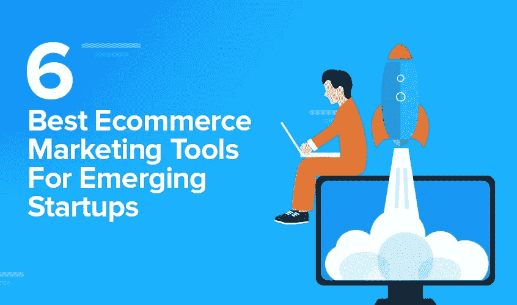
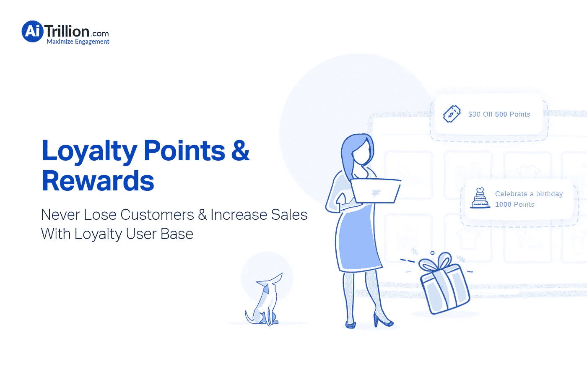
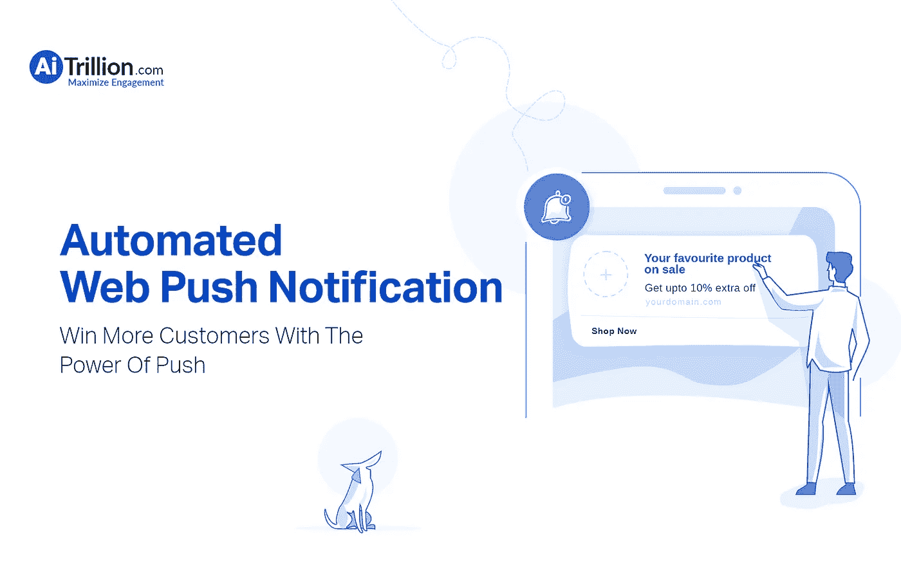
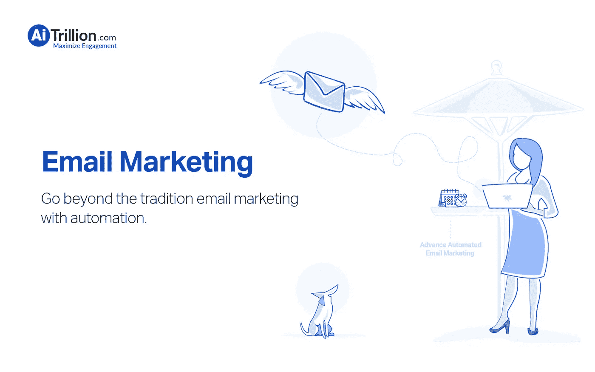
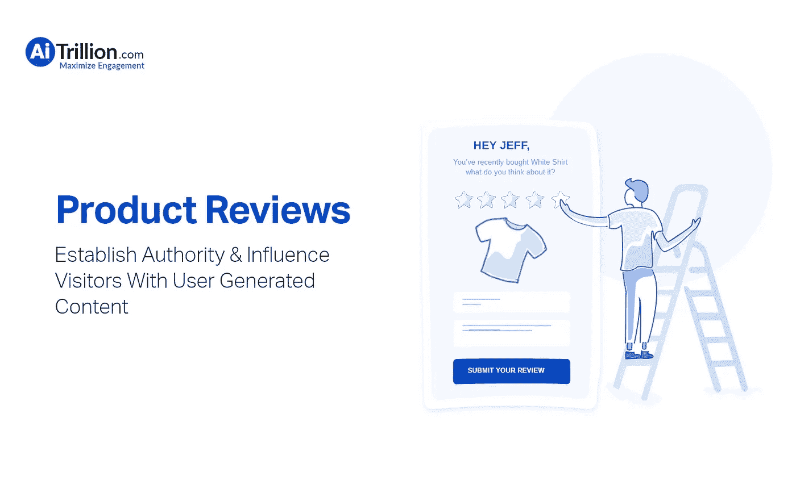

# 新兴创业公司的 6 个最佳电子商务营销工具

> 原文：<https://medium.com/hackernoon/6-best-ecommerce-marketing-tools-for-emerging-startups-9672579d9e68>

电子商务营销工具的数量简直难以用语言表达。从购物车软件到营销自动化工具，让你的网上商店设置可以有点累和混乱。

每一类工具都在业务中发挥着重要的作用，但是投资每一类工具是不可行的，也是不经济的。

智能营销策略与正确的工具和技巧的理想组合可以成倍地增长你的网上商店。

这就是为什么我编制了 2019 年市场上一些最好的电子商务营销工具的列表。在你花血汗钱去尝试不同的工具之前，找出什么是真正值得你花时间和金钱的，什么不是。

选择一个电子商务网站工具或平台，记住你的技术专长和预算，以及搜索引擎优化、现场搜索、移动友好性和可扩展性等因素，让用户更容易找到你的网站，让你的业务蓬勃发展。

记住所有这些，我不会忽视的一个领域是市场营销。没有营销，你的潜在客户不知道你的存在。没有顾客，你的生意只是一个昂贵的梦想。因此下面的列表！这份名单是精英中的精英；网站工具的圣杯，我愿意把自己和宣布将帮助你成长你的网上商店，如果利用适当和有效。

所以，看一看

# **1。Yotpo**

Yotpo 是一个电子商务营销平台，为忠诚度、推荐、视觉营销和客户评论提供先进的解决方案。Yotpo 帮助品牌在整个购买过程中利用客户评论和照片来提高信任度和社会证明，从而创造销售。

通过 Yotpo，企业可以收集几乎所有类型的用户生成内容，并利用它来改善客户体验，从而打造更强大的品牌形象。Yotpo 的集成解决方案让品牌能够从单一平台策划、管理、收集和响应用户生成的内容。

Yotpo 为品牌提供了在这个以客户为中心的快速变化的人口统计中统治所需的所有基本营销工具。它为用户生成的内容营销、忠诚度和推荐提供了一整套集成解决方案，通过最大化平均客户终身价值，帮助电子商务企业加速增长。

**Yotpo 也是 Shopify、脸书和 Google** 的官方合作伙伴，在全球拥有超过 300 名员工。

**增长计划的起价为每月 29 美元。**

**功能:**

*   **奖励管理:** Yotpo 提供同类最佳的奖励管理功能之一。Yotpo 团队通过对整个流程的直观洞察，成功简化了客户入职流程
*   Yotpo 平台可以高效地部署在**云、SaaS 和 Web 上。**
*   **客户满意度:**通过引入反馈收集和数据驱动分析等功能，Yotpo 成功提高了客户满意度。最重要的是，他们的反馈收集插件被许多客户评为最重要的功能之一。
*   **声誉管理:**在声誉管理的保护伞下，Yotpo 提供了令人难以置信的功能，如活动管理、情感分析、评论监控和客户评论平台。
*   **评论管理:** Yotpo 提供了一些最独特的功能来有效地调节和管理客户评论。其中包括活动管理、审核通知、审核请求、负面反馈管理、回应管理、社交分享等。

**优点**:

*   Yotpo 的客户服务被认为是一流的。
*   Yotpo 的审核管理也是确保成功的关键要素之一
*   新功能不断增加。
*   Yotpo 提供了一些令人印象深刻的功能，价格也极具竞争力。
*   有了 Yotpo，控制评论变得很容易。
*   他们的仪表板和温和系统易于操作，非常直观。

**缺点:**

*   如果你想使用更多的功能，你需要支付额外的费用。
*   对于中等规模的企业来说，成本很高

# **2。Mailchimp**

MailChimp 是最受欢迎和最好的电子商务营销平台之一。MailChimp 成立于 2001 年，总部位于佐治亚州亚特兰大市，拥有 700 多名员工。

从小型社区组织到财富 100 强和财富 500 强公司，数百万企业和个人都在使用 MailChimp 服务。MailChimp 被部署来发送自动消息、营销电子邮件、在线销售、创建有针对性的活动以及促进报告和分析。

该组织还越来越多地钻研电子商务企业的营销自动化。它已经成为面向中小型企业的领先营销自动化平台提供商之一..

MailChimp 使用 84 种技术产品和服务，包括 G Suite(以前的 Google Apps for Work)、Google Analytics an、WordPress。

**功能:**

*   电子邮件营销:MailChimp 最主要也是最受欢迎的功能之一就是它的电子邮件营销组件。具有自动回复、邮件列表管理、CAN 垃圾邮件合规性、报告/分析、订户管理、滴流活动、电子邮件管理等功能。MailChimp 绝对是任何寻求提升电子邮件营销工作的组织的首选。
*   **营销自动化:** Mailchimp 还提供一些一流的营销功能，如自动化 A/B 测试、分析/ROI 跟踪、登录页面/网络表单、社交营销和细分。

**优点:**

*   Mailchimp 有一种真正专业的感觉。界面反应灵敏，设计良好。
*   该平台使免费创业变得非常方便，并提供灵活的计划，非常适合创业。
*   有许多定制服务的选项，即使对于非英语观众，也可以非常容易地进行所有必要的更改来设置帐户。
*   活动发送后，系统会自动生成报告。人们甚至可以在发送完所有数据后几分钟内看到统计数据在移动中更新。
*   人们还可以看到每个活动中每个客户的反应:退订者、跳出率、点击数等。
*   有关于打开率、点击率和一般行业统计数据的详细信息，可以清楚地看到受众是否达到预期。
*   模板编辑器非常好用。人们可以很容易地将文本、图像、分隔线或其他类型的“块”放置在页面的另一侧，并可以实时可视化它们。

**缺点:**

*   设置并不容易，设置一切都需要一段时间。
*   文件管理器不像界面的其他部分那样直观，肯定是需要改进的。

**总结观点:**

全球许多企业都依赖 MailChimp 解决方案来实现营销流程的自动化。MailChimp 提供了对客户思想的深刻而有意义的见解，使其更容易做出战略决策。

综上所述，MailChimp 是一个出色而可靠的解决方案，随着令人兴奋的营销自动化功能的引入，它绝对是一个值得考虑的选择。除此之外，有几个新兴的平台正在以极具竞争力的价格提供类似的服务套件。因此，我建议你在最终确定你的理想平台之前先四处看看。

# **3。AiTrillion**

AiTrilliion 是一个新兴的人工智能电子商务营销平台。它提供了一个一体化的营销云，扩大了分布在 175 个国家的 5500 万客户群。

他们的人工智能解决方案实现了高效预测和与目标客户的互动。

他们的人工智能产品利用预测分析和数据驱动的算法来实现快速销售、自动化营销，并提供与客户和访客的深入互动。

而列表中的其他平台只能解决一系列问题。AiTrillion 将其提升了一个档次，与同行不同的是，它提供了一系列服务，如忠诚度奖励、推送通知、电子邮件营销自动化、产品推荐、电子邮件订阅以及个性化服务，否则这些服务需要订阅各种平台。

他们的工作流程分为三大支柱-

1.  参与—参与每个客户接触点
2.  分析—发现深入的客户洞察
3.  A.I —利用人工智能优化客户旅程

特点:

*   **AI-忠诚度奖励:**AI trillion 平台提供众多忠诚度计划，以保持客户忠诚度并增加重复购买。积分和奖励带来的客户终身价值让他们有更多的理由再次光顾您的商店。

*   **Ai 网页推送:** AiTrillion 套件还包括推送通知，通过发送及时、个性化的推送通知，将客户带回您的网站。这些有助于生成有洞察力的收入报告，以更好地分析和理解每个通知带来多少收入。

*   **AI email:** AiTrillion 还提供有针对性的电子邮件营销活动，以吸引网站以外的客户。这些活动可以轻松定制，不需要太多设置。

*   AI 产品推荐:AI trillion 最独特的产品之一就是它的产品推荐功能。使用这个平台，你可以在网站上方便地推荐你的客户最有可能感兴趣的产品。

*   **网络洞察:**利用人工智能有助于获得对客户思想的可靠洞察。拥有完整的客户资料，如姓名、电子邮件、电话号码、组织等，可以有效地确定联系的对象、时间和方式。

优点:

*   AiTrillion 拥有与所有主流平台的便捷集成。他们的见解也在整合的几分钟内传达。
*   该平台几乎适用于任何规模的企业，无论是中小型企业还是大型企业。
*   AiTrillion 提供了广泛的营销功能，如推送通知、电子邮件营销、忠诚度计划等，否则将需要企业购买多个平台。
*   他们在全球的强大立足点使他们能够创造数百万用户的可信赖的客户群。

# **4。忠诚离子**

LoyaltyLion 是一个**社交忠诚度框架**，它为电子商务商店提供了吸引和留住客户的创新方法。人们可以非常方便地建立一个完全定制的忠诚度计划。

该产品的一些核心功能包括个性化的忠诚度电子邮件，以增加重复购买，忠诚度等级和优化忠诚度数据，以用于未来的营销策略。LoyaltyLion 拥有令人印象深刻的转换率，通常在该平台上每花费 1 美元就会产生 15 美元的商店。因此，该平台已成为全球数千家电子商务商家信赖的平台，并且是 Shopify Plus 的官方合作伙伴。

它还得到了一些最优秀的企业家和投资者的支持，这些企业家和投资者在忠诚度、营销、电子商务和 SaaS 方面拥有专业知识，确保了未来一个季度的虚假增长。

特点:

*   客户忠诚度:LoyaltyLion 提供客户活动跟踪、无卡忠诚度系统、推荐跟踪和奖励管理等功能。
*   任何活动的奖励积分和奖励，如社交活动、评论、推荐和购买。

**优点:**

*   易于使用并与 BigCommerce 集成。
*   除了购买积分，Loyaltylion 还提供一些独特的功能，如在社交媒体上关注、撰写评论、推荐朋友等积分。
*   Loyaltylion 的电子邮件平台非常可靠，当客户注册时，当他们达到兑换优惠券的最低积分阈值时，它会向客户发送精心制作的电子邮件，并每月提醒他们使用积分。

**缺点:**

*   用户界面感觉有点过时，肯定需要改进。
*   到目前为止，顾客还不能在结账时自动应用他们的积分。虽然 Shopify 有这个功能，但 BigCommerce 还没有。

**总结观点:**

Loyaltylion 以极具竞争力的价格运营，这在该领域是一大优势。这也是一个理想的平台，任何人都在为他们的商店寻找一个忠诚度计划，这无疑是最全面和详细的计划之一。

# **5。推猫头鹰**

PushOwl 是一个电子商务商店的推送通知平台，主要关注基于 Shopify 的电子商务商店。该平台带有内置的自动化工具，可用于废弃购物车恢复、库存恢复、价格下降、运输提醒等。此外，人们还可以将 PushOwl 与流行的第三方应用程序集成，并扩展推送通知的使用。

PushOwl 在其网站上积极使用 71 项技术。这些包括 IPhone /手机兼容，以及 SPF，视口元，。

特点:

*   除了电子邮件之外，用户还可以通过推送通知发送审核请求。
*   不需要移动应用程序来发送通知。
*   生成有洞察力的收入报告，以更好地分析和理解您的每个通知带来多少收入。
*   点击地图使企业能够更好地理解客户行为，并相应地修改再营销策略。

优点:

*   即时活动后报告
*   广泛的通知洞察力有助于更好地理解客户行为。
*   不需要安装任何附加应用程序来发送和接收通知。

缺点:

*   人们静音或关闭推送通知——这是 pushowl 的主要障碍，随着时间的推移只会越来越深。
*   在每月 19 美元的价位上，其他产品提供了更广泛、更深入的见解。

**总结观点:**

由于仅限于推送通知，PushOwl 对于营销预算和资源有限的中小型企业来说可能是一种追加销售。尽管他们通过通知分析提供了顶级的营销见解，但这仍然不是市场上最好的。您可以查看列表中的其他产品，以获得涵盖类似价位的各种参数的更广泛的工具。

# **6。谷歌分析**

谷歌分析无疑是网络上最广泛使用的网络分析服务。

谷歌分析是伴随在**谷歌营销平台的网络分析。**它允许企业将客户旅程的所有部分联系起来，以便动态、可靠地了解客户行为。这是一项基本跟踪和报告网站流量的服务。

这项服务于 2005 年 11 月谷歌收购开发商顽童后推出。

Google Analytics 提供了一个 SDK，允许从 iOS 和 Android 应用程序收集使用数据(也称为 Google Analytics for Mobile Apps)。

谷歌分析为每个企业的燃眉之急提供答案，比如，

*   网站访客的频率？
*   你大多数客户的地理位置？
*   关于点击率和点击率的深刻而有意义的见解？
*   最常访问的页面
*   花在网站上的平均时间？
*   反馈。

特点:

*   网络分析:谷歌分析平台被吹捧为最好和最准确的网络跟踪平台。其功能包括，转换跟踪，关键字跟踪，浏览量跟踪，推荐源跟踪，网站搜索跟踪，网站时间跟踪，用户互动跟踪等。

优点:

*   谷歌分析使组织能够收集人口统计信息，这对于广告定位非常有用，特别是当你还使用谷歌像素提供转换数据时。
*   它还允许用户收集各种活动的 KPI，以及结合 Google 跟踪 URL 来跟踪影响者活动的成功。
*   来自 Analytics 的 **Google Data Studio** 是创建可共享报告的最有效方法之一，这些报告可以针对特定的页面组快速、轻松地进行操作，这对于拥有不同目标受众的多个细分市场的组织来说非常有用。

**缺点:**

*   学习如何使用谷歌分析需要一段时间，

**总结观点:**

作为谷歌的产品，谷歌分析无疑在游戏中处于领先地位。拥有如此多的数据可以利用，使得谷歌分析得出比其他行业同行更深入、更相关的见解。如果您正在寻找对流程的切实可行的见解，这是一个值得使用的工具。

**结束**

当您计划投资上述任何工具时，请记住您的特定业务用例。许多企业犯了跟风的错误，选择了他们的对手正在使用的相同工具，这绝对不是进行这个过程的正确方式。

记住要小心行事，选择你的业务可以扩展的工具和平台，最重要的是，**投资在有价值的地方。**

你使用的工具实际上是基于你的技术知识、商业模式和营销预算。如果你有一个很深的口袋和一个很好的营销预算，你的工具集将非常不同于没有营销预算的直运业务。

我没提到你最喜欢的电子商务工具吗？在评论里说说吧。