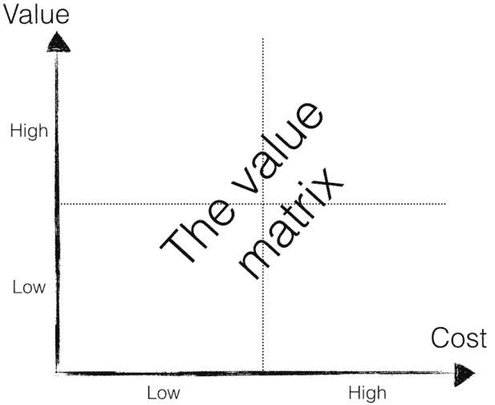
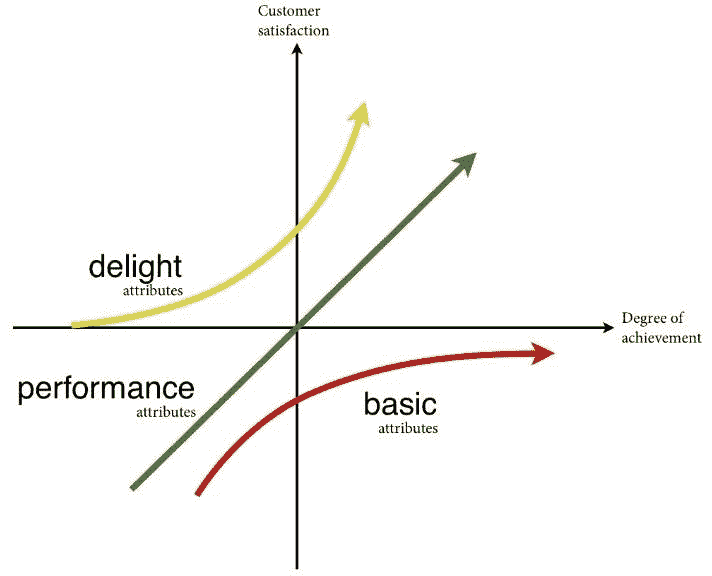
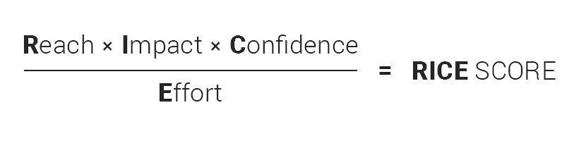

# 产品经理的 6 种强大的优先级排序技术

> 原文：<https://medium.com/hackernoon/6-prioritization-techniques-to-make-you-stop-working-on-the-wrong-stuff-646cc6429edc>

知道如何有效地优先考虑创意和功能是现代产品管理中最大的挑战之一。

即使是最有经验的产品经理在规划他们的路线图时，也可能会担心如何决定先做什么。作为产品战略的一个重要组成部分，优先排序是值得不断研究和改进的。在我最近的帖子中，我刚刚分享了一些关于[如何管理产品战略](https://hackernoon.com/how-to-manage-product-strategy-and-prioritize-like-a-pro-guide-for-product-managers-3641011140f2)的见解，所以现在是时候详细阐述有助于解决许多问题的优先排序了。

为什么优先化对产品经理来说是一个挑战？以下是一些原因:

*   我们经常关注智能特性，而不是直接影响我们目标的特性。
*   我们经常不顾一切地钻研新功能，而不是我们已经有信心的产品功能。
*   我们有时不会考虑一个特性比另一个特性需要更多的努力。
*   致力于我们自己会使用的想法会更令人愉快，而不是具有广泛影响力的特性，等等。

优先排序技巧意味着在有限的时间里获得更多。如何在各种方式、方法和框架中选择最佳的优先方式？

在这里，我将一些关于如何区分产品特性优先级的最佳方法整合到一个基本列表中。

# 2019 年将震撼你的 6 个优先排序技巧

# 1.精益优先(2x2 矩阵)

理解价值和努力概念的一个简单易行的方法是将其形象化为 2x2 矩阵。

精益优先顺序的 2x2 矩阵有助于制定决策，并确定什么是重要的或有风险的，以及努力的方向。这个矩阵通常与经典的艾森豪威尔矩阵联系在一起。

2x2 矩阵广泛用于产品管理中的功能优先级排序，因为它有助于整理所有项目并使事情有序。

你所需要的就是在白板上画一个大大的“加号”,并沿着纵轴和横轴标记“价值”和“努力”,或者使用任何具有基于矩阵的内置框架的[强大的产品管理工具](https://hygger.io/)。

比较价值和努力的组合有助于更好地确定任务的优先级，并选择对发展最重要的任务。价值展示了该特性能给你的产品带来的商业价值；努力度量完成任务所需的资源。

您必须定期重新访问矩阵，并在必要时重新平衡它——几个月前被视为低价值的项目现在可能相对于待办事项中的其他功能具有更高的价值。

该矩阵可以作为其他流行的优先级排序方法的基础，例如[价值与风险](https://university.hygger.io/prioritization-techniques/value-vs-risk-model)、[价值与成本](https://university.hygger.io/prioritization-techniques/value-vs-cost-and-value-vs-complexity)、[价值与复杂性](https://university.hygger.io/prioritization-techniques/value-vs-cost-and-value-vs-complexity)。

深入了解[精益优先](https://university.hygger.io/prioritization-techniques/value-vs-effort)方法的细节。

# 2.莫斯科优先化技术

莫斯科是确定需求优先级最简单的方法之一。它的名字和俄罗斯的首都毫无共同之处。首字母缩略词 MSCW (must，should，could，would)是由戴·克莱格于 1994 年首次提出的。然后人们加上了两个“o ”,使这个首字母缩略词更容易发音。

优先级方法允许您将您的需求、想法或功能列表分为以下几组:

*   **M(必须有)。**在最终解决方案中，这些特征必须得到满足，且不可协商。没有它们，你的产品将会失败。
*   **S(应有)。**这些功能具有高优先级，但对启动并不重要。他们在你的优先列表中占据第二位。
*   **C(可能有)。**理想但非必要的产品特性。
*   **W(不会有)。**通常，这些特性不会在当前版本中实现。然而，它们可能包含在未来的发展阶段中。

如果看起来很难，就试着用容易理解的例子来理解它:

让我们深入一个与产品管理没有太大关系的俗气案例。想象一下，你正在担心 [*如何让你的产品团队的日常会议更有成效*](https://hygger.io/blog/stand-up-meeting-best-practices/) *更有效率。*

你计划为你的团队租一间新的会议室，里面有额外的座位、会议机会和高科技通信设备，可以更有效地举行日常的单口相声。

你现有的房间太狭窄，不够舒适，不适合与来自其他国家的同事和合作伙伴举行高质量的远程会议。

因此，根据莫斯科方法定义优先级，你会得到:

*   一个新的宽敞的房间，舒适的座位，一个大圆桌，和完善的通用通讯系统。
*   *S:额外的座位、无限制的流动性、高质量的通风系统、舒适的白板和活动挂图、充足的照明。*
*   *C:一台超现代的咖啡机，可以用来喝咖啡、贴纸、漂浮物、额外的笔记本。*
*   柔和色调的壁纸，额外的插座，一个放松的大红色沙发。

**这种技术有什么好处？**

莫斯科方法有助于对您的产品项目进行排序和分类，以获得成功的结果。该方法基于您团队的专家意见。它可以轻松快速地完成并定义正在进行的功能的优先级。

了解更多关于[莫斯科技巧](https://university.hygger.io/prioritization-techniques/moscow-prioritization-method)。

# 3.卡诺模型

如果你关心优先考虑顾客满意和高兴，卡诺模型是最好的选择之一。

产品经理可能会承认，他们的功能积压经常看起来没完没了，但他们真诚地希望用正确的功能创建一个产品路线图。尽管如此，还是有很多疑问:如何衡量满意度？如何选择构建什么来提供它？如何超越满足进入完全的喜悦？Kano 模型是指导解决这些问题的强大的优先化工具。

Noriaki Kano 在 20 世纪 80 年代发展了产品开发和顾客满意的 Kano 理论。根据该模型，有三个前提:

*   **反映客户享受产品特性的满意度**取决于所提供功能的水平。
*   **客户反应**。根据客户对所提供的功能级别的反应，可以对功能进行分类。
*   **客户感受** —通过问卷调查了解客户对某项功能的感受。

作者确定了质量概况的三个主要组成部分:

1)基础。这符合产品的基本特征。

2)预期。这应该与产品的“定量”属性相对应。

3)有魅力。这与该产品令人钦佩的特性相符。

它们通过评估顾客的满意度和情感来帮助理解顾客对产品特性的看法。

探索广受欢迎的[卡诺模型](https://university.hygger.io/prioritization-techniques/kano-methodology)的更多细节。

# 4.大米评分

RICE 评分系统看起来是当今产品经理最需要的模型之一。如果你第一次见到这个缩写，下面是它的简要解释:

RICE 包括以下组成部分:影响力、影响力、信心和努力。

你需要结合这些因素来得到你的米分。

*   **Reach** 是衡量每个时期的人员/事件数量。Reach-factor 旨在估计每个功能或项目在特定时期内将影响多少人，以及有多少客户将看到这些变化。
*   **影响**显示了特性对产品的贡献。每个特定产品对价值的理解是不同的。例如，对于一个 B2B SaaS 产品来说，如果这些功能能够:提高试用到付费的转化率，帮助吸引新用户，帮助保持现有用户，等等，那么这些功能就具有很高的价值。
*   **信心**可以用百分制来衡量。如果你认为一个项目可能会有巨大的影响，但没有数据支持，确定性可以让你控制这一点。
*   **工作**估计一个特性需要所有团队成员花费的总时间，以便用最少的工作快速完成并产生影响。根据需要，工作因素被估计为“人-月”、周或小时的数量。它是一个团队成员在特定月份可以完成的工作。

深入了解[大米评分](https://university.hygger.io/prioritization-techniques/rice-score-model)系统的细节。

# 5.ICE 评分模型

ICE 评分模型允许您在没有额外要求的情况下完成工作并优先考虑您的产品功能。你必须根据以下公式计算每个想法的得分:

*   影响向您显示您的假设对您试图改进的关键指标的影响程度。
*   信心是关于你如何确定你所有的评估——包括影响和努力。
*   Ease 展示了实现的容易程度。它是对实现这个想法需要多少努力和资源的估计。

这些值的相对等级为 1-10，这样就不会使任何一个值过重。选择 1-10 的含义，只要评分保持一致。

ICE 评分的关键目标是防止你陷入过多微调分数的困境。这种优先化方法足以完成工作。

了解更多关于 [ICE score](https://university.hygger.io/prioritization-techniques/ice-scoring) 技术的信息。

# 6.根据自己的标准加权评分

这种先进的优先级排序方法有助于客观地决定接下来要执行什么功能和产品创意。

评分系统是一种便捷且低成本的方法，可以确定任何数量的事物的相对价值。把这个评分转到高级水平！

在加权评分的帮助下，您可以根据一系列标准，使用效益与成本框架对您的产品功能或创意进行排名，并应用您得出的分数来定义要削减的项目。

根据您的产品目标和全球战略，您可以选择特定的标准。

例如，它可以是(就潜在利益而言):

*   获取新客户
*   增加收入
*   留住现有客户
*   增值等。

在成本方面，您可以对开发的时间和成本、实施的时间和成本、运营成本等进行评分。

这种优先化方法的主要思想是量化你列表上的每个竞争计划，以帮助你优先化产品路线图。

公司应用加权评分来评估他们认为新功能对战略目标的相对影响。

如果你想了解更多关于[加权评分](https://university.hygger.io/prioritization-techniques/weighted-scoring)的内容，可以随意学习详细教程。

## 想要更多吗？

这些技术中的每一种对于不同的产品管理需求似乎都是有用和有效的。尝试过所有这些方法后，你一定会找到最佳选择。然而，即使这没有发生，你也有机会尝试其他的优先级排序方法。尝试应用质量功能展开、故事映射、KJ 方法论、“特征桶”等技术。

你想了解他们更多吗？好吧，我想我该计划下一篇关于它的文章了；)