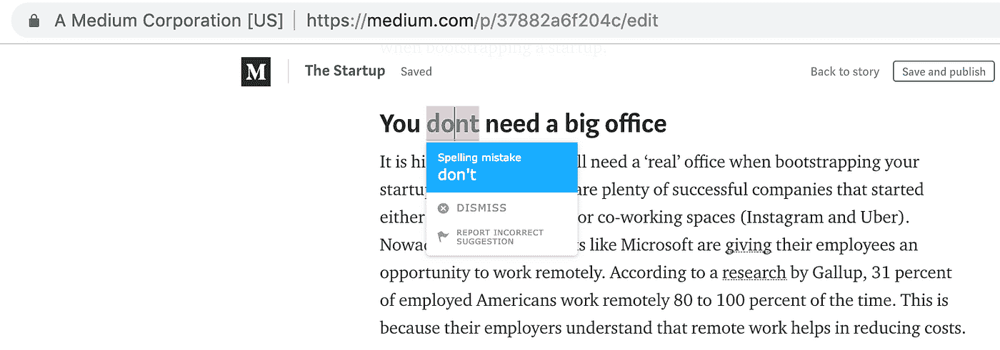
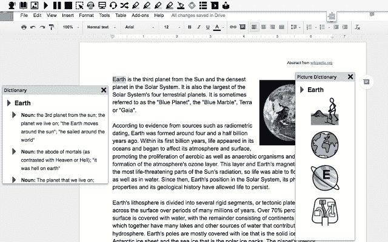
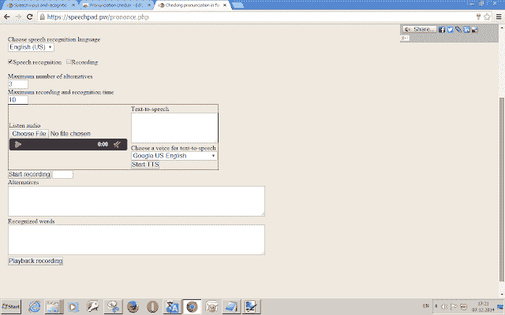
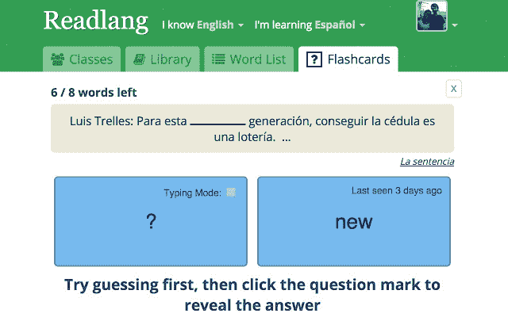
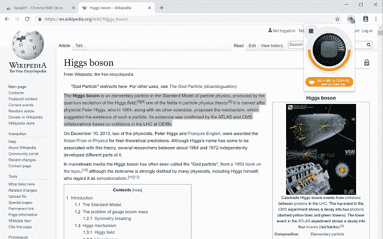

# 7 个用于学习英语的 Chrome 扩展

> 原文：<https://medium.com/hackernoon/7-chrome-extensions-for-learning-english-d3aeb4fb33ed>

我住在美国，但我的母语不是英语。我是谷歌浏览器的活跃用户。这就是为什么我想出了这个有用的扩展列表，它将帮助英语学习者提高写作、拼写、听力技能，并扩大他们的词汇量。

## [**发短信。艾**](https://chrome.google.com/webstore/detail/textlyai/ndgklmlnheedegipcohgcbjhhgddendc/)

免费的在线写作助手，也有一个扩展的高级版本。用户可以使用具有高级统计功能的 web 应用程序检查他们的写作，或者转而使用浏览器扩展。安装完成后，该工具会在网上跟踪你，并检测语法、拼写和风格问题，提出修改建议。要应用建议的修复，请单击它。

总是有一个正确措辞的例子对掌握英语写作技巧至关重要，所以这个工具对那些想写得更好的人来说很有用。

发短信。AI 支持流行的社交网站如 Twitter 和脸书，邮件服务如 Gmail，博客平台如 Medium 和 WordPress。

## [**读&写**](https://chrome.google.com/webstore/detail/readwrite-for-google-chro/inoeonmfapjbbkmdafoankkfajkcphgd)

对语言学习者来说最好的扩展之一，它不仅仅关注英语。主要功能:文本到语音的翻译，反之亦然，文本和图片字典，上下文建议。如果你对特定单词的发音或含义感到困惑，这是找到答案的完美工具。

## [**多林戈**](https://chrome.google.com/webstore/detail/duolingo-on-the-web/aiahmijlpehemcpleichkcokhegllfjl?hl=en)

这个扩展对于词汇的增强很方便。注册后，你需要选择目标语言，设定你的每周目标，并开始解决任务。Duolingo 提供分成模块的课程，以掌握特定的技能。

[**发音检查器**](https://chrome.google.com/webstore/detail/pronunciation-checker/jlkpkdklllddkljfanjoakohflbnanpe)

如果你想掌握你的发音以及写作、阅读和词汇，这个扩展将会非常方便。它的语音识别技术可以很好地检测拼写错误。用户可以添加他们喜欢的音频文件或学习除英语之外的其他语言。

## [**ReadLang**](https://chrome.google.com/webstore/detail/readlang-web-reader/odpdkefpnfejbfnmdilmfhephfffmfoh)

这种扩展切换外语单词与母语的选择，在一次点击。此外，用户可以制作卡片来更好地记忆短语。该系统支持 40 种语言。

## [**SpeakIt**](https://chrome.google.com/webstore/detail/speakit/pgeolalilifpodheeocdmbhehgnkkbak)

又一个听力训练工具。您需要突出显示网页上的文本，以将其转换为语音。该工具支持 50 多种语言，对英语学习非常有用。

## [谷歌翻译 ](https://chrome.google.com/webstore/detail/google-translate/aapbdbdomjkkjkaonfhkkikfgjllcleb)

令人惊讶的是，Google 开发者为他们的翻译服务创建了有用的扩展。它可以应用于网络上任何地方的未知单词的即时翻译。

你知道哪些有用的语言学习 Chrome 扩展？请在下面的评论中分享链接！