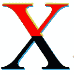
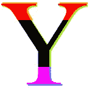
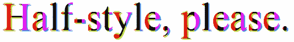
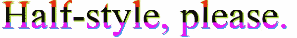
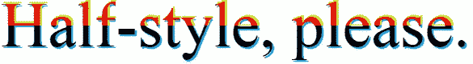
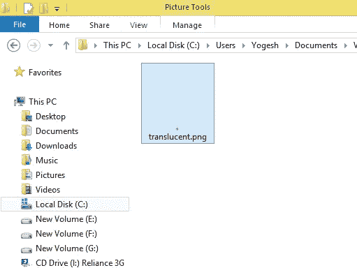
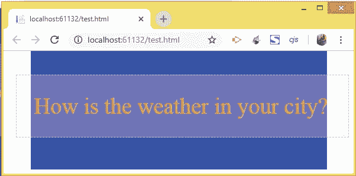
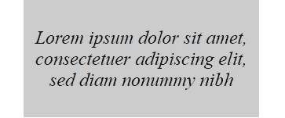
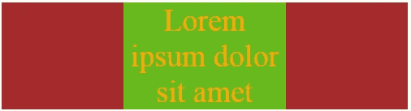

# 从初学者到专家，每个开发人员都应该知道的 7 个常见的 Web 开发问题

> 原文：<https://medium.com/hackernoon/7-common-web-development-problems-which-every-developer-from-beginners-to-experts-should-know-with-47a7d2e9367f>


Web 开发可能是一项复杂的任务，因为它涉及到许多技术和语言，如 HTML、JavaScript 和 PHP、ASP.NET、My SQL 和 AJAX。可能会有一些问题，你会被困几个小时到几天。这可能是非常令人沮丧的，因为碰巧没有地方可去，找到你的解决方案。在我的 web 开发生涯中，我碰巧遇到了许多问题，但幸运的是我及时得到了它们的解决方案。

因此，我决定写这篇教程来指出 5 个常见的 Web 开发问题，每个初学者、中级或专家开发者都应该知道如何解决这些问题。因此，不再浪费时间，让我们一个一个地开始。

> **问题 1:将 CSS 应用于字符的一半**

我们大多数人可以认为`CSS` 可以应用于任何角色，但永远不能应用于半个角色。但是你错了，因为有一种方法可以将`CSS` 应用于任何字符的一半。

你可以使用名为 **HalfStyle** 的**插件**，可以从 [**GitHub**](https://github.com/arbelh/HalfStyle) 下载

使用这个插件，你可以以一种非常简单的方式，对一个字符的每一半或三分之一(甚至是整段文字)进行垂直或水平样式化*。*

> ****安装****

*从 GitHub 下载插件 zip 文件，并将文件夹解压到您的网站。*

*接下来，将对 ***HalfStyle CSS an JS 和 jQuery*** 的引用添加到网页的 head 部分，如下所示:*

```
*<link href="HalfStyle-master/css/halfstyle.css" rel="stylesheet" /><script type="text/javascript" src="HalfStyle-master/js/jquery.min.js"></script><script type="text/javascript" src="HalfStyle-master/js/halfstyle.js"></script>*
```

*现在你可以使用它了。*

> ****为单个字符****

*添加类别。' halfStyle '添加到包含要半样式化的字符的元素中。并赋予它属性`data-content="character"`(用你想要的字符替换字符，比如‘X’或‘Y’)。*

**例 1:字符 X 被设计成水平半体**

```
*<span class="halfStyle hs-horizontal-half" data-content="X">X</span>*
```

**

***Horizontal Half***

**例 2:字符 Y 被水平样式化第三**

```
*<span class="halfStyle hs-horizontal-third" data-content="Y">Y</span>*
```

**

***Horizontal Third***

**例 3:字符 X 的样式垂直第三**

```
*<span class="halfStyle hs-vertical-third" data-content="X">X</span>*
```

**

***Vertical Third***

**例 4:字符 Y 被设计成垂直半体**

```
*<span class="halfStyle hs-vertical-half" data-content="Y">Y</span>*
```

**

***Vertical Half***

*CSS 类——‘T3’，‘T4’，‘T5’，‘T6’是自定义的 CSS 类，在`HalfStyle.css` 文件中定义。*

*您可以根据需要在'`: before`'和'`:after`'类中更改它们的属性，如颜色、字体等。*

> ****为文本****

*将`.textToHalfStyle`类和数据属性`data-halfstyle=“[-CustomClassName-]”`添加到包含文本的元素中。*

**示例 1:文本样式垂直对半**

```
*<span class="textToHalfStyle" data-halfstyle="hs-vertical-half">Half-style, please.</span>*
```

**

***Text Styled Vertical Half***

**示例 2:第三种垂直样式的文本**

```
*<span class="textToHalfStyle" data-halfstyle="hs-vertical-third">Half-style, please.</span>*
```

**

***Text Styled vertical third***

**示例 3:水平样式的文本第三个**

```
*<span class="textToHalfStyle" data-halfstyle="hs-horizontal-half">Half-style, please.</span>*
```

**

***Text Styled Horizontal Third***

**示例 4:水平对半样式的文本**

```
*<span class="textToHalfStyle" data-halfstyle="hs-horizontal-third">Half-style, please.</span>*
```

**

***Text Styled Horizontal Half***

> ***问题二:如何在不重装页面的情况下修改网址***

*每个初学 JavaScript 的程序员都知道'【T4]'会重新加载页面。因此，为了在不重新加载的情况下更改页面的 URL，您应该使用'`pushState()`'方法。*

**例子:创建一个按钮，点击后将改变网址:**

```
*<button onclick="changeURL()">Click here</button><script>
function changeURL() {
    window.history.pushState('page2', 'Title', '/about.html');
}
</script>*
```

*我使用了`pushState()`方法将 URL 改为*about.html*。该方法有 3 个参数:*

***1。状态** —状态对象是与`pushState()`创建的新历史条目相关联的 JavaScript 对象。每当用户导航到新的状态时，就会触发一个`popstate`事件，该事件的 state 属性包含历史条目的 state 对象的副本。*

***标题** —您要前往的州的简短标题。*

***URL** —新的 URL 由该参数给出。请注意，在调用`pushState()`之后，浏览器不会尝试加载这个 URL，但是它可能会在稍后尝试加载这个 URL，例如在用户重启浏览器之后。*

*注意，可以通过使用 [**jQuery 加载方法- load()**](http://www.yogihosting.com/jquery-load/) 来重新加载新 URL 的内容。`.load()`方法是一个非常强大的 AJAX 方法，它不仅可以获取另一个页面的完整 HTML 内容，还可以获取基于`CSS` 类和`Ids`的元素内容。*

> ***问题 3:给文字一个透明的背景***

*有两种方法可以解决这个问题，它们是:*

> ****1。制作透明背景图片****

*这里你创建一个`.png`格式的小`1px*1px`透明点图像。我用 Photoshop 制作了这张图片，它的尺寸只有`95 bytes`。该图像为浅灰色，如下所示:*

**

***Transparent Image***

*现在，要使用这个图像作为背景，我必须像这样使用`CSS`的背景属性的 URL 值:*

```
*background: url("Content/Images/translucent.png") repeat;*
```

*让我们看一个例子。*

*像这样创建两个 div:*

```
*<div class="containerDiv">
    <div class="transparentDiv">
        How is the weather in your city?
    </div>
</div>*
```

*现在将这些 div 的 CSS 添加到样式表中，如下所示:*

```
*.containerDiv {
  height: 200px;
  width: 500px;
  background-color: blue;
  position: relative;
}.transparentDiv {  
  color: orange;
  font-size: 38px;
  padding: 30px;
  background: url("Content/Images/translucent.png") repeat;
  position: absolute; 
  left: -25px;
  width: 100%;
  top: 40px;
}*
```

*请注意，通过为“containerDiv”提供**位置:绝对**属性,“transparentDiv”位于“container div”之上。还要注意背景属性，我已经将图像设置为“transparentDiv”的背景。*

*当您在网页中运行这段代码时，它看起来会像:*

**

***Transparent background using transparent background image***

> ****2。使用 CSS 3 背景色属性****

*你可以使用 CSS 3 `backgound-colo` r 属性，而不是使用背景透明图像(如上所述)。您只需将该属性添加到。并注释掉先前的背景属性，如下所示:*

```
*background-color: rgba(240, 240, 240, 0.5);
/*background: url("Content/Images/translucent.png") repeat;*/*
```

*我已经将`rgba` 颜色格式中的浅灰色背景指定为 240、240、240，并使用 0.5 的不透明度来获得想要的透明效果。*

**

***Transparent background using CSS3 background-color property***

> ***问题 4:用 CSS 垂直居中文本***

*有许多方法可以垂直对齐文本。可以使用 CSS 的`line-height`属性或者使用绝对定位来实现。在我看来，你可以很容易地做到这一点，只使用'显示'属性。有两种方法可以做到这一点:*

> ****1。使用显示:flex 属性****

*这里我将使用 Flexbox 并赋予元素以下 CSS 属性:*

```
*display: flex;
align-items: center;*
```

*例:在你的网页中添加下面的 div*

```
*<div class="box">
    Lorem ipsum dolor sit amet, consectetuer adipiscing elit, sed diam nonummy nibh
</div>*
```

*还添加了将垂直对齐 div 中包含的文本的`CSS` 。*

```
*.box {
    height: 150px;
    width: 300px;
    background: #CCC; 
    color: #000;
    font-size: 24px;
    font-style: oblique;
    text-align: center;
    display: flex;
    align-items: center;
}*
```

*注意:最后两个属性负责文本的垂直对齐。*

*现在运行网页中的代码，您将看到文本垂直居中对齐，如下所示:*

**

***Vertically Center Alignment of text using display flex***

> ***2。使用显示:表格属性***

*在这种方法中，我使用 CSS 来模拟表格行为，因为表格支持垂直居中对齐。这里父 div 提供了 **display: table** 属性，而子元素提供了两个属性，分别是:*

```
*display: table-cell;
vertical-align: middle;*
```

*示例:让我展示一个包含 3 个 div(并排排列)的示例。每个 div 都有不同长度文本，这些文本都以垂直居中的方式对齐。*

*将以下代码添加到您的页面中:*

```
*<div class="verticallyCenter">
    <div>First</div> 
    <div>This is the Second div</div>
    <div>Third div</div>
</div>*
```

*有一个父 div 具有名为“verticallyCenter”的 CSS 类。这个 div 包含 3 个子 div。*

*接下来，将以下 CSS 添加到页面中:*

```
*.verticallyCenter {
    background-color: red;
    display: table;
    height: 100px;
}.verticallyCenter div {
    font-size: 25px;
    display: table-cell;
    vertical-align: middle;
    width: 33%;
    padding: 5px;
}*
```

*请注意,“vertically center”div 包含的是 **display: table** ,而 3 个孩子被赋予了以下 2 个重要属性:*

```
*display: table-cell;
vertical-align: middle;*
```

*现在，在您的浏览器中运行您的网页，它将看起来像:*

**

***Vertically Center Alignment using display table***

> ****问题 5:如何制作一个 div 100%高度的浏览器窗口****

*你可以通过使用**视口百分比**长度来做到这一点，视口百分比长度相对于初始包含块(即 body 标签)的大小。当窗口的高度或宽度改变时，它们会相应地缩放。*

**这些单位是 vh(视口高度)、vw(视口宽度)、vmin(视口最小长度)和 vmax(视口最大长度)。**

*我们可以利用`vh: 1vh`等于视口高度的 1%。也就是说，`100vh` 等于浏览器窗口的高度。*

*所以 follow div(下面给出)等于浏览器窗口的高度，而不管它在 DOM 树中的位置:*

```
*<div style="height: 100vh">Some content</div>*
```

> ****100 VH 和 100%有什么不同？****

*考虑下面的例子:*

```
*<div style="height:200px">
  <p style="height:100%;">Hello, world!</p>
</div>*
```

*这里,“Hello world”段落元素的高度为 200 像素，因为父 div 的高度为 200 像素。*

*现在将 p 元素的高度改为`100vh` ，如下所示:*

```
*<div style="height:200px">
  <p style="height:100vh;">Hello, world!</p>
</div>*
```

*现在，不管 div 的高度如何，段落元素都将是正文的 100%高度。*

> ****问题六:如何知道选中了哪个单选按钮****

*要找出哪个单选按钮被选中，可以使用 jQuery 或 JavaScript。假设有 3 个单选按钮用于选择一个人的性别。所有这些单选按钮都有一个共同的名字，叫做“性别”。*

```
*<input type="radio" name="sex" value="Male" />Male
<input type="radio" name="sex" value="Female" />Female
<input type="radio" name="sex" value="Unspecified" />Unspecified*
```

*现在，在 jQuery 代码中创建这些单选按钮的 click 事件。然后使用。val()方法找出所选单选按钮的值。该代码如下所示:*

```
*$("input[name='sex']").click(function () {
  alert($(this).val());
});*
```

*复选框与单选按钮类似，只是您可以为一个选项选择多个复选框。在[**jQuery Checkbox Checked**](http://www.yogihosting.com/check-uncheck-all-checkbox-using-jquery/)教程中，你可以学到所有使用 Checkbox checking 或 un checking 的方法。*

> ***问题 7:以中间水平方式对齐文本和元素***

*使用 **text-align: center** 将文本放置在元素的水平中间。例如，在您的网页中添加以下 div:*

```
*<div class="container">
    Lorem ipsum dolor sit amet
</div>*
```

*还将下面的 CSS 添加到样式表中:*

```
*.container {
  width: 500px;
  background-color: brown;
  color: orange;
  font-size: 38px;
  text-align: center;
}*
```

*请注意，我在 CSS 中将 text-align 设置为居中。当您在浏览器中运行它时，文本将被放置在 div 的中心。下图显示了这一点:*

**

***Using text-align: center***

*当你想将整个元素对齐到它的父元素的中心时，你可以在 CSS 中使用“margin: auto”。这种方法用于将整个网站内容与页面中间对齐。*

*现在更新上面的 div 以包含一个子 div，它将被放置在中心。代码如下所示:*

```
*<div class="container">
  <div class="centerDiv">
    Lorem ipsum dolor sit amet
  </div>
</div>*
```

*为 centerDiv 添加以下 CSS:*

```
*.centerDiv {
  background: #67b91e;
  width: 200px;
  margin: auto;
}*
```

*请注意页边距:自动给定到 centerDiv。*

*现在在浏览器中运行该网页，您将看到 centerDiv 与其父级的中心对齐。查看下图:*

**

***Align Child in the middle of the parent***

***结论***

**

*我希望你在这篇教程中发现了一些新的东西来增加你的 web 开发知识。如果是这样的话别忘了给**拍几下**以示喜欢。它不仅会给我的坏脸带来微笑，还会激励我为网站开发者写更多更好的文章。*

*和往常一样，**关注我**，每当我在 Medium 上发表新文章时，都会收到通知。*

*另外查看我在 HACKERNOON 的另一篇文章—[**ASP.NET 核心—如何在实体框架核心**](https://hackernoon.com/asp-net-core-how-to-use-dependency-injection-in-entity-framework-core-4388fc5c148b) 中使用依赖注入*