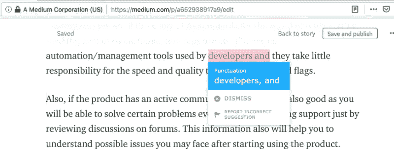
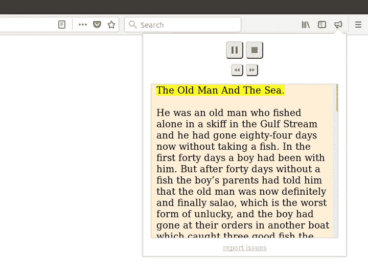
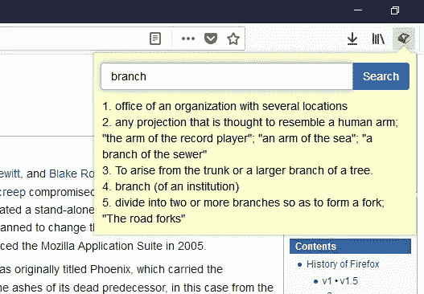
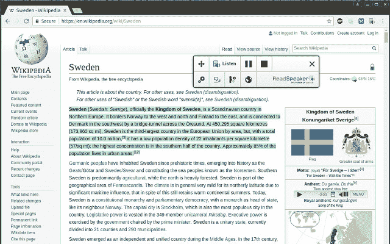
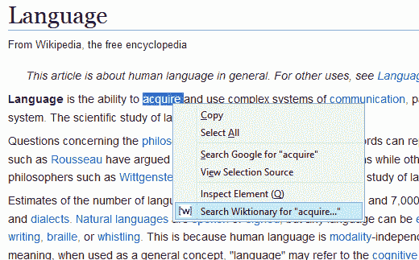

# 每个英语学习者都应该使用的 7 个火狐插件

> 原文：<https://medium.com/hackernoon/7-firefox-add-ons-every-english-learner-should-make-use-of-5c0f9dcef240>

*Image credit:* [*Pexels*](https://www.pexels.com/photo/boots-footwear-indoors-parquet-165221/)

Firefox 是我最喜欢的浏览器之一，通过使用插件，它的功能可能会得到显著扩展。我也是一个积极的英语学习者和用户，所以我列出了一个 Firefox 插件列表，这些插件将有助于提高写作、拼写、听力技能，并扩大词汇量。

## [**发短信。艾**](https://addons.mozilla.org/en-US/firefox/addon/textly/)

发短信。AI 是一个语法检查器，它使用先进的 AI 算法来检测书写、拼写和风格错误。在你安装了这个插件后，它会在任何一个有所谓的文本区的网站上检查你的书写，用户可以在这个文本区输入一些东西。该系统支持许多流行的网站，如 Gmail、脸书、Twitter、Medium 或 WordPress。

当检测到错误时，检查器会突出显示该错误。要应用修复，您需要单击建议的更正。这对语言学习者来说非常方便，因为日复一日，你会看到你的常见错误，并更好地记住如何正确书写某些单词。

## [林多 ](https://addons.mozilla.org/en-US/firefox/addon/linduo/)

正如 LinDuo 的开发者所说，该工具可以在一个月内帮助学习 1000 个新英语单词。学习过程游戏化。在游戏过程中，该工具显示单词及其图形表示，并可以播放正确的发音。

在每个完成的课程之后，用户被授予所谓的经验点，这将刺激继续学习。不确定每月 1000 个单词的进度，但是用这个工具每月至少学习几十个单词是可能的。

## [**口中念念有词**](https://addons.mozilla.org/en-US/firefox/addon/read-aloud/)

这是掌握听力技巧的一个很好的工具，这个插件使用定制的语音识别技术，允许它大声朗读网络上的每一篇文本。这意味着你可以边听感兴趣的文章边学习，而不是枯燥的学习材料。用户可以设置语音类型和阅读速度。大声朗读甚至可以阅读 pdf。

## [**英语弹出词典**](https://addons.mozilla.org/en-US/firefox/addon/english-popup-dictionary/)

方便的火狐量子词典。它的工作非常直接——双击页面上的单词来查看翻译。

## [**read speaker TextAid**](https://addons.mozilla.org/en-US/firefox/addon/readspeaker-textaid-add-on/)

另一个文本到语音转换器。它可以转换成音频网页、谷歌文档、微软 Word 在线页面，甚至可以听写你正在输入的文本。

## [**语境 wikitionary**](https://addons.mozilla.org/en-US/firefox/addon/context-wiktionary/)

一个简单的附加组件，但仍然很有帮助。有助于在维基词典数据库中查找单词的实际含义。然后，搜索结果会显示在新选项卡中。

## [谷歌翻译 ](https://addons.mozilla.org/en-US/firefox/addon/google-translate-right-menu/)

通过打开带有翻译的新标签，类似于上下文 Wiktionary。强大的翻译工具，可以节省你很多时间。

你知道哪些有用的语言学习火狐插件？请在下面的评论中分享链接！