# 2020 年你应该知道的 7 个前端 JavaScript 趋势和工具

> 原文：<https://medium.com/hackernoon/7-frontend-javascript-trends-and-tools-you-should-know-for-2020-fb1476e41083>

## 前端开发人员应该开始学习的七个固执的预测…

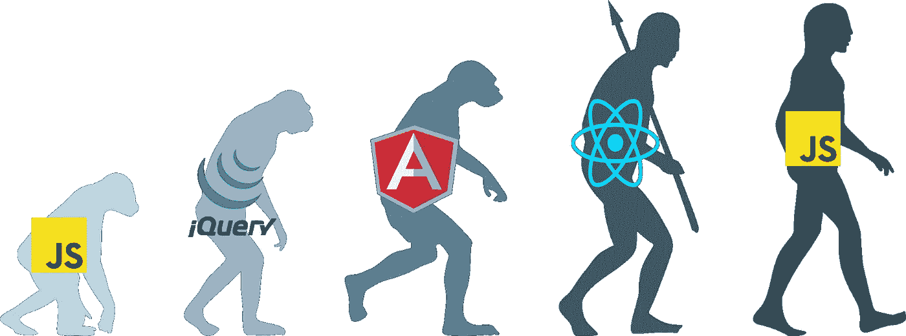

Image from [codeburst](https://codeburst.io/building-efficient-components-6ee2bdaea542) by [@webrealizer](http://twitter.com/webrealizer)

JavaScript 世界发展迅速。

前端开发(和 web 开发)的世界正在飞速发展。今天，如果你不在 top 或 Webpack，React Hooks，Jest，Vue 和 NG 元素之上，你会开始感觉到差距在扩大。但是，事情正在发生变化。

虽然前端丛林中的开发人员和技术人员的数量逐年激增，但生态系统渴望实现标准化。新技术和工具的出现已经在改变游戏规则。

可以肯定地说，总的趋势将是 UI 标准化，一种基于组件的组合，它影响了从样式到测试甚至状态管理的一切，以及更好的整体模块化。这将包括围绕 web 组件、es 模块、以组件为中心的工具等构建的技术。

这是对未来几年前端开发状态的一个自以为是的简短和片面的观察。很自然地，它错过了一百万件事情，所以请不要客气地跳到下面，加入你的见解。

# 1.框架不可知论 Web 组件

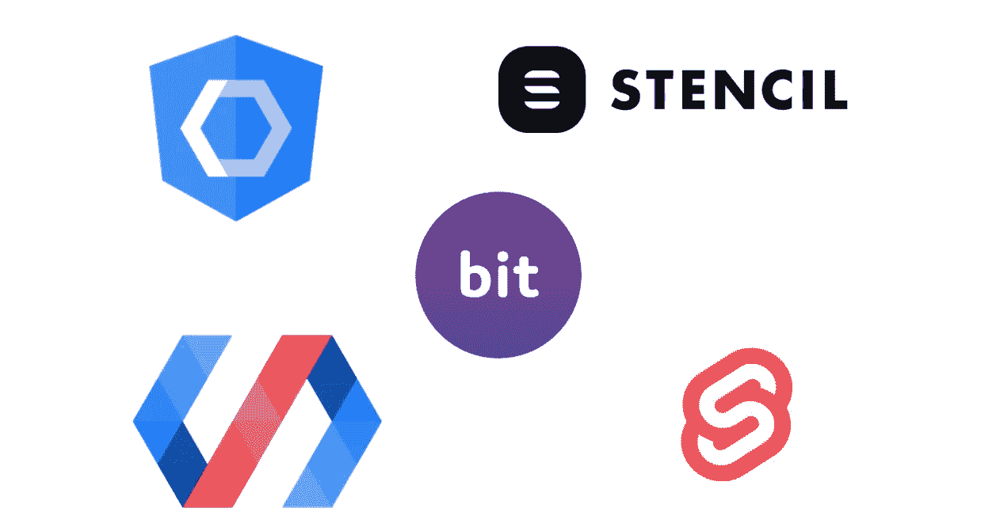

所以基本上，这就是未来。为什么？因为这些纯 web 组件是框架不可知的，可以在没有框架或任何框架拼写标准化的情况下工作。因为它们摆脱了 JS 疲劳，并且得到了现代浏览器的支持。因为它们的包大小和消耗将是最优的，并且 VDOM 渲染是令人兴奋的。

这些组件提供了 Custom Element，一个 Javascript API，它允许您定义一种新的 html 标记、指定布局的 HTML 模板，当然还有本质上特定于组件的 Shadow DOM。

在这个领域需要了解的突出工具有 [**Lit-html**](https://github.com/Polymer/lit-html) (和 [Lit-element](https://lit-element.polymer-project.org/) )、 [**StencilJS**](https://github.com/ionic-team/stencil) 、[**SvelteJS**](https://github.com/sveltejs/svelte)**，当然还有**[**Bit**](https://bit.dev)，用于可重用的模块化组件，可以在任何地方直接共享、使用和开发。****

****当考虑我们 UI 开发的未来，以及模块化、可重用性、封装和标准化的原则在组件时代应该是什么样子时，web 组件就是答案。下面了解更多。****

**** [## 2019 年开发 Web 组件的 7 个工具

### Web 组件在野外:从 lit-html 到 Stencil，Svelete 和超越。

blog.bitsrc.io](https://blog.bitsrc.io/7-tools-for-developing-web-components-in-2019-1d5b7360654d)  [## 2019 年你应该知道的 9 个 Web 组件 UI 库

### 寻找与框架无关的 web 组件？看看

blog.bitsrc.io](https://blog.bitsrc.io/9-web-component-ui-libraries-you-should-know-in-2019-9d4476c3f103)  [## Web 组件原型:构建一个 RSS 阅读器

### 如何使用 web 组件、ES6 模块和朋友构建应用原型。

blog.bitsrc.io](https://blog.bitsrc.io/prototyping-with-web-components-build-an-rss-reader-5bb753508d48) 

# 2.框架战争的未来？

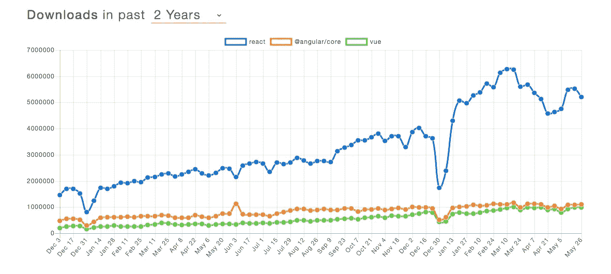

Yeah, in NPM downloads React is still queen. For [now](https://www.npmtrends.com/react-vs-@angular/core-vs-vue).

所以我们并不打算深究“谁更好，为什么”，你可以在下面找到这个问题的更多答案。相反，我们将后退一步，注意更大的画面。围绕组件的前端技术的整体“市场份额”正在增长。不断地。新开发人员的加入率也在快速增长，并且有更多的空间供工具采用。

那么，从现在起的 5 年内，哪个框架将会统治世界呢？没人知道。但是，可以肯定地说，在 web 组件统治 dom 的原生 JS 生态系统中，它将是一个最佳位置(双关语！😈).React 位于 NPM 下载量的首位。**然而——**看看[这些数字](https://w3techs.com/technologies/comparison/js-react,js-vuejs)。似乎在实际的网络使用中，差距**很小**。

令人震惊，对吧？😃

[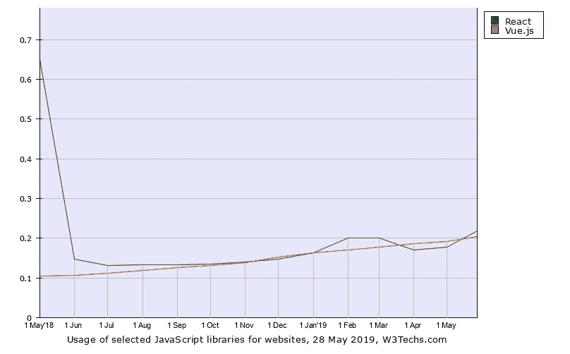](https://w3techs.com/technologies/comparison/js-react,js-vuejs)

Vue and React are, in fact, quite close in real-world usage.

随着与框架无关的 web 组件的未来标准化，人们可能会怀疑它对 UI 框架战争的影响。是的，React 不是一个框架…我们知道。

利用真实数据深入研究框架基准测试:

 [## 小型 web 应用的 Angular、React 和 Vue 基准测试

### 比较 2019 年真实生活应用程序的大小、速度等

blog.bitsrc.io](https://blog.bitsrc.io/benchmarking-angular-react-and-vue-for-small-web-applications-e3cbd62d6565)  [## react vs Angular vs vue . js—2019 年选什么？(已更新)

### 前段时间我们发表了一篇文章，对比 Angular 和 React。在那篇文章中，我们展示了利弊…

medium.com](/@TechMagic/reactjs-vs-angular5-vs-vue-js-what-to-choose-in-2018-b91e028fa91d) 

# 3.微前端

[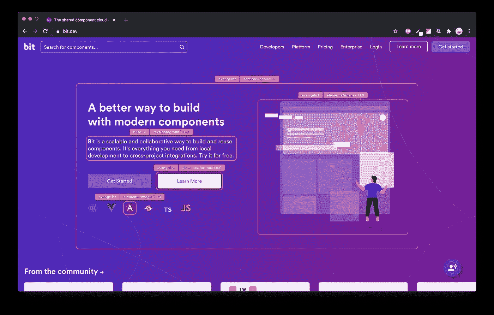](https://blog.bitsrc.io/how-we-build-micro-front-ends-d3eeeac0acfc)

微前端是将整体前端代码库分割成更小、更易管理的部分的一种方式。因此，前端团队可以享受与微服务类似的好处:可维护的代码库、自治团队、独立发布和增量升级。

微前端通常被认为是在*运行时、*在服务器或客户端发生的独立前端的组合。

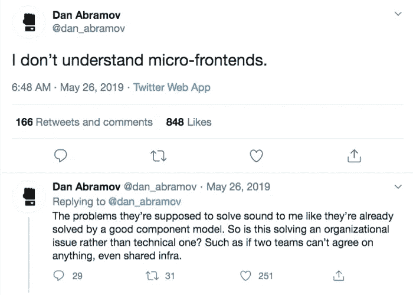

虽然运行时集成有其好处(例如，更小的有效负载)，但无论如何，它们不是实现"*独立的*可交付的*前端应用"*"的唯一方式(引用 [Cam Jackson](https://martinfowler.com/articles/micro-frontends.html) )。

有了**正确的组件模型**和**正确的工具**，任何团队都可以采用模块化的方法来构建 web 应用程序，并享受这些好处。

微前端超越了仅仅是软件设计，进入了组织设计([康威法则](https://en.wikipedia.org/wiki/Conway%27s_law)’)，让更小的团队独立拥有和交付特性，增加组织的整体生产力。

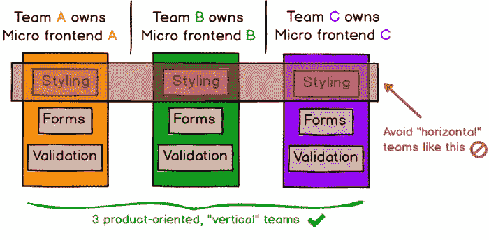

您可以通过这些有用的资源了解更多信息:

 [## 我们如何构建微前端

### 构建微前端来加速和扩展我们的 web 开发过程。

blog.bitsrc.io](https://blog.bitsrc.io/how-we-build-micro-front-ends-d3eeeac0acfc)  [## 微前端

### Cam Jackson Cam Jackson 是 ThoughtWorks 的一名全栈 web 开发人员和顾问，他对如何…

martinfowler.com](https://martinfowler.com/articles/micro-frontends.html)  [## 你应该知道的 11 个微前端框架

### 发现构建微前端的最佳库和工具。

itnext.io](https://itnext.io/11-micro-frontends-frameworks-you-should-know-b66913b9cd20)  [## 微前端的状态

### 前端 web 开发中一个更有争议的话题是微前端。他们值得吗？你真的应该分手吗…

blog.bitsrc.io](https://blog.bitsrc.io/state-of-micro-frontends-9c0c604ed13a) 

# 4.ES 模块和 CDN

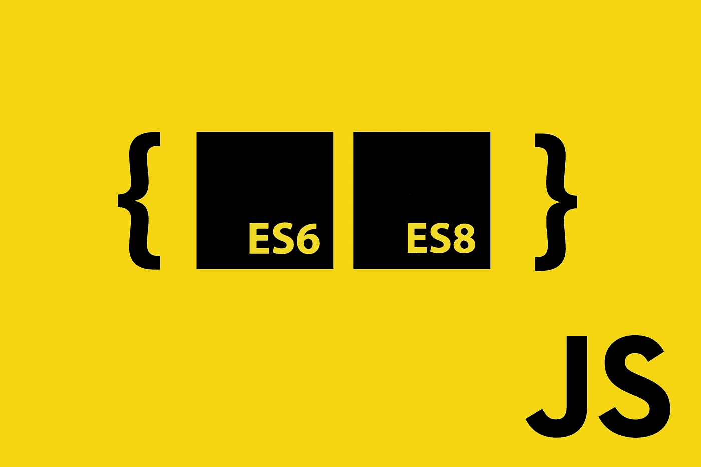

ES 模块是在浏览器中使用模块的标准，由 ECMAScript 标准化。使用 ES 模块，您可以轻松地将功能封装到可通过 CDN 等使用的模块中。随着 Firefox 60 的发布，所有[主流浏览器都将支持](https://hacks.mozilla.org/2018/03/es-modules-a-cartoon-deep-dive/) ES 模块，Node mteam 正在致力于为 [Node.js](https://nodejs.org/en/) 添加 ES 模块支持。此外，[用于 WebAssembly 的 ES 模块集成](https://www.youtube.com/watch?v=qR_b5gajwug)将在未来几年推出。试想一下，用 Bit 隔离的 JS 组件，通过 [bit.dev](https://bit.dev) 经由 CDN 消费。

 [## ES 模块:卡通深潜- Mozilla 黑客-网络开发者博客

### ES 模块为 JavaScript 带来了一个官方的、标准化的模块系统。随着 5 月份 Firefox 60 的发布，所有…

hacks.mozilla.org](https://hacks.mozilla.org/2018/03/es-modules-a-cartoon-deep-dive/)  [## 进口

### 静态导入语句用于导入由另一个模块导出的绑定。

developer.mozilla.org](https://developer.mozilla.org/en-US/docs/Web/JavaScript/Reference/Statements/import)  [## 德诺兰/德诺

### 用 V8、Rust 和 Tokio - denoland/deno 构建的安全 JavaScript/TypeScript 运行时

github.com](https://github.com/denoland/deno) 

# 5.状态管理

那么……国家管理有什么新变化？最终，我们只是通过 Redux 全球商店的一切反正对不对？

但是，这很难充分利用组件的模块化和可重用性。React 的新上下文 API 和[钩子](https://blog.bitsrc.io/search?q=hooks)意味着你不需要第三方库，可以在功能组件层面管理状态，提高模块化和可重用性。因此，展望未来，我们可能会尝试更多地从封装组件的角度考虑状态管理，而不是从全局应用程序存储的角度考虑。只是一个想法。

 [## 2019 年反应状态管理状态

### 在野外观察国家管理…商店开门营业了！🐯

blog.bitsrc.io](https://blog.bitsrc.io/state-of-react-state-management-in-2019-779647206bbc)  [## Redux 或 MobX:试图消除困惑

### 在 React 应用中使用 Redux 或 MobX？本文向您展示了两种状态管理之间的所有差异…

www.robinwieruch.de](https://www.robinwieruch.de/redux-mobx-confusion/) 

# 5.将组件样式化为组合

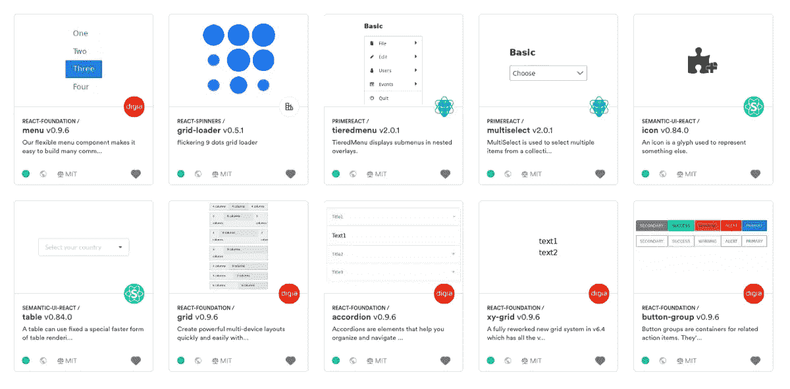

Modular with Bit: separate logic and theme components, compose your styling

因此，在过去的两年中，有很多关于样式组件的讨论。从内联 CSS 或 CSS 模块到 JS 和 styled-components 中的 CSS，甚至是像 stylable 这样的中途解决方案，选项非常多。

当想到未来几年的造型时，我喜欢把造型想象成一种构图。也就是说，我们的[组件设计系统](https://blog.bitsrc.io/building-a-consistent-ui-design-system-4481fb37470f)应该包括逻辑组件和主题化组件，它们可以使用像 [Bit](https://bit.dev) 这样的工具组合在一起。通过这种方式，你可以创建一个根据需要发展和变化的设计系统，而不会把一个笨重的库强加给不愿意采用它的开发人员。设计工具本身，如 Sketch an Figma，利用 will 组件实现这一目的(将它们与 Bit 结合，你就得到最终的组件设计系统。这太令人兴奋了。

 [## 2019 年 React 组件的 5 种风格

### 通过简短而详细的回顾，了解 2019 年 React 组件的风格

blog.bitsrc.io](https://blog.bitsrc.io/5-ways-to-style-react-components-in-2019-30f1ccc2b5b)  [## 构建 UI 组件设计系统

### 了解优步、Pinterest、Shopify 和 Airbnb 如何利用组件来构建一致的 UI/UX 设计系统。

blog.bitsrc.io](https://blog.bitsrc.io/building-a-consistent-ui-design-system-4481fb37470f) 

# 6.面向数据驱动应用的 GraphQL API 客户端

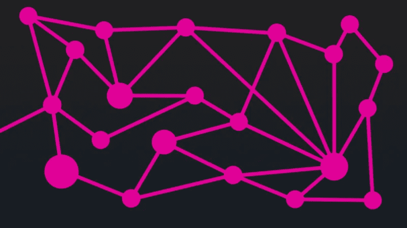

因此，使用 GraphQL 通过组件为客户打开了令人兴奋的可能性。使用 [Apollo](https://github.com/apollographql/apollo-client) 您可以轻松地构建通过 GraphQL 获取数据的 UI 组件。结合[位](https://github.com/teambit/bit)，您可以从您正在工作的消费项目中导入和开发这些组件。

通过 API 的智能管理，我们可以简化围绕数据驱动的应用程序开发的工作流程，并加快我们工作的开发速度。因此，向前看几年绝对是值得的。

 [## 2019 年你应该知道的 13 个 GraphQL 工具和库

### 增强 GraphQL APIs 开发工作流程的有用工具和库。

blog.bitsrc.io](https://blog.bitsrc.io/13-graphql-tools-and-libraries-you-should-know-in-2019-e4b9005f6fc2) 

# 7.基于组件的设计工具

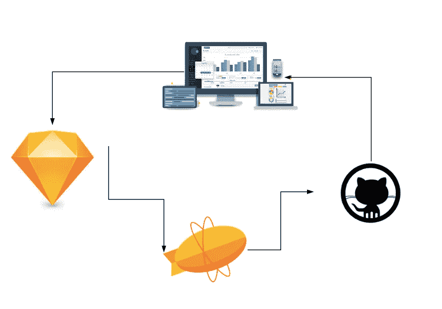

随着[组件成为我们的设计系统](https://blog.bitsrc.io/building-a-consistent-ui-design-system-4481fb37470f)，设计师和开发者之间的鸿沟将被弥合。从设计者和开发者的角度来看，这在等式的两端都是可能的。

**阅读:**

 [## 我们如何建立一个设计系统

### 用组件构建一个设计系统来标准化和扩展我们的 UI 开发过程。

blog.bitsrc.io](https://blog.bitsrc.io/how-we-build-our-design-system-15713a1f1833)  [## 设计系统:开发人员和设计人员协作

### 你的设计系统是什么，Sketch 还是 GitHub？未来有什么希望？

medium.com](/sketch-app-sources/what-is-your-design-system-really-c7a927d7bf92) 

[草图](https://medium.com/u/d39f69b23aa2?source=post_page-----fb1476e41083--------------------------------)已经在设计组件之间创建了依赖链接，因此您可以以模块化的方式设计和更新设计。与代码组件的集成已经开始萌芽，这只是时间问题。像 Figma 这样的工具是基于可重用的 UI 元素从头开始构建的。 [Framer 团队](https://medium.com/u/89a1103c5c78?source=post_page-----fb1476e41083--------------------------------)正在为编码的设计者构建一个工具，在一定程度上控制将 UI 元素转化为可重用的 React 组件。通过 [**Bit**](https://bit.dev) ，你可以把自己设计的组件变成可以在任何地方可视化发现、使用甚至开发的可重用的积木，从开发者端架起一座桥梁。Bit +组件设计工具是一个强大的未来。通过 CDN 的位和 web 组件，这意味着全面的组合。

 [## 使用 React 和 Bit 的原子设计:简化复杂的 UI

### 使用带有 React + Bit 的原子设计来简化复杂的 UI。

blog.bitsrc.io](https://blog.bitsrc.io/simplify-complex-ui-by-implementing-the-atomic-design-in-react-with-bit-f4ad116ec8db)  [## 优步设计|在优步了解设计

### 随着优步发展成为一家拥有多种产品的全球性公司，我们过去的视觉形象不再代表我们…

www.uber.design](https://www.uber.design/case-studies/rebrand)  [## 构建视觉语言

### 我们新设计系统的幕后这篇文章是我们新设计语言系统系列的一部分。卡莉…

airbnb.design](https://airbnb.design/building-a-visual-language/)****