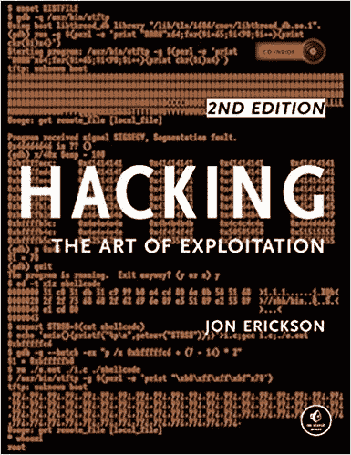
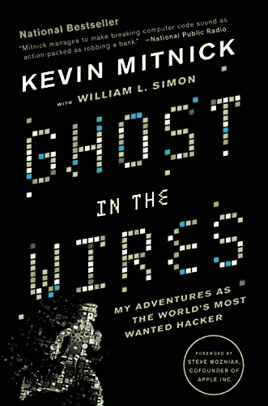
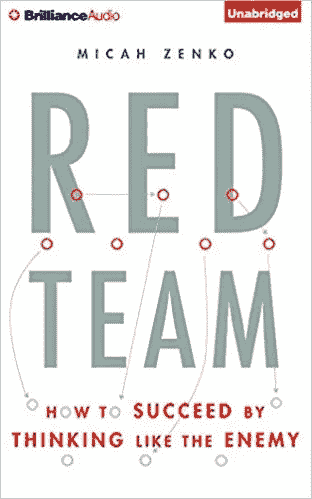
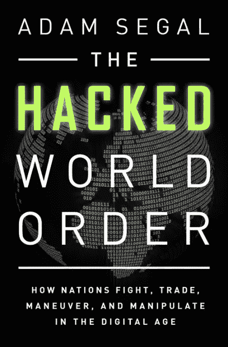
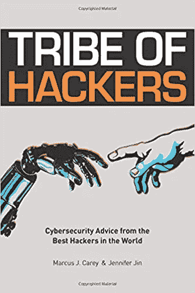
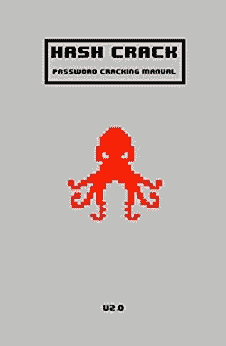
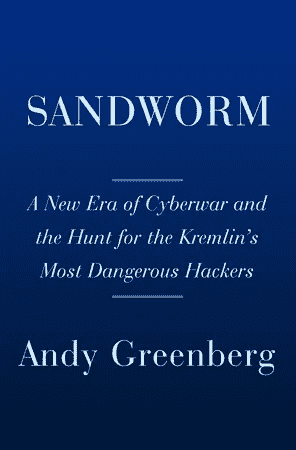

# 今年要读的 7 本关于黑客的有趣的书

> 原文：<https://medium.com/hackernoon/7-interesting-books-about-hacking-to-read-this-year-c951e6f638b0>

Image by [Freestocks.org](https://www.pexels.com/photo/kindle-technology-amazon-tablet-12627/)

今年你是否在寻找新的黑客主题书籍来阅读？你当然是。无论你是想学习一项新技能，推进你的网络安全职业生涯，还是只是阅读一篇扣人心弦的[黑客](https://hackernoon.com/tagged/hacking)故事，这里都有很多不错的选择。

这个列表包含了所有的东西。以下是今年要读的七本黑客书籍。

# 1.[《黑客:剥削的艺术》，作者乔恩·埃里克森](https://www.amazon.com/Hacking-Art-Exploitation-Jon-Erickson/dp/1593271441/ref=zg_bs_3648_26?_encoding=UTF8&psc=1&refRID=RHP33R2CB42TWG65PNRW)

我们将从初学者必读书目开始这个列表。这本书涵盖了你需要知道的一切，并以任何人都能理解的方式进行了解释。它还附带了一个 LiveCD，你可以用它来测试你新发现的黑客技术。

“黑客:利用的艺术”涵盖了从编程到网络通信到机器架构到黑客技术的所有内容。不只是告诉你如何运行漏洞，它还教你他们如何工作，并向你展示如何使你自己的。

包含的 LiveCD 为您提供了一个无需修改操作系统的 Linux 编程和调试环境。这允许你按照书中的例子调试代码，利用加密弱点，劫持网络通信和发明新的利用。

# 2.[《电线中的幽灵:我作为世界头号通缉犯的冒险》作者凯文·米特尼克和林子幸·西蒙](https://www.amazon.com/Ghost-Wires-Adventures-Worlds-Wanted/dp/0316037729/ref=as_li_ss_tl?s=books&ie=UTF8&qid=1509142089&sr=1-1&keywords=Ghost+in+the+Wires:+My+Adventures+as+the+World’s+Most+Wanted+Hacker&linkCode=sl1&tag=bat-us-20&linkId=45ddbe688eacc3fe7fe8f793982a8e8a)

《电线中的幽灵》讲述的是有史以来最著名、最难以捉摸的黑客之一凯文·米特尼克的故事。米特尼克进入了一些世界上最大的公司的网络和计算机，并躲避了当局多年。这本书讲述了他从开始从事黑客工作到被捕的生活。

这本书由米特尼克和作者林子幸·西蒙合著，引人入胜且充满悬念。虽然它没有提供实用的黑客技巧，但它确实提供了一些对一个极具影响力的黑客、社会工程师和逃脱艺术家的思想的洞察。通过他的功绩，他改变了公司保护信息的方式。作为一名网络安全顾问，他至今仍在从事这项工作。

# 3.[《红队:如何像敌人一样思考才能成功》作者 Micah Zenko](https://www.cfr.org/book/red-team)

如果你想了解更多关于红色团队的知识，这本书正适合你。由国家安全专家 Micah Zenko 撰写，这本书讲述了什么是红色团队，它的历史，红色团队如何运作，如何使用，最佳实践，常见错误等等。

这本书提供了大量基于作者与各种组织合作的经验的例子。它不会教你技术性的黑客技能，但它会告诉你如何创建和授权有效的红队。这使得它成为任何商业领袖的有用读物。如果你只是想了解 red teaming，以提高你对黑客和网络安全世界的总体理解，这也很好。它证明了像敌人一样思考在几乎任何努力中都是有益的。

# 4.

网络安全专家亚当·西格尔(Adam Segal)在《黑客世界秩序》(The Hacked World Order)一书中解释了网络空间是如何改变地缘政治的，以及它在未来会如何继续改变。网络安全现在是一个国家安全问题，几乎影响到每个人。这本书是一个大开眼界，信息丰富，有时在这个重要的主题可怕的外观。

西格尔向读者展示了国家如何利用互联网来攻击，监视，操纵，破坏和控制其他国家或团体。他讨论了历史上一些最具影响力的网络国家安全事件，详细介绍了当今各国如何利用互联网达到自己的目的，并探讨了国家支持的黑客活动在未来可能产生的影响。

# 5.[“黑客部落:来自世界上最好的黑客的网络安全建议”，作者 Marcus J. Carey 和 Jennifer Jin](https://www.amazon.com/Tribe-Hackers-Cybersecurity-Advice-World/dp/1793464189/ref=zg_bs_3648_2?_encoding=UTF8&psc=1&refRID=RHP33R2CB42TWG65PNRW)

随着网络犯罪事件的增加，对网络安全专业人员的需求也在迅速增长。《黑客部落》(Tribe of Hackers)的作者表示，尽管已经有数十万名网络安全专业人员，但预计未来几年还会出现数十万人的缺口。这本书的目标是改变这种情况。

为了写这本书，作者马库斯·j·凯里(Marcus J. Carey)和詹妮弗·金(Jennifer Jin)向 70 位网络安全领袖征求了职业、行业和个人建议。“黑客部落”包括给那些希望进入网络安全行业的人以及想要创办自己公司的专业人士的建议。这本书回答了这些人可能会有的问题，并给出了开始的建议。

作为奖励，这本书的所有收入都将捐给各种慈善机构，包括邦克实验室、初创企业！儿童俱乐部、美国镰状细胞病协会和雨林合作组织。

# 6.[《哈希破解:密码破解手册》Joshua Picolet](https://www.barnesandnoble.com/w/hash-crack-joshua-picolet/1125205954)

“哈希破解”是对密码破解的极好介绍。它讨论了渗透测试人员和网络安全专家可以用来评估其组织的安全状况的技术。

这本书包括基本和先进的技术。它涵盖了所有最流行的密码破解分析工具和方法，以及表格，命令和在线资源。《哈希破解》易于阅读，并且开门见山地给出了一些实用的技巧，你可以用它们来提高你的密码安全性。

# 7.[“沙虫:网络战的新时代，追捕克里姆林宫最危险的黑客”，作者安迪·格林伯格](https://www.amazon.com/Sandworm-Cyberwar-Kremlins-Dangerous-Hackers/dp/0385544405/ref=zg_bsnr_3648_19?_encoding=UTF8&psc=1&refRID=M1ANESA3P76SXZTW7R74)

2014 年，世界开始经历一系列针对世界各地政府、公用事业、电网和私营公司的攻击。这些攻击包括有史以来第一次由黑客造成的停电。它们在 2017 年以 NotPetya 达到高潮，该公司使一些世界上最大的公司陷入瘫痪，造成了 100 亿美元的损失。

这些攻击背后的黑客被称为沙虫。他们得到了俄罗斯军事情报局的支持，并获得了历史上最危险的黑客团队的名声。

这本书由《连线》资深作家安迪·格林伯格(Andy Greenberg)撰写，涵盖了该组织的已知情况、其攻击的影响以及识别和跟踪该组织成员的努力。它还评论了这种模糊的数字和物理冲突对当今世界的影响。

我们的世界肯定在变化，黑客和网络安全是这些变化的主要驱动力。很难跟上网络安全世界发生的一切，但阅读这些书籍会有所帮助。这七本书将告诉、启发和娱乐任何对黑客感兴趣的人。