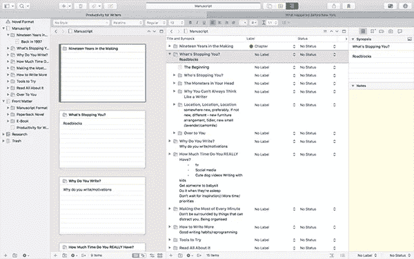
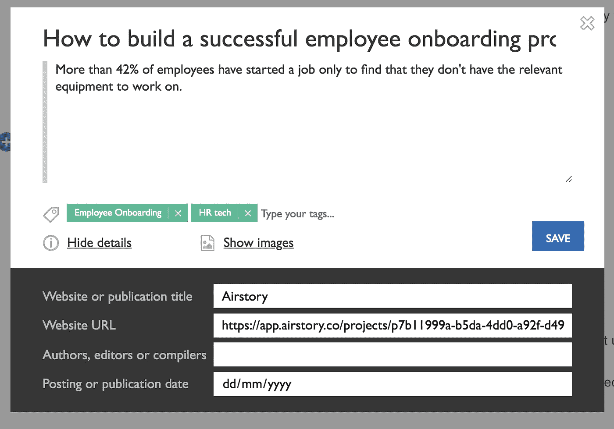
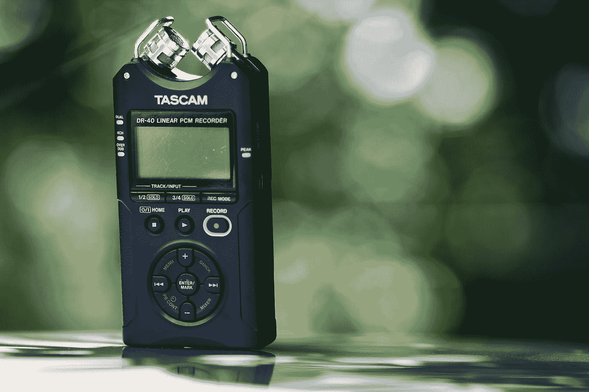
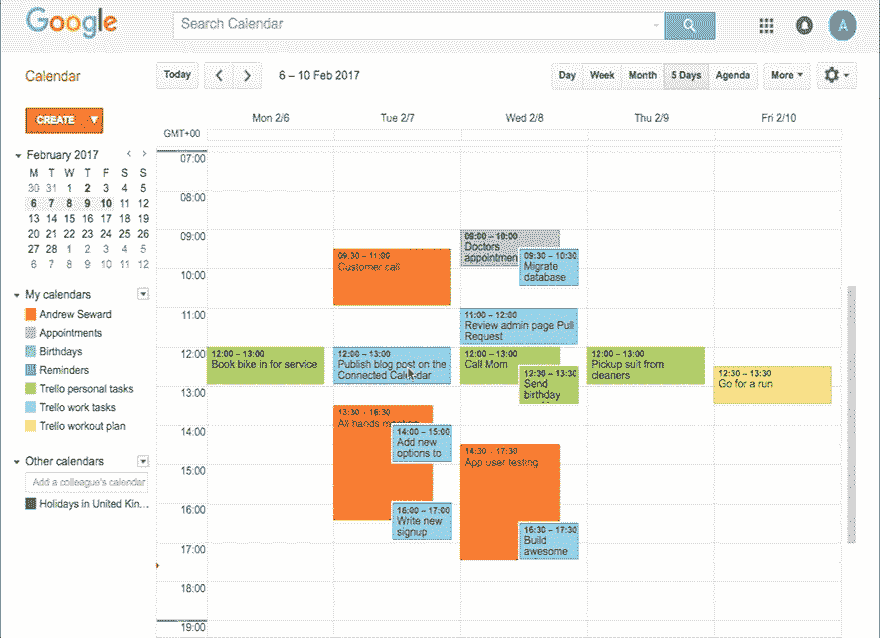

# 7 个鲜为人知的工具让你比以往更有效率

> 原文：<https://medium.com/hackernoon/7-lesser-known-tools-to-make-you-more-productive-than-ever-85e4ea3139ed>

Photo by [Taras Shypka](https://unsplash.com/@bugsster?utm_source=medium&utm_medium=referral) on [Unsplash](https://unsplash.com?utm_source=medium&utm_medium=referral)

我们都想在一天中有更多的时间，但是，无论我们多么努力地希望，这永远不会发生。

相反，我们需要找到更好、更聪明的工作方式。

无论你是一个创业者还是一个大团队的一员，这里有 7 个工具会让你比以往任何时候都更有效率。

GIF courtesy of Giphy.

# 代书人

Screenshot courtesy of [The Writer’s Cookbook](https://www.writerscookbook.com/scrivener-3-review/)

你的内容越长，你需要做的研究就越多。但是保持所有的研究和内容有组织可能是困难的。

Scrivener 可以让你把所有东西放在一起，而不需要搜索多个微软 Word 文件或谷歌文档。

你需要的一切都可以保存在同一个 Scrivener 项目中。在创建或编辑内容时，您可以对其进行调整，以便只看到您需要的内容。这让你更容易集中精力去做一件不那么吓人的事情。

它与 Dropbox 同步，因此你可以在移动设备上启动一个项目，并在返回桌面时继续工作。

一旦这个项目完成，你可以把它导出为电子书、PDF 或者任何你需要的文件类型。

# 航空公司

[航空故事](https://www.airstory.co/)旨在让广告文案的工作更轻松。它允许你在网上任何地方快速方便地保存报价。然后，您可以对它们进行分类，并将其作为您文案的灵感来源。

# 笔和纸

Photo by [Kaleidico](https://unsplash.com/@kaleidico?utm_source=medium&utm_medium=referral) on [Unsplash](https://unsplash.com?utm_source=medium&utm_medium=referral)

永远不要低估纸和笔的力量。当你感到停滞不前时，转而用传统的方式来做事情可能是打破那堵墙的好方法。

它还能让你疲惫的眼睛从屏幕前得到急需的休息。

# 话音记录器

Photo by [Oscar Ivan Esquivel Arteaga](https://unsplash.com/@oscaresquivel?utm_source=medium&utm_medium=referral) on [Unsplash](https://unsplash.com?utm_source=medium&utm_medium=referral)

许多人——尤其是那些写作新手或不常写作的人——发现自己在手写或打字时会自我编辑。

使用录音机(即使只是手机上的一个)意味着你更有可能随意说话。这种随意的语气在写下来的时候对读者来说听起来更自然，使他们更有可能形成情感联系，从而更有可能成为客户。

因为你在写作的时候没有自我编辑，所以你也可以更快地把你的想法从你的头脑中取出来。

*和*你也可以和同事分享你的语音备忘录来激励他们。

如果你没有时间转录你的笔记，像 [Dragon](https://www.nuance.com/en-gb/dragon.html) 这样的应用程序可以按照你的口述转录，或者像 [Rev](https://www.rev.com/) 这样的服务可以转录你的音频文件。

# 马斯克拉夫特

MarsCraft 将生产力变成一场游戏。你生产的时间越长，你的火星基地就越大。如果你错过了一天，你会回到起点…

如果你发现很难长时间集中注意力，这个应用程序是一个有用的方法，可以让你更长时间地集中注意力。

如果你在应该工作的时候关闭应用程序来浏览手机，你会丢失你的进度，不得不重新开始。

# Trello 日历连接器

我们都知道特雷罗在帮助我们组织项目方面有多棒。但是它的动力使它变得更好。

[Trello 日历连接器](https://trello.com/power-ups/5a1d81359fcdfd9011c0a698/cronofy)可以与所有主要的日历服务(甚至微软 Exchange)一起工作。使用它，你可以同步你的到期日和你的日历。如果您在日历中移动名片，它也会在 Trello 中自动更新。

# 松弛日历连接器

我们中的大多数人在工作中与同事聊天。所以，不可避免的，你会需要和他们组织一次会议。当你们相互参照日历来寻找见面的最佳日期和时间时，要反复提示。

[松弛日历连接器](https://cronofy.slack.com/apps/A08TXU0BT-cronofy-calendar-connector)消除了所有这些需求。你邀请这个人参加会议，然后他们可以根据你已经存在的时间表选择最适合他们的时间。

即使他们和你在不同的工作空间，或者根本不使用 Slack，它也能工作。这才是有成效的。

# 你最喜欢的生产力工具是什么？

请在评论中告诉我们！