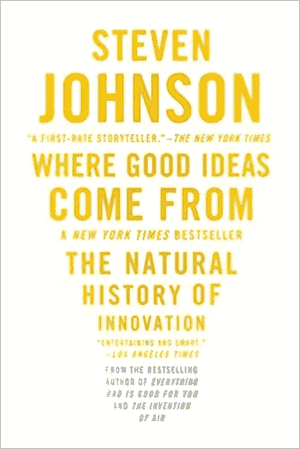
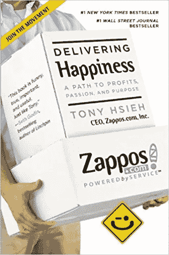
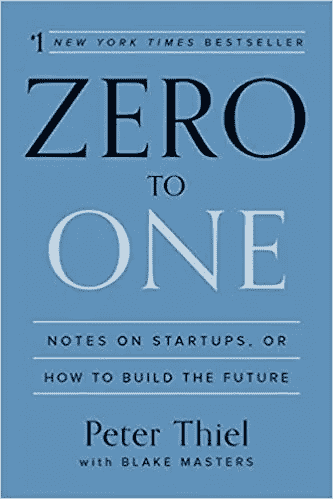
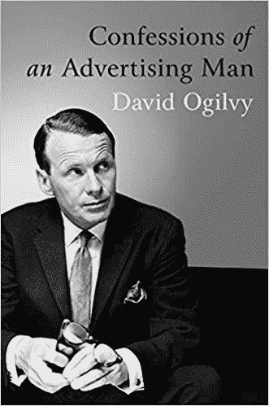
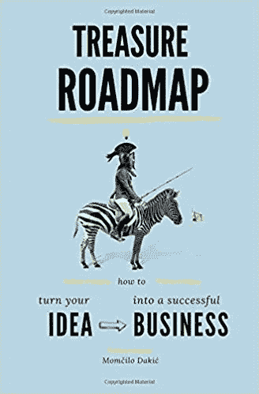
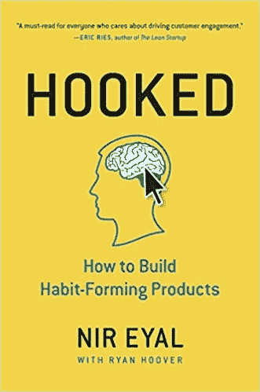
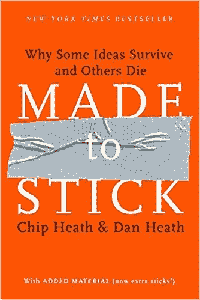

# 7 本必读的产品管理书籍

> 原文：<https://medium.com/hackernoon/7-must-read-books-for-product-managers-17a294830481>

这些 [*书籍*](https://hackernoon.com/tagged/books) *中的知识将向你展示如何选择、定义、启动、提炼你的想法，并从中赚钱。*

## 1) [好主意从何而来:创新的自然历史](https://www.amazon.com/Where-Good-Ideas-Come-Innovation/dp/1594485380/)

我们都知道灯泡时刻。突然间一切都变得清晰明了。一个想法已经诞生，现在看来是如此明显。但是这个想法是如何实现的呢？印刷机、铅笔、抽水马桶、电池——这些都是很棒的想法。但是它们从哪里来呢？是什么点燃了辉煌的火花？什么样的环境孕育了他们？我们如何创造突破性的技术来推进我们的生活、社会和文化？史蒂文·约翰逊的回答很有启发性，他指出了真正创新背后的七个关键模式，并跨越时间和学科对它们进行了追踪。

[拿到书](https://www.amazon.com/Where-Good-Ideas-Come-Innovation/dp/1594485380/)

## 2) [传递快乐:通往利润、激情和目标的道路](https://www.amazon.com/Delivering-Happiness-Profits-Passion-Purpose/dp/0446576220/)

在《传递快乐》一书中，捷步达康首席执行官谢家华分享了他在商业和生活中学到的不同经验，从创办蠕虫农场到经营披萨店，通过 LinkExchange、捷步达康等等。快节奏、脚踏实地的《传递快乐》展示了一种截然不同的企业文化是如何成为实现成功的强大模式，以及如何通过关注你周围人的快乐，你可以大幅提升自己的快乐。

[拿到书](https://www.amazon.com/Delivering-Happiness-Profits-Passion-Purpose/dp/0446576220/)

## 3) [零比一:创业笔记，或如何打造未来](https://www.amazon.com/Zero-One-Notes-Startups-Future/dp/0804139296/)

这是我的最爱之一。在 ***零比一*** 中，企业家兼投资者彼得·泰尔展示了我们如何找到独特的方法来创造这些新事物。非常有趣的阅读，许多现实生活中的例子。

泰尔首先提出了一个反向假设，即我们生活在一个技术停滞的时代，即使我们被闪亮的移动设备分散了注意力而没有注意到。信息技术进步很快，但进步没有理由局限于计算机或硅谷。任何行业或商业领域都可以取得进步。它来自于每个领导者必须掌握的最重要的技能:学会独立思考。

[拿到书](https://www.amazon.com/Zero-One-Notes-Startups-Future/dp/0804139296/)

## 4) [一个广告人的自白](https://www.amazon.com/Confessions-Advertising-Man-David-Ogilvy/dp/190491537X)

大卫·奥格威被许多最大的全球品牌视为“广告之父”和创意天才。首次出版于 1963 年，这本开创性的书彻底改变了广告界，成为 20 世纪 60 年代广告一代的圣经。它也成为国际畅销书，被翻译成 14 种语言。奥美的开创性思想和鼓舞人心的哲学，它不仅涵盖广告，还包括人事管理，企业道德，办公室政治，并形成了良好的商业实践的基本蓝图。写帖子标题或者广告的时候，我总会回头看这本书。

[拿到书](https://www.amazon.com/Confessions-Advertising-Man-David-Ogilvy/dp/190491537X)

## 5) [宝藏路线图:如何将你的想法变成成功的生意](https://www.amazon.com/Treasure-Roadmap-turn-successful-business/dp/179441228X)

这份详细的路线图将向你展示如何选择、定义、启动、提炼你的想法，并从中赚钱。你会一口气读完这本书，并一遍又一遍地使用它来寻求建议，而不管你的业务发展处于什么阶段。这本书将引领你走向财务和个人的卓越。这本书提供了一套从精益创业、设计思维和敏捷软件开发中涌现出来的工具，这些工具正在彻底改变新想法的产生、提炼和推向市场的方式。无论你是在创办一家新公司，领导一家已建立的公司，还是仅仅为了让一个新的[产品](https://hackernoon.com/tagged/product)起飞而工作，你只需要问正确的问题并简化你的工作。使用这本书来学习如何提出问题，引导你在意想不到的地方找到答案。强烈推荐。

[拿到书](https://www.amazon.com/Treasure-Roadmap-turn-successful-business/dp/179441228X)

## 6) [上钩:如何打造养成习惯的产品](https://www.amazon.com/Hooked-How-Build-Habit-Forming-Products/dp/1591847788)

为什么有些产品吸引了广泛的关注，而有些却失败了？是什么让我们完全出于习惯去购买某些产品？技术如何吸引我们，有没有一种潜在的模式？Nir Eyal 通过解释 Hook 模型回答了这些问题(以及许多其他问题), Hook 模型是一个嵌入到许多成功公司产品中的四步过程，旨在巧妙地鼓励客户行为。通过连续的“挂钩周期”，这些产品实现了它们的最终目标，即一次又一次地吸引用户，而不依赖昂贵的广告或激进的信息。 *Hooked* 基于 Eyal 多年的研究、咨询和实践经验。

[拿到书](https://www.amazon.com/Hooked-How-Build-Habit-Forming-Products/dp/1591847788)

## 7) [坚持:为什么一些想法存活而另一些死去](https://www.amazon.com/Made-Stick-Ideas-Survive-Others/dp/1400064287/)

在《为坚持而生》一书中，奇普和丹·希斯揭示了坚持想法的剖析，并解释了让想法变得更坚持的方法，比如应用人类尺度原理，使用 Velcro 记忆理论，以及创造好奇心间隙。一路走来，我们发现各种各样的粘性信息——从臭名昭著的“偷肾环”骗局到教练的体育道德课，再到索尼新产品的愿景——都从相同的六个特征中汲取力量。*定制贴*将改变你的沟通方式。这是一个快节奏的成功故事(和失败)之旅:诺贝尔奖获得者科学家喝了一杯细菌来证明关于胃溃疡的一个观点；利用特蕾莎修女效应的慈善机构；小学老师的模拟实验实际上阻止了种族偏见。挑衅性的、令人大开眼界的、通常令人惊讶地有趣的*向我们展示了赢得创意的重要原则——并告诉我们如何应用这些规则来使我们自己的信息坚持下去。*

*[拿到书](https://www.amazon.com/Made-Stick-Ideas-Survive-Others/dp/1400064287/)*